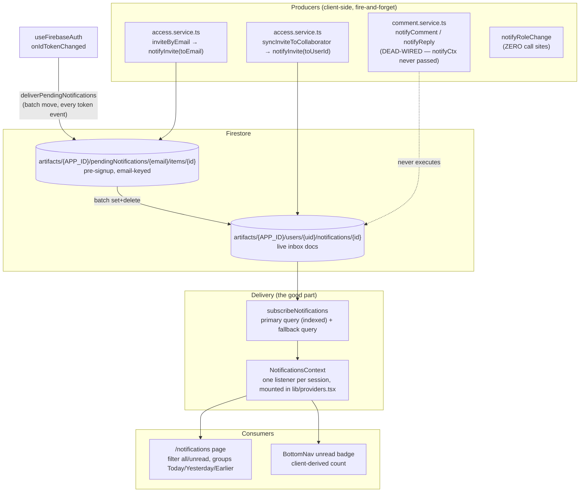
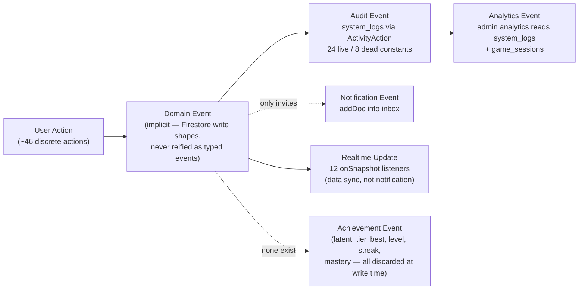
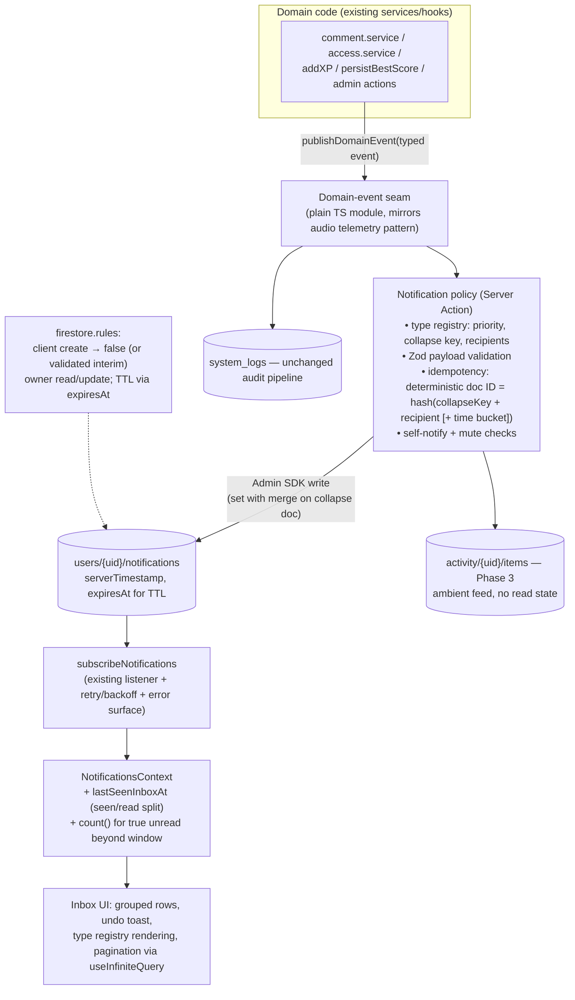

# NOTIFICATION_SYSTEM_DISCOVERY.md

> **Purpose**: complete discovery, reverse-engineering, and gap analysis of the current notification architecture in Kana & Nihongo Master, plus industry/Firebase/library/UX research and a recommended target architecture — the foundation document for building a modern notification platform for this app.
>
> **Method**: full-codebase forensic read (every file in `features/notifications/`, all notification-creation call sites, `firestore.rules`, `firestore.indexes.json`, all 12 realtime listeners, and every user-action surface across all 7 feature domains), cross-referenced against `PROJECT_CONTEXT.md` (the full-repo audit of 2026-07-11). No code was modified.
>
> **Audit date**: 2026-07-11. **HEAD**: `db4e9a7` (`main`). All paths relative to the project root `src/` (the inner folder that contains `package.json`).

---

# 1. Executive Summary

The app has the **skeleton of a notification system but almost no working nervous system attached to it**. The delivery channel — a single, always-on Firestore `onSnapshot` listener lifted into an app-shell React Context — is genuinely well-architected and is, ironically, the best realtime plumbing in the entire codebase. But nearly everything upstream and downstream of that channel is missing, broken, or dead:

**The single most important discovery of this audit**: of the four declared notification types (`invite`, `comment`, `reply`, `role_change`), **only `invite` ever fires in production**. `notifyComment` and `notifyReply` are fully implemented but dead-wired — they sit behind an optional `notifyCtx` parameter in `comment.service.ts` that the only UI caller (`useCommentPanel.ts`) never passes. `notifyRoleChange` has zero call sites. Users who comment on each other's shared decks — the app's richest collaboration loop — generate **no notifications at all** today.

**Second-order findings that materially shape the redesign**:
- **Security**: `firestore.rules` allows *any authenticated user* to write arbitrary, fully-forged notification documents into *any other user's* inbox (`allow create: if isSignedIn()` with zero payload validation), and to enqueue pending notifications for *any email address*. Spam and sender-impersonation are rule-permitted today.
- **Correctness**: `markAllNotificationsRead` requires two composite indexes that are absent from `firestore.indexes.json` — as written, it throws `failed-precondition` unless someone created the indexes manually in the console. The pending-notification delivery path has a real multi-device double-delivery race (no idempotency key), and one guaranteed duplicate: every email invite produces **two** invite notifications (pending-delivery + acceptance-sync).
- **There is no deduplication, no grouping, no pagination, no TTL, no archiving, no error UI, no undo, no push, no email, no offline persistence, and no unread-counter aggregation** — the badge is client-derived from a hard 50-document query window, which also caps the badge at 50 and makes the "99+" rendering branch unreachable.
- **The event landscape is far richer than the notification system exploits.** The audit found ~40 discrete user actions; a mature audit-log pipeline (`system_logs`, Zod-validated, token-verified server actions) that already captures 24 of them; and at least 12 high-value notification moments that are *derivable from data already being written* but never detected as events: deck duplicated (lineage is stamped!), tier promotion (old and new tier are both inside an existing transaction), new personal best, level-up, streak milestones, deck mastered, kana 80% mastery, being overtaken on a leaderboard, editor edited your deck, comment resolved, access revoked, admin deleted your content.

**Bottom line**: this is not a "fix the notification system" project — it's a "the delivery channel works; now build the *production* side (event detection, fan-out, dedup/grouping), the *integrity* side (rules, indexes, idempotency), and the *product* side (new types, grouping UX, preferences)" project. The recommended target architecture (§16) keeps Firestore + the existing context/listener pattern, adds a server-side notification-writer boundary (Server Actions first, Cloud Functions when triggers/digests demand it), introduces a typed domain-event layer, and rolls out in four phases (§18) — the first of which is pure repair (security rules, indexes, dedup, dead-wiring) and can ship in days, not weeks.

---

# 2. Current Architecture

## 2.1 Component map



## 2.2 Notification model (`features/notifications/types/index.ts`, verbatim)

```ts
NotificationType   = "invite" | "comment" | "reply" | "role_change"
NotificationStatus = "unread" | "read"

NotificationData (all optional): lessonId, inviterId, inviteRole, shareLink, commentId

AppNotification {
  id, userId, type, title, message,
  data?: NotificationData,
  status: NotificationStatus, readAt?, isDeleted?,
  senderId, senderName?: string | null,
  createdAt: number,                     // epoch ms — SENDER'S CLIENT CLOCK, never serverTimestamp()
  // deprecated, still dual-written:
  deckId?, deckTitle?: string | null, link?, read?: boolean
}
```

`isUnread(n)`: if `status !== undefined` → `status === "unread"`; else legacy `read === false`. A doc with *neither* field counts as **read**.

## 2.3 Firestore structure, indexes, rules

**Collections**:
| Path | Purpose |
|---|---|
| `artifacts/{APP_ID}/users/{uid}/notifications/{id}` | Live inbox (per-user subcollection) |
| `artifacts/{APP_ID}/pendingNotifications/{normalizedEmail}/items/{id}` | Pre-signup invites, delivered on login |

**Composite indexes** (`firestore.indexes.json` — complete): `system_logs` ×3 (`level/timestamp`, `entityType/timestamp`, `userId/timestamp`), `notifications` ×1 (`isDeleted ASC, createdAt DESC` — the primary subscribe query ✔), plus a `lessons.roles` collection-group field override. **Missing**: `(read, isDeleted)` and `(status, isDeleted)` on notifications — both required by `markAllNotificationsRead`'s dual queries, which combine an equality with an inequality on a different field. As committed, mark-all-read **throws `failed-precondition`** unless those indexes were hand-created in the console.

**Security rules** (verbatim, the load-bearing parts):
```
match /notifications/{notiId} {
  allow read, update, delete: if isOwner(userId);
  allow create: if isSignedIn();          // ← ANY authed user, ANY payload, ANY target inbox
}
match /pendingNotifications/{email}/items/{id} {
  allow read, delete: if isSignedIn() && request.auth.token.email.lower() == email.lower();
  allow create: if isSignedIn();          // ← ANY authed user can enqueue for ANY email
}
```
No payload validation of any kind: `senderId` forgeable, `type`/`title`/`message`/`data.shareLink` arbitrary, path-vs-field `userId` mismatch allowed. The comment *itself* is RBAC-gated by the comments rule, but the notification the commenter would write is not tied to that gate. Owners can hard-`delete` (soft-delete is code convention only). Pending reads are correctly scoped to the token's email (no cross-email disclosure).

## 2.4 Realtime listener + unread counter

One listener per session: `NotificationsContext` (effect deps `[user?.uid]`, symmetric cleanup, StrictMode-safe). Primary query:
```ts
where("isDeleted","!=",true), orderBy("isDeleted"), orderBy("createdAt","desc"), limit(50)
```
Fallback (opened once, inside the primary's error callback): `orderBy("createdAt","desc"), limit(50)` + client-side `!n.isDeleted` filter. If the **fallback** errors, the stream is dead until the uid changes — no retry, no backoff, no error UI (an errored stream renders the "No notifications yet" empty state).

`unreadCount` = `notifications.filter(isUnread).length` — client-derived over the 50-doc window only. No counter document, no aggregation query, no `count()` usage. The BottomNav's `"99+"` branch is unreachable (window caps at 50).

## 2.5 Everything that does NOT exist (checklist against Phase 2's rubric)

| Concern | Status |
|---|---|
| Archiving | ❌ none (soft-delete only, `isDeleted:true` forever) |
| TTL / expiration | ❌ none — docs live forever; no Firestore TTL policy configured |
| Grouping/collapse | ❌ none at the data layer; UI groups by *time bucket* only (Today/Yesterday/Earlier) |
| Pagination | ❌ none — hard `limit(50)`, no `startAfter`, notification #51+ unreachable |
| Sorting | `createdAt desc` only — from the **sender's client clock** (skew breaks ordering + bucketing; the `yesterdayMs = todayMs − 86_400_000` bucket math is DST-naive) |
| Caching | React state in context only; no React Query, no persistence |
| Offline | ❌ plain `getFirestore()` — no `persistentLocalCache`; offline = empty inbox, queued writes lost on tab close |
| Batching (writes) | Only in delivery/mark-all/clear-all; creation is per-doc `addDoc` |
| Deduplication | ❌ absent everywhere — bare `addDoc`, no dedup key, no query-before-write |
| Optimistic updates | None explicit — perceived speed is Firestore latency compensation; failures are silent (`.catch(() => {})` or unhandled transition rejections) |
| Error UI | ❌ none anywhere in the feature |
| Undo | ❌ none — "Clear all" soft-deletes up to 500 docs with no confirm and no undo |
| Push / FCM | ❌ zero traces (`firebase/messaging` only a transitive dep; no service worker, no `Notification.permission`) |
| Email | ❌ none |
| Preferences / mute / per-type opt-out | ❌ none — settings store has audio/font toggles only |

## 2.6 Race conditions & consistency defects (all code-proven)

1. **Multi-device pending-delivery duplication**: two devices logging in concurrently both `getDocs` the pending set; destination doc IDs are fresh auto-IDs and `batch.delete` on a gone doc silently no-ops → both commits succeed → duplicates. Fires on every `onIdTokenChanged` (login, refresh, ~hourly), so even single-device races are possible. The one-line fix (reuse the pending doc's ID as the destination ID, making the second write an idempotent overwrite) is not implemented.
2. **Guaranteed double-invite**: `inviteByEmail` creates a pending notification; when the invitee later opens the share link signed-in, `syncInviteToCollaborator` fires a *second* `notifyInvite` to them. One invite → two notifications, by design accident.
3. **`!=` field-existence trap**: `where("isDeleted","!=",true)` excludes docs that *lack* the field. Legacy docs are invisible to the primary query, mark-all, and clear-all — but visible via the fallback. Same inbox renders differently depending on which listener path is live.
4. **The 50 / 500 / unbounded triangle**: badge counts a 50-doc window; `markAllNotificationsRead` is unbounded (>500 unread → batch exceeds 500 ops → throws); `deleteAllNotifications` caps at exactly 500 silently (remainder never cleared, no loop).
5. **Stale badge on direct user switch**: on A→B login, `notifications` isn't cleared before B's first snapshot; the page shows skeletons but the badge shows A's count.
6. **Pending delivery >250 items**: 2 ops/item × >250 items exceeds the 500-op batch cap → `commit()` throws → swallowed → retried and re-failed on every token event, forever.
7. **Delivery activity-log fires before the batch commits** — logs success even when delivery fails.
8. **Memory leaks**: none found (symmetric unsubscribe, no zombie fallback path). This part is clean.

---

# 3. Current Notification Flow

## 3.1 Creation flow (the only live path: invites)

```
Owner opens ShareModal → enters email → inviteByEmail (client)
  → lesson.invitedEmails[email] = {role, invitedAt}                    (Firestore, owner's deck doc)
  → notifyInvite({toEmail}) → createPendingNotification                 (pendingNotifications/{email}/items)
  → [NO activity log — SHARE_INVITE_SENT enum entry is dead]

Invitee signs in (any device, any token refresh)
  → useFirebaseAuth.onIdTokenChanged
  → deliverPendingNotifications(uid, email)                             (batch: set into inbox + delete pending)
  → logNotificationsDelivered (fire-and-forget, BEFORE commit)

Invitee opens the share link signed-in
  → getSharedLesson → syncInviteToCollaborator
  → roles/collaborators/collaboratorMeta updated, invitedEmails entry removed
  → notifyInvite({toUserId: invitee}) — a SECOND invite notification, to the invitee, "from" the owner
  → [owner never learns the invite was accepted]
```

## 3.2 Rendering flow

```
NotificationsContext (session-long onSnapshot, 50-doc window)
  → useMemo: unreadCount (filter isUnread), groups (Today/Yesterday/Earlier, local-midnight buckets)
  → BottomNav badge (unreadCount, "99+" unreachable)
  → /notifications page
      filter all|unread (client-side re-filter of groups)
      NotificationGroupSection (sticky time-bucket headers)
        NotificationRow: type icon, hand-rolled relativeTime (render-time only, goes stale),
                         unread dot (visual only), hover-revealed delete (invisible on touch),
                         InviteActions (Accept = mark-read + navigate; Decline = soft-delete ONLY —
                         underlying invite survives and re-converts on next share-link visit)
      Mark all read / Clear all: useTransition + Firestore batch + chained fire-and-forget activity log;
                                 failures silent; no confirm, no undo
```

## 3.3 Synchronization & cleanup

Cross-tab/device sync is inherited entirely from Firestore's listener fan-out — read state converges automatically (each mutation is a server write). There is **no cleanup of any kind**: no TTL, no archival job, no cascade when a referenced deck is deleted (links dangle to dead share pages), no withdrawal of pending invite notifications when the invite is revoked (`revokeEmailInvite` removes the `invitedEmails` entry but leaves the pending notification doc deliverable forever).

---

# 4. User Action Inventory

Complete, code-verified inventory of every discrete user action, with its current event/notification footprint. Legend — **Log**: `ActivityAction` written to `system_logs`; **Notif**: notification created today.

## 4.1 Authentication & account

| # | Action | Firestore write | Log | Notif |
|---|---|---|---|---|
| 1 | Google sign-in (popup/redirect) | `login_sessions/{uid}` (server, 30-min dedup) | `user.login` | — (pending delivery only) |
| 2 | First-ever sign-in | — | — | — **no "account created" moment exists anywhere in client code** |
| 3 | Sign-out | deletes `login_sessions/{uid}` | `user.logout` | — |
| 4 | Change settings (font, 3 audio toggles, volumes) | **none — localStorage-only Zustand** (doesn't roam devices) | — | — |
| 5 | Reset progress data (global) | `users/{uid}.progress` (clears learnedChars/charStats, keeps xp/streak) | **none** | — |
| 6 | Activity heartbeat | `users/{uid}.lastSeenAt` (5-min throttle) | — | — (written, never read by any user-facing feature — a dormant presence primitive) |

## 4.2 Flashcard authoring & sharing

| # | Action | Firestore write | Log | Notif |
|---|---|---|---|---|
| 7 | Create deck (manual/paste/CSV/AI/image) | lesson + cards batch | `deck.created` | — |
| 8 | Edit deck (aggregate builder save) | diff-based batch | `deck.updated` | — |
| 9 | **Editor edits someone else's shared deck** | writes into the *owner's* collections | `deck.updated` under the *editor's* uid | — **owner never told** |
| 10 | Delete deck | deep delete (cards + images) | `deck.deleted` | — **collaborators never told; deck silently vanishes from their lists** |
| 11 | Reorder decks / reorder card / upload card image | order fields / Storage | — | — |
| 12 | **Duplicate a shared deck** | new lesson with `sourceLessonId`/`sourceUserId` **lineage stamped** | generic `deck.created` (lineage not in metadata) | — **original owner never told, despite the data existing** |
| 13 | Change privacy (restricted/link/public) + public role | lesson share fields | `share.privacy_updated` (client-side log) | — |
| 14 | Invite by email | `invitedEmails` map | **none** (`share.invite_sent` enum entry dead) | ✅ invite (pending) |
| 15 | Revoke invite | `deleteField()` on map | **none** (dead enum) | — **pending notification doc NOT withdrawn — stale invite stays deliverable** |
| 16 | Change collaborator role | roles map | `share.roles_updated` (count only — no target uid, no old/new role) | — **`notifyRoleChange` exists for exactly this and is never called** |
| 17 | Remove collaborator | roles key deleted | same log (indistinguishable from role change) | — **removed user never told** |
| 18 | Accept invite (auto-convert on visit) | roles + collaboratorMeta | — | ✅ invite #2 → to the *invitee themselves*; **owner never told** |
| 19 | Accept invite (UI button) | mark-read only, then navigate | `notification.read` | — |
| 20 | **Decline invite (UI button)** | **soft-deletes notification only — invite survives, re-converts on next visit** | `notification.deleted` | — |
| 21 | Copy share link | — | — | — |

## 4.3 Comments

| # | Action | Firestore write | Log | Notif |
|---|---|---|---|---|
| 22 | Add comment | comment doc (sanitized, ≤2000 chars) | — | **dead-wired** — `notifyComment` exists, `notifyCtx` never passed by `useCommentPanel` |
| 23 | Reply | parent doc `replies[]` append (2-level max) | — | **dead-wired** (same mechanism) |
| 24 | Edit comment | content + updatedAt | — | — |
| 25 | Delete comment | hard `deleteDoc` (replies go with it) | — | — |
| 26 | Resolve/unresolve comment | `resolved` toggle | — | — **comment author never told their comment was resolved** |
| — | @mention | **concept absent from the codebase entirely** | | |

## 4.4 Study / SRS / progress

| # | Action | Firestore write | Log | Notif | Latent milestone |
|---|---|---|---|---|---|
| 27 | Grade a card (SM-2) | userProgress card doc + daily counter | — | — | per-card `mastered` status exists, never aggregated |
| 28 | Complete study session | XP, `lessonsCompleted++` | `study.session_completed` | — | |
| 29 | Complete mistake-review chain | same | same (`mode:"mistake-review"`) | — | "mistakes cleared" moment |
| 30 | Daily cap hit / catch-up triggered | silent redistribution over 3 days | **none — invisible event** | — | |
| 31 | Deck fully mastered | — | — | — | **no "all mastered" detection anywhere** (`DeckStatus` counts new/due/mistake only) |
| 32 | XP gain / streak change | inline in `addXP` | — | — | **level-up (`floor(xp/500)+1`) computed only at profile render; streak reset indistinguishable from increment** |
| 33 | Reset per-deck progress | batch reset | `study.progress_reset` | — | |

## 4.5 Games & leaderboards

| # | Action | Firestore write | Log | Notif | Latent event |
|---|---|---|---|---|---|
| 34 | Complete match/speed/kana-quiz/survival | session finish + stats + leaderboard | 4 × `*_completed` actions | — | |
| 35 | **New personal best** | transactional promote in `persistBestScore` — **returns void; the "is new best" fact is computed then discarded**; UI re-derives it racily client-side | — | — | one-line detection inside the existing transaction |
| 36 | **Tier promotion** (bronze→…→diamond) | new `tier` string persisted | tier in completion metadata | — | before/after diff available in same transaction, never compared |
| 37 | Leaderboard rank change / overtaken | — (derived live in `MiniLeaderboard`, 2-second animation, never persisted) | — | — | "you were overtaken" derivable but rank never stored |
| 38 | Top-3 entry | — | — | — | derivable from existing top-N subscription |

## 4.6 Kana

| # | Action | Log | Notif | Latent |
|---|---|---|---|---|
| 39 | Char marked learned (on visit) | — | — | |
| 40 | Quiz / survival completed | ✅ | — | |
| 41 | Practice "completed" | **dead logger — no completion moment exists in the endless practice loop** | — | |
| 42 | 80% mastery (Novice→Scholar flip) | — | — | computed per-render in `useKanaHubState`, never persisted/evented |

## 4.7 Admin & AI

| # | Action | Log | Notif |
|---|---|---|---|
| 43 | Role granted/revoked | `admin.role_granted/-revoked` | — affected user never told |
| 44 | User deleted | `admin.user_deleted` | n/a (content orphaned) |
| 45 | **Content deleted by admin** | `admin.content_deleted` | — **deck owner never told their content was removed** |
| 46 | AI card/deck/OCR generation (success/failure) | — | — all four AI hooks are synchronous in-hook awaits; navigating away discards results silently; no job state persisted — the natural "background job finished" candidates if generation ever moves server-side |
| — | Report/flag content | **no user-facing reporting mechanism exists at all** (admin "Reports" = log viewer) | |

## 4.8 Dead event constants (defined, never fired)

`DECK_SHARED`, `DECK_UNSHARED`, `CARD_CREATED`, `CARD_UPDATED`, `CARD_DELETED`, `SHARE_INVITE_SENT`, `SHARE_INVITE_REVOKED` (7 enum entries, zero call sites) + `KANA_PRACTICE_COMPLETED` (wrapper exists, never invoked).

---

# 5. Interaction Matrix

The complete matrix of cross-user interactions — current state and target design. **Priority**: P0 = must interrupt (badge + possible push later), P1 = inbox-worthy, P2 = digest/activity-feed material. **Grouping** = collapse key for the target architecture. **Silent** = should update data without an inbox entry.

| # | User A action | Recipient(s) | Today | Target type | Priority | Delivery | Grouping key | Realtime | Silent | Email later | Push later |
|---|---|---|---|---|---|---|---|---|---|---|---|
| 1 | Invites B by email | B (pre- or post-signup) | ✅ invite (but **doubled**) | `invite` | P0 | inbox + badge | `invite:{lessonId}:{email}` (dedup, not group) | ✅ | — | ✅ (invite email) | ✅ |
| 2 | B accepts invite | **A (owner)** | ❌ | `invite_accepted` | P1 | inbox | `invite_accepted:{lessonId}` | ✅ | — | digest | — |
| 3 | B declines invite | A (owner) | ❌ | `invite_declined` | P2 | inbox | same | ✅ | — | digest | — |
| 4 | A comments on B's deck card | B (owner) + thread participants | ❌ (**dead-wired**) | `comment` | P0 | inbox + badge | `comment:{lessonId}:{cardId}` (collapse: "3 new comments on X") | ✅ | — | digest | ✅ |
| 5 | A replies to B's comment | B (parent author) + owner if distinct | ❌ (dead-wired; owner was never even intended) | `reply` | P0 | inbox + badge | `reply:{commentId}` | ✅ | — | digest | ✅ |
| 6 | A resolves B's comment | B (comment author) | ❌ | `comment_resolved` | P1 | inbox | `comment_resolved:{lessonId}` | ✅ | — | — | — |
| 7 | A (editor) edits B's shared deck | B (owner) + other editors | ❌ | `deck_updated` | P1 | inbox | `deck_updated:{lessonId}:{actorId}:{day}` (collapse edit bursts) | ✅ | — | digest | — |
| 8 | A (owner) edits a shared deck | collaborators/viewers | ❌ | `deck_updated` | P2 | activity feed > inbox | same | ✅ | often | digest | — |
| 9 | A deletes a shared deck | all collaborators | ❌ (silent vanish) | `deck_deleted` | P1 | inbox | `deck_deleted:{lessonId}` | ✅ | — | — | — |
| 10 | A changes B's role | B | ❌ (`notifyRoleChange` dead) | `role_change` | P1 | inbox | `role_change:{lessonId}:{uid}` | ✅ | — | — | — |
| 11 | A removes B as collaborator | B | ❌ | `access_revoked` | P1 | inbox | same | ✅ | — | — | — |
| 12 | A revokes B's pending invite | B | ❌ (stale pending doc persists!) | withdraw pending doc | — | **cleanup, not notification** | — | — | ✅ | — | — |
| 13 | A duplicates B's public/shared deck | B (owner) | ❌ (lineage stamped, unread) | `deck_duplicated` | P2 | inbox or activity | `deck_duplicated:{lessonId}` (collapse: "5 people saved your deck") | ✅ | — | digest | — |
| 14 | A makes deck public | collaborators | ❌ | `privacy_changed` | P2 | activity feed | — | ✅ | often | — | — |
| 15 | A overtakes B on a leaderboard | B | ❌ (2s in-game animation only) | `overtaken` | P2 | inbox (throttled) | `overtaken:{gameMode}` (collapse per mode per day) | ✅ | opt-out | — | ✅ |
| 16 | A enters top-3 of a leaderboard | A (self) + optionally displaced user | ❌ | `leaderboard_top3` | P2 | inbox | `leaderboard:{gameMode}` | ✅ | — | digest | — |
| 17 | Admin deletes A's deck | A (owner) | ❌ | `content_removed` | P0 | inbox + badge | — | ✅ | — | ✅ | ✅ |
| 18 | Admin grants/revokes A's admin role | A | ❌ | `role_change` (system) | P1 | inbox | — | ✅ | — | — | — |
| 19–24 | **Self-notifications** (new best, tier promotion, level-up, streak milestone/at-risk, deck mastered, kana 80%) | self | ❌ | `achievement` family | P1–P2 | inbox + celebratory toast | `achievement:{kind}` | ✅ | opt-out | weekly digest | streak-at-risk ✅ |

**Design principle applied above** (industry-standard, see §11): *interruptive* (badge/push) is reserved for direct-address events (invite, comment on *your* content, reply to *you*, admin action against *you*); everything ambient (edits, duplications, leaderboard drift, milestones) defaults to inbox-quiet or activity feed, with collapse keys from day one.

---

# 6. Event Map

Reverse-engineered event taxonomy. Today, "events" exist in three disconnected planes that never feed each other:



## 6.1 The 12 existing realtime channels (listener census)

| # | Watches | Consumer | Notes |
|---|---|---|---|
| 1 | `users/{uid}/notifications` (≤50) | NotificationsContext | **the** notification channel — app-shell, always-on |
| 2 | `users/{uid}/lessons` | useLessons | own decks |
| 3 | collectionGroup `lessons` by `roles.{uid}` (+ legacy fallback) | useLessons.sharedLessons | shared-with-me |
| 4 | collectionGroup `lessons` where `isPublic` | usePublicLessons | discovery |
| 5 | `users/{ownerId}/cards` | useCards/useCardsWithProgress | content stream |
| 6 | `userProgress/{uid}/lessons/{lid}/cards` | useCardsWithProgress | SRS stream |
| 7 | same collection | useDeckProgressStatus | dashboard counts |
| 8 | card `comments` subcollection | useCommentPanel | per-open-card |
| 9 | `users/{uid}` progress doc | useUserProgress | XP/streak/learnedChars |
| 10 | `leaderboard_{mode}` top-N | useLeaderboard | in-game + results |
| 11 | `users/{uid}/stats` (best map) | useBestScores | kana hub |
| 12 | `users/{uid}/stats` (full) | subscribeGameStats | home badges |

**Implication**: the app already maintains a rich realtime mesh. A notification platform doesn't need new transport — it needs **producers** writing into channel #1 (or a successor) when meaningful deltas occur on channels #2–#12.

## 6.2 Latent events discarded at write time (highest-value list)

| Latent event | Where the data already exists | Detection cost |
|---|---|---|
| New personal best | inside `persistBestScore`'s transaction (reads old best, writes new) | ~1 line: return/emit `isNewBest` |
| Tier promotion | same transaction (old tier read, new tier written) | ~1 line: compare before/after |
| Deck duplicated | `sourceLessonId`/`sourceUserId` stamped on the clone | producer at duplicate time |
| Level-up | `addXP` computes new xp; level = `floor(xp/500)+1` | compare `level(old)` vs `level(new)` in `addXP` |
| Streak milestone / reset / at-risk | `addXP` streak math | compare in `addXP`; "at-risk" needs a scheduled job |
| Deck fully mastered | per-card `mastered` status + `DeckStatus` aggregation point | extend `getDeckStatus` |
| Kana 80% threshold | `progressPct` in `useKanaHubState` | persist a crossed-threshold flag |
| Overtaken on leaderboard | `useLeaderboard` rank deltas (in-memory only) | requires persisted rank or server-side diff |
| Invite accepted (owner-facing) | `syncInviteToCollaborator` already runs at the exact moment | add one `notifyX` call |
| Comment resolved | `resolveComment` toggle | add one `notifyX` call |
| Admin removed your content | `deleteGlobalFlashcardAction` knows the owner uid from the path | add producer in the action |

---

# 7. Notification Lifecycle

**Current lifecycle** (states actually reachable in code):

```
[created: addDoc {status:"unread", isDeleted:false, createdAt: senderClock}]
   │  (or: pending → batch-delivered on login, duplication-prone)
   ▼
UNREAD ──row click / Accept──▶ READ {status:"read", read:true, readAt}
   │                              │
   └────── trash / Decline ───────┴──▶ SOFT-DELETED {isDeleted:true}   ← terminal; docs persist forever
```

- No `archived` state, no expiry, no hard-delete path in code (though rules would permit owner hard-deletes).
- Read state is **per-document and cross-device consistent** (server writes + listener) — this part matches industry behavior.
- **Lifecycle holes**: read-state on a *group* is undefined (no groups); no "seen" (badge-clearing) vs "read" (item-opened) distinction — industry systems separate these (§11); soft-deleted docs still count against the 50-doc query window's underlying collection scan and accumulate forever; nothing transitions notifications when their referent dies (deck deleted → dangling link).

**Target lifecycle** (recommended, see §16): `created → delivered → seen (badge cleared) → read (item opened) → [archived | expired-by-TTL]`, with group-level read semantics and referent-validity checks at render.

---

# 8. Activity Feed vs Notification

The codebase currently conflates none of these — because it only has two of the four concepts, and they're cleanly separated already. The redesign must keep them separate as new types are added:

| Concept | Definition | What belongs there (this app) | Current home |
|---|---|---|---|
| **Notification** | Directed at *you*; actionable or attention-worthy; has read state; drives the badge | invites, comments on your content, replies to you, role/access changes, admin actions against you, achievement unlocks | `users/{uid}/notifications` ✔ (keep) |
| **Activity Feed** | Ambient, browsable "what happened around things I care about"; no read state; no badge | edits to decks you collaborate on, duplications of your public decks, leaderboard drift, collaborator joins | **does not exist** — candidates currently either silent or misdirected toward notifications |
| **Audit Log** | Immutable, compliance/debugging record; admin-facing; never user-visible | all 24 live `ActivityAction`s | `system_logs` ✔ (keep; do NOT try to render this to users — it's an admin/ops artifact with its own Zod schema, retention needs, and admin-only rules) |
| **Timeline** | Per-object history ("this deck's changes") | deck edit history, comment threads (already per-card) | partial: comments are per-card; no deck edit history exists |

**Key rulings for the redesign**:
1. `system_logs` is a *source* the activity feed could be derived from, but should not be its storage — different retention, different access rules, different shape.
2. Deck-edit bursts (many `deck.updated` in an hour) belong in the activity feed with collapse, *plus at most one* collapsed notification to the owner per actor per day — never one notification per save.
3. Achievements are notifications (they carry a badge-worthy moment) but also feed a profile timeline later.

---

# 9. Firebase Architecture Review

Assessment of the current stack against modern Firebase capabilities, and what to adopt.

| Capability | Current usage | Verdict / recommendation |
|---|---|---|
| **Firestore listeners** | Excellent — single lifted listener, symmetric cleanup | Keep. This is the right pattern; do not replace with polling or RTDB. |
| **`serverTimestamp()`** | ❌ never used — `createdAt: Date.now()` from sender's clock | **Adopt immediately** for all notification writes (fixes ordering + bucketing under skew). |
| **Security Rules payload validation** | ❌ none on notification creates | **Adopt**: validate shape (`request.resource.data.senderId == request.auth.uid`, path uid == field userId, type in allow-list, size caps). Better: move creation server-side entirely and set `allow create: if false` for clients. |
| **Composite indexes** | 1 of 3 required indexes present | Fix `firestore.indexes.json` (add `(read,isDeleted)`, `(status,isDeleted)`) or eliminate the dual-schema queries by completing the migration. |
| **Firestore TTL policies** | ❌ none | **Adopt**: TTL on an `expiresAt` field for soft-deleted (30d) and read (90–180d) notifications — free deletion, no scheduled job needed for basic hygiene. |
| **`count()` aggregation queries** | ❌ unused | **Adopt** for unread badge when window > 50: `getCountFromServer(where status=="unread")` on inbox open + increment/decrement locally between refreshes. Cheaper than a distributed counter at this scale. |
| **Distributed counters** | none | Not needed at current scale (one user's own unread count has no write contention). Revisit only for global/public counters. |
| **Cloud Functions** | none exist in repo | **Adopt selectively (Phase 3)**: Firestore triggers for fan-out to many recipients (deck with 20 collaborators), scheduled digests, streak-at-risk detection, cleanup jobs. Not required for Phase 1–2 — Server Actions with the already-lazy Admin SDK cover single-recipient fan-out today. |
| **FCM / Web Push** | zero traces | Defer to Phase 4 (§20). Requires service worker + permission UX + token management — a project of its own. |
| **Offline persistence** | ❌ plain `getFirestore()` | **Adopt** `initializeFirestore(app, {localCache: persistentLocalCache({tabManager: persistentMultipleTabManager()})})` — one-line change, gives offline inbox + faster cold loads app-wide. Test the multi-tab behavior with the existing listener mesh first. |
| **Batched writes** | used, with the 500-op ceiling bugs documented in §2.6 | Keep, but chunk loops (mark-all, clear-all, pending delivery) at ≤400 ops per batch. |
| **Transactions** | one (best-score) — correct usage | Extend the same pattern to event detection (tier/best) rather than adding new infra. |
| **Firestore Bundles** | unused | Not relevant to notifications (useful for the static kana dataset if ever moved server-side — out of scope). |
| **Event fan-out** | n/a | For multi-recipient events: inline loop in a Server Action up to ~20 recipients; Cloud Function trigger beyond that (deck collaborator counts are small — Server Action suffices for the foreseeable roadmap). |
| **Cost posture** | Reads dominated by the 12-listener mesh; notifications add ≤50 docs/session + 1 doc/event | Fine at current scale. §13 models growth. The single biggest current cost smell is unrelated to notifications (admin analytics' 2000-doc sample reads). |

---

# 10. Library Evaluation

Current relevant stack: React 19, Next 16, Zustand 5, TanStack Query v5 (installed, narrowly used), framer-motion, date-fns v4, react-window? (no), Zod v4.

| Library | Verdict | Reasoning |
|---|---|---|
| **TanStack Query** | ✅ **Use more of what's installed** | Already a dependency. Wrong tool for the *live inbox* (onSnapshot beats it), but right tool for *paginated history* (`useInfiniteQuery` + `startAfter` cursors) when pagination lands in Phase 2. Zero bundle cost, zero learning curve (admin already uses it). |
| **date-fns** | ✅ **Use what's installed** | Replace the hand-rolled `relativeTime` with `formatDistanceToNow` + a shared 30s ticker context (fixes stale timestamps). Already a dependency; admin already uses it for exactly this. |
| **Zod** | ✅ **Use what's installed** | Notification payload schema at the Server-Action boundary, mirroring the existing `systemLogInputSchema` pattern. |
| **framer-motion** | ✅ **Use what's installed** | Enter/exit/reorder animations for inbox rows; already powers AlertProvider's AnimatePresence. |
| **Sonner / React Hot Toast** | ❌ **Do not add** | `AlertProvider` + `Alert` already implement a capped, animated, pause-on-hover toast stack matching the design system. Sonner would duplicate it with a foreign visual language. If toast needs grow (action buttons, promise toasts), extend `AlertProvider` first. |
| **react-window / React Virtuoso** | ⏸ **Defer** | The inbox renders ≤50 rows today; with pagination it renders pages. Virtualization becomes worth it only if "load all history" UX is chosen. Revisit at >200 rendered rows. (Precedent: admin's `LogsVirtualList` doesn't virtualize either.) |
| **react-intersection-observer** | ⏸ **Defer, then maybe** | Useful for two things later: infinite-scroll trigger (Phase 2 pagination) and mark-as-seen-on-viewport (Phase 3). Tiny (~1.5kB), zero-dep, natural fit — acceptable *when those features land*, not before. Native `IntersectionObserver` via a small custom hook is also fine. |
| **RxJS** | ❌ **Do not add** | The event flows here are simple fan-outs; Firestore listeners + plain functions cover them. RxJS's learning curve and bundle weight (~30kB) buy nothing this architecture needs. |
| **XState** | ❌ **Do not add** | Notification lifecycle is a 4-state enum, not a statechart. The codebase's precedent for complex state is a plain TS class (Speed's `GameEngine`) — follow that if anything. |
| **Headless UI / Floating UI** | ❌ **Do not add** | Existing Modal/dropdown primitives + `useDialogA11y` cover the needs. A notification-preferences popover can use the existing `Select`/`SettingsMenu` patterns. |
| **Day.js** | ❌ **Do not add** | date-fns already installed. |
| **EventEmitter libs (mitt, etc.)** | ❌ **Do not add** | The audio system's `telemetry.ts` proves the house pattern: a 30-line dependency-free pub/sub. If a client-side domain-event bus is wanted, copy that pattern. |
| **Firebase Messaging SDK** | ⏸ **Phase 4 only** | Part of the already-installed `firebase` package (no new dependency) — but the service worker, permission UX, and token lifecycle make it a deliberate later phase, not a library decision. |
| **react-use** | ❌ **Do not add** | Grab-bag; the 2–3 hooks it would provide (interval, visibility) are trivial to write and partially exist. |

**Net recommendation: zero new dependencies for Phases 1–2.** The stack already contains everything needed; the gaps are architectural, not tooling.

---

# 11. Industry Best Practices

Distilled patterns from the reference systems, mapped to this app's situation.

| Pattern | Who does it canonically | Relevance here |
|---|---|---|
| **Inbox + badge separation ("seen" vs "read")** | GitHub (blue dot vs bold), Slack (badge clears on channel open, unread marks persist) | Adopt: opening `/notifications` clears the *badge* (seen), rows keep unread styling until interacted with. Today the two are conflated. |
| **Collapse/grouping by object** | Facebook ("X and 5 others commented on…"), GitHub (one row per thread, updated in place), LinkedIn (reaction rollups) | Adopt at the **data layer** via a collapse key (`type:objectId`), updating one doc (`count`, `actors[]`, `updatedAt`) instead of appending — prevents comment-burst spam and shrinks doc counts. This is the single highest-leverage UX+cost pattern. |
| **Priority tiers / interruption budget** | Slack (DM > mention > channel), Linear (subscribed vs assigned), Teams (priority notifications) | Adopt the P0/P1/P2 model from §5: only direct-address events touch the badge; ambient events are inbox-quiet or feed-only. |
| **Watch/subscribe model** | GitHub (watch repo), Jira (watchers), Google Docs (comment thread subscription) | Adopt lightly: "watching" is implicit via the roles map (collaborator = watcher). An explicit mute-per-deck toggle is the Phase 3 refinement. |
| **Digest + smart batching** | GitHub email digests, LinkedIn daily rollups, Notion batched email ("what you missed") | Phase 4: daily/weekly email digest from undelivered/unread P1–P2 items. Requires Cloud Scheduler + an email provider (neither exists today). |
| **Notification preferences matrix** | Slack (per-channel), Discord (per-server/channel cascades), GitHub (per-repo per-event) | Adopt a minimal version in Phase 3: per-type on/off + per-deck mute, stored in Firestore (NOT the localStorage-only Zustand settings — preferences must roam). |
| **Undo instead of confirm** | Gmail (undo send/archive), Slack | Adopt for Clear-all/delete: soft-delete already makes undo trivial (flip `isDeleted` back within a toast window). Today: no confirm AND no undo — the worst quadrant. |
| **In-place updating notifications** | GitHub (thread row re-sorts + updates), Discord (mention counts) | Comes free with the collapse-key model — the doc updates, the listener re-renders. |
| **Read-state sync across devices** | All of them | Already correct via Firestore — preserve this property through every change. |
| **Event-sourced notification pipeline** | Slack/Facebook at scale (event bus → fan-out workers → per-user inboxes) | The full pattern is overkill here, but its *shape* — typed domain events → notification policy → inbox write — should be mirrored in miniature (a `publishDomainEvent()` seam, §16), so a future Functions-based pipeline can slot in without rewriting producers. |
| **Referent-death handling** | Slack ("message deleted"), GitHub (grayed rows) | Render a tombstone ("This deck is no longer available") instead of navigating to a dead link — cheap fix for the dangling-link defect. |

---

# 12. UX Research

Current-state UX inventory (from code) and the target patterns.

**What exists today**: filter tabs (All/Unread), sticky time-bucket headers, type icons with per-type colors, unread dot, hover-revealed delete, invite Accept/Decline buttons, skeleton rows, filter-aware empty states, "99+" badge cap (unreachable), `useTransition` pending states.

**Defects found (code-proven)**:
- Delete button is `opacity-0 group-hover:opacity-100` — **invisible on touch devices** (still tappable blind).
- Relative timestamps computed at render only — "2m ago" **goes stale** with no ticker.
- Keyboard: rows accept Enter but **not Space**; unread state has **no screen-reader text**; badge has no `aria-live`.
- **No error state exists** — a dead listener renders "No notifications yet."
- **No undo, no confirm** on Clear-all (up to 500 docs, one tap).
- Decline visually dismisses an invite that **remains functionally active**.
- No reduced-motion guard on the pulse animation (the app has a global CSS collapse, but the JS-free pulse is fine; noted for parity with the confetti precedent).

**Target UX patterns** (ranked by value/effort):
1. **Undo toast for destructive actions** — soft-delete makes this nearly free; wire through the existing `AlertProvider` (extend `Alert` with an action button).
2. **Grouped rows with avatar stacks** — "K. and 3 others commented on 食べ物" — requires the collapse-key data model plus extending `collaboratorMeta` with `photoURL` at acceptance time (today it stores only displayName/email; the existing avatar stack renders initials placeholders).
3. **Live relative timestamps** — shared 30s ticker context + date-fns.
4. **Unread separator** ("New since you last visited") — needs a per-user `lastSeenInboxAt` field; pairs with the seen/read split.
5. **Touch-visible actions** — always-visible kebab or swipe-to-reveal (the codebase has no gesture infra; a kebab menu via existing primitives is the cheaper, more accessible choice).
6. **Error + retry state** — replace the error≡empty conflation with an inline error card and a retry (re-subscribe) affordance.
7. **Mark-seen on open** (badge clears when inbox opens), keeping per-row unread styling — matches user expectations set by every reference product.
8. **Accessibility pass** — Space key, `aria-live="polite"` on the badge, sr-only "unread" text, focus management after row deletion.
9. **Celebration surface for achievements** — the app already has confetti + reduced-motion gating in `GameResultsScreen`; achievement notifications should reuse that pattern, not invent a new one.
10. **Presence/typing indicators** — the reference apps have them, but this app's only social surface is async (comments); the `lastSeenAt` heartbeat could power a "recently active" dot on collaborator lists later. Not a notification-platform concern; noted and deferred.

---

# 13. Scalability Assessment

## 13.1 Type-count scaling (10 → 50 → 100 → 500 types)

The current design hard-codes types in two places (`NotificationType` union + the icon switch in `NotificationListItem`). That's fine for ~10 types and collapses beyond that. Target: a **type registry** — one module mapping `type → {icon, color, priority, collapseKeyFn, renderer, preferencesGroup}`. At 50+ types, group types into *categories* (collaboration/achievement/system/social) and hang preferences and rendering off categories, not individual types. At 100–500 types (unlikely for this product, but the exercise is instructive): the registry stays; what breaks first is *preferences UX* (solve with category-level controls + per-object mutes, never a 500-row settings page) and *rules-based validation* (solve by moving all creation server-side, where the registry validates — rules just enforce "server only").

## 13.2 Volume scaling (100k users, 1M notifications)

| Dimension | Current behavior at scale | Mitigation (already in target design) |
|---|---|---|
| Reads | Each session: 1 listener × ≤50 docs initial + deltas. 100k DAU ≈ 5M reads/day baseline — linear, manageable, dominated by *other* listeners (cards/lessons) anyway | Collapse-key grouping cuts doc counts 3–10× on chatty types; `count()` for badge avoids widening the window |
| Writes | 1 doc/event; comment bursts amplify | Grouping turns bursts into 1 doc + N updates; batching in fan-out |
| Storage | Soft-deleted docs accumulate forever | TTL policy (`expiresAt`) — zero-cost deletion |
| Index growth | 1 composite index/query pattern; single-tenant per-user subcollections keep indexes shallow | Complete the dual-schema migration to delete 2 of 3 needed indexes |
| Fan-out | Client loops (invite = 1 recipient today) | Server Action loop ≤ ~20 recipients; Functions trigger beyond; deck collaborator counts make this a non-issue for years |
| Hot documents | None (per-user subcollections shard naturally) | Keep per-user inboxes; never introduce a global feed collection without sharding |
| Background processing | None exists | Cloud Scheduler + Functions only when digests/streak-at-risk land (Phase 3–4) |

**The honest scalability verdict**: per-user inbox subcollections on Firestore scale comfortably past this product's plausible horizon. The real scaling risks are *product-shaped* (notification fatigue without grouping/preferences) and *cost-shaped* (unbounded retention), not infrastructure-shaped.

---

# 14. Gap Analysis

| Category | Gap | Severity |
|---|---|---|
| **Critical** | Comment/reply notifications dead-wired (`notifyCtx` never passed) — the core collaboration loop is silent | 🔴 |
| **Critical** | Rules allow forged notifications into any inbox + pending spam to any email | 🔴 |
| **Critical** | `markAllNotificationsRead` missing its composite indexes — throws as-written | 🔴 |
| **Critical** | Double-invite guaranteed; multi-device delivery duplication; no idempotency anywhere | 🔴 |
| **Architecture** | No event layer — meaningful moments (best/tier/level/mastery/duplication) computed and discarded at write time | 🟠 |
| **Architecture** | No dedup/collapse keys; no type registry; types hard-coded in 2 places | 🟠 |
| **Architecture** | Client-clock `createdAt`; no `serverTimestamp()` | 🟠 |
| **Architecture** | Dual-schema migration half-finished (legacy `read` still dual-written; `!=` visibility split) | 🟠 |
| **Architecture** | Decline-invite doesn't revoke; revoke-invite doesn't withdraw the pending doc | 🟠 |
| **UX** | No grouping, no undo, no error state, invisible touch delete, stale timestamps, no seen/read split | 🟠 |
| **Performance** | 50-doc hard window (badge caps at 50, older items unreachable); no pagination; no offline cache | 🟡 |
| **Security** | No payload validation; hard-delete permitted by rules against soft-delete convention | 🟠 (folded into critical rule fix) |
| **Scalability** | No TTL/retention; soft-deleted docs accumulate forever; 500-op batch ceilings unchunked | 🟡 |
| **Maintainability** | 8 dead ActivityAction constants; dead `notifyRoleChange`; noop `onRefresh` prop drilling; icon switch + union duplication | 🟡 |
| **DX** | No notification test coverage at all; no local emulator config (`firebase.json` has no emulators block) — every producer test hits live Firestore | 🟡 |

---

# 15. Risks

1. **Enabling dead-wired comment/reply notifications without dedup/grouping first** will convert the silence problem into a spam problem overnight (every comment = one doc, one badge increment). Sequence matters: idempotency + collapse keys land *before or with* the new producers.
2. **Rules tightening can brick the current client-side creation path.** Moving `allow create: if false` requires the Server-Action writer to ship in the same release; a staged rule (`senderId == auth.uid` + shape validation) is the safe intermediate.
3. **The half-finished dual-schema migration** means any new query must handle three doc shapes (status-only, read-only, neither). A backfill (one-time script stamping `status` + `isDeleted` on all legacy docs) should precede new query patterns, or the `!=` trap will keep resurfacing.
4. **`onIdTokenChanged`-driven delivery runs hourly per tab** — any new logic added there (e.g., digest checks) multiplies quietly. Keep delivery idempotent and cheap.
5. **Offline persistence enablement** interacts with all 12 listeners, not just notifications — multi-tab cache behavior needs a regression pass on study/game flows before shipping.
6. **No emulator setup** means every migration script and rules change is tested against production data unless emulator config is added first — do that before the backfill.
7. **Proxy.ts guest-block interaction** (from PROJECT_CONTEXT.md): share links currently bounce signed-out users to `/login`. Invite notifications deep-link to share pages — any fix to the guest-access bug changes who can land from a notification link; keep the two workstreams aware of each other.
8. **Achievement notifications depend on write-time detection inside client-side code paths** (`addXP`, `persistBestScore` run client-side). A cheating user can forge achievements exactly as easily as they can forge scores today — acceptable for now (leaderboards have the same trust model), but document that server-side detection is the eventual home.

---

# 16. Recommended Target Architecture

**Philosophy**: keep what works (Firestore inbox subcollections, the lifted listener/context, the existing design-system UI), add the three missing layers — *events*, *policy*, *integrity* — with the smallest viable server boundary.



**Decisions**:
1. **Creation moves server-side** (Next.js Server Actions first — the lazy Admin SDK and the `ActionResult` envelope pattern already exist; Cloud Functions only when triggers/scheduling demand it in Phase 3–4).
2. **Idempotency via deterministic doc IDs**: `notifId = hash(type + collapseKey + recipientUid [+ dayBucket])`. Duplicate producers become idempotent overwrites; grouping becomes `set(..., {merge: true})` with `count`/`actors[]` increments. This one decision eliminates the double-invite, the multi-device race, and comment-burst spam simultaneously.
3. **Type registry** (`features/notifications/registry.ts`): one map driving icon, color, priority, collapse behavior, preference category, and renderer — new types become one-entry additions.
4. **Two collections, two concepts**: `notifications` (directed, read-state, badge) and — Phase 3 — `activity` (ambient, feed-only). Audit log untouched.
5. **Schema v2**: `serverTimestamp()` `createdAt`; `expiresAt` (TTL); `collapseKey`, `count`, `actors: [{uid, name, photoURL}]`; drop dual-written legacy fields after backfill; keep `status`/`readAt`; add `seenAt` semantics via a per-user `lastSeenInboxAt` field on the user doc rather than per-doc writes.
6. **Client**: keep the context; add fallback retry with capped backoff, an error state, `getCountFromServer` for the true unread count, and `useInfiniteQuery`-driven history pagination past the live window.

---

# 17. Migration Strategy

Ordered to never break the live inbox:

1. **Safety net first**: add Firebase emulator config + a minimal notification test suite (creation, delivery, dedup, rules) before touching anything.
2. **Backfill**: one-time Admin-SDK script stamping `status`, `isDeleted:false`, and `expiresAt` onto all legacy docs (kills the `!=` visibility trap); verify with the emulator, run against prod once.
3. **Indexes**: ship the two missing composite indexes (or land the backfill first and delete the legacy-`read` query, needing only one).
4. **Interim rules**: tighten `create` to `senderId == auth.uid && userId == path uid && type in [...] && shape checks` — keeps the current client path working while blocking forgery/spam.
5. **Server-side writer**: introduce the notification Server Action + registry + deterministic IDs; migrate the two live invite call sites to it; fix the double-invite (drop the `syncInviteToCollaborator` self-notify, add the owner-facing `invite_accepted` instead); make `deliverPendingNotifications` reuse pending doc IDs (idempotent) and chunk batches.
6. **Flip rules**: `allow create: if false` for clients once all producers go through the server boundary.
7. **Re-wire the dead producers**: pass `notifyCtx` through `useCommentPanel` → comment/reply notifications go live *with* collapse keys already in place; wire `notifyRoleChange` at `commitRolesUpdate`; fix Decline to actually revoke; make revoke withdraw pending docs.
8. **Schema cleanup**: stop dual-writing `read`; remove deprecated fields from the type after a deprecation window; drop the now-unneeded index.
9. **Only then** new types (achievements, admin, duplication) and the UX layer (grouping UI, undo, pagination, seen/read).

Rollback posture: every step is independently reversible except the rules flip (step 6), which is why it trails the writer by a full step.

---

# 18. Phased Implementation Roadmap

| Phase | Scope | Contents | Effort |
|---|---|---|---|
| **Phase 1 — Repair** (no new features) | Integrity + security | Emulator setup, backfill, missing indexes, interim rules validation, `serverTimestamp()`, idempotent pending delivery (deterministic IDs + chunked batches), fix double-invite, error state + retry in context, stale-badge-on-user-switch fix, undo toast for clear-all/delete, touch-visible delete, a11y pass (Space key, aria-live, sr-only unread) | **3–5 dev-days** |
| **Phase 2 — Platform** | Server boundary + core producers | Notification Server Action + Zod schema + type registry + collapse keys; migrate invite producers; **wire comment/reply** (the headline user-visible win); `invite_accepted` (owner), `role_change`, `access_revoked`, `comment_resolved`, admin `content_removed`; Decline-revokes fix; rules flip to server-only create; TTL policy + `expiresAt`; live relative timestamps | **6–9 dev-days** |
| **Phase 3 — Product** | Grouping, achievements, preferences, feed | Grouped rendering + avatar stacks (extend `collaboratorMeta` with photoURL); seen/read split + unread separator + `count()` badge; pagination (`useInfiniteQuery`); achievement events (new best, tier promotion, level-up, streak milestone, deck mastered, kana 80%, deck duplicated) detected at their existing write sites; per-type/per-deck preferences (Firestore-stored); activity feed collection + a minimal feed surface; first Cloud Function only if the feed's fan-out needs it | **10–15 dev-days** |
| **Phase 4 — Reach** | Off-app delivery | FCM web push (service worker, permission UX, token lifecycle, per-type push opt-in); email digests (Cloud Scheduler + provider); streak-at-risk scheduled detection; notification analytics (open rates via the existing `system_logs` pipeline) | **10–15 dev-days** + infra decisions |

---

# 19. Estimated Development Effort

Assumes one senior engineer familiar with this codebase (or armed with `PROJECT_CONTEXT.md` + this document); testing included at the stated level (emulator-backed unit tests for services/policy, manual QA for UX).

| Workstream | Estimate | Confidence |
|---|---|---|
| Phase 1 (repair) | 3–5 days | High — every item is a localized, code-proven fix with a known diff shape |
| Phase 2 (platform) | 6–9 days | High-medium — Server Action pattern, Zod, Admin SDK, and registry precedents all exist in-repo |
| Phase 3 (product) | 10–15 days | Medium — grouping UI and preferences carry the most design iteration risk |
| Phase 4 (reach) | 10–15 days | Low-medium — push permission UX and email infra involve external decisions (provider, domain auth) not yet made |
| **Total to a modern, complete platform** | **~30–45 dev-days** | Phases independently shippable; value is front-loaded (Phase 2 delivers the biggest user-visible change: comments finally notify) |

---

# 20. Future Extensions

Beyond the roadmap, in rough priority order:

1. **Push notifications (FCM)** — Phase 4 as scoped; the P0 types (invite, comment, reply, admin removal, streak-at-risk) are the only ones that should ever push by default.
2. **Email digests** — daily/weekly rollup of unread P1/P2 + achievement recaps; requires Cloud Scheduler, an email provider, and unsubscribe/preference plumbing; the digest *query* is trivial once `expiresAt`/`status` hygiene from Phase 2 exists.
3. **@Mentions** — the comment renderer already parses lightweight markdown; adding `@name` tokenization + a `mention` notification type (P0) is a natural extension once collaborator autocomplete UI exists (collaboratorMeta provides the candidate list).
4. **Webhooks / integrations** — a `notificationCreated` Cloud Function trigger could POST to user-configured webhooks (Slack/Discord); only meaningful once a power-user/classroom persona emerges.
5. **AI summaries** — the app already has a Gemini integration; a "summarize what happened this week" digest (feed → prompt → summary notification) is a distinctive, low-cost extension once the activity feed exists.
6. **Classroom/teacher mode** — bulk-invite, assignment-due notifications, teacher digests of student progress; the pending-notification (email-keyed) mechanism generalizes directly to roster invites.
7. **Presence layer** — `lastSeenAt` heartbeat already exists; a "recently active" indicator on collaborator lists and comment threads is nearly free; live "co-studying" presence (RTDB or Firestore presence pattern) is the ambitious version.
8. **Cross-surface inbox** — if a mobile app ever ships, the per-user inbox subcollection + FCM tokens design carries over unchanged; that portability is a deliberate property of the target architecture.

---

*End of discovery document. Companion reference: `PROJECT_CONTEXT.md` (full-repository audit, same date). No code was modified in producing this document.*
