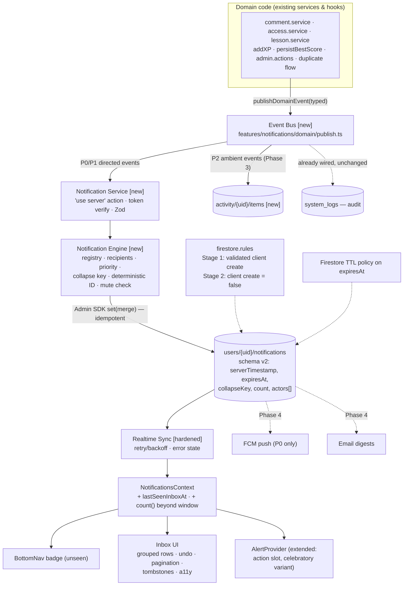
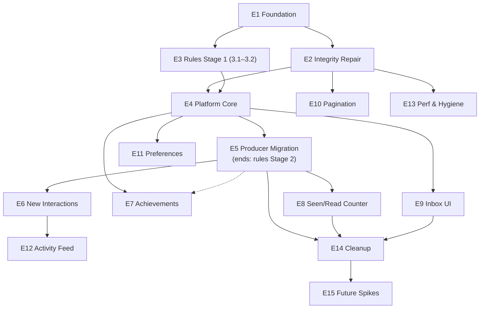

# NOTIFICATION_SYSTEM_IMPLEMENTATION_PLAN.md

> **Purpose**: the enterprise implementation backlog that converts `NOTIFICATION_SYSTEM_DISCOVERY.md` into executable work — 15 epics, 81 tasks, each scoped so a single developer (or AI agent) can pick one up and execute it without re-analyzing the project. Companion references: `NOTIFICATION_SYSTEM_DISCOVERY.md` (what's broken/missing and why), `PROJECT_CONTEXT.md` (full-repo map).
>
> **Date**: 2026-07-11. **Baseline**: `main` @ `db4e9a7`. All paths relative to the project root `src/` (the inner folder containing `package.json`). No code is written in this document.

---

# 1. Executive Summary

The discovery established that the app's notification *delivery channel* (a single always-on Firestore listener lifted into `NotificationsContext`) is sound, while everything around it is broken, missing, or dead: only 1 of 4 notification types ever fires (invites — and those fire twice), security rules permit forged notifications into any inbox, `markAllNotificationsRead` throws for lack of indexes, there is no dedup/grouping/pagination/TTL/preferences/undo/error-handling, and ~12 high-value notification moments are computed and discarded at existing write sites.

This plan sequences the fix as **15 epics across 4 development phases**, ordered so that:
- **Nothing breaks**: every epic is backward compatible; the live inbox keeps working through every step; rules tighten in two stages (validate → server-only) with the server writer landing *between* them.
- **Value ships early**: the single biggest user-visible change — comment/reply notifications going live — lands at the end of Phase 2 (~week 3), not at the end of the project.
- **Risk is front-loaded into cheap work**: Phase 1 is pure repair (emulator, backfill, indexes, idempotency, security validation) — 3–5 days that de-risk everything after.
- **Every task is reviewable and rollback-able**: tasks are sized S/M/L (≤0.5 / ≤1.5 / ≤3 dev-days), have explicit file lists, and the rollback plan (§16) is per-epic.

**Headline numbers**: 81 tasks · critical path runs E1→E2→E3→E4→E5 (repair → platform → producers) · estimated 32–46 dev-days total to the full platform · zero new npm dependencies through Phase 3.

---

# 2. Target Architecture

Module-by-module responsibilities. Modules marked **[exists]** are kept (possibly hardened); **[new]** are created by this plan; **[future]** are Phase-4+ scoped but designed-for now.

| Module | Status | Responsibility | Concrete home |
|---|---|---|---|
| **Event Bus** | [new] | Thin, typed, client-side seam: domain code calls `publishDomainEvent(event)` instead of calling notification functions directly. No queue, no persistence — a dispatcher that routes typed events to the Notification Service (and later analytics/feed). Mirrors the house pattern of `shared/audio/telemetry.ts` (dependency-free pub/sub). | `features/notifications/domain/events.ts` + `publish.ts` |
| **Notification Service** | [new] | The single authoritative *writer*: a Next.js Server Action that verifies the caller's ID token, validates payload (Zod), consults the Engine, and writes via the Admin SDK. Clients lose direct write access to inboxes (rules flip). | `features/notifications/actions/notification.actions.ts` |
| **Notification Engine** | [new] | Pure decision logic, no I/O: type registry lookup (priority, category, collapse key, renderer id), recipient resolution, self-notify suppression, preference/mute checks, deterministic doc-ID derivation, collapse/merge computation. Unit-testable in isolation. | `features/notifications/domain/engine.ts` + `registry.ts` |
| **Inbox (storage)** | [exists, schema v2] | Per-user subcollection `artifacts/{APP_ID}/users/{uid}/notifications/{id}`. V2 doc shape adds `collapseKey`, `count`, `actors[]`, `expiresAt`, server `createdAt`; keeps `status`/`readAt`; drops dual-written legacy fields after migration. | unchanged path |
| **Realtime Sync** | [exists, hardened] | The existing `subscribeNotifications` listener + `NotificationsContext`, hardened with retry/backoff, an error state (no more error≡empty), and user-switch state clearing. Remains the only transport — no polling, no RTDB. | `features/notifications/{services,context}/` |
| **Unread Counter** | [rebuilt] | Seen/read split: badge counts *unseen* (vs `lastSeenInboxAt` on the user doc); true unread beyond the live window via `getCountFromServer()`; group-level read semantics. | context + `features/user` doc field |
| **Inbox UI** | [exists, modernized] | Registry-driven row rendering, grouped rows with avatar stacks, undo toasts, pagination, unread separator, error/tombstone states, full a11y. | `app/(main)/notifications/` |
| **Toast** | [exists, extended] | `AlertProvider`/`Alert` remain the only toast system; extended with an action slot (undo) and a celebratory variant for achievements. No new toast library. | `shared/providers/AlertProvider.tsx`, `shared/components/ui/Alert.tsx` |
| **Activity Feed** | [new, Phase 3] | Ambient, read-state-free "what happened around my decks" — separate collection, separate surface; P2 events route here first per the interaction matrix. | `activity/{uid}/items` + feed UI |
| **Analytics** | [exists, reused] | The `system_logs` audit pipeline is untouched; notification lifecycle events (created/read/deleted) already log there. Open-rate style analytics derive from it later — no new pipeline. | `lib/logging/` |
| **Push (FCM)** | [future] | Web push for P0 types only; requires service worker + permission UX + token lifecycle. The Engine's priority field is the routing input, so no re-architecture is needed to add it. | Phase 4 |
| **Email Digests** | [future] | Scheduled rollup of unread P1/P2; requires Cloud Scheduler + provider. Digest query is trivial once `status`/`expiresAt` hygiene exists. | Phase 4 |
| **Webhooks** | [future] | `notificationCreated` Cloud Function trigger → user-configured endpoints. Deliberately not designed beyond the seam: the Engine's output shape is the webhook payload. | Phase 4+ |

---

# 3. Architecture Diagram



---

# 4. Implementation Principles

1. **One live inbox, always.** No task may leave the current listener/page broken at merge time. Schema changes are additive until Epic 14.
2. **Two-stage rules tightening.** Stage 1 (validate client writes) ships in Phase 1 and is compatible with the current client producers. Stage 2 (`create: false`) ships only after every producer routes through the Server Action (Epic 5), in the same release as the last producer migration.
3. **Deterministic IDs are the idempotency backbone.** `docId = hash(type + collapseKey + recipientUid [+ timeBucket])`. Every producer becomes retry-safe; duplicates become merges. This is a Phase-2 invariant that Phase-1 delivery repair (pending-doc ID reuse) foreshadows.
4. **Registry over switch statements.** Every new type is one registry entry (icon, color, priority, category, collapse fn, renderer id) — never another `case` in `NotificationListItem`.
5. **No new npm dependencies through Phase 3.** TanStack Query, date-fns, Zod, framer-motion, and the AlertProvider already cover every need (per discovery §10). Any deviation requires a written justification against §12 of this plan.
6. **Server Actions before Cloud Functions.** The lazy Admin SDK + `ActionResult` envelope pattern already exist in-repo. Functions enter only when *triggers or schedules* demand them (feed fan-out at scale, digests, streak-at-risk).
7. **Feature-flagged cutovers.** A single module-level flag (`NOTIFICATIONS_V2` in a config file, not env-scattered) gates: server-writer routing, grouped rendering, seen/read badge. Flags are removed in Epic 14 — flags are migration tools, not permanent switches.
8. **Every epic independently rollback-able** (§16). Tasks that can't be (rules flips, backfills) are explicitly marked and paired with a rehearsed reverse procedure.

**Global Definition of Done (applies to every task; per-task cards list only acceptance criteria):**
- Type-checks and builds (`next build` — the pre-commit hook enforces this).
- Unit/emulator tests written or updated for changed behavior; all tests green.
- No regression to the live inbox (manual smoke: badge, list, mark-read, invite accept).
- Follows repo conventions: design-system primitives, barrel imports, layering (`domain → services → hooks → components`), `.rules/ai-rules/*` standards.
- Task's file list matches the actual diff (or the deviation is explained in the PR).
- Reviewed against the acceptance criteria by a second pair of eyes (human or agent).

---

# 5. Epic Overview

| Epic | Title | Business objective | Phase | Est. |
|---|---|---|---|---|
| E1 | Foundation & Safety Net | Make all subsequent work testable and reversible (emulator, tests, flags) | 1 | 2–3d |
| E2 | Data Integrity Repair | Eliminate code-proven correctness defects (indexes, clocks, races, limits) | 1 | 2–3d |
| E3 | Security Rules Hardening | Close the forged-notification and pending-spam holes without breaking producers | 1→2 | 1–2d |
| E4 | Notification Platform Core | Server-side writer + engine + registry + idempotency — the platform | 2 | 4–5d |
| E5 | Producer Migration & Dead-Wire Repair | All existing producers through the platform; comments/replies finally notify | 2 | 3–4d |
| E6 | New Interaction Notifications | Owner/collaborator lifecycle events (accepted, resolved, revoked, removed…) | 2→3 | 2–3d |
| E7 | Achievement & Milestone Events | Detect and celebrate the discarded moments (best, tier, level, streak, mastery) | 3 | 3–4d |
| E8 | Unread Counter & Seen/Read Model | Industry-standard badge semantics; accurate counts beyond the window | 3 | 2d |
| E9 | Inbox UI Modernization | Grouping UI, undo, error states, touch, a11y, live timestamps | 3 | 4–5d |
| E10 | Pagination & History | Reach past the 50-doc window without widening the live listener | 3 | 1.5–2d |
| E11 | Notification Preferences | Per-category and per-deck control; roaming (Firestore-stored) | 3 | 2–3d |
| E12 | Activity Feed Separation | Ambient events out of the inbox, into a feed surface | 3 | 2–3d |
| E13 | Performance, Cost & Firebase Hygiene | TTL, offline persistence, read/write cost control | 3 | 1.5–2d |
| E14 | Legacy Cleanup & Migration Completion | Delete dual-writes, dead code, flags, compat shims | 3→4 | 1.5–2d |
| E15 | Future Extensions (scoping only) | De-risk Phase 4 with spikes and design notes, not builds | 4 | 2–3d |

---

# 6. Detailed Task Breakdown

Task card format — **ID · Title** — `Risk` (L/M/H) · `Complexity` (S ≤0.5d / M ≤1.5d / L ≤3d) · `Deps`. Then Purpose/Value, Technical description, Files (**mod** = modify, **new** = create, **del** = delete logic), Acceptance criteria. The global DoD (§4) applies to all.

## Epic 1 — Foundation & Safety Net

*Objective: nothing else in this plan should be executed against production data blind. Emulator, tests, fixtures, flags first.*

**1.1 · Firebase emulator suite configuration** — L · S · Deps: none
Purpose: local, disposable Firestore+Auth for every subsequent test and migration rehearsal. Today `firebase.json` has no emulators block; every experiment hits prod.
Tech: add `emulators` block (firestore, auth, ports) to `firebase.json`; npm scripts `emulators:start`, `test:emu`; document `FIRESTORE_EMULATOR_HOST` usage for Admin SDK and client SDK connection in tests.
Files: **mod** `firebase.json`, `package.json`; **new** `docs/testing-notifications.md` (short runbook).
AC: `firebase emulators:start` boots Firestore+Auth locally; a trivial emulator round-trip test passes in `vitest` (node env — already configured).

**1.2 · Notification test harness + fixtures** — L · M · Deps: 1.1
Purpose: shared setup so every notification test doesn't reinvent seeding.
Tech: test utilities that (a) connect client & Admin SDK to the emulator, (b) create fixture users/lessons/notifications (factory functions covering all three legacy doc shapes: status-only, read-only, neither — the `!=` trap shapes), (c) reset state between tests.
Files: **new** `features/notifications/__tests__/harness.ts`, `fixtures.ts`.
AC: fixtures can produce all 3 legacy shapes + v2 shape; harness used by ≥1 passing test.

**1.3 · Baseline behavior regression suite** — L · M · Deps: 1.2
Purpose: freeze current behavior (including its quirks) so repairs are provably behavior-preserving where intended and provably fixed where not.
Tech: emulator tests for: subscribe primary/fallback paths, `isUnread` across 3 doc shapes, `markNotificationRead` dual-write, `deliverPendingNotifications` happy path, group bucketing boundaries.
Files: **new** `features/notifications/__tests__/{subscribe,lifecycle,delivery}.test.ts`.
AC: suite green against current code; the known defects (double-invite, dup delivery) captured as `.todo`/failing-documented tests to flip green in E2/E5.

**1.4 · Security-rules unit tests** — M · M · Deps: 1.1
Purpose: rules changes (E3) must be test-driven; rules bugs are production incidents.
Tech: `@firebase/rules-unit-testing` (dev-dependency — the one permitted test-only addition, standard Firebase tooling) exercising: owner read/update, cross-user create (currently allowed — assert current then flip in E3), pending read scoping, hard-delete.
Files: **new** `firestore-rules.test.ts` (root, beside `firestore.rules`); **mod** `package.json` (devDep).
AC: current rules' behavior fully asserted, including the insecure paths (as documented-failing expectations for E3).

**1.5 · `NOTIFICATIONS_V2` feature-flag module** — L · S · Deps: none
Purpose: single switch for staged cutovers (writer routing, grouped rendering, seen/read badge); avoids env-var sprawl.
Tech: one config module exporting typed flags with defaults false; consumed via import (tree-shakeable), not context.
Files: **new** `features/notifications/config.ts`.
AC: flags importable from server and client code; flipping requires one-line change; documented removal plan (E14.5).

## Epic 2 — Data Integrity Repair

*Objective: every defect in discovery §2.6 fixed, behavior-preserving otherwise. All shippable independently.*

**2.1 · Ship missing composite indexes** — L · S · Deps: none
Purpose: `markAllNotificationsRead` currently throws `failed-precondition` as-written (discovery: `(read,isDeleted)` and `(status,isDeleted)` absent).
Tech: add both composites to `firestore.indexes.json`; deploy via CLI. (One becomes droppable after E14.1 — noted there.)
Files: **mod** `firestore.indexes.json`.
AC: mark-all-read succeeds against emulator with indexes loaded; index build verified in console.

**2.2 · Legacy-doc backfill script** — M · M · Deps: 1.1, 1.2
Purpose: kill the `!=` field-existence trap (legacy docs invisible to primary query, visible to fallback) and pre-stamp TTL.
Tech: one-time Admin-SDK script: for every notifications doc missing fields, stamp `status` (derived via `isUnread` logic), `isDeleted:false`, and `expiresAt` (per E13.1 policy). Batched ≤400 ops, resumable (cursor by uid), dry-run mode. Rehearse on emulator with 1.2 fixtures; run once against prod.
Files: **new** `scripts/backfill-notifications.mjs`; **new** short runbook section in `docs/testing-notifications.md`.
AC: dry-run reports counts; emulator rehearsal converts all 3 legacy shapes; post-run, primary and fallback queries return identical sets.

**2.3 · `serverTimestamp()` for `createdAt`** — M · M · Deps: 1.3
Purpose: sender-clock timestamps break ordering and Today/Yesterday bucketing under skew.
Tech: switch all creators to `serverTimestamp()`; readers handle the brief `null` local-pending state (Firestore returns null for unresolved server timestamps in latency-compensated snapshots — render as "sending…" or use `serverTimestamps: "estimate"` snapshot option); `groupNotificationsByTime` gets a DST-safe yesterday boundary (date-fns `startOfDay`/`subDays`).
Files: **mod** `features/notifications/services/notification.service.ts`, `types/index.ts` (createdAt may be Timestamp|number during transition), `context/NotificationsContext.tsx` (snapshot options), `app/(main)/notifications/_components/NotificationListItem.tsx`.
AC: new docs order correctly regardless of client clock; bucket math passes a DST-boundary unit test; old numeric `createdAt` docs still render.

**2.4 · Idempotent, chunked pending delivery** — M · M · Deps: 1.3
Purpose: kill the multi-device double-delivery race and the >250-item permanent-failure loop.
Tech: destination doc ID = pending doc ID (second concurrent commit becomes an idempotent overwrite); chunk the batch at ≤200 items (400 ops); move the delivered activity-log call *after* successful commit; keep per-token-event triggering but make it cheap (early-exit on empty).
Files: **mod** `features/notifications/services/notification.service.ts` (`deliverPendingNotifications`).
AC: emulator test simulating two concurrent deliveries yields exactly one inbox doc per pending item; 300-item fixture delivers fully across chunks; log fires only on success.

**2.5 · Fix the guaranteed double-invite** — M · S · Deps: 1.3
Purpose: one email invite currently produces two invite notifications (pending delivery + `syncInviteToCollaborator` self-notify).
Tech: remove the `notifyInvite({toUserId})` call from `syncInviteToCollaborator` (`features/flashcard/services/access.service.ts` L83) — the invitee already has the pending-delivered invite. (The owner-facing `invite_accepted` replaces its one useful side effect, in E6.1 — until then, acceptance is silent, which is the current owner experience anyway.)
Files: **mod** `features/flashcard/services/access.service.ts`.
AC: end-to-end emulator flow (invite → login → open link) yields exactly one invite notification; regression test from 1.3 flips green.

**2.6 · Chunk mark-all-read and clear-all; unify limits** — M · S · Deps: 2.1
Purpose: mark-all throws >500 unread; clear-all silently strands docs past 500.
Tech: loop both operations in ≤400-op batches until exhausted; share one chunked-batch helper.
Files: **mod** `features/notifications/services/notification.service.ts`; **new** helper in same file or `services/batch.ts`.
AC: 600-doc fixture: mark-all marks all; clear-all clears all; no thrown batch errors.

**2.7 · Clear state on user switch** — L · S · Deps: none
Purpose: stale badge/list flash when switching accounts A→B.
Tech: in `NotificationsContext`'s effect, `setNotifications([])` + `setLoading(true)` synchronously when uid changes before resubscribing.
Files: **mod** `features/notifications/context/NotificationsContext.tsx`.
AC: unit test: uid change renders empty+loading before B's first snapshot; badge never shows A's count.

**2.8 · Listener retry/backoff + surfaced error state** — M · M · Deps: 1.3
Purpose: today a dead fallback stream renders "No notifications yet" forever (error ≡ empty).
Tech: context gains `error: Error | null`; fallback failure schedules capped exponential re-subscribe (e.g. 1s→2s→4s→…→60s, reset on success); expose `retry()`; page renders an error card (UI in E9.4, minimal inline text here).
Files: **mod** `features/notifications/{services/notification.service.ts,context/NotificationsContext.tsx}`, `app/(main)/notifications/page.tsx` (minimal error branch).
AC: emulator test: killed stream recovers on restore; error state distinguishable from empty in context value.

**2.9 · Withdraw pending notifications on invite revoke** — M · S · Deps: none
Purpose: `revokeEmailInvite` removes the `invitedEmails` entry but leaves the pending notification deliverable forever.
Tech: on revoke, query the email's pending items for `data.lessonId == lessonId && type == "invite"` and delete them (client SDK is permitted: creator ≠ reader, but rules allow… — verify: pending delete is email-scoped to the *invitee*; the *owner* cannot delete. Therefore route through a small Server Action using Admin SDK, or defer deletion to delivery-time filtering: at delivery, skip invite items whose lesson no longer has a matching `invitedEmails` entry. **Choose delivery-time filtering** — no new rules surface, no privilege expansion).
Files: **mod** `features/notifications/services/notification.service.ts` (delivery-time validity check), `features/flashcard/services/access.service.ts` (doc comment pointing at the mechanism).
AC: revoked invite's pending item is skipped (and cleaned) at next delivery; valid invites unaffected.

## Epic 3 — Security Rules Hardening

*Objective: close forgery/spam holes in two compatible stages.*

**3.1 · Stage-1 rules: validated client creates** — H · M · Deps: 1.4
Purpose: today any authed user can write any payload into any inbox. Stage 1 blocks forgery/spam while the client producers still exist.
Tech: `notifications/{id}` create requires: `request.resource.data.senderId == request.auth.uid`, `request.resource.data.userId == userId` (path match), `type in ['invite','comment','reply','role_change']`, string size caps on title/message, `status == 'unread'`, `isDeleted == false`. `pendingNotifications` create: same sender binding + size caps (recipient email can't be fully validated client-side — accepted residual until Stage 2).
Files: **mod** `firestore.rules`; **mod** `firestore-rules.test.ts` (flip 1.4's documented-insecure assertions).
AC: rules tests: forged `senderId` rejected, cross-path `userId` rejected, oversized payload rejected; legitimate invite flow still passes end-to-end.

**3.2 · Deny client hard-delete; soft-delete only** — M · S · Deps: 3.1
Purpose: rules currently allow owner `delete`, contradicting the soft-delete convention.
Tech: remove `delete` from the owner grant; `update` rule permits setting `isDeleted:true` (and read-state fields) but not mutating `senderId`/`type`/`createdAt`.
Files: **mod** `firestore.rules`, rules tests.
AC: hard-delete rejected; soft-delete and read-state updates pass; immutable fields locked.

**3.3 · Stage-2 rules: server-only creation** — H · S · Deps: E5 complete (5.7)
Purpose: final posture — clients cannot create notifications at all; the Server Action (Admin SDK, bypasses rules) is the only writer.
Tech: `allow create: if false` on both notification paths. Ships in the **same release** as the last producer migration (5.7). This task is the rules half; 5.7 is the code half.
Files: **mod** `firestore.rules`, rules tests.
AC: rules tests: all client creates rejected; full invite/comment E2E via Server Action passes on emulator.

## Epic 4 — Notification Platform Core

*Objective: the engine + service that everything else plugs into. Pure additive — nothing consumes it until E5.*

**4.1 · Domain event types** — L · M · Deps: none
Purpose: typed vocabulary for everything that can happen (the Event Bus's contract).
Tech: discriminated union `DomainEvent` covering the interaction matrix (discovery §5): `invite_sent`, `invite_accepted`, `invite_declined`, `comment_added`, `reply_added`, `comment_resolved`, `role_changed`, `access_revoked`, `deck_updated_by_editor`, `deck_deleted`, `deck_duplicated`, `content_removed_by_admin`, `achievement_unlocked` (with `kind` sub-union), … Each variant carries actor, object refs (lessonId/cardId/commentId), and recipient-resolution inputs — not resolved recipients (the Engine resolves).
Files: **new** `features/notifications/domain/events.ts`.
AC: every row of the discovery interaction matrix maps to exactly one event variant; types compile; no `any`.

**4.2 · Zod payload schemas** — L · S · Deps: 4.1
Purpose: runtime validation at the Server-Action boundary, mirroring `lib/logging/schema.ts`'s `systemLogInputSchema` precedent.
Tech: `domainEventSchema` (per-variant), `notificationDocSchema` (v2 doc shape). Server Action parses before any I/O.
Files: **new** `features/notifications/domain/schema.ts`.
AC: schema round-trips every event variant; malformed payloads produce typed failures; unit tests per variant.

**4.3 · Notification type registry** — L · M · Deps: 4.1
Purpose: kill the type-union + icon-switch duplication; make "add a type" a one-entry change.
Tech: `registry.ts`: `Record<NotificationTypeV2, { icon: LucideIcon; colorToken; priority: "P0"|"P1"|"P2"; category: "collaboration"|"achievement"|"system"; collapseKey: (e) => string; render: RendererId; pushEligible: boolean }>`. Categories drive preferences (E11) and future push routing.
Files: **new** `features/notifications/registry.ts`; **mod** `features/notifications/types/index.ts` (V2 type union derived from registry keys).
AC: registry covers all E5/E6/E7 types; exhaustiveness enforced by types (adding a type without a registry entry fails compile).

**4.4 · Notification factory (payload → doc v2)** — L · M · Deps: 4.1, 4.3
Purpose: one normalization point producing the v2 doc shape.
Tech: pure function: event + recipient → `{type, title, message, data, senderId, senderName, actors:[{uid,name,photoURL?}], collapseKey, count:1, status:"unread", isDeleted:false, createdAt: <serverTimestamp sentinel>, expiresAt}`; message templates per type live beside the registry.
Files: **new** `features/notifications/domain/factory.ts`.
AC: golden-file unit tests per type; no Firestore imports in the module (pure).

**4.5 · Deterministic IDs + dedup strategy** — M · M · Deps: 4.4
Purpose: idempotency backbone (kills producer retries/dupes) and the write-side half of grouping.
Tech: `notifId = hash(type + collapseKey + recipientUid [+ dayBucket for time-collapsed types])` — stable hash (e.g. FNV-1a hex, no dependency). Registry's `collapseKey` decides bucketing. Document collision posture (per-user namespace → negligible).
Files: **new** in `features/notifications/domain/engine.ts`.
AC: property test (fast-check, already a devDep): same event twice → same ID; distinct objects → distinct IDs.

**4.6 · Collapse/merge write semantics** — M · M · Deps: 4.5
Purpose: comment bursts become "N new comments" (one doc updated), not N docs.
Tech: writer does `set(ref, doc, {merge:true})` with `count: increment(1)`, `actors: arrayUnion(actor)` (cap actors at ~4 for rendering), `updatedAt: serverTimestamp()`, and **resets `status` to `"unread"`** on merge (new activity re-surfaces a read group — GitHub semantics).
Files: **mod** `features/notifications/domain/engine.ts`; writer in 4.7.
AC: emulator test: 3 comment events on one card → 1 doc, count 3, 2 distinct actors, unread after prior read.

**4.7 · Server Action writer (`createNotificationAction`)** — M · L · Deps: 4.2, 4.5, 4.6, 3.1
Purpose: the single authoritative write path.
Tech: `"use server"`; verifies caller ID token (pattern: `lib/logging/user-actions.ts`); asserts `event.actorId == decoded.uid` (no acting-as); Zod-parses; Engine resolves recipients (e.g. lesson roles map fetched via Admin SDK), applies self-notify suppression and (E11 stub) mute checks; writes per-recipient with deterministic IDs; returns `ActionResult` envelope (house pattern). Fan-out inline (collaborator counts are small); chunk if >20 recipients.
Files: **new** `features/notifications/actions/notification.actions.ts`; **mod** `features/notifications/actions/index.ts` (barrel).
AC: emulator E2E: comment event → owner doc created, commenter (self) suppressed; forged actorId rejected; recipient resolution unit-tested against a fixture lesson with owner+editor+commenter+viewer.

**4.8 · Priority calculation** — L · S · Deps: 4.3
Purpose: P0/P1/P2 drives badge/toast now, push/digest later.
Tech: priority comes from the registry, with per-event overrides hook (e.g. `deck_updated` collapses to P2 when actor is owner, P1 when actor is editor-on-your-deck). Stored on the doc (`priority`) for query/digest use.
Files: **mod** `registry.ts`, `factory.ts`.
AC: matrix rows' priorities reproduced by unit test.

**4.9 · Mute/preference check seam** — L · S · Deps: 4.7
Purpose: E11 lands later; the Engine needs the hook now so producers never change again.
Tech: `isMuted(recipientUid, event): Promise<boolean>` — Phase-2 implementation returns false; E11 replaces internals. Called by the writer pre-write.
Files: **new** stub in `features/notifications/domain/engine.ts`.
AC: writer consults the seam; stub covered by a test asserting it's called per recipient.

**4.10 · `publishDomainEvent()` client seam** — L · S · Deps: 4.1, 4.7
Purpose: producers call one function; routing (Server Action now, Functions later, feed in E12) is centralized.
Tech: thin async dispatcher: validates shape client-side (cheap), fetches ID token, calls the Server Action, swallows-and-logs failures (fire-and-forget semantics preserved — notifications must never block the primary action; house pattern). Dev-mode console.debug of every event (mirrors audio telemetry).
Files: **new** `features/notifications/domain/publish.ts`.
AC: unit test: failure of the action does not reject the caller's promise chain; event logged in dev.

**4.11 · Schema v2 types + read-compat** — L · M · Deps: 4.3
Purpose: readers must handle v1 docs (both legacy shapes) and v2 docs simultaneously until E14.
Tech: `AppNotificationV2` type; `normalizeNotificationDoc(raw): AppNotificationV2` coercion at the subscription boundary (pattern precedent: `normalizeLesson`); `isUnread` folded into the normalizer.
Files: **mod** `features/notifications/types/index.ts`, `context/NotificationsContext.tsx` (normalize on snapshot).
AC: normalizer unit tests across all 4 doc shapes; UI renders mixed lists correctly.

## Epic 5 — Producer Migration & Dead-Wire Repair

*Objective: every notification flows through the platform; the dead collaboration loop comes alive. Ends with the rules flip.*

**5.1 · Migrate `inviteByEmail` to the platform** — M · M · Deps: 4.7, 4.10
Tech: replace the direct `notifyInvite({toEmail})` call (`access.service.ts` L137) with `publishDomainEvent({type:"invite_sent",…})`; pending-notification creation moves inside the Server Action (Admin SDK writes the pending doc — enabling Stage-2 rules to also close the pending-create hole).
Files: **mod** `features/flashcard/services/access.service.ts`, `features/notifications/actions/notification.actions.ts`.
AC: E2E invite flow green (send → pending → login delivery → single notification); Stage-2 pending rule viable.

**5.2 · Wire `notifyCtx` — comment notifications live** — M · M · Deps: 4.7, 4.10 · **The headline task of the project.**
Purpose: comments on shared decks finally notify (dead-wired today: `useCommentPanel.ts` never passes `notifyCtx` to `comment.service.ts` L191).
Tech: replace the `notifyCtx` mechanism entirely: `useCommentPanel`'s add-comment path calls `publishDomainEvent({type:"comment_added", lessonId, cardId, commentId, cardLabel, deckTitle,…})` after successful comment write. **Include `commentId`** (currently omitted — breaks deep-linking). Recipients (Engine): deck owner + prior thread participants, minus actor. Collapse key: `comment:{lessonId}:{cardId}`.
Files: **mod** `features/flashcard/hooks/useCommentPanel.ts`; **del** `notifyCtx` plumbing in `features/flashcard/services/comment.service.ts` (the dead parameter and its internal calls).
AC: emulator E2E: A comments on B's deck → B gets one notification with working deep link; 3 rapid comments → one collapsed doc (count 3); self-comment → nothing.

**5.3 · Reply notifications live** — M · S · Deps: 5.2
Tech: same pattern at the reply path (`useCommentPanel.ts` reply handler; dead call at `comment.service.ts` L273). Recipients: parent-comment author + deck owner (if distinct), minus actor. Collapse: `reply:{commentId}`.
Files: **mod** `features/flashcard/hooks/useCommentPanel.ts`, `comment.service.ts` (**del** dead branch).
AC: reply notifies parent author and owner (when distinct); self-reply silent.

**5.4 · `role_change` finally fires** — M · S · Deps: 4.7
Purpose: the dead-since-birth `notifyRoleChange` moment, done right.
Tech: `ShareModal`'s `commitRolesUpdate` (`ShareModal.tsx` L222-252) publishes `role_changed` (target uid, old role, new role) — also enriching the currently-lossy `SHARE_ROLES_UPDATED` audit log (add target + roles to metadata while there).
Files: **mod** `features/flashcard/components/ShareModal.tsx`; **del** `notifyRoleChange` from `notification.service.ts` (superseded).
AC: role change notifies the affected collaborator with old→new roles in the message; remove-collaborator path emits `access_revoked` instead (E6.4 type, wired here if E6 not yet started — single event site).

**5.5 · Decline actually declines** — M · M · Deps: none (independent)
Purpose: Decline currently soft-deletes the notification while the invite silently survives and re-converts on next visit.
Tech: Decline handler (`NotificationListItem.tsx` `InviteActions`) publishes `invite_declined`; a small Server Action removes the lesson's `invitedEmails[email]` entry (Admin SDK — the invitee can't write the owner's lesson doc) and soft-deletes the notification; owner receives `invite_declined` (P2) per matrix.
Files: **mod** `app/(main)/notifications/_components/NotificationListItem.tsx`; **new** action in `features/notifications/actions/notification.actions.ts` (or `features/flashcard/actions/` — keep with sharing domain: **decide** `features/flashcard/actions/invite.actions.ts`).
AC: after Decline, opening the share link does NOT grant collaborator access; owner sees the decline notification.

**5.6 · V1→V2 rendering compatibility switch** — L · S · Deps: 4.11, 1.5
Tech: `NotificationListItem` renders via the registry for v2 docs, legacy switch for v1; gated by normalizer output, not the flag (shape-driven).
Files: **mod** `app/(main)/notifications/_components/NotificationListItem.tsx`.
AC: mixed v1/v2 inbox renders correctly; no flag needed at read time.

**5.7 · Retire client producers + flip Stage-2 rules** — H · S · Deps: 5.1–5.5, 3.3
Purpose: the point of no (easy) return — one release containing: deletion of `createNotification`/`createPendingNotification`/`notifyInvite`/`notifyComment`/`notifyReply` client exports, and the `create: false` rules.
Tech: coordinated release; rollback = revert commit + redeploy prior rules (rehearsed, §16).
Files: **mod** `features/notifications/services/notification.service.ts` (**del** creator exports; keep read/subscribe/mutation functions), `firestore.rules`.
AC: grep: zero client-side notification-create call sites; full E2E suite green under Stage-2 rules.

## Epic 6 — New Interaction Notifications

*Objective: the owner/collaborator lifecycle events from the interaction matrix. Each task = one registry entry + one producer call site + tests. All follow the identical pattern; risk L, complexity S unless noted.*

**6.1 · `invite_accepted` → owner** — Deps: 4.7, 2.5. Producer: `syncInviteToCollaborator` (`access.service.ts` — the exact moment already exists; this replaces the removed self-notify). AC: owner notified once per acceptance; accepting user gets nothing.
**6.2 · `invite_declined` → owner** — Deps: 5.5 (producer wired there). AC: P2, no badge interruption (per matrix; badge behavior lands with E8 — until then it's a normal inbox row).
**6.3 · `comment_resolved` → comment author** — Deps: 4.7. Producer: `resolveComment` path in `useCommentPanel`/`comment.service.ts` L308. AC: resolver ≠ author → author notified; self-resolve silent.
**6.4 · `access_revoked` → removed collaborator** — Deps: 5.4. Producer: remove-collaborator branch of `commitRolesUpdate`. AC: removed user notified; message does not leak who else has access.
**6.5 · `deck_updated` → owner (editor edits) + collaborators (ambient)** — M complexity — Deps: 4.6. Producer: `useLessons.saveFullLesson` success path when `actor != owner` (the editor-edit detection: edit page's `?ownerId=` flow). Collapse: `deck_updated:{lessonId}:{actorId}:{day}` — one per actor per deck per day. Owner P1; other collaborators route to feed when E12 lands (until then: suppressed, not inboxed — matrix says ambient).
**6.6 · `deck_deleted` → collaborators** — Deps: 4.7. Producer: `useLessons.deleteLesson` — must snapshot the roles map *before* the delete batch (recipients vanish with the doc). AC: all non-owner role holders notified; message carries deck title (referent will be gone — tombstone-safe by construction).
**6.7 · `deck_duplicated` → original owner** — Deps: 4.6. Producer: shared-page duplicate flow (`app/(main)/flashcard/shared/[shareId]/page.tsx` L122-161 — lineage already stamped). Collapse: `deck_duplicated:{lessonId}` ("N people saved your deck", actors capped). P2.
**6.8 · `content_removed` (admin) → owner** — M complexity — Deps: 4.7. Producer: `deleteGlobalFlashcardAction` (`features/admin/actions/admin.actions.ts`) — already server-side with Admin SDK; calls the Engine directly (no client hop). P0 + a `reason` field. AC: owner notified with deck title and a neutral policy message; admin identity NOT disclosed.
**6.9 · Admin `role_change` (system) → affected user** — Deps: 6.8 pattern. Producer: `setAdminRoleAction`. AC: grant and revoke both notify; message copy reviewed (system-sender, not admin's name).

## Epic 7 — Achievement & Milestone Events

*Objective: detect the discarded moments at their existing write sites; celebrate without spamming.*

**7.1 · Achievement framework (registry category + celebratory surface)** — L · M · Deps: 4.3
Tech: `achievement` category in the registry (self-notifications, P1/P2, `collapseKey: achievement:{kind}`); celebratory toast variant in `AlertProvider`/`Alert` (reuses confetti + `usePrefersReducedMotion` pattern from `GameResultsScreen`); registry `render` id for a trophy-styled row.
Files: **mod** `registry.ts`; **mod** `shared/providers/AlertProvider.tsx`, `shared/components/ui/Alert.tsx` (celebration variant — design-system compliant).
AC: an achievement event produces both an inbox row and (when app is foreground) a celebration toast; reduced-motion respected.

**7.2 · New personal best** — L · S · Deps: 7.1. Tech: `persistBestScore` (`features/game/services/game.service.ts` L66-115) already reads old best inside its transaction — return `{isNewBest, oldBest}` and publish from the calling hook (client-side detection is the current trust model for scores; documented). Kills the racy client-side `isNewBest` re-derivation in `GameResultsScreen` as a bonus. AC: new best → one notification per mode per improvement; replays without improvement silent.
**7.3 · Tier promotion** — L · S · Deps: 7.2. Tech: same transaction, compare `scoreToTier(old)` vs `scoreToTier(new)`. AC: bronze→silver fires once; non-crossing improvements silent.
**7.4 · Level-up** — L · S · Deps: 7.1. Tech: `addXP` (`features/user/hooks/useUserProgress.ts` L37-61): compare `floor(oldXp/500)` vs `floor(newXp/500)`. AC: crossing fires exactly once (idempotent ID: `achievement:level:{level}`).
**7.5 · Streak milestones** — L · S · Deps: 7.4. Tech: same site; milestones {3,7,30,100}; deterministic ID per milestone prevents re-fires. ("Streak at risk" needs scheduling — deferred to E15.2 scope.)
**7.6 · Deck fully mastered** — M · M · Deps: 7.1. Tech: at study-session completion (`useStudySession.handleComplete`), compute mastered-count from the already-live `useCardsWithProgress` data; publish when `mastered == total && total > 0` with ID `achievement:deck_mastered:{lessonId}` (re-fire only after a reset). AC: mastering fires once; un-mastering (interval regression) then re-mastering fires again only post-reset — decision documented.
**7.7 · Kana 80% mastery** — L · S · Deps: 7.1. Tech: threshold-crossing detection where `markLearned` updates progress (not in the render-time `useKanaHubState` calc); ID `achievement:kana80:{alphabet}`. AC: crossing 80% per alphabet fires once ever.
**7.8 · Copy/i18n pass for achievement messages** — L · S · Deps: 7.2–7.7. Product-reviewed strings in the factory's template table (Japanese-learning tone, emoji per TIER_INFO precedent). AC: all templates reviewed; no lorem placeholder ships.

## Epic 8 — Unread Counter & Seen/Read Model

**8.1 · `lastSeenInboxAt` + mark-seen-on-open** — M · M · Deps: none
Tech: field on the user doc (`users/{uid}` — beside progress; rules already owner-scoped); `/notifications` page writes it on mount (throttled); context computes `unseenCount = notifications.filter(n => createdAt > lastSeenInboxAt && isUnread(n)).length`.
Files: **mod** `features/user/services/user.service.ts`, `context/NotificationsContext.tsx`, `app/(main)/notifications/page.tsx`.
AC: opening the inbox zeroes the badge; rows keep unread styling; cross-device: badge converges via the user-doc listener.

**8.2 · Badge = unseen; accurate count beyond window** — M · M · Deps: 8.1
Tech: `getCountFromServer(where status=="unread")` on inbox open + on `lastSeenInboxAt` refresh; context exposes `{unseenCount, trueUnreadCount}`; BottomNav renders unseen ("99+" finally reachable and correct).
Files: **mod** `context/NotificationsContext.tsx`, `app/(main)/_components/BottomNav.tsx`.
AC: 120-unread fixture: badge shows true count; count query fires ≤1× per inbox open (no polling).

**8.3 · Unread separator** — L · S · Deps: 8.1. Tech: "New" divider row above the first item older than `lastSeenInboxAt` snapshot-at-open. Files: **mod** page + list components. AC: separator positions correctly; absent when nothing new.
**8.4 · Badge a11y** — L · S · Deps: 8.2. Tech: `aria-live="polite"` region announcing count changes; sr-only "N unread notifications". Files: **mod** `BottomNav.tsx`. AC: screen reader announces transitions; no announcement spam (debounced).
**8.5 · Group-level read semantics** — M · S · Deps: 4.6, 8.1. Tech: opening a collapsed row marks the single doc read (count/actors preserved for display); merge-reset-to-unread (4.6) re-surfaces later activity. AC: read collapsed row stays read until new activity merges in.

## Epic 9 — Inbox UI Modernization

**9.1 · Registry-driven row renderer** — L · M · Deps: 4.3, 4.11. Tech: replace the icon `switch` in `NotificationListItem` with registry lookup; renderer-id → row component map (standard, collapsed, achievement, tombstone, invite-actions). Files: **mod** `NotificationListItem.tsx`; **new** `_components/rows/*.tsx`; **del** the type switch. AC: all types render via registry; adding a type requires zero edits to list components.
**9.2 · Grouped rows + avatar stacks** — M · L · Deps: 9.1, 4.6, and `collaboratorMeta.photoURL` (subtask: extend `syncInviteToCollaborator` to stamp `photoURL` at acceptance; existing rows fall back to initials — the current `UserAvatar`/`UserMeta` fallback already handles this). Tech: collapsed row shows up to 3 overlapping avatars + "+N", actor summary ("K. and 3 others"), count badge. Files: **mod** `access.service.ts` (photoURL stamp), **new** `_components/rows/CollapsedRow.tsx`, `_components/AvatarStack.tsx` (or promote to `shared/components/ui` if a second consumer appears — default: keep local). AC: 5-actor collapsed doc renders 3 avatars + "+2"; initials fallback; no layout shift.
**9.3 · Undo toasts for destructive actions** — M · M · Deps: none (AlertProvider extension shared with 7.1). Tech: `Alert` gains an optional action button; delete/clear-all show "Cleared N notifications — Undo" (8s); undo flips `isDeleted:false` back (single doc) or replays the captured id list (clear-all — capped at the operation's actual doc ids, captured pre-batch). Remove the (nonexistent) confirm in favor of undo. Files: **mod** `shared/components/ui/Alert.tsx`, `shared/providers/AlertProvider.tsx`, `NotificationListItem.tsx`, `page.tsx`. AC: undo within window restores exactly the affected docs; after window, no-op; a11y: toast focusable, action reachable by keyboard.
**9.4 · Error state + retry UI** — L · S · Deps: 2.8. Tech: error card (design-system `EmptyState` variant with danger styling) + retry button wired to context `retry()`. Files: **mod** `NotificationsPlaceholders.tsx`, `page.tsx`. AC: killed stream shows error card, not "all caught up"; retry recovers.
**9.5 · Live relative timestamps** — L · S · Deps: none. Tech: 30s ticker context (one interval for the whole list) + date-fns `formatDistanceToNow`; delete the hand-rolled `relativeTime`. Files: **mod** `NotificationListItem.tsx`; **new** `_components/useNowTicker.ts`; **del** hand-rolled fn. AC: timestamps advance without snapshot churn; one interval total (not per row).
**9.6 · Touch-visible actions (kebab)** — M · M · Deps: 9.1. Tech: replace hover-revealed delete with an always-visible kebab menu (existing dropdown patterns / `useDialogA11y`); menu: mark read/unread, delete, (later) mute-this-deck. Files: **mod** row components; **del** `opacity-0 group-hover` delete. AC: all actions reachable on touch; keyboard: menu opens with Enter/Space, arrows navigate.
**9.7 · Accessibility pass** — L · M · Deps: 9.1–9.6. Tech: Space-key activation on rows; sr-only unread text; focus management after row deletion (move to next row); `prefers-reduced-motion` on any new animation; audit with the existing a11y conventions (`useDialogA11y`, focus-visible rings). AC: keyboard-only full journey (navigate → open → act → undo) possible; no focus loss on mutation.
**9.8 · Tombstone rendering for dead referents** — M · S · Deps: 9.1. Tech: navigation guard — on row activation, if the deep link is a shared deck, the target page already 404s; better: row-level "no longer available" state when `data.lessonId` known-deleted (deck_deleted events set a flag on their own notifications at creation; for organic dangles, catch the 404 return path and mark the doc). Minimal viable: render tombstone style for `deck_deleted` type + graceful 404 landing for others. AC: no dead-end navigation without explanation.
**9.9 · List enter/exit animations** — L · S · Deps: 9.1. Tech: `AnimatePresence` + layout animations on rows (house framer-motion springs); reduced-motion collapses to fades. AC: insertion/removal animate; zero animation under reduced motion.

## Epic 10 — Pagination & History

**10.1 · Cursor-paginated history query** — L · M · Deps: 2.2 (backfill ensures uniform fields). Tech: `getDocs` page fn: `where isDeleted==false, orderBy createdAt desc, startAfter(cursor), limit(30)` — reuses the live query's existing composite index. Files: **mod** `notification.service.ts` (new `fetchNotificationPage`). AC: pages don't overlap the live window (dedupe by id at merge); stable ordering.
**10.2 · `useInfiniteQuery` history hook** — L · M · Deps: 10.1. Tech: TanStack `useInfiniteQuery` (already installed; admin precedent) keyed `["notifications-history", uid]`, `staleTime: Infinity` (history is immutable-ish; live window covers fresh). Files: **new** `features/notifications/hooks/useNotificationHistory.ts`. AC: fetches only on demand; cache evicted on uid change.
**10.3 · Infinite-scroll trigger** — L · S · Deps: 10.2. Tech: small custom `useIntersectionObserver` hook (native API — no dependency per §12); sentinel row at list end. Files: **new** `shared/hooks/useIntersectionObserver.ts` (genuinely reusable → shared). AC: scroll to end loads next page exactly once per crossing; manual "Load more" fallback button for a11y.
**10.4 · Live + history merge in UI** — M · M · Deps: 10.2, 9.1. Tech: render live window first, history pages after, id-deduped; separator between "live" and "older" is invisible to users (single list). AC: no duplicate rows; mutations (read/delete) on history rows update via one-off doc writes and local cache patching (React Query `setQueryData`).

## Epic 11 — Notification Preferences

**11.1 · Preferences data model** — L · S · Deps: 4.3. Tech: `users/{uid}/settings/notifications` doc: `{categories: {collaboration: bool, achievement: bool, system: bool}, mutedDecks: string[], updatedAt}`; defaults all-on; rules: owner read/write; **Firestore, not the localStorage Zustand store** (must roam). Files: **new** model in `features/notifications/domain/preferences.ts`; **mod** `firestore.rules` (+tests). AC: doc shape Zod-validated; defaults applied when absent.
**11.2 · Preferences service + hook** — L · M · Deps: 11.1. Tech: `onSnapshot` hook (house triple `{prefs, loading, error}`) + write fns. Files: **new** `features/notifications/{services/preferences.service.ts,hooks/useNotificationPreferences.ts}`. AC: live cross-device sync verified on emulator.
**11.3 · Engine integration** — M · S · Deps: 11.2, 4.9. Tech: replace the 4.9 stub: writer reads the recipient's prefs doc (Admin SDK, 1 read per recipient — acceptable; cache per-invocation) and suppresses category-off / deck-muted events. P0 system events (`content_removed`) are non-suppressible — documented. AC: muted deck's comment events create nothing; system P0 always delivers.
**11.4 · Per-deck mute surface** — L · S · Deps: 11.3, 9.6. Tech: "Mute this deck" in the row kebab + on the deck detail page (owner/collaborator). AC: mute round-trips; visible muted state.
**11.5 · Preferences UI** — L · M · Deps: 11.2. Tech: section in `/settings` using existing `SettingsMenu`/toggle patterns: 3 category toggles + muted-decks list with unmute. Files: **mod** `app/(main)/settings/page.tsx`. AC: design-system compliant; changes reflected in delivery within one event.

## Epic 12 — Activity Feed Separation

**12.1 · Feed collection + rules** — M · M · Deps: 4.10. Tech: `artifacts/{APP_ID}/activity/{uid}/items/{id}` — no read state, `expiresAt` 30d TTL, owner-read, server-write only (born with Stage-2 posture). Files: **mod** `firestore.rules`, `firestore.indexes.json` (createdAt desc — single-field suffices); **new** `features/notifications/domain/feed.ts`. AC: rules tests; TTL stamped.
**12.2 · Feed producers (P2 ambient routing)** — M · M · Deps: 12.1, E6. Tech: Engine routes matrix-P2-ambient events (`deck_updated` to non-owner collaborators, `privacy_changed`, duplication rollups) to feed items instead of inbox docs; registry gains `surface: "inbox" | "feed" | "both"`. AC: ambient events stop touching the badge; matrix rows' routing reproduced by tests.
**12.3 · Feed UI surface** — M · L · Deps: 12.2, 9.1. Tech: second tab on `/notifications` ("Activity") sharing row components minus read affordances; own pagination (10.x pattern). AC: feed browsable; no unread styling; empty state distinct.
**12.4 · Feed retention & volume guard** — L · S · Deps: 12.1. Tech: 30d TTL confirmed; per-collapse-key daily caps in the Engine (max 1 feed item per key per day). AC: burst fixture produces bounded items.

## Epic 13 — Performance, Cost & Firebase Hygiene

**13.1 · TTL policy on `expiresAt`** — M · S · Deps: 2.2. Tech: console/CLI TTL policy on the notifications collection group; policy documented (soft-deleted: 30d; read: 180d; unread: none). Factory + backfill stamp accordingly. Files: **mod** `docs/` runbook; infrastructure config (no code). AC: emulator can't test TTL — verify policy exists in console + stamping verified by tests.
**13.2 · Offline persistence enablement** — M · M · Deps: 1.3 (regression baseline). Tech: `initializeFirestore(app, {localCache: persistentLocalCache({tabManager: persistentMultipleTabManager()})})` in `lib/firebase.ts` (also fixes the `@firebase/firestore` import oddity while there); **app-wide change** — regression pass across all 12 listeners (study, games, dashboard) and multi-tab. Files: **mod** `lib/firebase.ts`. AC: offline inbox renders cached docs; multi-tab study session unaffected; cold-load reads reduced (measured).
**13.3 · Listener & mount audit** — L · S · Deps: none. Tech: verify single notifications listener under StrictMode/navigation (assert via dev counter); document the double-`AdminProvider` mount as out-of-scope-but-adjacent (PROJECT_CONTEXT debt #2). AC: exactly 1 active notifications listener at any time, test-asserted.
**13.4 · Dev-mode read/write instrumentation** — L · S · Deps: none. Tech: dev-only counter wrapper around notification service calls logging reads/writes per session to console (audio `getAudioCounters` precedent). AC: visible per-session totals in dev; tree-shaken from prod.
**13.5 · Fan-out batching audit** — L · S · Deps: 4.7, E6. Tech: assert every multi-recipient writer chunks ≤400 ops; property test with 25-recipient fixture. AC: no unchunked loop remains (grep + test).

## Epic 14 — Legacy Cleanup & Migration Completion

**14.1 · Stop dual-writing `read`** — M · S · Deps: 2.2 (backfill), E5. Tech: remove `read: true` from `markNotificationRead`/mark-all; `isUnread` drops the legacy branch after verifying zero remaining docs lack `status` (post-backfill query). Files: **mod** `notification.service.ts`, `types/index.ts`. AC: prod query confirms 0 legacy docs; reads/writes touch `status` only.
**14.2 · Remove deprecated type fields** — L · S · Deps: 14.1. Tech: delete `deckId`/`deckTitle`/`link`/`read` from `AppNotification`; normalizer maps any straggler docs. AC: compile-clean; normalizer covers stragglers.
**14.3 · Drop redundant composite index** — L · S · Deps: 14.1. Tech: remove `(read, isDeleted)` from `firestore.indexes.json` (legacy query gone). AC: mark-all still green.
**14.4 · Dead-code sweep** — L · S · Deps: E5–E7. Tech: delete superseded creators (5.7 remnant check), the 7 dead `ActivityAction` constants **or** wire them (decision per constant recorded: `SHARE_INVITE_SENT`/`REVOKED` → wire into 5.1/2.9 producers; `DECK_SHARED`/`UNSHARED` → wire into privacy-change; `CARD_*` → delete, aggregate logging stands; `KANA_PRACTICE_COMPLETED` → delete, no completion moment exists); remove the noop `onRefresh` prop drilling. Files: **mod** `lib/logging/actions.enum.ts`, producers, `page.tsx`. AC: zero dead exports in the notification path (grep-verified).
**14.5 · Remove `NOTIFICATIONS_V2` flags + v1 renderer** — M · S · Deps: all E5/E8/E9 stable ≥2 weeks. AC: flag module deleted; single render path; no v1-shaped docs remain (query-verified).
**14.6 · Documentation sync** — L · S · Deps: 14.5. Tech: update `PROJECT_CONTEXT.md` (State Management, API Inventory, Data Flow sections) + mark discovery/plan docs as executed with outcome notes. AC: docs match shipped reality.

## Epic 15 — Future Extensions (scoping/spikes only — no production build)

**15.1 · FCM push spike** — M · M. Prototype on a branch: service worker, `getToken`, permission UX flow sketch, token storage design (`users/{uid}/fcmTokens/{token}`), P0-only routing off the registry's `pushEligible`. Deliverable: design note + demo, go/no-go.
**15.2 · Email digest + streak-at-risk design note** — L · S. Provider comparison, Cloud Scheduler + Function shape, digest query off `status`/`priority`/`expiresAt`, unsubscribe/preference integration (11.x category model). Deliverable: 2-page design note.
**15.3 · Webhooks design note** — L · S. `notificationCreated` trigger → user-configured endpoint; payload = Engine output; defer until a persona demands it. Deliverable: 1-page note.
**15.4 · @Mentions design note** — L · S. Tokenizer in the existing comment markdown renderer, autocomplete off `collaboratorMeta`, `mention` P0 type (registry-ready). Deliverable: design note + registry stub.
**15.5 · AI weekly summary spike** — L · S. Feed items → existing Gemini service → `achievement`-style digest notification. Deliverable: prompt sketch + cost estimate.

---

# 7. Dependency Graph



- **Critical path**: E1 → E2 → E3(stage 1) → E4 → E5 — everything user-visible hangs off E5.
- **Parallelizable**: after E4 lands, {E5} ∥ {E9.3–9.5, 9.9} ∥ {E10} ∥ {E13.2–13.4} can run as three developer lanes. E7 ∥ E8 ∥ E11 after E5. E6's nine tasks are mutually independent (fan out across developers).
- **Blocked pairs**: 3.3 ⇄ 5.7 ship together; 14.x blocked on 2-week stability of E5/E8/E9; 9.2 needs its `photoURL` subtask before avatar stacks render real images.
- **Optional**: E12 (feed) and 9.8/9.9 can be deferred without blocking anything downstream except 12.x itself.
- **Future**: E15 items gate Phase 4 planning, not Phase 3 delivery.

---

# 8. Frontend Tasks

Cross-reference view of §6 (task IDs are canonical); per-file impact for the frontend lane.

| Concern | Tasks | Existing files touched | New files | Deleted logic |
|---|---|---|---|---|
| Provider/context | 2.7, 2.8, 4.11, 8.1, 8.2 | `context/NotificationsContext.tsx`, `lib/providers.tsx` (none expected — context mount unchanged) | — | error≡empty conflation |
| Store/state | 8.1, 8.2, 10.2 | user doc field, context | `hooks/useNotificationHistory.ts` | — |
| Hooks | 5.2, 5.3, 10.2, 10.3, 11.2 | `features/flashcard/hooks/useCommentPanel.ts` | `useNotificationHistory.ts`, `shared/hooks/useIntersectionObserver.ts`, `hooks/useNotificationPreferences.ts` | `notifyCtx` plumbing |
| Services (client) | 2.3–2.6, 2.9, 10.1, 11.2 | `services/notification.service.ts` | `services/preferences.service.ts` | creator exports (5.7) |
| Realtime listeners | 2.8, 13.3 | `services/notification.service.ts` | — | — |
| Toast renderer | 7.1, 9.3 | `shared/providers/AlertProvider.tsx`, `shared/components/ui/Alert.tsx` | — | — |
| Inbox UI | 9.1–9.9, 8.3, 12.3 | `page.tsx`, `NotificationListItem.tsx`, `NotificationsPlaceholders.tsx` | `_components/rows/*.tsx`, `AvatarStack.tsx`, `useNowTicker.ts` | icon switch, hand-rolled `relativeTime`, hover-only delete, noop `onRefresh` |
| Badge | 8.2, 8.4 | `app/(main)/_components/BottomNav.tsx` | — | unreachable "99+" becomes real |
| Filters/pagination/virtualization | 10.1–10.4 (virtualization: deliberately none — §12) | `page.tsx` | history hook + sentinel | — |
| Optimistic updates | 9.3 (undo model replaces the need for rollback UX on destructive ops; reads stay latency-compensated) | row components | — | — |
| Offline | 13.2 | `lib/firebase.ts` | — | `@firebase/firestore` import oddity |
| Skeleton/empty/error | 9.4 | `NotificationsPlaceholders.tsx` | — | — |
| A11y | 8.4, 9.6, 9.7 | rows, badge, page | — | Enter-only key handling |

---

# 9. Firebase Tasks

| Concern | Tasks | Artifact |
|---|---|---|
| Collections (new/changed) | 4.11 (schema v2), 11.1 (`users/{uid}/settings/notifications`), 12.1 (`activity/{uid}/items`), 15.1 (`fcmTokens` design) | Firestore |
| Indexes | 2.1 (add 2), 12.1 (feed), 14.3 (drop 1) | `firestore.indexes.json` |
| Security rules | 3.1 (validated create), 3.2 (no hard-delete, field immutability), 3.3 (server-only create), 11.1, 12.1 | `firestore.rules` + `firestore-rules.test.ts` |
| Cloud Functions | none until Phase 4 (15.1/15.2 spikes define the first two) | — |
| Transactions | 7.2/7.3 (reuse `persistBestScore`'s existing transaction for detection) | `game.service.ts` |
| Aggregation / unread counter | 8.2 (`getCountFromServer`) | context |
| Batched writes | 2.4, 2.6, 13.5 (≤400-op chunking everywhere) | service + engine |
| TTL / cleanup | 2.2 (stamp), 13.1 (policy), 12.4 (feed 30d) | console policy + factory |
| Offline persistence | 13.2 | `lib/firebase.ts` |
| Listener optimization | 2.8 (retry), 13.3 (audit) | service/context |
| Cost optimization | 4.6 (collapse = fewer docs), 13.1 (storage), 13.4 (instrumentation), 12.4 (feed caps) | cross-cutting |
| Emulators | 1.1 | `firebase.json` |

---

# 10. UX Tasks

| UX item | Task | Notes |
|---|---|---|
| Grouped notifications | 9.2 (+4.6 data layer) | "K. and 3 others commented…" |
| Unread separator | 8.3 | vs `lastSeenInboxAt` |
| Avatar stack | 9.2 | needs photoURL stamping subtask |
| Relative timestamps | 9.5 | live 30s ticker, date-fns |
| Mark all read | 2.6 (fixed), 8.5 (group semantics) | now actually works |
| Undo / undo delete | 9.3 | replaces the missing confirm |
| Filters | existing All/Unread kept; feed tab 12.3 | search deliberately deferred (no corpus need at ≤hundreds of docs; revisit with history) |
| Priority colors/icons | 4.3, 9.1 | registry-driven |
| Keyboard navigation | 9.7 | Space, focus management |
| Accessibility | 8.4, 9.7 | aria-live badge, sr-only unread |
| Mobile | 9.6 | kebab replaces hover-only delete |
| Animations | 9.9, 7.1 | reduced-motion aware |
| Loading UX | existing skeletons kept; 10.3 sentinel | — |
| Empty states | existing kept; 12.3 feed variant | — |
| Error states | 9.4 | error ≠ empty, retry |
| Notification settings | 11.4, 11.5 | categories + per-deck mute |
| Celebration UX | 7.1, 7.8 | confetti reuse, copy pass |
| Tombstones | 9.8 | dead-referent handling |

---

# 11. Performance Tasks

| Item | Task | Mechanism |
|---|---|---|
| Memory | 13.3 | single-listener assertion; ticker consolidation (9.5: one interval, not per-row) |
| Listener reduction | none needed — 1 listener already | 13.3 guards it |
| Read reduction | 4.6 (collapse), 8.2 (count query ≤1/open), 10.2 (`staleTime: Infinity` history), 13.2 (persistent cache) | |
| Write reduction | 4.5/4.6 (merge > append), 12.4 (feed caps), 2.4 (early-exit delivery) | |
| Caching | 13.2 (Firestore local cache), 10.2 (React Query) | |
| Virtualization | deliberately none (≤80 rendered rows worst case; §12) | revisit trigger documented: >200 rows |
| Lazy loading | 10.3 (on-demand history) | |
| Pagination | 10.1–10.4 | |
| Grouping | 4.6 | 3–10× doc reduction on chatty types |
| Debounce/batching | 2.4, 2.6, 13.5, 8.1 (throttled seen-writes) | |
| Animation perf | 9.9 (layout animations scoped to list; reduced-motion) | |
| Bundle | 13.4 note: registry tree-shakes; zero new deps through P3 (§12) | |

---

# 12. Library Evaluation

Final decisions (discovery §10 ratified into the plan; "install" = add to `package.json`):

| Library | Install? | Reason | Bundle | Migration cost | Alternative chosen |
|---|---|---|---|---|---|
| TanStack Query | **NO (already installed)** — use more | History pagination (10.2); admin precedent exists | 0 | none | — |
| date-fns | **NO (already installed)** — use more | Timestamps (9.5), DST-safe buckets (2.3) | 0 | none | — |
| Zod | **NO (already installed)** — use more | Event/doc schemas (4.2); `systemLogInputSchema` precedent | 0 | none | — |
| framer-motion | **NO (already installed)** — use more | 9.9 animations, existing AnimatePresence patterns | 0 | none | — |
| `@firebase/rules-unit-testing` | **YES (devDependency only)** | Rules tests (1.4) are non-negotiable for E3; official tooling; zero prod bundle | 0 (dev) | none | hand-rolled emulator asserts (worse coverage of rules semantics) |
| Sonner / React Hot Toast | **NO** | `AlertProvider` extension (9.3/7.1) covers action-toasts + celebration in the house design language | −15–25kB avoided | — | extend `AlertProvider` |
| react-window / Virtuoso | **NO** | ≤80 rendered rows worst case; pagination bounds the list; revisit trigger: >200 rows | −7–30kB avoided | — | pagination |
| react-intersection-observer | **NO** | one sentinel use-case; native `IntersectionObserver` in a 20-line shared hook (10.3) | −1.5kB avoided | — | `shared/hooks/useIntersectionObserver.ts` |
| RxJS | **NO** | simple fan-out flows; 30kB + steep curve buys nothing here | −30kB avoided | — | plain functions + Firestore listeners |
| XState | **NO** | lifecycle is a 4-state enum; house precedent is plain TS (`GameEngine`) | −15kB avoided | — | typed unions |
| Headless UI / Floating UI | **NO** | kebab menu (9.6) achievable with existing primitives + `useDialogA11y` | avoided | — | existing primitives |
| Day.js | **NO** | date-fns installed | — | — | — |
| mitt / EventEmitter | **NO** | `publishDomainEvent` is ~30 lines; audio `telemetry.ts` precedent | avoided | — | hand-rolled seam |
| Firebase Messaging | **DEFERRED (Phase 4)** | part of installed `firebase` pkg — a project decision (SW, permissions, tokens), not a library decision; 15.1 spike gates it | ~0 (subpath) | SW + UX work | — |
| react-use | **NO** | grab-bag; needed hooks are trivial | avoided | — | write 2 tiny hooks |

**Net: one dev-only dependency added across the entire plan.**

---

# 13. Testing Strategy

Layered per the harness built in E1 (all emulator-backed; vitest node env already suits this):

| Layer | Coverage | Key tasks |
|---|---|---|
| Unit (pure) | Engine: registry exhaustiveness, deterministic IDs (property tests via existing `fast-check`), factory golden files, priority matrix, bucket math incl. DST | 4.3–4.8, 2.3 |
| Integration (emulator) | Writer E2E per type; collapse/merge; recipient resolution vs fixture roles; preference suppression; pending delivery incl. concurrency and >250 items; chunked mark-all/clear-all | 4.7, 4.6, 2.4, 2.6, 11.3 |
| Rules | Every rule branch, both stages; forged sender, cross-path, oversize, hard-delete, immutable fields; pending email scoping | 1.4, 3.1–3.3 |
| Realtime | Primary→fallback failover, retry/backoff recovery, user-switch clearing, StrictMode single-listener assertion | 2.7, 2.8, 13.3 |
| Race conditions | Two-device delivery (2.4), concurrent read-mark vs merge-reset (4.6+8.5), double-submit producers (deterministic-ID property) | dedicated suite |
| Multi-tab | Offline-cache multi-tab behavior post-13.2; badge convergence across tabs | 13.2, 8.2 |
| Multi-device | Emulated as two client contexts against one emulator (harness supports N clients) | 1.2 |
| Accessibility | Keyboard-journey checklist (manual, scripted steps in the runbook); aria assertions in component tests where feasible under node env limits (no jsdom — assert props/attributes on rendered element trees, `ChartCell.test.tsx` precedent) | 9.7, 8.4 |
| Performance | Read/write budget assertions via 13.4 counters in tests (e.g. "inbox open ≤ 1 count query"); 600-doc and 25-recipient fixtures | 13.4, 13.5 |
| Offline | Cache-served inbox render with emulator network disabled | 13.2 |
| Stress | 1k-doc inbox fixture: pagination stability, mark-all chunking, TTL stamping | 2.6, 10.x |

CI note: the repo has no CI (PROJECT_CONTEXT debt #5). This plan does not depend on CI existing, but E1's `test:emu` script is CI-ready — wiring it into a workflow is a recommended parallel quick win outside this plan's scope.

---

# 14. Migration Strategy

```
Current implementation
  │  E1: emulator + tests + flags (nothing user-visible changes)
  ▼
Compatibility layer
  │  E2: backfill unifies doc shapes · serverTimestamp with dual-shape readers
  │  4.11: normalizer renders v1 + v2 side by side
  ▼
Gradual rollout (feature flag NOTIFICATIONS_V2)
  │  E4 platform lands dark (no consumers)
  │  E5 migrates producers one call site at a time — each independently revertable
  │  Stage-1 rules already compatible with both paths
  ▼
Rules flip (the one coordinated release)
  │  5.7 + 3.3 together: last client producer removed + create:false
  │  rehearsed rollback: revert commit + `firebase deploy --only firestore:rules` (previous rules kept in git)
  ▼
Remove legacy logic
  │  14.1–14.4: dual-writes off, deprecated fields dropped, dead code deleted
  ▼
Cleanup
  │  14.5: flags removed after ≥2 weeks stability · 14.3 index drop
  ▼
Final architecture (§2/§3) — docs synced (14.6)
```

**No-breaking-changes guarantees**: readers always precede writers (normalizer before v2 docs exist); rules Stage 1 accepts both producer generations; the backfill is additive (stamps fields, never removes); every E5 producer migration is a single-call-site diff revertable in isolation; the only two-sided release (5.7+3.3) has a rehearsed 2-command rollback.

---

# 15. Risk Assessment

| Epic | Top risks | Mitigation | Residual |
|---|---|---|---|
| E1 | Emulator behavioral drift vs prod (`!=` semantics, TTL not emulated) | Document known gaps; TTL verified in console (13.1); backfill dry-run against prod read-only first | Low |
| E2 | Backfill misclassifies legacy docs; serverTimestamp null-pending states break sorting | Dry-run + emulator rehearsal on all 3 shapes; snapshot `serverTimestamps:"estimate"` option; 1.3 baseline suite | Low |
| E3 | Stage-1 rules reject a legitimate current write path we missed | 1.4 tests written against *current* producers first; staged deploy with console monitoring; instant rules rollback | Med→Low |
| E4 | Engine recipient resolution reads owner lesson docs via Admin SDK — logic bugs silently mis-target | Fixture-heavy unit tests per role combination; writer refuses empty-recipient events loudly (dev) | Med |
| E5 | **Spam-on-enable**: comments notifying for the first time surprises users; volume misjudged | Collapse keys land *before* producers (4.6 hard-blocks 5.2); P1 not P0 for bursts; 11.x prefs follow within the phase | Med |
| E5/E3 | Rules-flip release leaves a producer un-migrated → silent creation failures | 5.7 AC includes repo-wide grep gate; `publishDomainEvent` failure logging surfaces misses in dev/telemetry | Low |
| E6 | Notification copy leaks private info (who else has access, admin identity) | Copy review AC on 6.4/6.8; factory templates centralized for audit | Low |
| E7 | Client-side achievement detection is forgeable; duplicate fires on retry | Deterministic IDs make re-fires idempotent; forgery accepted (same trust model as scores today), server-side detection documented as Phase-4+ | Accepted |
| E8 | Seen/read semantics confuse existing users (badge clears "too early") | Matches every reference product; unread styling persists; copy in empty state explains "New" separator | Low |
| E9 | AlertProvider extension destabilizes app-wide toasts | Additive props only; existing Alert tests… (none exist — add smoke tests in-task); visual QA across features that use alerts | Med→Low |
| E10 | History/live merge shows duplicates or reorders on boundary | id-dedupe + boundary test in 10.4 AC | Low |
| E11 | Per-recipient pref reads add cost to fan-out | 1 read/recipient, cached per invocation; collaborator counts small; measured by 13.4 | Low |
| E12 | Feed becomes a second inbox (concept bleed) | Registry `surface` routing is exclusive by default; no read state in feed schema — structurally can't badge | Low |
| E13 | Offline persistence regression across the 12-listener mesh | Dedicated multi-tab/multi-feature regression pass in-task; ships alone, revertable one-liner | Med→Low |
| E14 | Cleanup lands while stragglers exist (v1 docs, flag consumers) | Query-verified preconditions in every 14.x AC; 2-week stability gate | Low |
| Cost (cross) | Firestore read growth from count queries + pref reads | 8.2 bounded to inbox-open; 13.4 instrumentation with budget assertions in tests | Low |
| Security (cross) | Server Action spoofing / replay | Token verify + `actorId == decoded.uid` (4.7); deterministic IDs make replays idempotent no-ops | Low |

---

# 16. Rollback Plan

| Change class | Rollback procedure | Rehearsed? |
|---|---|---|
| Any single producer migration (E5/E6/E7 tasks) | Revert the one-call-site commit; platform tolerates zero consumers | trivially |
| Rules Stage 1 (3.1/3.2) | `git revert` + `firebase deploy --only firestore:rules` (~1 min) | 1.4 keeps pre/post rule files testable |
| Rules Stage 2 + producer retirement (5.7+3.3) | Two commands: revert the paired commit, redeploy prior rules — restores client-write path exactly | **must be rehearsed on emulator before the release** (AC of 5.7) |
| Backfill (2.2) | Additive-only (stamps fields); "rollback" = readers ignore stamped fields (normalizer tolerates both) — no reverse script needed; script keeps a dry-run manifest of touched doc ids regardless | dry-run manifest |
| serverTimestamp (2.3) | Revert commit; mixed numeric/Timestamp `createdAt` already handled by readers | covered by design |
| Offline persistence (13.2) | Revert the one-line init change | trivially |
| TTL policy (13.1) | Disable policy in console; deletions already executed are gone — hence conservative windows (180d read) and unread-never-expires | policy review gate |
| Feature-flagged UI (E8/E9 gated pieces) | Flip `NOTIFICATIONS_V2` flags off | by construction |
| Index changes (2.1/14.3) | Re-add/remove entries + deploy; index builds are non-destructive | trivially |
| Cleanup (E14) | Ordinary git reverts; preconditions (query-verified zero stragglers) make forward-fix preferable | — |

---

# 17. Development Phases

| Phase | Epics | Theme | Exit criteria |
|---|---|---|---|
| **Phase 1 — Repair** | E1, E2, E3 (3.1–3.2) | Testable, correct, non-forgeable — zero new features | Emulator + suites green; backfill executed; indexes live; Stage-1 rules deployed; all discovery §2.6 defects closed |
| **Phase 2 — Platform** | E4, E5, E6 (6.1–6.4) | Server-authoritative pipeline; **comments/replies notify** | Stage-2 rules live; all producers via `publishDomainEvent`; invite/comment/reply/role/decline E2E green; collapse working |
| **Phase 3 — Product** | E6 (rest), E7–E13 | Achievements, seen/read, grouped UI, pagination, prefs, feed, perf | Registry ≥15 live types; badge = unseen; grouped rows + undo shipped; prefs roaming; TTL + offline live |
| **Phase 4 — Cleanup & Reach** | E14, E15 | Debt zero; future de-risked | Flags/dual-writes/dead code gone; docs synced; push/digest go/no-go decisions made with spike evidence |

---

# 18. Milestone Timeline

Assuming 1–2 developers (lanes noted); calendar weeks, not dev-days:

| Week | Milestone | Contents |
|---|---|---|
| W1 | **M1 — Repaired & Guarded** | Phase 1 complete (E1→E2→E3 stage 1). Demo: mark-all works on 600 docs; forged notification rejected by rules; dup-delivery test green |
| W2 | Platform dark-launch | E4 complete behind flag; engine test suite green; no user-visible change |
| W3 | **M2 — Collaboration Awakens** | E5 complete incl. rules flip. Demo: comment → owner notified with deep link; 3 comments → 1 grouped doc; Decline actually declines. E6.1–6.4 riding along |
| W4–5 | Achievements + counter lane ∥ UI lane | E7 + E8 in lane A; E9.1–9.6 in lane B; E10 whichever frees first |
| W6 | **M3 — Modern Inbox** | E9 complete (undo, avatars, a11y, error states); E8 seen/read live; E11 preferences shipped; E6 fully done |
| W7 | Feed + hygiene | E12 + E13 (TTL, offline, instrumentation) |
| W8 | **M4 — Platform Complete** | E14 cleanup (post 2-week stability window on E5, satisfied by W6+); docs synced |
| W9–10 | Phase-4 gate | E15 spikes; push/digest go/no-go review with real numbers |

---

# 19. Estimated Effort

| Phase | Epics | Dev-days (est.) | Confidence |
|---|---|---|---|
| Phase 1 | E1–E3 | 5–8 | High — every task maps to a code-proven defect with a known diff shape |
| Phase 2 | E4–E5 + E6.1–6.4 | 9–12 | High-medium — all house patterns (Server Actions, Zod, Admin SDK, registries) have in-repo precedents |
| Phase 3 | E6 (rest), E7–E13 | 14–19 | Medium — grouped-UI iteration and the offline-persistence regression pass carry the spread |
| Phase 4 | E14–E15 | 4–7 | Medium — cleanup is mechanical; spikes are timeboxed by definition |
| **Total** | | **32–46 dev-days** | Matches discovery's 30–45 envelope; value front-loaded (M2 at ~week 3) |

Sizing legend used throughout: S ≤0.5d · M ≤1.5d · L ≤3d. Estimates assume familiarity with this codebase or its context documents; add ~15% for a developer onboarding cold.

---

# 20. Future Roadmap

Post-plan horizon, gated by the E15 spikes:

1. **Push notifications (FCM)** — P0 types only (invite, comment/reply, admin removal, streak-at-risk); requires 15.1's go decision. Registry's `pushEligible` + priority fields mean zero re-architecture — a Cloud Function on `notificationCreated` + token management.
2. **Email digests** — daily/weekly unread P1/P2 rollup per 15.2; the digest query is a `where("status","==","unread").where("priority","in",["P1","P2"])` once this plan's hygiene exists; provider + unsubscribe plumbing are the real work.
3. **Streak-at-risk** — first scheduled Function (Cloud Scheduler): users whose `lastPlayed` is yesterday and local evening approaches → P0 push/inbox nudge; pairs with 7.5's milestone infrastructure.
4. **@Mentions** — 15.4 design: comment tokenizer + collaborator autocomplete + `mention` P0 type; the single highest-engagement addition once comment notifications prove out.
5. **Webhooks / integrations** — 15.3; classroom/team personas would trigger this (Slack/Discord posting).
6. **AI weekly summaries** — 15.5; feed → Gemini → digest notification; a distinctive differentiator with the integration already in-house.
7. **Server-side achievement detection** — move 7.x detection from client call sites into Functions triggers when anti-forgery matters (leaderboard integrity workstream, shared with game scores).
8. **Mobile app carry-over** — per-user inbox + FCM token design ports unchanged; a deliberate property of this architecture.

---

*End of implementation plan. Execution note for agents: pick tasks in dependency order (§7); each task card's file lists + acceptance criteria are self-contained, with `NOTIFICATION_SYSTEM_DISCOVERY.md` §2–§6 as the behavioral reference for the code being changed and `PROJECT_CONTEXT.md` for house conventions. No code was modified in producing this document.*
