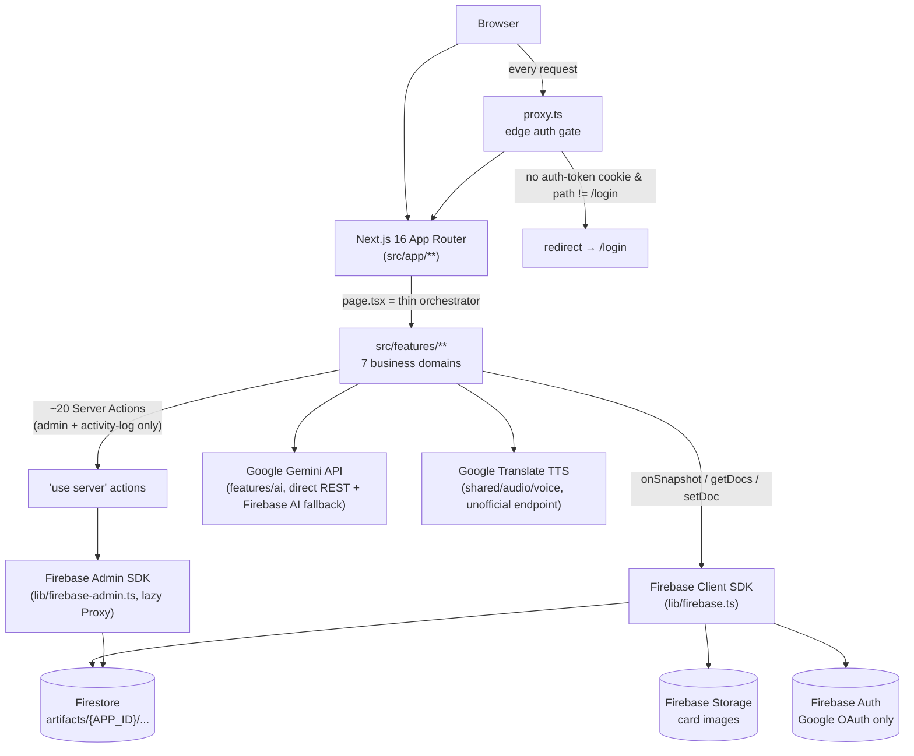

# PROJECT_CONTEXT.md

> **Purpose**: single source-of-truth context file for AI agents working on this repository. Generated by a full-repository audit (parallel deep-dive across config, routing, every feature domain, shared infrastructure, and the audio subsystem). Pure documentation — no code was changed to produce this file.
>
> **Audit date**: 2026-07-11. **HEAD at audit time**: `db4e9a7` — "refactor(audio): rebuild sound system around a single AudioManager" (branch `main`).
>
> **CRITICAL PATH NOTE**: the actual Next.js project root — the directory containing `package.json`, `node_modules`, `tsconfig.json`, `next.config.ts` — is `src/` relative to the git repository root. That is, the git repo root (`/Users/yuh.nguyenpham/GitHub/japanese/`) is **not** the app; it's a wrapper directory holding this file, `.git/`, `docs/`, and a few standalone planning/analysis Markdown files. The actual app lives one level down, inside a folder that is itself named `src`. **Every file path in this document is relative to that inner `src/` directory** unless given as a full path starting with `/Users/...` or prefixed "repo root". Do not confuse `<repo-root>/src/app/` (routes) with `<repo-root>/src/` (project root) — the nesting is `<repo-root>/src/{package.json, app/, features/, shared/, lib/, public/}`.

---

# Executive Summary

**Kana & Nihongo Master** is a Japanese-language-learning web app built on Next.js 16.2.3 (App Router) + React 19.2.4 + TypeScript 5, styled with Tailwind CSS v4, backed by Firebase (Firestore + Auth + Storage) with no custom backend server and no REST API layer. It teaches the two Japanese phonetic syllabaries (hiragana/katakana, the "kana" domain) and general vocabulary via user-authored or AI-generated flashcard decks (the "flashcard" domain), wrapped in spaced-repetition study, three arcade-style mini-games (Match/Speed/Study), a survival challenge mode, deck sharing with Google-Docs-style collaboration, a notification inbox, an admin console (IAM, content moderation, analytics, audit logs), and a synthesized text-to-speech + Web-Audio SFX system that was substantially rebuilt just before this audit (see [Audio System](#audio-system)).

**Architectural character**:
- **100% client-SDK-driven data layer.** There are no REST API routes (`route.ts`) anywhere in the app. All CRUD goes through the Firebase **client SDK** directly from React hooks/services. The only server-side compute is (a) ~20 Next.js Server Actions scoped almost entirely to the admin console and to a shared audit-logging pipeline, and (b) `proxy.ts`, a single edge-level auth gate.
- **Feature-folder architecture** under `src/features/`, each internally layered `domain/` (pure logic) → `services/` (Firestore access) → `utils/` (pure helpers) → `hooks/` (React state) → `components/` (UI), enforced by convention, not tooling.
- **Two Next.js App Router route groups** — `(main)` (persistent bottom-nav chrome, browsing/management screens) and `(immersive)` (zero-chrome, full-screen active study/game sessions) — verified from actual layout code, not naming.
- **State is deliberately fragmented, not unified**: 3 Zustand stores (one global app-settings store, two feature-session stores), several hand-rolled React Contexts acting as singleton Firestore-subscription caches, a narrow TanStack React Query adoption (8 files, concentrated in the admin console), and local `useState`/`onSnapshot` everywhere else. There is no single "server cache" convention.
- **Security model has two real gaps worth knowing before extending it**: (1) `proxy.ts` (Next 16's `middleware.ts` replacement) redirects every unauthenticated request to `/login` except literally `/login` itself — including the "public" flashcard share-link routes that the application code was clearly designed to let guests view (see [High Risk Areas](#high-risk-areas)). (2) The admin console's real enforcement is server-side (`assertAdminAction` reading a non-httpOnly cookie + re-verifying an ID token), which is sound, but the client-side `AdminGuard`/`AdminProvider` role check independently re-runs up to three times per admin page load (a performance/consistency debt, not a security hole).
- **No CI/CD pipeline exists.** All quality gating is a single local Husky `pre-commit` hook that runs a full `next build` (which folds in typecheck + lint) plus `prettier --write .` — there is no PR-time or server-side enforcement.
- **Test coverage is thin and lopsided**: 8 test files total in the whole repo, 6 of which cover the recently-rebuilt `shared/audio/` module; the two largest and most logic-heavy domains (`features/kana`'s quiz/survival engines, `features/flashcard`'s SRS/game engines) have essentially zero automated coverage outside one component test and one rules-table test.

---

# Technology Stack

Source: `package.json` (`name: "src"`, `version: "0.1.0"`, `private: true`).

## Runtime dependencies

| Package | Version | Purpose |
|---|---|---|
| `next` | 16.2.3 (pinned exact) | Framework — App Router, Server Actions, `proxy.ts` edge convention |
| `react` / `react-dom` | 19.2.4 (pinned exact) | UI runtime |
| `firebase` | ^12.12.0 | Client SDK: Auth, Firestore, Storage, Firebase AI Logic (Gemini access) |
| `firebase-admin` | ^13.8.0 | Server-side Admin SDK: privileged Auth/Firestore ops, used almost exclusively by the admin console + logging pipeline |
| `zustand` | ^5.0.12 | Minimal global/session state (3 stores total app-wide) |
| `@tanstack/react-query` | ^5.99.0 | Async server-state cache — narrowly adopted (8 files: admin hooks, one flashcard loader branch, one kana stroke-SVG fetch) |
| `@tanstack/react-table` | ^8.21.3 | Headless table logic — admin Users table only |
| `zod` | ^4.3.6 | Schema validation — used almost nowhere in feature code; the *only* production validator is `lib/logging/schema.ts`'s `systemLogInputSchema`, gating every write to the shared `system_logs` collection |
| `@dnd-kit/core` / `@dnd-kit/sortable` / `@dnd-kit/utilities` | ^6.3.1 / ^10.0.0 / ^3.2.2 | Drag-and-drop — flashcard detail-page card reordering |
| `framer-motion` | ^12.38.0 | Animation — modals, alerts, admin sidebar drawer, drag reordering, confetti gating |
| `lucide-react` | ^1.8.0 | Icon set — 121 ad-hoc import sites, no central icon registry |
| `recharts` | ^3.8.1 | Charts — admin analytics/dashboard only |
| `react-confetti` | ^6.4.0 | Celebratory burst on new high scores (game results screen) |
| `react-dropzone` | ^15.0.0 | Drag-and-drop file upload — AI image-to-deck import |
| `date-fns` | ^4.1.0 | Date formatting/streak math |
| `clsx` + `tailwind-merge` | ^2.1.1 / ^3.5.0 | Wrapped as the app's `cn()` helper (`shared/utils/cn.ts`) |
| `server-only` | ^0.0.1 | Build-time guard preventing server modules (e.g. `firebase-admin.ts`) from leaking into client bundles |
| `prettier` | ^3.8.2 | **Listed as a runtime dependency, not devDependency** — likely so it's guaranteed present for the pre-commit hook's direct shell invocation |

## Dev dependencies

| Package | Version | Purpose |
|---|---|---|
| `typescript` | ^5 | Strict mode on |
| `tailwindcss` + `@tailwindcss/postcss` | ^4 | CSS-first config (no `tailwind.config.js`) |
| `eslint` + `eslint-config-next` | ^9 / 16.2.3 | Flat config, pinned to Next's version |
| `vitest` + `fast-check` | ^4.1.8 / ^4.7.0 | Test runner + property-based testing |
| `husky` + `lint-staged` | ^9.1.7 / ^16.4.0 | Git hooks (lint-staged is configured but **not actually invoked** by the active hook — see [Configuration System](#configuration-system)) |
| `@ianvs/prettier-plugin-sort-imports` | ^4.4.1 | Import-order enforcement |
| `prettier-plugin-tailwindcss` | ^0.6.11 | Tailwind class sorting |
| `@types/node` / `@types/react` / `@types/react-dom` | ^20 / ^19 / ^19 | Type defs |

## Notable absences
No shadcn/ui (no `components.json` anywhere). No `class-variance-authority`. No `next-themes`/dark mode. No Redux (despite `react-redux`/`redux`/`reselect` appearing as *transitive* deps in `node_modules` — not in `package.json`). No email/password auth (Google OAuth only). No translation/streaming AI features. No server-side rendering framework beyond Next's own. No external observability/log-shipping service (Sentry, Datadog, etc.) — all logging goes to a self-owned Firestore collection.

---

# Repository Structure

```
<repo-root>/                                   ← git root, NOT the app
├── PROJECT_CONTEXT.md                         ← this file
├── CODEBASE_CONTEXT.md                        ← prior AI-generated overview (2026-07-10), see Appendix
├── docs/adr/001-audio-architecture.md         ← the one real ADR in the repo
├── .claude/                                   ← Claude Code project config
│   ├── launch.json                            ← dev-server launch config (npm --prefix src run dev, port 3000)
│   └── skills/design-system/                  ← project-authored skill: UI token/component reference
├── .rules/                                    ← large mixed collection of AI coding-assistant rule files (see Coding Standards)
├── .idea/                                     ← JetBrains IDE config (not inspected further)
└── src/                                       ← ACTUAL PROJECT ROOT (package.json lives here)
    ├── package.json, tsconfig.json, next.config.ts, eslint.config.mjs,
    │   prettier.config.js, postcss.config.mjs, vitest.config.ts, firebase.json,
    │   firestore.rules, firestore.indexes.json, storage.rules, proxy.ts
    ├── .husky/pre-commit                      ← the only real git hook
    ├── app/                                   ← Next.js App Router (routes — see Route Inventory)
    │   ├── layout.tsx, globals.css, favicon.ico, not-found.tsx
    │   ├── login/page.tsx
    │   ├── (main)/                            ← persistent bottom-nav chrome
    │   │   ├── layout.tsx, _components/BottomNav.tsx
    │   │   ├── page.tsx (home), kana/{page,chart,learn}, flashcard/{page,create,[id],[id]/edit,shared/[shareId]}
    │   │   ├── notifications/{page,_components/}, profile/page.tsx, settings/page.tsx
    │   │   └── admin/{layout,page,analytics,content,reports,settings,users}/
    │   └── (immersive)/                       ← zero-chrome, full-screen sessions
    │       ├── layout.tsx (bare passthrough)
    │       ├── kana/{practice,quiz,survival/(+_components/)}
    │       └── flashcard/[id]/{study,match,speed}, flashcard/shared/[shareId]/{study,match,speed}
    ├── features/                              ← business-domain modules (7 domains)
    │   ├── admin/       — IAM, moderation, analytics, audit-log console
    │   ├── ai/          — Google Gemini integration (flashcard/deck generation)
    │   ├── flashcard/   — decks, SRS study, sharing/RBAC, 3 games (largest domain, 137 files)
    │   ├── game/        — generic game infrastructure (session lifecycle, leaderboard, tiers, HUD) — consumed by flashcard/games and kana
    │   ├── kana/        — hiragana/katakana chart, learn, practice, quiz, survival
    │   ├── notifications/ — Firestore-backed notification inbox
    │   └── user/        — Firebase Auth flow, profile/progress data, activity tracking
    ├── shared/                                ← cross-cutting, feature-agnostic code
    │   ├── audio/       — the audio subsystem (AudioManager + collaborators, voice/TTS) — see dedicated section
    │   ├── components/ui/    — 21 design-system primitives (Button, Card, Modal, ...)
    │   ├── components/layout/ — 1 file: ScreenHeader
    │   ├── constants/   — SPACING/SECTION_HEADING (used); TYPOGRAPHY (defined, unused — dead code)
    │   ├── hooks/        — useCopyToClipboard, useDialogA11y, usePrefersReducedMotion
    │   ├── providers/    — AlertProvider (toast system)
    │   └── utils/        — cn, array/reorder helpers, atomicCard (validator stub), colors, cookie, romaji, time
    ├── lib/                                   ← app-wide singletons, not feature-scoped
    │   ├── firebase.ts (client SDK singleton), firebase-admin.ts (lazy Proxy-based admin SDK)
    │   ├── app-store.ts (global Zustand store), providers.tsx (the real provider composition root)
    │   ├── AudioProvider.tsx, FontSyncer.tsx (both render null, side-effect only)
    │   └── logging/     — shared audit-log pipeline (schema, server persistence, 2 Server Action entry points, client wrapper)
    └── public/
```

**File-type counts** (excluding `node_modules`, `.next`): 235 `.ts`, 213 `.tsx` — a ~450-file, moderate-sized codebase. Test files: 8 total (see [Missing Documentation](#missing-documentation) / Appendix).

---

# System Architecture

## Overall architecture diagram



## Layering convention (per feature domain)

```
domain/        pure business logic & types — zero side effects, zero Firestore, zero React
   ↑
services/      Firestore/Storage access layer (client SDK; "use server" only for admin + logging)
   ↑
utils/         pure helpers (validation, formatting, RBAC resolution, session building)
   ↑
hooks/         React state — onSnapshot subscriptions wrapped in useState/useEffect, calls services/
   ↑
loaders/       (flashcard only) unifies "personal" vs "shared" data sources into one shape
   ↑
components/    UI — composition only, no direct Firestore calls
```

This is a **convention enforced by code review culture / `.rules/ai-rules/architecture.rule.md`**, not by tooling — no ESLint import-boundary rule enforces it (contrast with the audio system, which *does* have a hard ESLint-enforced boundary; see [Audio System](#audio-system)).

## Provider composition (the real root, not `shared/providers/`)

The actual app-wide provider tree is assembled in **`src/lib/providers.tsx`**, mounted once from **`src/app/layout.tsx`** (the only importer of `@/lib/providers`):

```
<html><body>
  <Providers>                                    lib/providers.tsx
    useFirebaseAuth()                            side-effect hook, not JSX — writes user/isAuthReady into Zustand
    useActivityTracker()                         throttled Firestore "last seen" heartbeat (5 min)
    <QueryClientProvider client={queryClient}>   staleTime:30s, refetchOnWindowFocus:false, retry:1
      <AlertProvider>                            shared/providers/AlertProvider.tsx — toast stack, cap 3
        <FontSyncer />                           renders null — syncs handwriting-font class to <body>
        <AudioProvider />                        renders null — wires Zustand settings into shared/audio, lifecycle stop hooks
        <AuthGate>                                 blocks render until isAuthReady (NOT until signed-in)
          <AdminProvider>                          features/admin/context/AdminContext.tsx
            <NotificationsProvider>                features/notifications/context — one shared onSnapshot listener
              {children}  ──────────────────────▶  routed page tree
            </NotificationsProvider>
          </AdminProvider>
        </AuthGate>
      </AlertProvider>
    </QueryClientProvider>
  </Providers>
</body></html>
```

**Known duplication**: `AdminProvider` is mounted **again** by `app/(main)/layout.tsx` (`<AdminProvider>{children}<BottomNav/></AdminProvider>`), and `AdminGuard` (the route guard on `/admin/**`) calls `useAdminRoleCheck()` a **third**, fully independent time rather than reading the already-resolved context value. Visiting any `/admin/*` route therefore fires up to three parallel, identical role-check network round trips. `app/(main)/admin/layout.tsx`'s own doc comment claims `AdminProvider` "is mounted once, app-wide" — that comment is factually wrong.

## Route-group architecture: `(main)` vs `(immersive)`

Verified from actual layout code, not folder naming:
- **`(main)`** — `app/(main)/layout.tsx` mounts a fixed, always-visible `BottomNav` (Home/Kana/Decks/Alerts/[Admin]/Profile) after `{children}`. This is the "browse, manage, configure" shell: home dashboard, kana reference material (hub/chart/learn), flashcard CRUD/browsing/sharing, notifications, profile, settings, the entire admin console.
- **`(immersive)`** — `app/(immersive)/layout.tsx` is a literal passthrough (`return <>{children}</>`). No chrome, no providers of its own. Every page here is a self-contained `fixed inset-0` active session (kana practice/quiz/survival, all 6 flashcard game modes) with its own in-page exit control. Deliberately strips global nav so a mis-tap can't exit a timed/scored session.
- Route groups don't affect URLs — both groups contribute leaf routes under the same top-level prefixes (e.g. `/kana` and `/kana/chart|learn` are `(main)`; `/kana/practice|quiz|survival` are `(immersive)`). No path is defined in both groups.

## "Pure orchestrator" page pattern (near-universal)

Almost every `page.tsx` under `app/` is a few lines: extract route params (`use(params)`), call a `features/**` hook/loader, handle loading/404 inline, render one feature-root component (`KanaHub`, `MatchGame`, `StudySession`, `AdminOverviewPage`, etc.). Nearly all business logic lives in `src/features/`, not `src/app/`.

---

# Business Domains

| Domain | Folder | One-line purpose |
|---|---|---|
| **Flashcard** | `features/flashcard/` | Create/edit/share decks ("Lessons"), SM-2 spaced-repetition study, threaded card comments, 3 arcade games (Match/Speed/Study). Largest domain (137 files). |
| **Kana** | `features/kana/` | Teach hiragana/katakana via reference chart, guided learn mode, handwriting practice, scored quiz, and a 3-sub-mode survival challenge. |
| **Admin** | `features/admin/` | IAM (user role management), global content moderation, usage/engagement analytics, system audit-log viewer, platform settings (stub). |
| **AI** | `features/ai/` | Sole Google Gemini integration — single-card generation, topic-based deck generation, image-to-deck OCR, lazy mnemonic hints, Match-game distractor generation. Consumed only by `features/flashcard`. |
| **Game** | `features/game/` | Generic, domain-agnostic game infrastructure (session lifecycle, leaderboard, tier classification, HUD components) — the common foundation under `flashcard/games/{match,speed}` and `kana`'s quiz/survival. Contains zero imports of either consumer (verified one-directional). |
| **Notifications** | `features/notifications/` | Firestore-backed in-app notification inbox: invite/comment/reply/role_change types, pending-email delivery-on-login, soft-delete, dual-schema (legacy+new) migration in flight. |
| **User** | `features/user/` | Google-OAuth-only auth flow, gamification profile data (XP/streak/learned-chars), server-side deduplicated login/logout audit logging. |
| **Audio** (shared, not a feature) | `shared/audio/` | App-wide synthesized SFX + Google-Translate-TTS pronunciation, recently rebuilt around one `AudioManager`. |

---

# Feature Inventory

## Flashcard (`features/flashcard/`)

**Subfolders**: `actions/` (audit logging only — see [API Inventory](#api-inventory)), `components/` (shared UI + 3 Study players), `dashboard/`, `detail/`, `domain/` (SM-2 engine, pure), `games/{match,speed,study}/`, `hooks/`, `loaders/`, `services/` (6 files), `types/`, `utils/` (7 files).

**Two parallel card type models** coexist, reconciled only by structural duck-typing, not a shared alias:
1. **Legacy/flat** `FlashCard` (`types/flashcard.types.ts`) — content + inline SM-2 fields on one object. Still used by `card.service.ts` and both game engines.
2. **Split/new** `domain/types.ts`'s `FlashCardContent` (immutable, deck-creator-owned) + `UserCardProgress` (mutable, per-learner, separate Firestore subtree) → merged `CardWithProgress`. Used by `progress.service.ts`, `useCardsWithProgress`, the Study players.

**Deck/card model**: a **Lesson** is the deck (`title`, `description`, `categories[]` free-form tags capped at 3, `themeColor`, fractional-index `order`, RBAC fields). A **FlashCard** has `primary` (required, meant to be atomic — one word/phrase, no commas/slashes/parens — but the enforcing validator is currently a disabled no-op stub, see [Technical Debt](#technical-debt)), `alternatives[]`, `meaning` (required), `example`, optional image, and AI-enrichment fields (`distractors`, `hint`, `usageNote`, `difficulty 1-3`, `mnemonic`, `clozeTemplate`, `cardType`).

**SM-2 spaced repetition** (`domain/srs.ts::computeNextSRS`, ease clamped `[1.3, 2.5]`):
| Grade | Effect |
|---|---|
| Again | `repetitions=0`, `interval=1`, `ease -= 0.2` |
| Hard | `repetitions` unchanged, `interval = round(interval*0.8)` (min 1), `ease -= 0.15` |
| Good | `interval` = 1 (1st rep) / 6 (2nd) / `round(interval*ease)` (later); `repetitions += 1` |
| Easy | `interval` = 1 (1st rep) / `round(interval*ease*1.3)` (later); `repetitions += 1`; `ease += 0.15` |

`status`: new (reps=0) → learning (1–2) → review (≥3) → mastered (interval≥21d). `isMistake` set true on Again/Hard, cleared on Good/Easy, **persisted** (Mistake Review survives refresh).

**Study session building** (`utils/learningEngine.ts::buildSession`): `"learn"` = all never-studied cards; `"practice"` = due cards + up to 10 new, shuffled, capped by a **daily review budget** (default 50) with a **Catch-Up Mode** that redistributes excess overdue cards round-robin across the next 3 days if overdue count exceeds 2× the cap; `"mistake-review"` = all `isMistake===true` cards. Completing any session with remaining mistakes **auto-chains into mistake-review** rather than exiting.

**Sharing (full trace)**: `shareId = base64url(ownerId + ":" + lessonId)` — deterministic, no DB lookup needed to decode. Owner picks a privacy mode (`restricted`/`link`/`public`) via `ShareModal`; `publicRole` is capped at `"commenter"` (`sanitizePublicRole` strips any stored `"editor"` at the write boundary — defense against legacy data). Owner can additionally invite by email (pending until the invitee signs in, auto-converted to a permanent collaborator on first matching login). A visitor at `/flashcard/shared/{shareId}` goes through `getSharedLesson`: decode → fetch owner's lesson doc → auto-convert any matching pending invite → **access gate** (owner/explicit-role/pending-invite/link-or-public → else `null` → 404) → paginated card-content fetch (200/page) → merge with the *viewer's own* progress subtree → `resolveRole` → `stripSensitiveFields` (deletes `roles`/`collaborators`/`invitedEmails` before the payload reaches client state). **Progress isolation**: N users studying one shared deck each get independent SM-2 state written to their own `userProgress/{uid}/...` tree, never the owner's.
> **⚠ See [High Risk Areas](#high-risk-areas)**: this entire "guest can view a share link" design is currently unreachable for unauthenticated visitors because `proxy.ts` redirects any request without an `auth-token` cookie to `/login`, and `/flashcard/shared/*` is not in `PUBLIC_PATHS`.

**RBAC matrix** (`utils/rbac.ts`):
| Action | owner | editor | commenter | viewer | none |
|---|:-:|:-:|:-:|:-:|:-:|
| View / play / study | ✅ | ✅ | ✅ | ✅ | ❌ |
| Comment | ✅ | ✅ | ✅ | ❌ | ❌ |
| Edit / reorder cards | ✅ | ✅ | ❌ | ❌ | ❌ |
| Delete cards, manage sharing, invite, delete deck | ✅ | ❌ | ❌ | ❌ | ❌ |

Resolution priority: owner → explicit `roles[uid]` → pending email invite → public link (capped at commenter) → none.

**Three games** — see dedicated deep-dives in [Business Rules](#business-rules).

**Zustand**: `hooks/useMatchGameStore.ts` — in-memory-only Match-mode grid state (`grid`, `selectedIds`, `matchedPairIds`, `processing`, `shakeCellIds`), no persistence, reset every round.

**React Query**: exactly one call site in the whole domain — `loaders/useFlashcardLoader.ts`'s shared-deck branch (`staleTime: Infinity`, `retry: false`). Every other hook is hand-rolled `useState`/`onSnapshot`.

## Kana (`features/kana/`)

**Subfolders**: `actions/` (activity logging), `chart/`, `components/` (shared across modes: `AlphabetSwitcher`, `AnswerFeedback`, `DrawingCanvas`, `KanaAudioButton`, `KanaStrokeAnimation`), `data/` (static dataset), `hooks/` (cross-mode engines), `hub/`, `learn/`, `practice/`, `quiz/`, `store.ts` (Zustand), `types/`.

**Data model** (`types/kana.types.ts`): `KanaChar { char: string; romaji: string; group: string }` — intentionally minimal, no audio-ref or stroke-order field (TTS is synthesized on demand, stroke SVGs fetched live from KanjiVG by Unicode code point). `HIRAGANA_DATA` = 104 entries, `KATAKANA_DATA` = 131 entries (27 more for katakana-only "extended" loanword sounds). `data/chartLayouts.ts::buildChartBlocks` derives the 2-D gojūon table view from the flat arrays at render time via positional slicing (relies on hand-authored data-file ordering). `data/visualGroups.ts` — 20 hand-curated visually-similar-character groups feeding quiz distractor generation (one group, `["ハ","八"]`, intentionally mixes in a kanji).

**Five modes + hub**:
| Mode | Route | Purpose | Scoring/session |
|---|---|---|---|
| Chart | `/kana/chart` | Static reference table, tap-to-hear | None — always-complete reference view |
| Learn | `/kana/learn` | Sequential/random flashcard tutorial, marks chars "learned" on first visit | None — closed-loop navigation |
| Practice | `/kana/practice` | 3-step handwriting drill (Trace→Copy→Recall) on a free-draw `<canvas>` | **No correctness checking at all** — self-assessed |
| Quiz | `/kana/quiz` | Fixed 20-question scored recall (MC/typing/Smart-Review) | `comboMultiplier` streak scoring, Smart-Review sorts by ascending per-char accuracy |
| Survival | `/kana/survival` | 3 sub-modes: Infinity (3 lives), Time Attack (countdown, capped bonus < penalty so it's "unwinnable forever"), Drop (RAF falling-word typing game) | Same combo scoring; each sub-mode writes its own leaderboard key |

**State**: `store.ts`'s `useKanaStore` persists exactly one field — the selected `alphabet` (`hiragana`/`katakana`/`both`). Everything else (quiz progress, survival lives/timer, practice step, learn position) is local component/hook state, deliberately not global.

**Typed-answer checking** (`shared/utils/romaji.ts::checkTypedAnswer`) accepts documented alternate spellings (si/shi, tu/tsu, zya/ja, etc.) via a hardcoded alternatives map.

**Known dead/vestigial code**: `QuestionType`'s `"reverse"`/`"listen"` variants are declared but never produced by the quiz generator (the audio policy layer already has a real gating branch waiting for `"listen"` — see [Audio System](#audio-system)); `SurvivalPhase`'s `"leaderboard"` value is unused; `logKanaPracticeCompleted` is exported but never called (Practice mode is the only mode that doesn't activity-log completion).

## Admin (`features/admin/`)

Six areas, each 1:1 with a `components/` subfolder and a route: **Dashboard** (`/admin`), **Users** (`/admin/users`), **Content** (`/admin/content`), **Analytics** (`/admin/analytics`), **Reports** (`/admin/reports`), **Settings** (`/admin/settings`, **unimplemented stub** — deliberately renders "not available yet" rather than a form that silently doesn't save).

Full layering: `page.tsx` (thin wrapper) → `components/{area}/*PageContent.tsx` (orchestrator) → `hooks/use*.ts` (TanStack Query wiring) → `actions/admin.actions.ts` (`"use server"`, permission gate) → `services/*.service.ts` (`import "server-only"`, Firebase Admin SDK) → `lib/firebase-admin.ts`.

See full [Permission System](#permission-system) section for the RBAC model — this is the one domain where server-side privilege (listing/deleting arbitrary Firebase Auth users, collection-group queries across every user's decks) is genuinely necessary and correctly gated.

**Analytics is the most complex service** (`analytics.service.ts`, 723 lines): builds growth/engagement/retention/content-breakdown/log-derived charts from a mix of pre-aggregated `analytics_daily` snapshots (populated by infrastructure **outside this repo** — no `functions/` directory exists) and **on-the-fly heuristic classification** (keyword-matching Vocabulary/Grammar/Kanji categories from a 200-doc content sample; feature-usage discovery from a merged 2000-doc log/session sample).

## AI (`features/ai/`)

Sole Gemini integration, consumed only by `features/flashcard`. Five capabilities: single-word card generation, topic-based deck generation, image-to-deck OCR (multimodal), lazy mnemonic hints (fetched only on card reveal), Match-game distractor generation. **`schemas/` folder name is misleading** — despite Zod being in the stack, these are plain template-string JSON *examples* fed to the LLM as few-shot formatting hints, not runtime validators. Real validation is hand-rolled in `services/gemini.service.ts` (`parseCard`/`parseCardArray`: required-field checks, length caps, regex-counted cloze-token validation, difficulty allow-list).

**Dual-path model calling**: tries the direct Gemini REST API first (`NEXT_PUBLIC_GEMINI_API_KEY`), falls back once to the Firebase AI SDK (`firebase/ai`) on any non-quota error (quota errors re-throw immediately, no fallback). Model: `gemini-2.5-flash-lite` (env-overridable). In-memory-only cache (`Map`, no TTL, tab-session-scoped).

## Game (`features/game/`)

Generic infrastructure, zero knowledge of its consumers (verified: zero imports of `features/flashcard` or `features/kana` anywhere in this folder). 14+ files across both consumer systems import from it. Provides: `domain/combo.ts::comboMultiplier` (`floor(streak/5)+1`, shared scoring formula), `domain/tier.ts` (bronze→diamond tier classification, shared across every game mode's leaderboard), `hooks/useGameSession` (session lifecycle: create → debounced score sync → finish, Firestore-transaction-backed best-score promotion via `persistBestScore`), `hooks/useLeaderboard`, and generic UI (`GameIntroScreen`, `GameResultsScreen`, `Leaderboard`/`MiniLeaderboard`, `StreakHud`, `StatGrid`, `TierBadge`, `LivesDisplay`).

## Notifications (`features/notifications/`)

`NotificationType = "invite"|"comment"|"reply"|"role_change"` — the last has zero call sites (dead code). Delivery is 100% Firestore real-time (no push, no email) via one shared `onSnapshot` listener lifted into `NotificationsContext` (mounted once at the provider root) so navigating to `/notifications` never cold-starts a fresh listener. Pending (pre-login, email-keyed) notifications auto-migrate to a user's live collection on every successful auth-token resolution. Soft-delete only (`isDeleted: true`, never hard-deleted). `subscribeNotifications` has an automatic composite-index-missing → simpler-query fallback. Dual-schema in flight: legacy `read: boolean` field kept in sync alongside new `status: "unread"|"read"` for backward compatibility with pre-migration docs.

## User (`features/user/`)

Google OAuth only (popup, falling back to redirect on popup-blocked). Auth state lives in **Zustand** (`lib/app-store.ts`'s `useAppStore`), not React Context — `user`/`isAuthReady` are explicitly excluded from the store's `persist` middleware (Firebase remains sole source of truth across reloads). `useFirebaseAuth` subscribes via `onIdTokenChanged` (not `onAuthStateChanged` — deliberate, to also catch the ~1hr token refresh), writes a **non-httpOnly** `auth-token` cookie (`shared/utils/cookie.ts`) consumed by `proxy.ts` and by admin Server Actions. Login/logout is logged server-side with a 30-minute Firestore-transaction dedup window (documented as landing on this approach after four previously-failed client-side strategies). Progress/gamification data (`UserData`: xp, streak, learnedChars, charStats) is a separate concern from Firebase's own profile fields (displayName/photoURL/email), never duplicated into Firestore.

---

# Route Inventory

All paths relative to `src/app/`. Route groups `(main)`/`(immersive)` do not appear in the URL.

| Route Path | File | Group | Server/Client | Auth (app-level) | Purpose |
|---|---|---|---|---|---|
| *(shell)* | `layout.tsx` | none | Server | N/A | HTML shell, fonts, `globals.css`, mounts `<Providers>`, sets the app's only inherited `<title>` |
| `/login` | `login/page.tsx` | none | Client | Public; redirects to `/` if already signed in | Google-only sign-in |
| *(404)* | `not-found.tsx` | none | Server | N/A | Global "You're Lost!" screen |
| *(wraps `(main)`)* | `(main)/layout.tsx` | (main) | Server | N/A | 2nd `AdminProvider` mount + persistent `BottomNav` |
| `/` | `(main)/page.tsx` | (main) | Client | Soft | Home dashboard: streak/XP, SRS "continue studying", kana progress, recent decks |
| `/kana` | `(main)/kana/page.tsx` | (main) | Client | Soft | Kana hub |
| `/kana/chart` | `(main)/kana/chart/page.tsx` | (main) | Server wrapper | Soft | Reference chart |
| `/kana/learn` | `(main)/kana/learn/page.tsx` | (main) | Server wrapper | Soft | Guided learn flow |
| `/flashcard` | `(main)/flashcard/page.tsx` | (main) | Client | Soft | Deck dashboard |
| `/flashcard/create` | `(main)/flashcard/create/page.tsx` | (main) | Client | Soft | Deck creation wizard |
| `/flashcard/[id]` | `(main)/flashcard/[id]/page.tsx` | (main) | Client | Soft, inline guard | Owner deck detail |
| `/flashcard/[id]/edit` | `(main)/flashcard/[id]/edit/page.tsx` | (main) | Client | Soft | Deck editor (also handles cross-user editor-role via `?ownerId=`) |
| `/flashcard/shared/[shareId]` | `(main)/flashcard/shared/[shareId]/page.tsx` | (main) | Client | **Intended public — see [High Risk Areas](#high-risk-areas)** | Public share landing, RBAC-scoped view |
| `/notifications` | `(main)/notifications/page.tsx` | (main) | Client | Soft | Notification inbox |
| `/profile` | `(main)/profile/page.tsx` | (main) | Client | Soft | Avatar/level/XP/stats, Sign Out |
| `/settings` | `(main)/settings/page.tsx` | (main) | Client | Soft | Handwriting/audio toggles, Reset Progress, Sign Out |
| *(wraps `/admin/**`)* | `(main)/admin/layout.tsx` | (main) | Server | `AdminGuard` | Sidebar + guard shell |
| `/admin` | `(main)/admin/page.tsx` | (main) | Server wrapper | RBAC `canViewDashboard` | Overview dashboard |
| `/admin/analytics` | `(main)/admin/analytics/page.tsx` | (main) | Client | RBAC `canViewAnalytics` | Charts + drilldowns + CSV export |
| `/admin/content` | `(main)/admin/content/page.tsx` | (main) | Server wrapper | RBAC `canManageContent` | Global deck moderation. **Only route besides root with its own `metadata`** |
| `/admin/reports` | `(main)/admin/reports/page.tsx` | (main) | Client | RBAC `canViewReports` | System log/audit viewer |
| `/admin/settings` | `(main)/admin/settings/page.tsx` | (main) | Client | `AdminGuard` (generic) | **Stub, not implemented** |
| `/admin/users` | `(main)/admin/users/page.tsx` | (main) | Server wrapper | RBAC `canManageUsers` | User search/role/deletion |
| *(wraps `(immersive)`)* | `(immersive)/layout.tsx` | (immersive) | Server | N/A | Bare `<>{children}</>` passthrough |
| `/kana/practice` | `(immersive)/kana/practice/page.tsx` | (immersive) | Server wrapper | Soft | Handwriting drill |
| `/kana/quiz` | `(immersive)/kana/quiz/page.tsx` | (immersive) | Server wrapper | Soft | MC/typing quiz |
| `/kana/survival` | `(immersive)/kana/survival/page.tsx` | (immersive) | Client | Soft | Survival orchestrator (4 local sub-screens under one URL) |
| `/flashcard/[id]/study` \| `/match` \| `/speed` | `(immersive)/flashcard/[id]/{...}/page.tsx` | (immersive) | Client | Soft, real `notFound()` | Owned-deck game sessions |
| `/flashcard/shared/[shareId]/study` \| `/match` \| `/speed` | `(immersive)/flashcard/shared/[shareId]/{...}/page.tsx` | (immersive) | Client | **Intended public** | Shared-deck game sessions |

**No `route.ts`, `middleware.ts`, `loading.tsx`, `error.tsx`, or `template.tsx` files exist anywhere in `app/`.** Loading/error states are all hand-rolled inline (`animate-spin` divs, inline conditional blocks) — Next's file-convention boundaries are unused throughout. Only `app/layout.tsx` and `admin/content/page.tsx` export `metadata`; no route uses `generateMetadata`.

**Route tree diagram**:

```mermaid
graph TD
    RootLayout["app/layout.tsx"] --> LoginPage["/login"]
    RootLayout --> NotFoundPage["not-found.tsx"]
    RootLayout --> MainLayoutN
    RootLayout --> ImmersiveLayoutN
    subgraph MAIN["(main) — persistent BottomNav"]
        MainLayoutN["(main)/layout.tsx"] --> Home["/"] & KanaHub["/kana"] & KanaChart["/kana/chart"] & KanaLearn["/kana/learn"]
        MainLayoutN --> FcDash["/flashcard"] & FcCreate["/flashcard/create"] & FcDetail["/flashcard/:id"] & FcEdit["/flashcard/:id/edit"] & FcShared["/flashcard/shared/:shareId"]
        MainLayoutN --> Notif["/notifications"] & Profile["/profile"] & Settings["/settings"]
        MainLayoutN --> AdminLayoutN["admin/layout.tsx"]
        AdminLayoutN --> AdminHome["/admin"] & AdminAnalytics["/admin/analytics"] & AdminContent["/admin/content"] & AdminReports["/admin/reports"] & AdminSettings["/admin/settings"] & AdminUsers["/admin/users"]
    end
    subgraph IMMERSIVE["(immersive) — zero chrome"]
        ImmersiveLayoutN["(immersive)/layout.tsx"] --> KPractice["/kana/practice"] & KQuiz["/kana/quiz"] & KSurvival["/kana/survival"]
        ImmersiveLayoutN --> FStudy["/flashcard/:id/study"] & FMatch["/flashcard/:id/match"] & FSpeed["/flashcard/:id/speed"]
        ImmersiveLayoutN --> FShStudy["/flashcard/shared/:shareId/study"] & FShMatch["/flashcard/shared/:shareId/match"] & FShSpeed["/flashcard/shared/:shareId/speed"]
    end
```


## Private `_components` folders

- **`(main)/_components/BottomNav.tsx`** — the persistent tab bar (Home/Kana/Decks/Alerts/[Admin]/Profile), reads unread-notification count and admin-role for conditional tabs/badges.
- **`(main)/notifications/_components/`** — `NotificationListItem.tsx` (`NotificationRow` + `NotificationGroupSection` + `InviteActions`), `NotificationsPlaceholders.tsx` (skeleton + empty states).
- **`(immersive)/kana/survival/_components/`** — the 4 phase-screens (`SurvivalSetupScreen`, `SurvivalQuizScreen`, `SurvivalDropScreen`, `SurvivalGameOverScreen`) driven by `useSurvivalGame()`'s phase/challengeMode state machine.

---

# Screen Inventory

See [Route Inventory](#route-inventory) for the full table (route path ↔ screen ↔ purpose ↔ auth). Screens grouped by user journey:

- **Onboarding**: `/login`
- **Home / navigation hub**: `/`, `/kana`, `/flashcard`, `/profile`, `/settings`, `/notifications`
- **Kana learning**: `/kana/chart` (reference), `/kana/learn` (tutorial), `/kana/practice` (handwriting), `/kana/quiz` (scored test), `/kana/survival` (4-phase challenge)
- **Flashcard authoring**: `/flashcard/create`, `/flashcard/[id]/edit`
- **Flashcard consumption**: `/flashcard/[id]` (owner detail), `/flashcard/shared/[shareId]` (guest/collaborator landing)
- **Flashcard sessions** (immersive, ×2 for personal/shared): `study`, `match`, `speed`
- **Admin console**: `/admin` (dashboard), `/admin/users`, `/admin/content`, `/admin/analytics`, `/admin/reports`, `/admin/settings` (stub)
- **Global**: 404 (`not-found.tsx`)

---

# Component Inventory

This is a ~450-file codebase; the tables below list the **root/entry components per screen** and the most-reused cross-cutting pieces. For exhaustive per-file component lists, see [Business Domains](#business-domains) and the dedicated deep-dives in [Business Rules](#business-rules) — every component name mentioned there is exact and file-path-locatable via its containing feature folder.

## Feature root components (rendered directly by `page.tsx` files)

| Component | File | Route |
|---|---|---|
| `KanaHub` | `features/kana/hub/components/KanaHub.tsx` | `/kana` |
| `KanaChart` | `features/kana/chart/components/KanaChart.tsx` | `/kana/chart` |
| `KanaLearn` | `features/kana/learn/components/KanaLearn.tsx` | `/kana/learn` |
| `KanaPractice` | `features/kana/practice/components/KanaPractice.tsx` | `/kana/practice` |
| `KanaQuiz` | `features/kana/quiz/components/KanaQuiz.tsx` | `/kana/quiz` |
| `FlashcardDashboard` | `features/flashcard/dashboard/components/FlashcardDashboard.tsx` | `/flashcard` |
| `LessonBuilder` | `features/flashcard/components/LessonBuilder.tsx` | `/flashcard/create`, `/flashcard/[id]/edit` |
| `FlashcardDetailLayout` | `features/flashcard/detail/components/FlashcardDetailLayout.tsx` | `/flashcard/[id]`, `/flashcard/shared/[shareId]` |
| `MatchGame` / `SpeedGame` / `StudySession` | `features/flashcard/games/{match,speed,study}/components/*.tsx` | 6 immersive game routes |
| `AdminOverviewPage` / `AdminUsersPageContent` / `AdminContentPageContent` / `AdminAnalyticsPageContent` / `AdminReportsPageContent` / `AdminSettingsPageContent` | `features/admin/components/{dashboard,users,content,analytics,reports,settings}/` | `/admin/**` |

## Cross-cutting reusable components (used by 2+ features)

| Component | File | Used by |
|---|---|---|
| `Leaderboard` / `MiniLeaderboard` | `features/game/components/` | Flashcard Match/Speed, Kana Quiz/Survival |
| `StatGrid` / `TierBadge` / `StreakComboBadge` / `GameStreakScoreStack` | `features/game/components/StreakHud.tsx`, `StatGrid.tsx`, `TierBadge.tsx` | Flashcard games, Kana Quiz/Survival, Study summary screens |
| `GameIntroScreen` / `GameResultsScreen` | `features/game/components/` | Flashcard Match/Speed, (structurally available to any future game mode) |
| `KanaAudioButton` / `FlashcardAudioButton` | `features/kana/components/`, `features/flashcard/components/` | Domain-specific but structurally identical — both reflect `useAudioStatus()`'s "unavailable" state |

See [Shared Components](#shared-components) for the true design-system primitive layer (`shared/components/ui/`).

---

# Shared Components

Source: `src/shared/components/ui/` (21 components + barrel) and `src/shared/components/layout/` (1 file). **100% of the 104 consumer files in the repo import from the barrel** (`@/shared/components/ui`), never a deep path. No shadcn/ui, no `class-variance-authority` — every "variant" is a hand-written `Record<VariantKey, string>` map inside the component file.

| Component | Props (summary) | Variants | Notes |
|---|---|---|---|
| `Button` | 17 props: `variant`, `size`, `color`/`alphabet`, `icon`, `loading`, `active`, `badge`, full ARIA passthrough | `variant`: primary/secondary/outline/ghost; `size`: md/icon/icon-sm; `color`: 8 named themes or raw hex; `alphabet`: hiragana/katakana/both (overrides color) | The core primitive — nearly every other component composes it. Accepts a domain-specific `alphabet` prop baked into a supposedly generic component (see [Technical Debt](#technical-debt)). |
| `Card` | `variant`, `padding`, `interactive`, `onClick` | default/elevated/flat/dashboard | Renders `<button>` if `onClick` given |
| `Modal` / `ConfirmModal` | `isOpen`, `onClose`, `title`, `maxWidth` / `variant` (danger/warning/info) | — | Share `useDialogA11y` (focus trap, Escape, focus-return). Close buttons **lack `aria-label`** (accessibility gap) |
| `Alert` | `type`, `message`, `onClose` | info/success/warning/error | **This is the toast component** — see `AlertProvider` below. Auto-dismiss 4-8s, pause on hover |
| `Input` / `Textarea` | HTML attrs + `variant` | default / underline | Focus ring reads an ambient `--theme-color` CSS var |
| `Select<T>` | `value`, `options`, `onChange`, `themeHex` | align, variant (full/compact) | Custom dropdown, not native `<select>` |
| `Badge` | `variant`, `size`, `icon`, `dot` | default/primary/success/warning/danger/info; sm/md/lg | |
| `Card`-adjacent: `ActionCard`, `ModeSelectionCard`, `StatCard` | — | — | Dashboard/hub tile variants |
| `EmptyState` / `NotFoundScreen` | `icon`, `title`, `description`, `action` | `fullScreen` | Universal empty/404 UI |
| `LoadingSpinner` | `color`, `size`, `fullScreen`, `label` | — | Default color hardcodes `#1cb0f6` instead of the `--color-katakana` token |
| `DatePicker` | `value` (ISO string), `onChange` | — | Custom calendar dropdown; nav-chevron buttons lack `aria-label` |
| `ReorderList<T>` / `ReorderItem<T>` | `items`, `onReorder`, `axis` | axis x/y, as div/li/ul/ol | Wraps Framer Motion's `Reorder` primitives |
| `UserAvatar` / `UserMeta` | `src`/`active` / `name`,`avatar`,`subtitle` | — | Auto-derives initials fallback from name |
| `SettingsMenu` | conditional `audioToggle`/`displayToggle`/`dangerAction` slots | — | Gear-icon dropdown with iOS-style toggles + 2-step danger-zone confirm |

**Layout** (`shared/components/layout/ScreenHeader.tsx`, the only file): `ScreenHeader` (sticky back-button + centered title + right slot), `ScreenHeaderRow` (raw header shell, `symmetricSidebars` 3-child centering mode, `variant="dark"` hardcodes an un-tokenized `bg-[#0a0a1a]/90`), `ScreenHeaderBackButton`.

**Toast system**: `Alert` (UI) + `AlertProvider`/`useAlert()` (`shared/providers/AlertProvider.tsx`) — global FIFO stack capped at 3, mounted once near the provider root, `framer-motion` `AnimatePresence`. **Do not confuse with `features/notifications/`** — that's a separate, persistent Firestore-backed inbox.

**No dark mode / theming system exists** — confirmed by repo-wide search (no `next-themes`, no `ThemeProvider`, zero `dark:` classes). The only visual "theming" is the 8-color `Button`/`ActionCard` accent system and the handwriting-font body-class toggle (typeface, not color scheme).

---

# Shared Hooks

Source: `src/shared/hooks/index.ts` barrel (3 hooks, universally imported via the barrel).

| Hook | Params | Returns | Purpose |
|---|---|---|---|
| `useCopyToClipboard` | `resetDelayMs=2000` | `{copied, copy}` | Clipboard write + auto-reset "Copied!" UX |
| `useDialogA11y<T>` | `(isOpen, onClose)` | `containerRef` | Shared Modal/ConfirmModal a11y: autofocus, Tab-trap, Escape-close, focus-return |
| `usePrefersReducedMotion` | none | `boolean` | `useSyncExternalStore` on the OS media query; exists specifically for JS-driven effects (confetti) that CSS-level motion collapse can't reach |

Feature-scoped hooks of note (not in `shared/` but heavily cross-consumed): `features/game/hooks/{useGameSession,useLeaderboard}`, `features/user/hooks/{useFirebaseAuth,useUserProgress,useBestScores,useActivityTracker}`. Full per-feature hook inventories are in [Business Domains](#business-domains).

---

# Shared Utilities

Source: `src/shared/utils/index.ts` barrel (8 files, full coverage).

| File | Key exports | Purpose |
|---|---|---|
| `array.ts` | `shuffleArray<T>` | Fisher-Yates, non-mutating — used across kana quiz, flashcard match/speed/practice |
| `reorder.ts` | `sortByOrder`, `getFractionalOrder`, `reorderWithFractionalIndex` | Fractional-index drag-reorder math (O(1) single-doc writes) — deck list, card list |
| `atomicCard.ts` | `validateAtomicCard` (**dead stub — always returns valid:true**), `splitAtomicPrimary` (actively used) | "One word per card" domain rule, shared between `features/flashcard` and `features/ai` |
| `cn.ts` | `cn` | `twMerge(clsx(...))` — the app's standard class-merge helper |
| `colors.ts` | `hexToThemeColor` | Maps 7 known hex values to a `Button`-compatible theme-color keyword (typed `any`) |
| `cookie.ts` | `setAuthCookie`/`clearAuthCookie`/`getAuthCookie` | Manages the non-httpOnly `auth-token` cookie consumed by `proxy.ts` |
| `romaji.ts` | `getValidRomaji`, `checkTypedAnswer` | Accepts documented alternate romanizations for typed kana answers |
| `time.ts` | `formatTime` | Seconds → `m:ss` |

**Constants** (`shared/constants/`): `styles.ts`'s `SPACING`/`SECTION_HEADING` — actively used, re-exported from the barrel. `typography.ts`'s `TYPOGRAPHY` scale — **defined but not re-exported from the barrel and has zero import sites anywhere** (confirmed dead code; components hardcode the same literal classes inline instead).

---

# State Management

Four coexisting mechanisms with mostly non-overlapping responsibilities — there is **no single unifying "server cache" convention**.

## 1. Zustand — global/session-scoped state (exactly 3 stores app-wide, confirmed by grep)

| Store | File | Persisted? | Shape |
|---|---|---|---|
| `useAppStore` | `lib/app-store.ts` | Yes (`persist`, key `app-settings`) — but `user`/`isAuthReady` explicitly excluded via `partialize` | `user`, `isAuthReady` (auth mirror, Firebase is source of truth) + `useHandwriting`, `globalAutoPlay`, `sfxMuted`, `voiceMuted`, `sfxVolume`, `voiceVolume` (settings, persisted) |
| `useMatchGameStore` | `features/flashcard/hooks/useMatchGameStore.ts` | No | Match-mode grid tile state, reset every round |
| `useKanaStore` | `features/kana/store.ts` | Yes (`persist`, key `kana-ui-state`) | Single field: selected `alphabet` |

## 2. React Context — singleton subscription caches + small ephemeral UI state

- `AlertProvider` — ephemeral toast stack (`useState` only).
- `AdminContext`/`AdminProvider` — derived `role`/`isLoading`, mounted **twice** (see [System Architecture](#system-architecture)).
- `NotificationsContext`/`NotificationsProvider` — one shared `onSnapshot` listener, explicitly designed as a hand-rolled server-cache singleton.

## 3. TanStack React Query — configured globally, adopted narrowly

`QueryClientProvider` wraps the whole app (`staleTime:30s`, `refetchOnWindowFocus:false`, `retry:1`), but only **8 files total** call into it: 5 admin hooks (`useAdminDashboard`, `useAnalytics`, `useAnalyticsDrilldown`, `useGlobalContent`, `useUsers`), `features/flashcard/loaders/useFlashcardLoader.ts`'s shared-deck branch, `features/kana/components/KanaStrokeAnimation.tsx`'s stroke-SVG fetch, and `lib/providers.tsx` itself. Two sites override to `staleTime: Infinity` for static data.

## 4. Local component state (`useState`/`useReducer`) — the default everywhere else

Everything not covered above — most forms, most modal flags, in-session quiz/game state — falls back to plain local state or ad hoc `onSnapshot`/`useEffect` wiring inside individual feature hooks. Given how narrow Zustand (3 stores) and React Query (8 files) actually are, this is the residual majority case across the codebase.

## A 5th, narrow channel: cookies

`shared/utils/cookie.ts`'s `auth-token` cookie exists specifically so non-Firebase-SDK code (`proxy.ts`, Server Actions) can see the current ID token without going through the client SDK.

---

# API Inventory

**There is no REST API in this application** — zero `route.ts` files exist anywhere under `app/`. "API" in this codebase means one of two things:

## A. Firebase client SDK calls (the actual data layer, ~17+ files)

Every feature's `services/*.service.ts` talks to Firestore/Storage directly via the client SDK (`lib/firebase.ts`'s exported `db`/`storage`/`auth` singletons). This is not enumerable as traditional "endpoints" — see each feature's Firestore path table in [Business Domains](#business-domains) and [Data Flow](#data-flow).

## B. Next.js Server Actions (~20 total, two purposes only)

| Action file | `"use server"` | Purpose | Permission gate |
|---|---|---|---|
| `features/admin/actions/admin.actions.ts` | Yes | 19 admin operations (see [Permission System](#permission-system) for the full action→permission table) | `assertAdminAction(<permission>)` — every action, first statement |
| `features/flashcard/actions/activity-log.actions.ts` | Yes | Deck/study/game completion audit events | None (logging only) |
| `features/kana/actions/activity-log.actions.ts` | Yes | Quiz/survival/practice completion audit events | None (logging only) |
| `features/notifications/actions/activity-log.actions.ts` | Yes | 5 notification lifecycle audit events | None (logging only) |
| `lib/logging/actions.ts` | Yes | `appendClientLogAction` — generic client-log entry point, verifies idToken, rejects on userId mismatch | Token verification only |
| `lib/logging/user-actions.ts` | Yes | `logUserActionServer` — the shared sink every `activity-log.actions.ts` wrapper calls into; Zod-validates via `systemLogInputSchema` | Token verification, silently swallows mismatch |

**Confirmed: `actions/` is NOT a general API layer for any feature except admin.** For flashcard, kana, and notifications, all real CRUD (create/update/delete decks, cards, grading, sharing, comments, notification read/delete) happens via the client SDK directly — `actions/` in those three features is scoped exclusively to audit/analytics logging.

---

# Permission System

The **only real, code-enforced authorization boundary in the entire route tree is `/admin/**`**. Flashcard/kana RBAC (viewer/commenter/editor/owner) governs data visibility and mutation *within* the flashcard domain but is not a route-level gate — see [High Risk Areas](#high-risk-areas) for how this interacts with `proxy.ts`.

## Admin RBAC (`features/admin/utils/rbac.ts`, `features/admin/services/admin.service.ts`)

**Roles**: `AdminRole = "superadmin" | "admin"` (no plain boolean flag as source of truth).

**Permission matrix**:
| Permission | superadmin | admin |
|---|:-:|:-:|
| canViewDashboard | ✅ | ✅ |
| canViewAnalytics | ✅ | ✅ |
| canViewReports | ✅ | ✅ |
| canManageUsers | ✅ | ✅ |
| **canDeleteUsers** | ✅ | ❌ |
| **canPromoteUsers** | ✅ | ❌ |
| canManageContent | ✅ | ✅ |
| **canChangeSettings** | ✅ | ❌ (dead — zero consumers, reserved for the unbuilt Settings backend) |

**Three-layer enforcement (outside-in)**:
1. **`proxy.ts`** — authentication only (cookie presence), no role awareness.
2. **`AdminGuard`** (client, `app/(main)/admin/layout.tsx`) — cosmetic; swaps content for "Access Denied" if role check fails. Prevents UI flash only.
3. **`assertAdminAction(permission)` / `assertPermissionFromToken`** (`features/admin/services/admin.service.ts`) — **the real boundary**. Reads the `auth-token` cookie server-side, resolves caller role via **custom claim first** (`decoded.superadmin`/`decoded.admin`), **falling back to a Firestore `admins/{uid}` doc**. Throws `UNAUTHORIZED`/`FORBIDDEN` and is called as the first statement of every one of the 19 exported actions in `admin.actions.ts`.

**Role-mutation safeguards** (`services/user.service.ts`): granting a role always writes `"admin"` — **there is no in-app code path that ever grants `"superadmin"`** (confirmed: zero calls to `setCustomUserClaims` anywhere in `src/`; superadmin must be provisioned out-of-band via Firebase console/CLI). Self-demotion and self-deletion are blocked server-side; superadmin accounts cannot be deleted via the app at all.

**Defense in depth** (`firestore.rules`): `admins/{uid}` is read-restricted to the owning uid and **write-blocked entirely from the client** (`allow write: if false` — only the Admin SDK can ever write role assignments), closing off a client-SDK privilege-escalation path even though the app's own services always use the Admin SDK anyway.

**Audit trail**: every privileged mutation (role grant/revoke, user delete, content delete, test-log emission) fire-and-forgets a `system_logs` write via `logAdminAction`, non-blocking (logging failure never blocks the primary action).

## Flashcard RBAC — see [Business Domains → Flashcard](#business-domains) for the full `owner/editor/commenter/viewer/none` matrix and `resolveRole` priority order.

---

# Authentication

**Provider**: Google OAuth only, via Firebase Auth (`features/user/services/auth.service.ts`: `signInWithGoogle` popup, `signInWithGoogleRedirect`/`completeGoogleRedirectSignIn` fallback for popup-blocked browsers). No email/password path exists anywhere.

**Client-side flow** (`features/user/hooks/useFirebaseAuth.ts`, mounted once in `lib/providers.tsx`):
1. `setPersistence(auth, browserLocalPersistence)` on mount.
2. Subscribes via **`onIdTokenChanged`** (deliberately not `onAuthStateChanged` — also fires on the ~1hr token refresh).
3. On truthy user: fresh `getIdToken()` → `setAuthCookie()` (non-httpOnly, 7-day max-age, `Secure` only over https) → push `User` into `useAppStore` → fire-and-forget `logUserLogin()` (server-dedup'd) + `deliverPendingNotifications()`.
4. On `null`: clear cookie, clear store.
5. Always ends with `setAuthReady(true)` — the flag `AuthGate` (inline in `providers.tsx`) blocks the **entire app's render** on until the first callback fires. `AuthGate` gates on auth *resolution*, not on *being signed in* — a signed-out visitor passes through once Firebase resolves.

**Server-side edge gate — `src/proxy.ts`** (Next.js 16's `middleware.ts` replacement, confirmed present and active):
```ts
const PUBLIC_PATHS = ["/login"];
// no auth-token cookie & path not in PUBLIC_PATHS → redirect to /login
// auth-token cookie present & path === "/login" → redirect to /
```
Matcher applies to every path except `_next/static`, `_next/image`, `favicon.ico`, and static file extensions — i.e., **every application route is covered**, not just the ones that "look" protected.

**Session logging**: login/logout events are written server-side (`features/user/services/auth-logging.service.ts`, `"use server"`) with a **30-minute Firestore-transaction dedup window** keyed on `login_sessions/{uid}`, explicitly engineered (per the file's own JSDoc) after four earlier client-side approaches all failed to avoid duplicate entries from Strict Mode remounts / token refreshes / navigation.

> **See [High Risk Areas](#high-risk-areas)** for the significant, verified interaction between `proxy.ts` and the flashcard sharing feature's guest-access design.

---

# Validation Rules

**Zod (v4.3.6) is a stack dependency but is used in almost no feature code.** The only production Zod schema in the entire application is:

```ts
// lib/logging/schema.ts
systemLogInputSchema = z.object({
  id: z.string().optional(),
  timestamp: z.number().int().positive().optional(),
  userId: z.string().nullable().optional(),
  action: z.string().min(1).max(2000),
  entityType: z.string().min(1).max(200),
  entityId: z.string().nullable().optional(),
  metadata: z.record(z.string(), z.unknown()).optional(),
  level: z.enum(["info", "warn", "error"]),
  source: z.enum(["client", "server", "cloud_function"]),
})
```
This gates every write to the shared `system_logs` collection (called from `lib/logging/server.ts::persistSystemLog`), and is therefore transitively reached by all admin, flashcard, kana, and notification activity-logging actions — but it validates only the generic **log envelope**, never feature-specific data shapes.

**Everywhere else, validation is hand-rolled**:
- **Flashcard**: `validateAtomicCard` (the intended "one word per card" enforcer) is a **disabled no-op stub** — always returns `valid: true` regardless of input (see [Technical Debt](#technical-debt)). Real validation: `card.service.ts::assertCardSchema` (self-healing, patches legacy docs rather than rejecting), `comment.service.ts::validateCommentContent` (≤2000 chars) + manual HTML-entity `sanitizeCommentContent` (XSS defense), `image.service.ts` inline MIME/size checks, `utils/parser.ts`'s CSV/JSON row validator.
- **AI**: `services/gemini.service.ts::parseCard`/`parseCardArray` — manual type coercion, length caps, regex-counted cloze-token check, numeric allow-list for `difficulty`.
- **Admin**: manual `if (!x) throw` guards throughout `services/*.service.ts` (no Zod).
- **User/Kana/Notifications/Game**: no domain-specific runtime validation beyond TypeScript compile-time types; only the logging envelope above is checked.

---

# Business Rules

## SM-2 spaced repetition (Flashcard)

See full algorithm table in [Business Domains → Flashcard](#business-domains). Key non-obvious rule: `"Reset Progress"` on a lesson resets all cards' SRS state, but the user-level `"Reset Progress Data"` in Settings (`useUserProgress().resetProgress()`) intentionally clears only `learnedChars`/`charStats`, **leaving `xp`/`streak`/`lessonsCompleted` untouched** — an easy-to-miss scoping decision.

## Match mode (Flashcard game)

4 difficulty tiers (`DIFFICULTY_CONFIG`): Easy (4 pairs/120s/no distractors/no lives) → Master (6 pairs/120s/18 distractor tiles/mixed prompt types/5 lives). Scoring: `100 + floor(streak/3)*30` per correct pair, wrong = flat `-50` (floored at 0, resets streak), full-clear-before-timeout adds `timeRemaining × 10`. Every correct match is graded SM-2 `"Good"` regardless of how many wrong attempts preceded it that round. Distractor tiles come from `features/ai::generateMatchDistractors`, silently omitted on AI failure.

## Speed mode (Flashcard game — most complex piece in the app)

Fixed 20 MC questions, adaptive per-question timer. **Adaptive difficulty** (`speedRules.ts::getSpeedDifficultyLevel`, test-locked) evaluated from the last 8 answers: Level 3 (5s, hints off) if accuracy≥85% & avg response ≤1600ms & streak≥3; Level 1 (10s, hints on) if accuracy≤60% or avg response ≥3000ms; Level 2 (8s) otherwise. **Scoring** (test-locked): wrong = 0; correct = `(100 + round(timeRemaining/timeLimit × 50)) × (floor(streak/5)+1)`. Card selection weights by error rate, speed penalty, overdue boost, difficulty bias, minus recency penalty, with a random-shuffle fallback so the game "never stalls." Distractors built by semantic/lexical/confusion-history scoring (`DistractorBuilder.buildSmart`). Every answer (right, wrong, or timeout) auto-advances after 1100ms.

## Study mode (Flashcard game)

Not scored/competitive — a phase router over Learn/Practice/Mistake-Review (documented above). **If any card is flagged a mistake at session end, auto-chains into mistake-review instead of returning to the mode selector.**

## Kana Quiz / Survival scoring

Shared `comboMultiplier(streak) = floor(streak/5)+1` (from `features/game/domain/combo.ts`, the same formula Speed uses). Smart Review sorts the entire dataset by ascending per-character accuracy (never-attempted chars sort *ahead* of confirmed-weak chars). Survival Time Attack's bonus-time-per-streak (capped 2s) is deliberately kept below the wrong-answer penalty (10s) so the mode is "unwinnable forever, only extendable" by design.

## Flashcard sharing / RBAC

Full trace in [Business Domains → Flashcard](#business-domains). Canonical rule: **public/link access can never grant edit rights** — `sanitizePublicRole` strips any stored `"editor"` value at the write boundary, defensively, even against legacy documents.

## Deck/card atomicity ("Atomic Card principle")

Design intent: `primary` must be exactly one word/phrase, enforced across both manual editing and AI generation. **Currently unenforced** — see [Technical Debt](#technical-debt) #1.

---

# UI Design System

Full detail lives in [Shared Components](#shared-components); this section covers tokens and system-level rules.

**Styling engine**: Tailwind CSS v4, CSS-first config — no `tailwind.config.js` anywhere. All tokens defined in `src/app/globals.css`'s `@theme {}` block, imported once from `src/app/layout.tsx`.

**Color tokens** (verbatim):
```css
@theme {
    --color-hiragana: #58cc02;   --color-katakana: #1cb0f6;   --color-both: #ce82ff;
    --color-survival: #ff9600;   --color-danger: #ea2b2b;
    --color-bg: #f7f7f8;         --color-text: #3c3c3c;       --color-muted: #afafaf;
    --color-border: #e5e7eb;     --color-danger-bg: #ffdfe0;
    --color-teal: #00d1e0;       --color-pink: #ff66bb;
    /* each hue above also has a hand-picked -strong / -hover companion, e.g. --color-hiragana-strong: #58a700 */
    --radius-5xl: 2.5rem;  --radius-6xl: 3rem;  --container-8xl: 100rem;
}
```
`hiragana`/`katakana`/`both`/`survival`/`danger` are the app's five alphabet/game-mode "brand hues"; `teal`/`pink` are extra accents.

> **Doc-vs-code drift**: `.claude/skills/design-system/references/tokens.md` claims a `surface: #ffffff` token "wired into `@theme`" — it does **not** exist in the actual CSS. Every card/modal surface in the real codebase uses raw `bg-white` (24 occurrences across 13 of the 21 `ui/` files). Treat that skill doc's `surface` entry as aspirational, not actual, until reconciled.

**Typography**: base set once (`html, body { font-size:16px; line-height:1.6; letter-spacing:0.05em; font-family: var(--font-ui), var(--font-japanese) }`). Two font families toggle via a `body.handwriting-font` class (Nunito/Noto-Sans-JP default ↔ Klee-One/Yomogi/Noto-Serif-JP handwriting mode). A formalized `TYPOGRAPHY` scale constant exists but is dead code (not re-exported, zero consumers) — components hardcode the same literal classes (`text-xl font-black`, etc.) inline instead.

**Animation**: Framer Motion standard spring `{stiffness:300, damping:25}` across Alert/Modal/ConfirmModal/DatePicker; `{stiffness:400, damping:17}` for Button hover/tap. A `prefers-reduced-motion` CSS block collapses durations to `0.01ms` (not `0`) deliberately, so `animationend`/`transitionend` listeners still fire.

**Icons**: `lucide-react`, 121 ad-hoc import sites, no central registry. Convention: primitives accept an icon **as a prop** (`Button.icon?: LucideIcon`) rather than hardcoding one.

**Known convention deviations** (grep-verified against the repo's own design-system skill): only 4 of 21 `ui/` components use the `cn()` helper the skill prescribes (the other 17 use raw template-literal class strings); a few hardcoded hex values duplicate existing tokens (`"#1cb0f6"` in 4 places instead of referencing `--color-katakana`); mixed Tailwind `!important` syntax (v4 trailing-suffix vs pre-v4 prefix form coexist in the same directory); several icon-only buttons (Modal/ConfirmModal close, DatePicker month-nav) lack `aria-label`.

---

# Configuration System

| File | Role |
|---|---|
| `next.config.ts` | Minimal — only customization is `images.remotePatterns` whitelisting `lh3.googleusercontent.com` (Google avatars) and `firebasestorage.googleapis.com` (uploaded card images). No `ignoreBuildErrors`/`ignoreDuringBuilds` — `next build` runs full typecheck + lint. |
| `tsconfig.json` | `strict: true`, `target: ES2017`, `moduleResolution: bundler`, path alias `@/*` → project root, Next's own TS plugin. |
| `eslint.config.mjs` | Flat config extending `eslint-config-next`'s `core-web-vitals` + `typescript`, plus a **project-specific hard rule**: `no-restricted-globals`/`no-restricted-properties` blocking direct `Audio`/`AudioContext`/`SpeechSynthesisUtterance`/`window.speechSynthesis` access across `features/**`/`app/**`/`lib/**`, each with a message redirecting to `shared/audio`'s `speak()`/`playSfx()`. This is the one place in the repo where an architectural boundary is tooling-enforced, not just convention. |
| `prettier.config.js` | 4-space indent, double quotes, 100-char width; `@ianvs/prettier-plugin-sort-imports` (hand-tiered import order: builtins → react/next → third-party → `@/` alias → relative → styles) + `prettier-plugin-tailwindcss` (must stay last per its own docs). |
| `postcss.config.mjs` / Tailwind v4 | Single plugin (`@tailwindcss/postcss`), no separate autoprefixer. |
| `vitest.config.ts` | `environment: "node"` (no jsdom/happy-dom — no full DOM-rendering tests possible without adding one), mirrors the `@/*` alias. |
| `firebase.json` | Configures **only** `firestore` (rules + indexes) and `storage` (rules) — **no `hosting`, no `emulators`, no `functions` block**. Firebase's role is strictly database/storage governance; it is not the app-hosting target. No `.firebaserc` exists either. A `.rules/skills/claude.ai/vercel-deploy-claimable/` skill bundle hints at Vercel as the likely (unconfirmed) hosting target. |
| `.husky/pre-commit` | The only real git hook: `cd src && prettier --write . && npm run build`. **Note**: the `lint-staged` config in `package.json` is never actually invoked by this hook — it formats/builds the *entire* tree, not just staged files, making the dedicated `lint-staged` script dead configuration in practice. |
| Environment variables | 11 vars in `.env.local` (repo root, one level above `src/`) — 7 `NEXT_PUBLIC_FIREBASE_*` (client config), 3 `FIREBASE_ADMIN_*` (service-account credentials, server-only), 1 `NEXT_PUBLIC_GEMINI_API_KEY`. *(Values were never read or reported during this audit — see security note in Appendix.)* |
| CI/CD | **None exists.** No `.github/` directory, no other CI config found anywhere. All gating is the local pre-commit hook above — no PR-time or server-side enforcement. |

---

# Mock Backend

**None exists.** No `mock-backend/`, no MSW, no fixture-server setup was found anywhere in the repository. Development and testing both hit real Firebase (or, for the 8 Vitest files, pure in-memory logic with no network mocking framework — the audio tests mock browser globals directly, not a backend).

---

# Data Flow

All Firestore paths are namespaced `artifacts/{APP_ID}/...` where `APP_ID = process.env.NEXT_PUBLIC_APP_ID ?? "kana-nihongo-master"` (`lib/firebase.ts`).

## Per-feature Firestore map

| Path | Written by | Read by | Feature |
|---|---|---|---|
| `users/{ownerId}/lessons/{lessonId}` | `lesson.service.ts` | `subscribeLessons`/`subscribeSharedLessons` (`collectionGroup`)/`subscribePublicLessons` | Flashcard |
| `users/{ownerId}/cards/{cardId}` | `card.service.ts` (content only) | `subscribeCards`, `fetchAllCards` | Flashcard |
| `.../lessons/{lessonId}/cards/{cardId}/comments/{commentId}` | `comment.service.ts` | same | Flashcard |
| `userProgress/{userId}/lessons/{lessonId}/cards/{cardId}` | `progress.service.ts` (`gradeCardForUser`) | `useCardsWithProgress`, `useDeckProgressStatus` | Flashcard (the content/progress split — deliberate multi-tenant design enabling N users to study 1 shared deck without write conflicts) |
| `userProgress/{userId}/studyStats/daily` | `progress.service.ts` | anti-burnout daily-cap check | Flashcard |
| `artifacts/{APP_ID}/users/{uid}` (field `progress`) | `user.service.ts::updateUserProgress` (non-transactional read-modify-write) | `useUserProgress` | User |
| `public/data/game_sessions/{sessionId}` | `game.service.ts` | live-session bookkeeping | Game (shared by Flashcard/Kana) |
| `public/data/leaderboard_{gameMode}/{userId}` | `persistBestScore` (**transactional**, only if new high) | `subscribeLeaderboard` → `Leaderboard`/`MiniLeaderboard` | Game |
| `users/{userId}/stats/{gameMode}` | same transaction | `subscribeGameStats`/`subscribePersonalBests` | Game |
| `users/{userId}/notifications/{id}`, `pendingNotifications/{email}/items/{id}` | `notification.service.ts` | `NotificationsContext` | Notifications |
| `admins/{uid}` | Admin SDK only (`allow write: if false` in rules) | `getFirestoreRole` | Admin |
| `system_logs` | `persistSystemLog` (Admin SDK, Zod-validated) | `log.service.ts` (admin reports) | Admin + shared logging |
| `analytics_daily`, `metadata/counters` | **External infrastructure, not this repo** (no `functions/` dir exists) | `analytics.service.ts`, `user.service.ts::getAdminStats` | Admin |
| `login_sessions/{uid}` | `auth-logging.service.ts` (transaction, 30-min dedup) | same | User |
| Storage: `users/{userId}/cards/{cardId}_{ts}.{ext}` | `image.service.ts` | card `imageUrl` | Flashcard |

**Consistency note**: only one write path in the whole app is transactional for race protection — `persistBestScore` (`runTransaction`, aborts if `score <= currentBest`). `updateUserProgress` (User feature) is explicitly a plain read-modify-write, unlike its transactional sibling, and can lose updates under rapid concurrent writes from multiple tabs.

---

# Request Lifecycle

Two distinct lifecycles coexist:

**A. Client-SDK read/write (the dominant path, ~17+ files)**: Component → feature hook (`useX`) → `onSnapshot`/`getDoc`/`setDoc`/`runTransaction` directly against `lib/firebase.ts`'s `db` → Firestore, governed by `firestore.rules` at the database layer (no server-side authorization step in this path at all — trust boundary is entirely Firestore Security Rules).

**B. Server Action path (admin + logging only, ~20 functions)**: Client component → Server Action (`"use server"`) → `assertAdminAction`/token-verification (reads the non-httpOnly `auth-token` cookie or an explicitly-passed ID token) → `services/*.service.ts` (`import "server-only"`) → `lib/firebase-admin.ts`'s lazily-initialized Admin SDK (`Proxy`-wrapped, deferred to first request so builds don't require live credentials) → Firestore, bypassing Security Rules entirely (Admin SDK has full access by design).

**C. Edge gate (every request)**: Browser request → `proxy.ts` (Next 16 "proxy" convention, matcher covers everything except static assets) → cookie-presence check → redirect to `/login` or pass through → Next.js routing → the page's own client-side data fetch (A or B above).

---

# Rendering Lifecycle

- **Server vs. Client split is intentional but loosely enforced**: layouts are always Server Components (no `"use client"` in any of the 4 `layout.tsx` files); pages are a mix, but the split doesn't correlate cleanly with whether the page has local state — several thin wrapper pages omit `"use client"` and stay Server Components purely because their rendered subtree is client-heavy regardless (no functional difference results).
- **No streaming/Suspense boundaries**: no `loading.tsx` anywhere, so there's no route-level Suspense fallback; every loading state is a hand-rolled inline conditional.
- **No `generateMetadata`** anywhere — all metadata is static, and only 2 of ~29 routes override the root's inherited `<title>`.
- **Hydration**: `<body suppressHydrationWarning>` on the root layout (likely accommodating the client-only handwriting-font class toggle applied post-mount by `FontSyncer`).
- **"Pure orchestrator" pattern** (see [System Architecture](#system-architecture)) means the actual component tree depth for any given screen is typically: `page.tsx` (1-5 lines) → feature-root component → several layers of feature subcomponents, all client-rendered once the orchestrator's data hook resolves.

---

# Error Handling

Patterns are consistent across features even without a shared error-boundary component:

- **RT subscription hooks** uniformly expose `{data, loading, error}` triples; errors are `console.error`-logged with a `[HookName]` prefix and surfaced as short human strings.
- **Fire-and-forget secondary writes** (SRS grading, audit logging, notification creation) are called `void x().catch(() => {})` throughout — a documented, intentional pattern ("Advance UI immediately — writes are fire-and-forget," verbatim in multiple component comments) so a logging/audit failure never blocks the primary user action.
- **Typed error taxonomies exist in exactly two places**: `features/flashcard/services/comment.service.ts`'s `CommentError`/`CommentErrorCode` enum (surfaced via the global `useAlert()` toast) and `features/ai/services/gemini.service.ts`'s `AIServiceError`/`code` union (`parse_error`/`api_error`/`quota_error`/`invalid_response`).
- **Optimistic-update rollback**: both flashcard card-reorder and deck-reorder update local state immediately, then revert to the last known-good array + show a toast if the Firestore write throws.
- **Access-denied vs. network-failure are deliberately distinguished** in the flashcard sharing flow (`SharedLoadError` typed `network-error`/`quota-exceeded` vs. a plain `null` return for "not found/no access") so the UI can show a retry button only when retrying could actually help.
- **No global React error boundary was found** — errors inside a component tree that aren't caught by a local try/catch would surface as an unhandled render crash, not a graceful fallback UI.

---

# Loading Strategy

- **No Next.js file-convention loading states** (`loading.tsx`) exist anywhere — every loading indicator is a hand-rolled inline `animate-spin` div or conditional block, repeated per-screen rather than centralized (one shared `LoadingSpinner` primitive exists in `shared/components/ui/` but is not wired through Next's Suspense mechanism).
- **`AuthGate`** (`lib/providers.tsx`) is the app's single coarse-grained loading gate — it blocks the *entire* app tree behind a splash screen until Firebase's first auth-state callback resolves, not per-route.
- **Skeleton states exist selectively**: `DashboardLoading` (flashcard dashboard, matches `DeckCard`'s layout), `SkeletonRows` (notifications), a `KanaStrokeAnimation` pulse placeholder while fetching stroke SVGs. Most other loading states are a plain spinner rather than a content-shaped skeleton.
- **Debouncing/throttling used deliberately in a few places**: `useGameSession.syncScore` (500ms debounce), `useActivityTracker` (5-minute throttle on "last seen" heartbeat), `lib/AudioProvider`'s sampled telemetry forwarding (5% sample, capped 20/session).

---

# Performance Strategy

What actually exists in the codebase (not aspirational):

- **Fractional indexing** for all drag-reorder operations (`shared/utils/reorder.ts`) — O(1) single-document writes instead of resequencing an entire list on every move.
- **Debounced score sync** (500ms) during live gameplay instead of writing on every point change.
- **In-memory caching** for AI generation (`Map`, no TTL, tab-session-scoped) to avoid redundant Gemini calls for the same word/topic within a session.
- **`staleTime: Infinity`** on the two React Query call sites serving genuinely static data (shared-deck loader, kana stroke SVGs).
- **Idle audio-context suspension** (`shared/audio/channels.ts`) — the Web Audio `AudioContext` auto-suspends after 30s of inactivity or immediately on tab-hide, fixing a prior bug where it stayed `"running"` indefinitely from the first click anywhere in the app.
- **`next/image` remote-pattern whitelisting** for the two external image hosts actually used (Google avatars, Firebase Storage) — standard Next.js image optimization applies to both.
- **Pagination/cursor-based fetching** for large collections: flashcard shared-deck card fetch (200/page), admin logs (over-fetch + in-memory filter to dodge missing composite indexes), admin users list.
- **Confetti gated behind `usePrefersReducedMotion`** specifically because the CSS-level `prefers-reduced-motion` collapse (durations → 0.01ms) can't reach a JS-driven particle library.

**Not found / not applicable**: no explicit `React.memo`/code-splitting audit was in scope for this pass beyond what agents incidentally observed; no `dynamic()` import usage was flagged by any research agent; no image lazy-loading beyond Next's defaults; no service worker/PWA/offline caching layer exists (the app explicitly requires network connectivity — Firestore's own offline persistence was not confirmed enabled).

---

# Security Strategy

- **Authentication**: Google OAuth only, Firebase-managed. Edge-level gate via `proxy.ts` on every route except `/login`.
- **Authorization**: server-side-enforced for the admin console (see [Permission System](#permission-system)); Firestore Security Rules (`firestore.rules`) are the trust boundary for all client-SDK reads/writes, with `admins/{uid}` explicitly client-write-blocked as defense-in-depth against privilege escalation even though the app's own code never attempts a client write there.
- **XSS defense**: `comment.service.ts::sanitizeCommentContent` manually HTML-entity-escapes user-authored comment text before storage/render (hand-rolled markdown renderer in `CommentItem` operates on the escaped string).
- **Secrets handling**: Firebase Admin credentials (`FIREBASE_ADMIN_PRIVATE_KEY` etc.) are server-only (`import "server-only"` guard in `lib/firebase-admin.ts`, build-time-enforced to never ship to a client bundle) and lazily resolved so builds don't require live credentials present.
- **Cookie**: the `auth-token` cookie is deliberately **not httpOnly** (documented rationale: the Firebase client SDK needs to refresh it seamlessly via `proxy.ts`'s read path) — this is a known, intentional trade-off, not an oversight, per inline code comments.
- **Architectural enforcement via tooling**: the only ESLint-enforced (not just convention-enforced) architectural boundary in the repo is the audio-system's ban on direct browser audio API access (see [Audio System](#audio-system)) — everything else (feature layering, RBAC checks, service-layer boundaries) relies on code-review discipline and the `.rules/` documents, not compiler/linter enforcement.
- **⚠ See [High Risk Areas](#high-risk-areas)** for the one concrete, verified security-relevant bug found during this audit: `proxy.ts` blocks the flashcard-sharing feature's intended guest-access path.

---

# Extension Points

Consolidated from each feature's own "how to extend this" guidance (see [Business Domains](#business-domains) for full narrative detail):

- **New flashcard game mode**: create `games/<name>/` mirroring `match`/`speed`/`study`'s folder shape; the session hook should call `useGameSession`/`recordGameResult` from `features/game` to inherit leaderboard/tier infrastructure for free; register the mode key in `loaders/useFlashcardLoader.ts`'s `gameMode()` switch; add both personal and shared route pages following the existing "pure orchestrator" template.
- **New flashcard field**: add to both `types/flashcard.types.ts::FlashCard` *and* `domain/types.ts` (the two parallel models must be kept structurally compatible — see [Technical Debt](#technical-debt) #4).
- **New Kana quiz mode/question type**: extend `QuestionType`/`quiz/types.ts`; the audio-policy layer already has a real `stage:"prompt"` gating branch pre-built and waiting for `questionType==="listen"` (currently unused) — a true listening-quiz mode's audio-gating half is already implemented.
- **New Survival challenge mode**: extend `ChallengeMode`, add a setup-screen card, add a lifecycle branch in `useSurvivalGame.ts`, add a phase screen under `app/(immersive)/kana/survival/_components/`; leaderboard wiring "just works" once the mode produces a unique `gameMode` key string.
- **New admin report/chart**: add a query fn to the relevant `services/*.service.ts`, a `fetch*Action` gated by an existing/new `PermissionAction`, a `useQuery`-wrapping hook, and a chart component wrapped in `AdminChartContainer`.
- **New admin area**: add a route + `components/{area}/*PageContent.tsx` + register in `AdminSidebar.tsx`'s `navItems` + permission(s) via `rbac.ts`. Every new privileged Server Action **must** start with `assertAdminAction(...)` to inherit the security model.
- **New AI capability**: follow the 4-file pattern — prompt builder in `prompts/`, example-shape string in `schemas/` (if structured output), a service function in `gemini.service.ts` (reusing `generateContent`/`extractJSON`/`classifyError`), a `"use client"` hook in `hooks/` following the `useTransition` + `AIStatus` convention.
- **New notification type**: extend `NotificationType`, add a `notifyX()` creator in `notification.service.ts`, an icon case in `NotificationIcon`, and (if actionable) a conditional action block alongside `InviteActions`.
- **New design-system primitive**: check `.claude/skills/design-system/SKILL.md` and `references/tokens.md` first — the skill explicitly lists confirmed gaps (no shared `Skeleton`, no documented banner-vs-toast rule) as known extension targets.

---

# Reusable Patterns

- **"Pure orchestrator" pages** — nearly universal across `app/**` (see [System Architecture](#system-architecture)).
- **Fire-and-forget secondary writes** (`void x().catch(() => {})`) for audit logging and non-critical side effects, so UI never blocks on them.
- **Optimistic update + rollback-on-failure** for all drag-reorder operations.
- **Fractional indexing** for any user-orderable list (deck cards, dashboard decks).
- **RT-subscription-hook triple** (`{data, loading, error}`) as the de facto contract for any Firestore-backed hook, even though no shared type/interface formalizes it.
- **Sequenced audio playback** (`shared/audio`'s `sequence(key, steps, {policy})`) replacing every ad-hoc `setTimeout` for "play a cue, then speak" gameplay feedback — see [Audio System](#audio-system).
- **Server Action result envelope** (`{ok: true, data} | {ok: false, error}`) — every admin action and logging action returns this shape rather than throwing across the RSC/client boundary.
- **Barrel-only imports** — every feature subfolder exports through its own `index.ts`, and 100% of `shared/components/ui` consumers import via the barrel rather than deep paths (confirmed by grep, zero exceptions).
- **Domain/service/util/hook layering** — see [System Architecture](#system-architecture); the closest thing this codebase has to a house architecture style, applied (with minor inconsistencies) across all 7 feature domains.

---

# Coding Standards

Encoded in two places, both outside the app's own source tree:

## `.claude/skills/design-system/`
Project-authored Claude Code skill, formalized from a full-codebase audit dated 2026-07-03. Governs **visual values and component reuse**: check `shared/components/ui/` for an existing primitive before building new UI; check `references/tokens.md` before hardcoding any color/size/radius/spacing value; flag (don't silently comply with) one-off hex colors, arbitrary Tailwind bracket values, or parallel card/button reimplementations. Explicitly scoped separately from `.rules/ai-rules/*` ("that governs code organization, this skill governs visual values and component reuse — both apply simultaneously").

## `.rules/` (repo root, one level above `src/`)
A large, mixed collection — some project-authored, much of it third-party-sourced generic Cursor-rules packs (`.rules/.cursor/`, largely non-project-specific).

**Project-authored standards** (`.rules/ai-rules/*.rule.md`, 14 files, each an "Act as a senior X..." persona directive): `architecture.rule.md` (clean, scalable, feature-based Next.js App Router structure), `bugfix.rule.md` (fix root causes, not symptoms), `build-validation.rule.md`, `cleanup.rule.md` (remove obsolete code after any change), `comment.rule.md`, `component.rule.md` (components = UI only, no business logic), `hook.rule.md` (one responsibility per hook), `library-preference.rule.md`, `naming.rule.md`, `performance.rule.md`, `refactor.rule.md` (behavior-preserving only), `review.rule.md`, `service.rule.md` (centralize all API/Firebase calls in services), `util.rule.md` (utils must be pure, no side effects).

**Third-party skill packs** (`.rules/skills/`): `composition-patterns/` and `react-best-practices/` (both Vercel-authored, MIT-licensed — React 19 composition patterns and performance guidelines respectively), `claude.ai/vercel-deploy-claimable/` (a one-command Vercel deploy skill — circumstantial evidence for Vercel as the intended hosting target, see [Configuration System](#configuration-system)).

**Observed adherence in practice**: strong on the `service.rule.md`/layering convention (consistently followed across all 7 features); weaker on `util.rule.md`'s purity mandate (`validateAtomicCard` is a stub, not a removed function) and on the design-system skill's own `cn()` mandate (only 4 of 21 `shared/components/ui` files actually use it).

---

# Technical Debt

Consolidated from every domain's research pass, most-actionable first within each cluster.

## Cross-cutting
1. **`validateAtomicCard` (`shared/utils/atomicCard.ts`) is a disabled no-op** — always returns `valid: true`. Every consumer branch (flashcard save-time validation, AI-generation post-check) is currently dead/unreachable code, despite extensive prompt-engineering token budget still spent instructing the AI not to violate atomicity.
2. **`AdminProvider` is mounted twice + `AdminGuard` independently re-checks role a third time** — up to 3 redundant network round trips on every `/admin/*` page load. `app/(main)/admin/layout.tsx`'s own comment claiming "mounted once" is factually wrong.
3. **`TYPOGRAPHY` constant (`shared/constants/typography.ts`) is fully dead code** — not re-exported from the barrel, zero import sites.
4. **`lint-staged` config in `package.json` is never invoked** — the actual pre-commit hook runs `prettier --write .` (whole tree) + full `next build` instead.
5. **No CI/CD** — all gating is a single local git hook; nothing enforces build/lint/test status server-side or at PR time.
6. **Near-zero test coverage outside `shared/audio/`** — 8 test files total; the two largest, most logic-dense domains (Kana's quiz/survival engines, Flashcard's SRS/game engines) have effectively none.

## Flashcard
7. **Two parallel card type models** (`FlashCard` flat vs. `FlashCardContent`+`UserCardProgress`) reconciled only by structural duck-typing — a new SRS field must be added to both or a `FlashCard`-typed consumer (Match/Speed engines) will silently miss it.
8. **Duplicate `reinsertCard` implementations** — byte-identical logic in both `domain/srs.ts` and `utils/learningEngine.ts`.
9. **Double best-score persistence per game end** — both `endSession` and `recordGameResult` independently call `persistBestScore`'s transaction for the same score (harmless/idempotent but doubles Firestore transaction cost per session).
10. **`McChoiceGrid`'s `textColorMode="buttonColorProp"` documented dead visual branch** — doesn't render its intended fill color due to a `Button` prop-precedence issue, left as-is intentionally.
11. **`useGameCompletionLogger`'s `timeMs` hardcoded to `0`** in both Match and Speed — analytics always records zero elapsed time.
12. **`LessonBuilderMeta.tsx` types `lesson`/`setLesson` as `any`** — one of very few untyped prop interfaces in an otherwise strict codebase.

## Kana
13. **`session: any` in `quiz/hooks/useQuizState.ts`** — the real return type of `useKanaQuizSession()` was never named/exported and reused.
14. **`logKanaPracticeCompleted` is dead code** — exported, never called; Practice is the only mode that doesn't activity-log completion.
15. **`QuestionType`'s `"reverse"`/`"listen"` and `SurvivalPhase`'s `"leaderboard"` are unused variants.**
16. **Mode-key strings hand-assembled inline in 3+ places** rather than one shared builder function — a future key-scheme rename requires multiple manual edits.

## Admin
17. **Settings area is entirely unimplemented** — deliberately a stub, not a bug, but `canChangeSettings` is dead permission code until it's built.
18. **Fabricated/hardcoded metrics presented as real data**: Content area's "Ghost Decks" stat (`filteredCount - 2`, an arbitrary fudge) and "Platform Utilization" (`"98%"` literal string); Dashboard's "Total Users" trend chip is hardcoded `+12%`.
19. **`QuickActionsCard` buttons are non-functional** — no `onClick` handlers at all.
20. **`LogsVirtualList` performs no virtualization** despite its name — plain `.map()`, fine at current page sizes but misleading.
21. **`deleteGlobalFlashcard` is a shallow delete** — only removes the lesson doc; its own confirmation dialog claims cards are also removed, which is false (orphaned `cards` subcollection).
22. **Bulk user actions are N sequential Server Action calls**, not a real batch endpoint.
23. **4 of the admin CSV-export actions bypass the service layer**, querying Firestore directly inside `admin.actions.ts` instead of delegating.
24. **22 `: any` occurrences** concentrated in `analytics.service.ts` and chart callback params.

## AI / User / Notifications / Game
25. **`notifyRoleChange` is dead code** — fully implemented, zero call sites.
26. **Sign-out logic duplicated verbatim** between `profile/page.tsx` and `settings/page.tsx`.
27. **`useUserProgress.updateUserProgress` is non-transactional** (plain read-modify-write) despite an established `runTransaction` pattern one feature away in `features/game`.
28. **`deleteAllNotifications` caps at 500 docs with no pagination loop** — larger histories can't be fully cleared in one action.
29. **Legacy `read`/`deckId`/`deckTitle`/`link` notification fields are `@deprecated` but still actively dual-written** — any new consumer must handle both schemas via `isUnread()`.
30. **`useAIImageDeck` doesn't follow the other 3 AI hooks' `useTransition`/`AIStatus` convention** (plain `useState`, untyped catch).

## Shared / UI
31. **Majority of `shared/components/ui` bypasses the `cn()` helper** the design-system skill prescribes (17 of 21 files use raw template strings).
32. **Several icon-only buttons lack `aria-label`** (Modal/ConfirmModal close, DatePicker month-nav) despite `Button` fully supporting the prop and it being used correctly elsewhere.
33. **`Button` bakes in a domain-specific `alphabet` prop** (hiragana/katakana/both color mapping) rather than staying fully generic.
34. **One un-tokenized hardcoded dark surface** (`ScreenHeaderRow`'s `variant="dark"` → `bg-[#0a0a1a]/90`) in an app with no dark-mode system otherwise.

## Audio
35. **The TTS transport itself is unchanged and fragile** — still calls an unofficial, unauthenticated Google Translate endpoint with no caching (every playback re-issues a network request); this is the ADR's own explicitly-tracked "Epic 3," blocked on provisioning a cloud-TTS credential.
36. **iOS has never been verified on a real device.**
37. **No volume slider UI** — only mute toggles, because no `Slider` primitive exists in the design system.
38. **The audio ESLint rule guards globals, not import paths** — a feature could still `import` `voice/googleTranslateTts.ts` directly, bypassing the manager; a `no-restricted-imports` rule is proposed in the ADR but not yet added.

---

# Refactoring Opportunities

Prioritized by (impact × ease), derived from the Technical Debt list above:

1. **Fix or remove `validateAtomicCard`** (#1) — currently silent dead code masking a documented product intent; either implement the real comma/slash/parenthetical checks the doc comments already describe, or delete the dead call sites and prompt-engineering investment around it.
2. **Collapse the duplicate `AdminProvider` mount + `AdminGuard`'s independent role-check** (#2) into a single context read — removes 2 of 3 redundant network calls on every admin page load.
3. **Unify `reinsertCard`** (#8) into one exported function, imported by both call sites.
4. **Wire `lint-staged` into the actual pre-commit hook** (#4), or delete the unused config — currently the tooling says one thing and does another.
5. **Reconcile the two flashcard card type models** (#7) — at minimum, add a shared type-level test/lint check that fails if the two definitions drift.
6. **Fix the fabricated admin metrics** (#18) — either wire real queries or remove the misleading hardcoded values before anyone mistakes them for live data.
7. **Add a shared `Skeleton` primitive** to `shared/components/ui` — the design-system skill already flags this as a confirmed gap; several features hand-roll their own pulse-loading blocks.
8. **Add `aria-label`s to the identified icon-only buttons** (#32) — small, isolated, high-value accessibility fix.

---

# High Risk Areas

Ranked by how surprising/consequential a discovery would be for an engineer working in the affected area without having read this document.

1. **⚠️ `proxy.ts` almost certainly breaks the flashcard public-sharing feature for actual guests.** `PUBLIC_PATHS = ["/login"]` is the *only* path exempted from the "no `auth-token` cookie → redirect to `/login`" rule. This means `/flashcard/shared/[shareId]` and its three immersive game-session children — which every other piece of code (`useSharedLesson`, `getSharedLesson`'s optional `currentUserId?`, `resolveRole`'s explicit anonymous-viewer branch, the flashcard-domain research agent's own conclusion that "shared routes are intentionally public... accept guests by design") was clearly built to support — are, per the current `proxy.ts` matcher, **unreachable by an unauthenticated visitor**, who gets bounced to `/login` before the share page ever renders. There is no anonymous Firebase sign-in anywhere in the codebase to give a guest a token (`grep -r "signInAnonymously"` returns zero hits). **This was independently discovered and cross-verified during this audit** — one research pass (routing) reported "no middleware, every route publicly reachable" (true only within `app/`), while two others (admin, user) separately referenced `proxy.ts` as the real gate; reading `proxy.ts` directly confirmed the gate is real, active, and covers the share routes. Either `PUBLIC_PATHS` needs to include a pattern for `/flashcard/shared/*` (and its game-session children), or the sharing feature's guest-access design is currently non-functional in production. **This is worth verifying against live/deployed behavior before assuming either direction is "the bug."**
2. **The unofficial Google Translate TTS endpoint** (`shared/audio/voice/googleTranslateTts.ts`) is the sole pronunciation transport, has no caching, and per the ADR's own status ("Accepted, partially implemented") is the single most likely thing to silently degrade — it has no SLA, is undocumented, and is community-known to rate-limit.
3. **Admin `canChangeSettings`/Settings backend gap** — the permission exists and is checked by nothing, meaning if a future engineer builds the Settings backend by copy-pasting an existing action's permission check, they need to remember this one is already half-wired but untested end-to-end.
4. **No CI/CD + thin test coverage** compounds risk on any change to `features/kana`'s quiz/survival engines or `features/flashcard`'s SRS/game engines — regressions there would only be caught by manual QA or a careful pre-commit `next build` (which catches type/lint errors, not logic regressions).
5. **`updateUserProgress`'s non-transactional read-modify-write** — a plausible source of silently-lost XP/streak updates under multi-tab usage, with no test coverage to catch a regression that makes it worse.
6. **The admin console's server-side permission checks are sound, but 4 of the CSV-export Server Actions bypass the service layer** — any future refactor of the service layer's Firestore access patterns (e.g., adding a caching layer) would need to remember these 4 call sites query Firestore directly and won't pick up the change automatically.

---

# Missing Documentation

- **This file did not exist before this audit.** `CODEBASE_CONTEXT.md` (repo root, 2026-07-10) is a prior, narrower AI-generated overview — still a useful cross-reference but not as exhaustive as this document; treat this file as authoritative where the two disagree, and prefer re-verifying against current code over trusting either document blindly, since both are point-in-time snapshots.
- **No developer-facing README exists at the actual project root** (`src/`) explaining local setup, required env vars, or how to run tests — onboarding currently depends on reverse-engineering `package.json` scripts.
- **No documentation of the `analytics_daily`/`metadata/counters` external population mechanism** — these Firestore collections are read by the admin analytics/dashboard but written by infrastructure that does not exist in this repository (no `functions/` directory, no cron/ETL code found). Whatever populates them is entirely undocumented from this codebase's perspective.
- **`firestore.rules`/`storage.rules` were read only in service of the admin-permission trace** — a full independent audit of every rule in those two files (beyond the `admins/{uid}` and `system_logs` rules quoted in this document) was not in scope of this pass and would be worth a dedicated review, especially given the flashcard-sharing access-control complexity documented above.
- **The `AUDIO_IMPLEMENTATION_MASTER_PLAN.md` / `AUDIO_POST_MIGRATION_CLEANUP_REPORT.md` / `AUDIO_SYSTEM_ROOT_CAUSE_ANALYSIS.md` / `SOUND_ARCHITECTURE_DISCOVERY.md` files referenced by git history are no longer present on disk** — see Appendix.
- **No architecture decision records exist for any decision besides audio** (`docs/adr/` contains exactly one file). Several of the design choices documented in this file (e.g., the Firestore path-namespacing scheme, the content/progress split, the fractional-indexing choice, the deliberate proxy.ts non-httpOnly cookie trade-off) are significant enough to warrant their own ADRs but currently only exist as inline code comments this audit surfaced.

---

# Recommendations

1. **Resolve the `proxy.ts` / flashcard-sharing conflict** (see [High Risk Areas](#high-risk-areas) #1) as the highest-priority follow-up — determine whether guest sharing is supposed to work today, and either fix `PUBLIC_PATHS` or update the sharing UI/docs to reflect that it currently requires sign-in.
2. **Decide the fate of `validateAtomicCard`** — implement it for real or formally remove the dead code paths it left behind; leaving a "validator" that always passes is worse than no validator, since it looks like a safety net that isn't one.
3. **Add a lightweight CI workflow** (even just `next build` + `vitest run` on PR) — the local pre-commit hook is a reasonable local safety net but provides zero protection against a contributor who skips hooks or force-pushes.
4. **Prioritize test coverage for `features/kana`'s quiz/survival engines and `features/flashcard`'s SRS/game engines** before their next significant refactor — these are the most logic-dense, least-tested parts of the app.
5. **Collapse the triple admin-role-check** into a single context read to cut unnecessary latency/network chatter on every admin page load.
6. **Write ADRs for the significant undocumented architectural decisions** flagged in [Missing Documentation](#missing-documentation) while the reasoning is still fresh (several of these were only recoverable from inline code comments during this audit, which is a fragile source of institutional knowledge).
7. **Treat this document as a living artifact** — re-generate or at least spot-check it after any significant refactor (the audio subsystem's own recent rebuild is a good template: an ADR + a focused cleanup report + this kind of exhaustive context dump, done together).

---

# Appendix

## Full dependency-purpose table
See [Technology Stack](#technology-stack).

## Environment variables (names only — no values were read or recorded during this audit)
Source: `.env.local` at the outer repo root (one level above `src/`).
```
NEXT_PUBLIC_FIREBASE_API_KEY
NEXT_PUBLIC_FIREBASE_AUTH_DOMAIN
NEXT_PUBLIC_FIREBASE_PROJECT_ID
NEXT_PUBLIC_FIREBASE_STORAGE_BUCKET
NEXT_PUBLIC_FIREBASE_MESSAGING_SENDER_ID
NEXT_PUBLIC_FIREBASE_APP_ID
NEXT_PUBLIC_FIREBASE_MEASUREMENT_ID
FIREBASE_ADMIN_PROJECT_ID
FIREBASE_ADMIN_CLIENT_EMAIL
FIREBASE_ADMIN_PRIVATE_KEY
NEXT_PUBLIC_GEMINI_API_KEY
```
Also referenced in code but not present in the `.env.local` grouping above: `NEXT_PUBLIC_APP_ID` (Firestore path namespace, defaults to `"kana-nihongo-master"` if unset), `NEXT_PUBLIC_AI_MODEL_CARD`/`NEXT_PUBLIC_AI_MODEL_DECK` (optional Gemini model overrides, default `gemini-2.5-flash-lite`).

## Test file inventory (complete — 8 files total)
```
shared/audio/telemetry.test.ts
shared/audio/sequencer.test.ts
shared/audio/manager.test.ts
shared/audio/policy.test.ts
shared/audio/status.test.ts
shared/audio/voice/googleTranslateTts.test.ts
features/kana/chart/components/ChartCell.test.tsx
features/flashcard/games/speed/engine/speedRules.test.ts
```
46 assertions across the 6 audio tests all passing as of audit time (`vitest run shared/audio`). The two non-audio tests each validate a single, narrow piece of logic (one click handler; one scoring-formula table).

## Existing documentation inventory (repo root, one level above `src/`)

| File | Status at audit time | Summary |
|---|---|---|
| `CODEBASE_CONTEXT.md` | Present on disk (24,084 bytes, 2026-07-10) | Prior AI-generated full-codebase overview — narrower and slightly staler than this document, still a useful cross-reference. |
| `docs/adr/001-audio-architecture.md` | Present on disk | The one real ADR in the repo — "Accepted, partially implemented" status for the `AudioManager` rebuild. See [Audio System](#audio-system). |
| `AUDIO_IMPLEMENTATION_MASTER_PLAN.md` | **Deleted from the working tree** (unstaged `git status` deletion, confirmed at audit time) — still recoverable via `git show HEAD:AUDIO_IMPLEMENTATION_MASTER_PLAN.md` | ~50-task, 11-epic implementation roadmap for the audio rebuild. |
| `AUDIO_POST_MIGRATION_CLEANUP_REPORT.md` | **Deleted from the working tree** (same as above) | Post-migration debt cleanup report: 22 items removed/consolidated, public audio API cut from 43 to 14 exported symbols. |
| `AUDIO_SYSTEM_ROOT_CAUSE_ANALYSIS.md` | **Deleted from the working tree** (same as above) | Root-cause ranking (RC-0 through RC-8) for the pre-rebuild audio failures — headline: pronunciation had been silently switched to an unofficial, unauthenticated Google Translate endpoint with no failure telemetry anywhere. |
| `SOUND_ARCHITECTURE_DISCOVERY.md` | **Deleted from the working tree** (same as above) | Pre-rebuild structural inventory — two uncoordinated singleton audio modules, a tautological policy gate, 10 autoplay call sites of which only 4 honored the user's setting. |

> **Note on the four deleted `AUDIO_*`/`SOUND_*` files**: `git status --porcelain` at the time of this audit shows all four (plus an unrelated `artifacts/samples/flashcards_sample.txt`) as unstaged deletions — present in `git show HEAD:<path>` but absent from the working directory on disk. This appears to be in-progress cleanup left uncommitted; if that work is intentional, committing the deletions would resolve the discrepancy between "these files are referenced as historical context in this document" and "these files don't exist if you go look for them."

## Glossary of domain-specific terms

| Term | Meaning |
|---|---|
| **Kana** | The two Japanese phonetic syllabaries, hiragana and katakana (as opposed to kanji, the logographic system — not currently taught by this app). |
| **Gojūon** | The traditional 5×10 table layout for organizing kana by consonant row / vowel column — what `KanaChart` renders and `chartLayouts.ts` builds. |
| **Lesson** | This codebase's internal name for a flashcard deck. |
| **SM-2** | The classic spaced-repetition scheduling algorithm (SuperMemo 2) — the basis for `domain/srs.ts::computeNextSRS`. |
| **Atomic Card** | This app's rule that a flashcard's `primary` field should hold exactly one word/phrase, not a comma/slash-separated list — currently unenforced (see [Technical Debt](#technical-debt) #1). |
| **APP_ID** | The Firestore path-namespace segment (`artifacts/{APP_ID}/...`), defaulting to `"kana-nihongo-master"`. |
| **`(main)` / `(immersive)`** | Next.js route groups distinguishing persistent-chrome browsing screens from zero-chrome full-screen active sessions. |
| **Proxy** (as in `proxy.ts`) | Next.js 16's renamed replacement for the deprecated `middleware.ts` convention — same edge-request-interception mechanism, new file/function name. |
