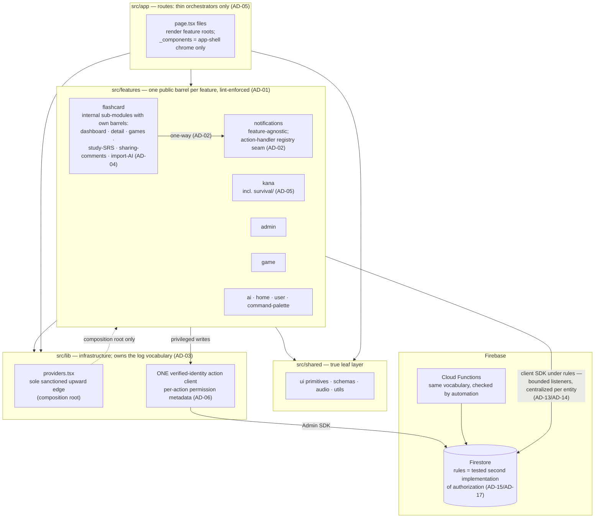

# 02 — Target Architecture

**Phase 3 — Architecture Decision.** This document describes the **destination**: the desired end state of the system once the twenty decisions (AD-01 … AD-20, fixed in this phase) are realized. It is written declaratively — every statement describes how the system *is* in the target state. It contains **no migration discussion, no sequencing, and no tasks**; how the system gets here belongs to later documents.

- **Binding decisions:** AD-01 … AD-20 (this phase's decision kernel). Each section names the decisions it embodies.
- **Evidence base (the "why"):** the assessment corpus (`architecture-assessment/` — S-x strengths, W-x weaknesses, RC-x root causes, CX-x complexity, PC-x pattern consistency, TD-x debt, R-x risks, OP-x opportunities, C-x evidence clusters, adjudications adj-n) and the discovery corpus (`project-discovery/` — cited as `discovery NN §`). Open questions are Q-n (`project-discovery/13`) and NQ-n (`architecture-assessment/12`).
- **Conditional destinations:** where a decision is Accepted-conditional (AD-08, AD-09 per-schema, AD-14 analytics, AD-16 activation, AD-19), the section states the **default destination** and its **gate** explicitly; the register at the end collects them. A gate changes which branch is built, never whether the section's rule holds.

---

## 0. The target in one view

The destination is the architecture the codebase already reaches for — its strongest verified properties (S-1 unidirectional layers, S-4 single action grammar, S-5 server-derived authority, S-6 tested rules mirror, S-14 tiered state) made **enforced, completed, and recorded** instead of conventional, staged, and tribal. The corpus's meta-finding is that six of twelve root causes reduce to staged work whose completion state was never recorded (RC cross-cutting observation; CX closing note; cluster C16). The target state therefore has two defining characteristics: **every boundary that matters is mechanically enforced** (P-1), and **every staged change knows its own end state** (P-4, AD-20).

---

## 1. Feature organization

**Embodies:** AD-01, AD-02, AD-04, AD-05 · Principles P-1, P-12.

### 1.1 Nine features, each with an enforced public API

The feature set remains the nine modules discovery catalogued — `admin`, `ai`, `command-palette`, `flashcard`, `game`, `home`, `kana`, `notifications`, `user` — each keeping the consistent internal grammar (`components/ hooks/ services/ actions/ domain/ types/ utils/` plus per-feature extras) that discovery verified (S-2; discovery 02 §1–2).

What changes is the nature of the boundary. In the target state:

- **Every feature exposes exactly one root barrel** (`features/<name>/index.ts`) and that barrel is the *only* legal cross-feature import surface. Deep imports into a feature's internals are **ESLint errors**, enforced by import-boundary rules in the existing ESLint setup (AD-01).
- The composition root (`lib/providers.tsx`, §2.3) and test files are the enumerated exemptions, declared in the lint config itself.

**Why this destination.** Today only 2 of 9 features have root barrels, and cross-feature imports routinely reach internal paths — 43 sites import `flashcard/types` directly, 9 reach `flashcard/games/match/config`, 4 import the `ShareModal` file itself (W-3). The consequence is that internal reorganization of any feature is a repo-wide breaking change, and nothing structural prevents the next convenience import from creating a new cycle — W-3 is the verified mechanism by which W-1's cycle arose. The layer discipline that *does* hold (S-1) held by single-author convention; with a bus factor of one (W-6, R-12), convention is precisely the thing the target state cannot rely on. P-1: boundaries are enforced, not documented — the corpus shows documented-only conventions drift (W-20's "mirrored" allowlists are provably unequal; CX-9's placement rule eroded twice).

### 1.2 Dependency direction: flashcard → notifications, never back

In the target state the notifications feature is **feature-agnostic**: it emits, stores, renders, and manages notifications without importing any producing feature. The one back-edge — `InviteActions.tsx` importing flashcard's `declineInviteAction` (W-1) — does not exist. Instead, notifications' public API owns a **registry/injection seam on the render/act side**: a notification kind maps to an action handler, and producing features register their handlers at composition time (the same open-closed shape the platform already has on the *write* side, where `domain/registry.ts` maps kinds to policy and `notify.ts` gives producers a one-line facade — RC-1).

**Why this destination.** RC-1 established that the cycle is not sloppiness but a *missing half of the platform's abstraction*: emission was decoupled, action handling was not, so the inbox must import the handler's owner. Left in place, each new actionable kind (7 more are pre-declared) adds another backward edge, hardening the cycle from one edge into a lattice (RC-1 risk statement; TD-4; cluster C3). With the seam in place, the dependency arrow is one-way and both features can be built, tested, and owned independently — which the notifications feature's Firebase-free `domain/` core (S-9) was visibly designed for.

### 1.3 Flashcard: one feature, enforced internal sub-modules

Flashcard remains **one feature** — no top-level split (AD-04). Its size is concentration matching domain weight (CX-2: the product *is* flashcards), and the corpus does not evidence that a split is necessary (OP-18 rates the seam availability Medium; W-4's severity reading is bucket-3 judgment per 10 §3). What the target state adds is **internal public-API discipline**: the existing sub-domains — dashboard, detail, games, study/SRS, sharing/access/comments, import + AI panels — each present an internal barrel with the same import rules applied *inside* the feature that AD-01 applies between features. The flat 27-file `components/` directory does not exist in the target state; every component lives in the sub-module that owns it (OP-18's observation that `dashboard/`, `detail/`, `games/`, `loaders/` already exist as partial seams).

**Why this destination.** W-4: six loosely related sub-domains share one namespace and one `types` barrel with 43 external import sites, so unrelated concerns churn together and every feature's compile-time fate is tied to flashcard internals. Internal sub-module barrels contain that blast radius without paying the unevidenced cost of a feature split (CX-2; OP-18; adj-4: flashcard is 46% of feature code — large enough that its *internal* structure is architecture, not housekeeping).

### 1.4 One placement rule; kana-survival's home

The target state has **one** placement rule (AD-05, P-12): *feature code lives in `features/<name>`; the route layer holds only orchestrators.* Route files are thin renders of a feature root (the 8-line orchestrator of S-2 is the model). `_components/` directories under `app/` are reserved for genuinely app-shell concerns: provider-free error/maintenance chrome (`app/_components` — must render when providers crash) and route-group shell chrome (`BottomNav`). Feature UI never lives route-side, no matter how few routes consume it.

Concretely, in the target state:

- **Kana-survival lives at `features/kana/survival/`** — screens and session hooks (`useSurvivalGame`, `useDropMode`) under the mode's own directory, in parity with its sibling modes (`hub/`, `chart/`, `learn/`, `practice/`, `quiz/`), each of which already keeps components and hooks feature-side (W-5, PC-15, RC-8).
- The notifications page's virtual list and placeholders live in `features/notifications` (CX-9 identified them as feature UI by dependency test).

**Why this destination.** The survival split is the corpus's clearest placement erosion: one mode bisected across the two layers the repo otherwise keeps distinct, surviving three restructures, creating the *only* `app → features/game` edges (RC-8, TD-10, discovery 08 §1.2), and standing as a live counterexample any future contributor can cite (CX-9: "each new contributor infers the placement rule from examples, and the examples disagree"). Cluster C4 is decision-ready per the readiness file (10 §6); NQ-5 (was the placement deliberate?) is recorded as **resolved-by-decision** — the rule above stands unless the owner vetoes, and either answer to NQ-5 leaves the same rule to write (12 §NQ-5).

---

## 2. Shared infrastructure

**Embodies:** AD-03 · Principles P-1, P-10.

### 2.1 `shared/` is a true leaf

`shared/` imports nothing from `features/` or `lib/` — the property S-1 verified by exhaustive grep is, in the target state, a lint-enforced invariant rather than an observed habit. Anything in `shared/` is extractable with zero risk of dragging feature or infrastructure code along (S-1's interpretation). Growth into `shared/` is governed by the **three-use rule** (P-10): a pattern is lifted to `shared/` when a third consumer exists, not before — the `Drawer` primitive (built, exported, zero consumers while two features hand-rolled the same panel — W-21, TD-11) is the canonical counter-example the rule exists to prevent.

### 2.2 `lib/` never imports `features/`

The `lib → features` direction does not exist in the target state (AD-03), with one exception (§2.3). The single current back-edge — `lib/logging/public.ts` importing `AdminLog`/`LogLevel`/`LogSource`/`LogType` from `features/admin/types` (W-2) — is resolved by **ownership**: the canonical log vocabulary lives in `lib/logging`, where the pipeline lives, and `features/admin` (the viewer) consumes it. This also eliminates the two-copy sync obligation RC-12 documented (the zod `logSourceSchema` re-declaring the feature-side union by hand).

**Why this destination.** RC-12: the vocabulary was born in the April-era admin viewer and never moved when the pipeline was centralized into `lib/` — the pipeline moved, ownership didn't. The cost is structural (every logging feature transitively depends on admin's types; the "canonical pipeline" advertises independence it doesn't have) and precedential: a tolerated type-only `lib → features` import invites a second, at which point the layering rule stops being grep-checkable (RC-12 risk; W-2).

### 2.3 The composition-root exception

`lib/providers.tsx` remains the **sole sanctioned upward edge**: the one place where the app shell is assembled from feature providers (`AdminProvider`, `NotificationsProvider`, the command-palette launcher, the user auth/activity hooks — S-1). In the target state this exception is *named in the boundary lint configuration* as an explicit exemption, so it is visibly one deliberate hole rather than a precedent (P-1: the difference between a documented exception and an unenforced convention is exactly what W-20/CX-9 showed drifting).

---

## 3. Form architecture

**Embodies:** AD-09 (form half) · Principle P-7.

In the target state there is **one form mechanism for multi-field and validated input**: `react-hook-form` + `zodResolver` bound to the entity's shared zod schema. The two existing sites (`useLessonBuilder`, `useShareInvites` — PC-1's beachhead, landed 07-16) are the pattern, not the exception. Trivial single-input surfaces (a search box, a single comment field) may remain controlled `useState` — this carve-out is written down as part of the convention (04), so the boundary between "form" and "input" is a rule, not a per-surface guess.

Properties of the destination:

- Validation rules for form input live in the schema, never in ad-hoc `maxLength` attributes or hand-rolled checks — the same class of input rule lives in exactly one place (PC-1's stated cost of the current split: "the same class of input rule lives in two places").
- Error display and submit-blocking derive from resolver state, so they behave identically across surfaces.

**Why this destination.** PC-1 rates forms *divergent* — two idioms, with the staged migration's end-state scope explicitly "intent unknown". The target state records the end state the beachhead implies. The library has been in `package.json` since April but unused until July (PC-1); the destination closes the adoption question instead of leaving it to be re-litigated per surface (AD-20's theme applied to a pattern).

---

## 4. Validation architecture

**Embodies:** AD-09 · Principles P-7, P-3.

### 4.1 The boundary-validation rule

**Every server write path validates through its zod schema.** This is already structurally true for the safe-action surface (S-4: every action carries `.inputSchema()`/`.bindArgsSchemas()`) and for log persistence (S-21); in the target state it is true for *every* write path, including the client-SDK service writes that today pass through the narrower legacy `validateAtomicCard` primary-field check (W-9, RC-6). One entity has one authoritative schema, and every path that persists that entity — manual builder, CSV/text import parser, AI output parsing — passes through it.

### 4.2 Declared schemas are enforced or deleted

In the target state there are **zero zero-consumer schemas**. A schema's header claim ("single validation source of truth") and its import graph agree — the corpus's sharpest documentation-vs-reality gap (W-9: headers actively mislead; tests deepen the illusion of enforcement) does not exist.

Per-schema disposition (AD-09, conditional):

| Schema | Default destination | Gate |
|---|---|---|
| `cardContentSchema` | Wired into every card write path (builder, `parser.ts`, AI output) — the header's own claim becomes true; `meaning`/`example`/`hint`/`clozeTemplate`/`difficulty` constraints are enforced at write time | Q-12 (production data compatibility: existing documents may violate constraints written before enforcement — RC-6, TD-5's "deferral converts a code fix into a data migration") |
| `privacyModeSchema` | Wired into the privacy-mode write path | Q-12 |
| `publicRoleSchema` | Wired into the share-role write path (alongside the runtime `sanitizePublicRole` cap it formalizes — S-5's three-layer cap gains its declared schema layer) | Q-12 |

The deletion branch, if a gate answers "overtaken," removes the schema *and* its header claim and tests — no decorative validation surface remains (P-3: delete before refactor).

### 4.3 One validation vocabulary per entity

Legacy typed validators are either subsumed by the schema (constraint checks) or retained for what schemas don't do (sanitization such as `sanitizeCommentContent`, numeric clamps), with the split written down. Error shapes normalize at boundaries — consumers handle zod issue shapes, not a per-validator taxonomy (PC-7's cost: `CardValidationError` vs zod issues today). Schema **placement** follows one rule (cross-feature entities in `shared/schemas/`, feature-private input schemas feature-side) instead of today's four location conventions (PC-7); the normative statement lives in 04.

**Why this destination.** Cluster C5: the three zero-consumer schemas mean card fields beyond `primary` are written unvalidated by every path, and Firestore accumulates documents no schema has checked (RC-6 business impact); R-16 rates the compounding data-quality drift. The boundary rule (P-7) plus rules-side re-validation (S-6, retained as defense-in-depth) gives the same invariant two genuine implementations — the shape S-5 already proves works for authorization.

---

## 5. Table architecture

**Embodies:** AD-11 · Principle P-10.

The target state has **one table engine**: the shared react-table engine (`useDataTable` + the `AdminTableShell` chrome family), consumed by Users, Content, **and Reports**. "How does an admin grid behave" has one answer: engine semantics (sorting/selection/filtering, with documented per-surface opt-outs like Content's upstream filtering) everywhere the shell appears. Reports' variable-height virtualized log rows are expressed *within* the engine's architecture rather than as a shell-only lookalike — the current state where Reports shares the visual chrome but none of the engine semantics (PC-2's cost) does not exist. NQ-4 (why was Reports excluded?) is resolved-by-decision: whatever the original reason, the destination is convergence.

The engine **remains admin-scoped**. It lifts into `shared/` only when a third, non-admin consumer exists (the three-use rule, P-10). This is deliberate: CX-12 diagnosed the admin surface as the accidental sole home of general-purpose patterns ("patterns-per-surface rather than patterns-per-problem"), and the corrective is not to pre-emptively globalize admin's engine but to have a written lift rule so the next table consumer triggers a considered extraction instead of a third implementation.

**Why this destination.** PC-2 (mostly-consistent, one undocumented exception three days old at assessment); CX-12; the Drawer counter-example (TD-11) showing what speculative extraction costs.

---

## 6. Dialog model

**Embodies:** AD-10, AD-19 (Drawer gate) · Principles P-2, P-3.

The target state sanctions **exactly two tiers** of overlay construction (AD-10):

- **Tier 1 — shared primitives.** `Modal` / `ConfirmModal` (Base UI Dialog + `DialogChrome`) for standard dialogs. This is the default; a surface uses Tier 1 unless it has a layout the primitives cannot express.
- **Tier 2 — direct `Dialog.Root` composition** for bespoke overlays (slide panels, the command palette, the share modal). Tier 2 is a *documented end state*, not a leftover — git already names it as the migrated destination for bespoke layouts (PC-3: commit `5669430` lists AdminSidebar and DeckDetailsPanel as completed migrations). The target-state constraint is that **Tier 2 always composes through `DialogChrome`**: backdrop, close-button accessibility, and scroll behavior come from the shared chrome in both tiers. The one straggler backdrop (`DeckDetailsPanel`'s hardcoded `bg-[#3c3c3c]/30` vs `DIALOG_BACKDROP_CLASSNAME` — OP-2) does not exist; there are zero bespoke backdrops.

**`Drawer`: delete-unless-claimed** (AD-19 shape; gate NQ-3). Default destination: the primitive does not exist, and the two real slide panels remain Tier-2 compositions via `DialogChrome`. If NQ-3 answers that `Drawer` was built *for* those two surfaces, the alternate destination is that `Drawer` becomes the panel primitive and both consume it — either branch ends the current state where the shared inventory advertises a drawer nothing uses while the codebase's actual drawers ignore it (W-21's "misleading affordance"; TD-11; OP-12; CX-7's undocumented-aspiration flavor).

**Why this destination.** PC-3 shows the two-tier design is already the deliberate post-migration shape; the target state keeps it and closes its two open edges (the chrome guarantee and the Drawer branch). P-2: one pattern per problem — two *tiers* of one pattern, not two patterns.

---

## 7. Data layer

**Embodies:** AD-06, AD-12, AD-13 (listener half), AD-14 · Principles P-2, P-6, P-9, P-11.

### 7.1 Two write-path families, one action client

The target state has exactly **two** write families (AD-06), down from three (PC-5, RC-11, CX-3):

1. **Client Firebase SDK under security rules** — the dominant family, for learner-owned realtime data (own lessons/cards, SRS progress, kana progress, own-inbox read state, leaderboard entries). This is ADR-002's affirmed territory (P-11: realtime by default), and it is what makes the rules layer a real second implementation of authorization (S-6, S-14).
2. **Typed safe-action server mutations** — for privileged and cross-user writes (notification emission, system logs, all admin operations), where the Admin SDK is required and rules cannot express the check (discovery 09 §1's division of write authority).

Within family 2, the current B/C transport split (cookie-session `adminActionClient` vs idToken-bind-arg `actionClient` — both terminating in the same `verifyIdToken` on the same kind of token, RC-11) converges on **a single verified-identity action client** with:

- **per-action permission metadata** — the property S-4 called out as the strongest part of the admin client ("an action *cannot be defined* without declaring its required permission") becomes universal: every privileged action declares what it requires, and the client's middleware enforces it;
- **thin per-surface configuration** — surface-specific concerns (how the credential travels; §10) are configuration of the one client, not a second client;
- **one result envelope** — `{ok,data} | {ok,error}` at every action boundary (S-4's `toActionResult` contract, now native rather than an adapter).

NQ-9 (should B and C converge?) is resolved-by-decision at the architecture level; transport-verification details are validated during design (AD-06's own caveat).

**Why this destination.** RC-11: the three families are fossils of three trust-boundary eras, and the B/C transport difference is the one part with no constraint behind it — "both end at `adminAuth.verifyIdToken` on the same kind of token, differing only in how it travels." The cost of the status quo is tri-modal reasoning on every cross-family user story and a per-endpoint family choice governed by tribal precedent (W-12, CX-3, cluster C10). The client-SDK family is *kept* because it is constraint-forced and load-bearing (realtime listeners, offline, rules enforcement — OP-1's own confidence note that full convergence is not structurally available).

### 7.2 Bounded queries

**Every collection/collectionGroup listener carries an explicit bound** (AD-14). The unbounded public-lesson `collectionGroup` listener (no `limit()`, mounted live on the dashboard for every visitor — R-2) is out of policy; in the target state it is bounded like every other query (the admin query layer already demonstrates the discipline: 50/100/200-doc caps throughout, TD §insufficient-evidence note). The *value* of each bound is a design/scale decision (NQ-6 informs it); the *existence* of a bound is unconditional.

**Why.** R-2: cost grows linearly and unboundedly with global public-deck count, live, for every dashboard visitor — the corpus's highest-impact scalability finding.

### 7.3 Centralized per-entity listeners

**One live listener per entity per client, shared by all consumers** (AD-13, P1 portion). The notifications pattern — a single app-lifetime `onSnapshot` in a context, with derived state memoized and every consumer reading the context (S-14, discovery 09 §4) — is the model for every realtime entity. The `useUserProgress` shape (one listener per consuming component × 10 mount sites — R-1, discovery 09 §6) does not exist in the target state; the user-progress subscription is opened once and shared.

**Why.** R-1: per-mount multiplication is structural, drives connection/memory/read-quota cost on every authenticated screen, and the codebase already contains its own counter-example — the corpus explicitly contrasts the two (discovery 09 §6 "Centralized single listener — Notifications only").

### 7.4 Honest UI

**Absent data renders as absent** (AD-14, P-9). Dashboards and exports never substitute fabricated values for missing sources: "Active users today: 0" as a rendering of *no data* does not exist; an explicit no-data state does. This applies to every metric surface, and it is what makes the analytics gate (§8.4) safe to resolve in either direction — whichever branch Q-9 selects, the UI never lies about which branch is live (W-11's core harm: "an operator cannot distinguish truth from unpopulated fallback, on exactly the surface built to answer that question"; RC-5; TD-8; cluster C6).

### 7.5 Pagination: exactly two mechanisms

The target state codifies the two existing mechanisms as **THE two** (AD-12):

- **Cursor-token pagination** for jumpable, one-shot administrative lists (`useCursorPagination`'s accumulated token map — already intra-unified by E17-T5c, PC-11);
- **Grow-window resubscribe** for realtime feeds (the notifications `loadMore` growing the live `limit()` — a documented correctness tradeoff, TD §performance note).

Both remain constraint-documented at their points of use, and **no third mechanism may be added** — a new paginated surface picks the mechanism matching its data channel (one-shot vs live). OP-3's Low rating (the divergence is principled, channel-forced) is why this is codification, not consolidation.

### 7.6 Fire-and-forget, reported

Fire-and-forget remains a sanctioned channel for secondary writes (S-12's tiered error policy is preserved: grading must never be blocked by a stats write). What changes is that swallowed failures **report before they are handled** (§12): the swallow sites carry a report call into the logging pipeline, so "best-effort" no longer means "invisible" (R-6, OP-22).

---

## 8. Firebase layer

**Embodies:** AD-08, AD-14 (analytics gate), AD-15 (automation half), AD-19 (fan-out gate), AD-17 (rules-suite floor).

### 8.1 Rules as tested mirror

`firestore.rules` remains a genuine second implementation of the app's authorization model — the property S-6 verified (role matrices, immutable-field guards, owner-self-only inbox creation) is preserved and extended: **every ruled collection appears in the rules test suite** (AD-17 floor). The current state — the rules suite exercises notifications/invites/progress/sessions/leaderboards but none of the lessons/cards/comments sharing model, `admins`, `system_logs`, `sharedProgress`, or the collection-group read (OP-24) — does not exist; the enforced side of the app's most complex access model is under test.

### 8.2 Vocabulary agreement is automated

Every place where the same vocabulary is declared in parallel artifacts — TS unions, zod enums, `firestore.rules` value lists, writer code, functions-package copies — is covered by an **automated agreement check** instead of prose comments and human discipline (AD-15 automation half; AD-08's mechanism). The corpus verified that these agreements are manual today and that one has already drifted (OP-19: three declarations of "valid notification type" in live disagreement); the rules file tracks the service layer by hand-written comments (OP-20). In the target state, divergence is a visible failure at the moment it is introduced, not a fact discovered by audit. (OP-20's caveat stands: the rules-coverage ↔ written-path correspondence is automated to the extent it is expressible; its floor is the §8.1 test requirement.)

### 8.3 Notification vocabulary: the stored data is authoritative

**The migration completes** (AD-08, conditional). Destination state:

- `AppNotification.type`'s TS union describes **what is actually written**: the stored vocabulary (10 distinct values today, including `digest` — W-7, adj-7) is authoritative, and the compile-time type widens to match it. Exhaustive switches over the union are trustworthy again (RC-2's core harm: "TypeScript's exhaustiveness checking is unavailable/false on the field where it matters most").
- The rules-side value list, the writer set, and the union agree — and §8.2's automation keeps them agreeing.
- The dual machinery has a **defined end state and removal gate**: in the completed destination there is one document shape (`status`-based), one query path, one index set, no `@deprecated` fields, no `isUnread()` legacy fallback, and no backfill script in-tree.

**Gates:** Q-5 (do legacy-shaped documents still exist in production data?) and NQ-1 (is the runbook's "NOT yet deployed" status current?). The gates choose *when the compatibility machinery can be removed*, not whether the destination holds — RC-3 identified the absence of a recorded completion condition as the root cause, and AD-20's ledger (§16) is what prevents this destination from freezing mid-flight the way the current migration did (TD-1, CX-1, clusters C1/C2).

### 8.4 Every read collection has a defined writer

In the target state, **no code reads a collection nothing writes**. Each collection has either an in-repo writer or a documented external contract naming its producer.

- `analytics_daily` / `metadata/counters` (AD-14, conditional on **Q-9**): default destination — the read paths and their fabricated fallbacks are **removed** (with §7.4's honest-UI rule governing what the dashboard shows instead). Alternate branch, if Q-9 reveals or a decision creates a real producer: the pipeline exists end-to-end and its document shapes are a recorded contract, not reverse-engineered from fallback code (RC-5: "a future producer must reverse-engineer the contract from fallbacks").
- `fanOutNotifications` callable (AD-19, gate **Q-6**): delete-unless-claimed. Default destination: the callable and its Cloud Tasks consumer do not exist; multi-recipient delivery is built when a product event first needs it. Alternate: an operator contract documents who invokes it (OP-14).

### 8.5 Functions package parity

The Cloud Functions package participates in the same contracts as the app: the same `APP_ID` derivation (§13), the same notification document shape (§8.3), and vocabulary membership checked by §8.2's automation (TD-16, R-14: the silent tenant-split failure mode is structurally closed).

---

## 9. Permission model

**Embodies:** AD-15 · Principle P-2.

### 9.1 Two engines, affirmed as two domains

The target state keeps **two RBAC engines**: deck-sharing RBAC (`resolveRole`'s five-step resolution, `canView`/`canComment`/`canEdit`, `sanitizePublicRole`) and platform-admin RBAC (the role→permission matrix behind the action client's metadata). This is *principled* duplication — the two models are structurally different (per-resource resolution pipeline vs boolean matrix), share no roles, no storage, and no call sites (PC-8, CX-12's "merging them would be worse", OP-6 rated Low). Each remains the declared and *actual* single source of truth for its domain.

### 9.2 Predicates are never inlined

The engines' contract ("Never inline role logic in components or pages" — the flashcard engine's own header) is **true** in the target state. The five inline re-derivations of the deck-access predicate (OP-5) do not exist; every access decision calls the engine. In particular:

- The semantically divergent `isOwner` in `shared.service.ts` (`roles?.[uid] === "owner"` vs the engine's `ownerId ?? userId` — OP-5, the corpus's "closest thing to a discovered live bug", 10 §1) is gone; ownership has one definition.
- The share-access predicate exists **once**, in an SDK-neutral pure module both the client resolver and the Admin-SDK preview consume — the missing home RC-9 identified. The preview keeps its own *file* (the bundle-isolation reason is legitimate — W-13), but not its own *implementation* of the predicate. The predicate module expresses the deliberate variants explicitly (link-reachable vs publicly-listed — RC-9's sitemap variant becomes a named predicate, not a subtly different inline copy).
- `firestore.rules` remains the third, enforcement-layer expression of the same policy — that duplication is structural to Firebase and is covered by §8.1's testing floor and §8.2's agreement checking rather than eliminated (TD-9, cluster C11).

Elaboration under the same principle: the three admin-authority predicates (app server: claims-or-doc-with-role; rules: claims-or-doc-existence; functions: doc-role-only — OP-7) **agree** in the target state, expressed once and mirrored per layer with the agreement checked. The *direction* of alignment is gated on **Q-10** (which source production authority actually rides on), since aligning blind risks locking out or failing to lock out real admins (OP-7).

**Why this destination.** OP-5/C11: the engine's authority is currently contradicted by its own consumers, and one divergence is behavioral, in an access path, with zero tests on the resolver (W-16). P-2: one pattern per problem — two *domains* each with one engine, never N inline copies per domain.

---

## 10. Auth model

**Embodies:** AD-07 · Principle P-6.

The target state's session credential is **httpOnly and server-verified**:

- The browser holds an **httpOnly session credential** minted and verified server-side. The JS-readable raw-ID-token cookie mirror — deliberately non-httpOnly so the client SDK could refresh it, with a 7-day cookie wrapping a 1-hour token (W-15, RC-4) — is not the target. Credential lifetime and token validity agree; the "page loads, all actions fail" stale-cookie state (W-15 consequence 3) does not exist.
- **The edge gate remains a routing-UX check only.** It never claims to be security; real verification is server-side on every privileged path, exactly as today (S-5's preserved strength: server derives identity, the client is never trusted with identity, target, or role). What changes is that the gate's routing signal is a credential XSS cannot read, closing the token-exfiltration amplifier (R-11: any XSS currently yields a live bearer token; TD-15: an accepted risk with no ADR).
- Defense-in-depth retains its current genuine layers: Firestore rules for client-SDK operations, per-action verification and permission metadata in the action client (§7.1), and the three-layer public-role cap (S-5, S-6).
- The public-route allowlist that the edge gate and the client `AuthGate` both consult is **single-sourced** (§13) — the two hand-mirrored, provably unequal copies (W-20a) do not exist.

**Why this destination.** Cluster C7: the current design is a coherent consequence of client-SDK-first auth (RC-4 traces the structure), but it trains misplaced trust — "any future developer who adds server-side data fetching to a 'protected' page, trusting the proxy gate, creates a leak" (W-15) — and it makes every XSS a session compromise (R-11, coupling to R-17). The readiness file lists the auth architecture as decision-ready: all mechanics and compensating controls are verified; this is a values decision, and AD-07 makes it. The decision itself is recorded as an ADR in the target state (TD-15's specific gap).

---

## 11. State management

**Embodies:** AD-13 · Principle P-11.

The **four-tier model of ADR-002 is affirmed** as the target state:

1. **Local state** (`useState`/`useTransition`) for per-surface concerns;
2. **Zustand stores** for cross-cutting client state and persisted preferences (auth objects excluded from persistence — S-14's correctness-and-security property is preserved);
3. **The three contexts** for app-lifetime *resources* — a shared listener, an imperative API — mounted exactly once in the composition root;
4. **React Query** for one-shot server state, with centralized query-key factories (S-14's structural prevention of the invalidation-mismatch bug).

`onSnapshot` remains the realtime channel — realtime by default, cache by exception, per ADR-002's written policy (P-11, S-14, PC-14). Two additions distinguish the target state from today:

- **The tier rule is written.** PC-16 found the store/context/local mapping coherent in practice but unwritten — in the target state the decision rule ("stores hold data shared across unrelated trees; contexts hold resources that mount once; React Query holds one-shot server state") is part of the conventions document (04), so tier choice is a rule, not archaeology.
- **Per-entity realtime subscriptions are centralized** (§7.3): tier 3 is where shared listeners live, and no entity's listener is duplicated per mount (R-1, PC-16).

**Why this destination.** S-14/PC-14: the model is one of the corpus's verified strengths, matched by code at every re-verified site; the target state keeps it and closes its two gaps (unwritten rule, per-mount listeners) rather than replacing it.

---

## 12. Observability

**Embodies:** AD-16 · Principle P-8.

### 12.1 Telemetry is active

The Sentry and PostHog wiring — already correctly gated, proxied first-party, and production-safe (S-21) — is **live**: production errors report somewhere, and the four route-level error boundaries are a real alarm surface rather than a no-op (OP-21). **Gate: Q-4** (credentials and ownership). Default destination: activated. The alternate branch (a deliberate decision *not* to run telemetry) is acceptable only as a recorded decision with the dormant wiring's weight reconsidered (OP-21's two branches) — what the target state excludes is the current *unknowable* state, where whether production errors are observed at all cannot be answered (W-17, cluster C13).

### 12.2 Report-then-handle

**Errors report before they are handled** (P-8). The tiered handling policy S-12 verified is preserved — boundaries for render-path crashes, error-into-state for subscriptions, fail-open defaults for secondary reads, fire-and-forget for secondary writes — but no real-state failure is silent:

- The 17 promise-swallow sites and the bare `catch {}` population (OP-22) route through the existing logging pipeline (`enqueueClientLog` / the activity-log actions — S-21's non-blocking facade is precisely built for this) *before* swallowing. The audio subsystem's `AUDIO_PLAYBACK_FAILED` sampling — today the only subsystem whose silent failures leave a trace (OP-22) — is the model generalized.
- **Boundaries surface, services report:** user-facing error UX stays at boundaries; services and hooks report and then apply their tier's policy. Swallowing without reporting is out of policy for writes to real state (SRS counters, Storage cleanup, notification delivery, audit writes — R-6's inventory).
- The audit trail is no longer best-effort-invisible: a gap in `system_logs` is detectable because failed audit writes are themselves reported (W-17's audit-trail cost).

**Why this destination.** W-17/R-6/C13: production failure modes below the crash threshold are invisible today — 59 `console.error` sites reach no one, and the writes that fail silently include the audit log itself. The pipeline to fix this exists and is verified (S-21); the destination is its use.

---

## 13. Configuration

**Embodies:** AD-18 · Principle P-1.

In the target state, every configuration fact that two consumers depend on has **exactly one source**:

- **One public-path allowlist module**, consumed by both the edge proxy and `AuthGate`. The current two copies are provably unequal despite a "mirrors" comment (W-20a); NQ-2 is resolved-by-decision — the divergence is treated as **defect, not intent**, and the canonical definition is single-sourced with per-consumer *behavior* (redirect vs splash) derived from the one list.
- **One `APP_ID` derivation**, consumed by both the app and the functions package. The dual-env-var split (`NEXT_PUBLIC_APP_ID` vs `NOTIFICATIONS_APP_ID`, each with its own default literal — TD-16, R-14) does not exist; the silent tenant-partition failure mode is structurally closed.
- **`.env.example` documents the full environment surface** (~30 variables — TD-13): a fresh environment stood up from the repo alone knows what "fully configured" means, and deliberately env-gated no-ops (S-13's design) are discoverable instead of silent. This is a direct bus-factor mitigation (W-6, C9).
- Config access stays funneled through dedicated modules with safe defaults (S-13 preserved).

**Hosting remains OPEN** (Q-2). The corpus is explicit that the decision cannot be made from documents (TD-14: the repo's only TODO; R-13: no `.firebaserc`, no hosting block, demo-only project IDs). The target configuration architecture is hosting-agnostic; what the destination *does* require is that when the hosting decision is made, it is recorded (an ADR — the artifact whose absence TD-14 names), and `SITE_URL` is provisioned rather than silently falling back to localhost on production URL surfaces.

**Why this destination.** Cluster C14: every member is a hand-synchronized fact whose failure mode is quiet (SEO silently broken, notifications silently split-brained, monitoring silently absent). W-20's four items are all verified drift or drift surfaces; single-sourcing is P-1 applied to configuration.

---

## 14. Folder and naming conventions

**Embodies:** AD-01, AD-05 (as conventions) · **Normative statement lives in document 04 of this phase (Conventions & Standards).**

This section only fixes what the target *structure* guarantees; the full rulebook (naming, file suffixes, schema placement, `_components/` criteria, sub-module barrel shape, the form/input boundary of §3, the state-tier rule of §11) is specified once, in 04, and cross-referenced from code where enforcement lives. Structural guarantees of the destination:

- The placement rule of §1.4 (features own feature code; routes orchestrate; `_components/` = app-shell chrome only).
- One root barrel per feature; internal sub-module barrels inside flashcard (§1.1, §1.3).
- Layer import directions of §2, lint-enforced with the composition root as the single named exemption.
- Conventions are **enforced or they are not conventions** (P-1): the corpus documented what happens otherwise — a 200-line ceiling with 44 standing violations training contributors that lint output is noise, a placement rule with a standing counterexample, a docs index missing an existing ADR (W-21, TD-3, CX-9). The target state's conventions each name their enforcement mechanism (lint rule, CI check, or 04's checklist) in 04.

---

## 15. Testing strategy end-state

**Embodies:** AD-17 · Coverage follows risk.

### 15.1 Five suites, affirmed

The five-suite topology is the target architecture of testing (S-10, adj-2's corrected census): **unit** (node) · **real-browser component** (Vitest Browser Mode) · **app emulator + rules** · **functions emulator** · **E2E** (Playwright against emulator + dedicated server). Each tier continues to prove what only it can prove (rules against the real rules engine, keyboard/focus contracts in a real DOM, idempotent delivery against a real Firestore emulator, realtime end-to-end in a real browser). CI keeps job-for-job parity with the local suites (S-11).

### 15.2 Coverage floors

The target state adds **floors** — minimum coverage properties that hold regardless of allocation choices:

1. **Every feature has unit coverage of its domain logic.** The current zero-coverage features (`ai`, `game`, `home`, `command-palette` — OP-23) do not exist as a category.
2. **Every ruled collection appears in the rules suite** (§8.1; OP-24).

### 15.3 Allocation follows risk

Above the floors, allocation priority goes to the highest-risk untested units the corpus named: **SRS math** (`progress.service.ts`, 335 lines, zero tests), the **sharing-RBAC resolver** (`resolveRole` — security-relevant, pure, 9 consumers, zero direct tests), and the **flashcard data services** (the diff-based `lesson-save` batch writer, `card.service`, `comment.service`, `shared.service`) (W-16, TD-2, cluster C8). The inversion the corpus measured — pure leaf domains well tested while the money-path mutation logic is unguarded, including tests that validate schemas nothing enforces (W-16's sharpest point) — is the specific state the target excludes. The harnesses all exist (S-10); the destination is allocation, not tooling.

---

## 16. Change governance: the completion ledger

**Embodies:** AD-20 · Principle P-4. *The highest-leverage single decision in the kernel.*

In the target state, **every staged change carries a ledger entry** recording: intended end state · current stage · owner · review-by date. The ledger lives in-repo (as a migrations ledger or ADR addenda), and a staged change without an entry is a review-time defect. ADRs continue for decisions (001–003 exist and are cross-referenced from code — S-20); the docs index is kept current (the ADR-003 omission of W-21d does not recur).

**Why this destination — the corpus's own meta-finding.** Six of twelve root causes (RC-2, RC-3, RC-5, RC-6, RC-7, RC-10) reduce to one cause: *a migration or capability was staged with a defined later step, and the repository has no mechanism that records whether the later step happened or is still intended* (RC cross-cutting observation). The complexity analysis reached the same conclusion independently: the code that is hardest to reason about is not the largest feature but the drift group — staged work whose later steps have no recorded status (CX closing taxonomy; cluster C16). Every conditional destination in this document (§4.2, §8.3, §8.4, §12.1, and the AD-19 deletion gates) is, in the target state, a ledger entry with an owner and a review date — which is precisely what prevents this architecture from becoming the next frozen migration.

### The dead-surface default (AD-19, applied throughout)

Wherever this document marks a surface delete-unless-claimed, the target state's default is **deletion** (P-3: delete before refactor), behind a named gate: dormant `NotificationKind`s (7, gate Q-8) · never-emitted `ActivityAction`s (8, gate Q-11) · handler-less admin Quick Actions, the Settings stub, and `canChangeSettings` (gate Q-13) · the fan-out callable (gate Q-6) · the one-story Storybook toolchain (gate Q-17) · `Drawer` (gate NQ-3). The kana-practice logging gap — the one member RC-7 proved is an *omission* rather than a roadmap item (its siblings log; it doesn't) — resolves in whichever direction its gate answers: either practice logs like its siblings or the action is deleted with the rest. In every case the target state excludes the current third option: declared surface whose liveness nobody can determine (W-8, W-10, TD-6, TD-7, TD-12, CX-7, cluster C12).

---

## Conditional destinations register

| Section | Destination (default) | Gate | Alternate branch |
|---|---|---|---|
| §4.2 | Three schemas wired into their write paths | Q-12 (production data compatibility, per schema) | Schema deleted with its header claim and tests |
| §6 | `Drawer` deleted; panels stay Tier-2 via DialogChrome | NQ-3 | `Drawer` adopted by both slide-panels |
| §8.3 | Notification migration completed: single shape/query/index; union matches stored data | Q-5, NQ-1 | (Timing only — destination itself is not conditional) |
| §8.4 | `analytics_daily`/`metadata-counters` read paths removed | Q-9 | Real writer defined; shapes become a recorded contract |
| §8.4 | Fan-out callable deleted | Q-6 | Operator contract documented |
| §9.2 | Admin-authority predicate aligned, single definition mirrored | Q-10 (alignment direction) | — |
| §12.1 | Sentry/PostHog active in production | Q-4 (credentials/ownership) | Recorded decision to stay dark; wiring weight reconsidered |
| §13 | Hosting: **remains OPEN** | Q-2 | Decision recorded as ADR when made |
| §16 | Dormant vocabularies / inert admin UI / Storybook deleted | Q-8, Q-11, Q-13, Q-17 | Claimed items completed (producer wired, page built, adoption resourced) |

Questions the corpus raised that **no AD-x covers** are deliberately absent from this destination and belong to 07-Open-Questions: the rendering-strategy/SSR posture (W-14, NQ-10), anonymous leaderboard readability (R-3, NQ-7), world-readable card-image Storage (R-18, NQ-8), the transaction-invariant audit (R-7, NQ-11), the sanitization-path trace (R-17, NQ-12), the page-level accessibility audit (W-22, NQ-13), runtime magnitudes (NQ-14), and the uncontracted external endpoints (W-19, Q-15/Q-16).
