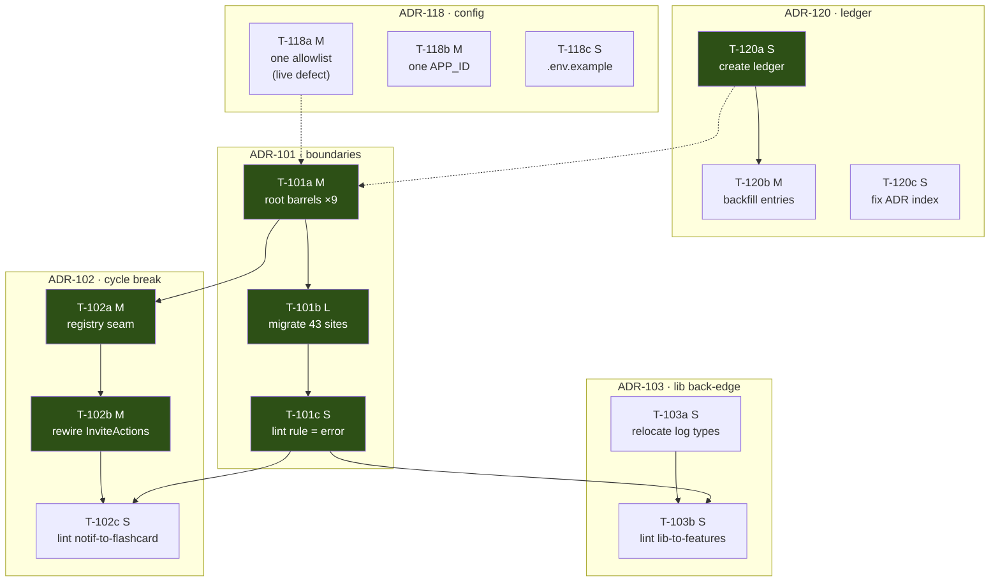
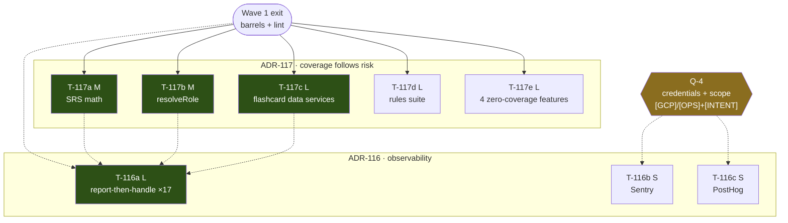
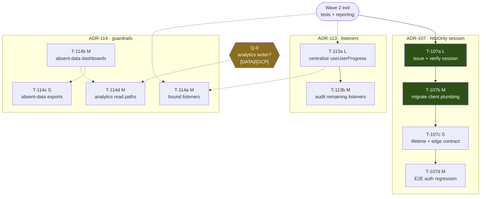
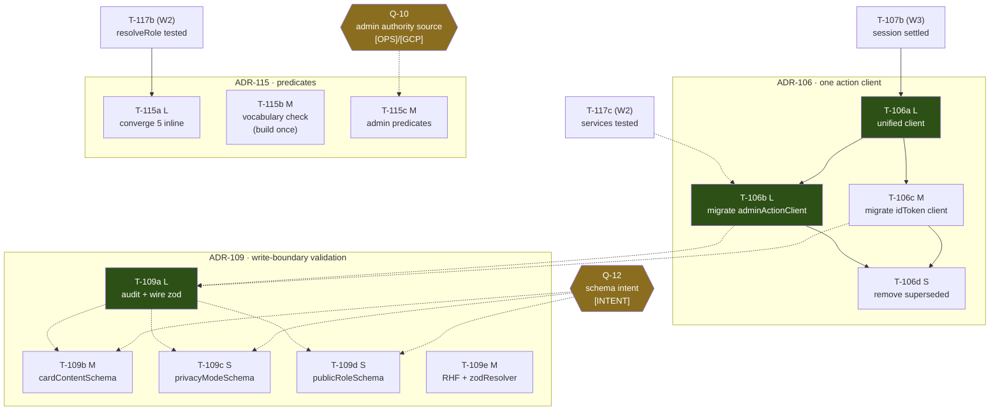
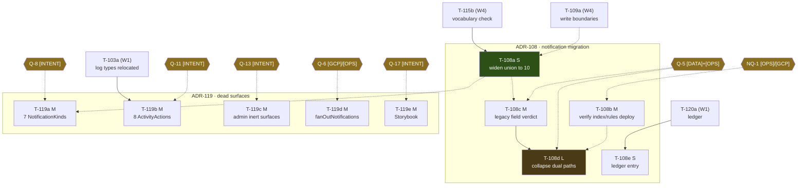
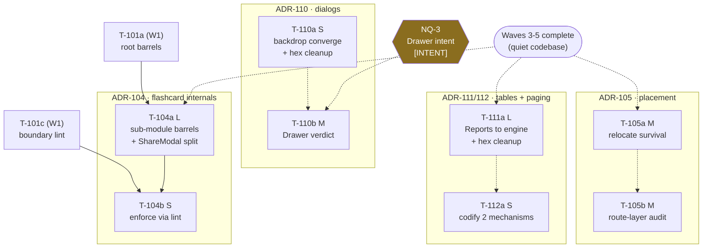

# 05 — Dependency Map

**Phase 11 — Implementation Planning.** Task-level dependencies across the **63-task** set — 62 wave-assigned plus T-118d (`[OPEN Q-2]`, not schedulable). Derived from the twenty ADRs in `architecture-decision/03-Architecture-Decisions.md`; wave membership and the critical-path spine are fixed by the planning kernel.

**Authority.** `01-Validated-Backlog.md` is the authoritative elaborated task list; IDs, sizes, gates, and wave assignments here are aligned to it (19 S · 29 M · 14 L · 1 unsized · 0 XL). Where this file and the backlog state the same fact, the backlog governs. The kernel's headline "50 tasks" is a confirmed transcription error — **63 is correct.**

**Honest labeling.** Derived-from-decisions planning, not backlog validation. `engineering-tasks/` and `requirements-consolidation/` do not exist and are unrecoverable; traceability runs task → ADR → driving findings → corpus. No Requirement-ID or Recommendation-ID is cited.

---

## Dependency taxonomy

Every edge in this document is classified. The distinction changes what a scheduler may do with it.

| Class | Notation | Meaning | May a scheduler violate it? |
|---|---|---|---|
| **HARD** | `A --> B` (solid) | **Technical.** B cannot compile, cannot run, or would break the pre-commit gate (lint + format + full build) without A. Includes "B would have to be built twice" where the rebuild is total, not incremental. | **No.** Violating a HARD edge produces a non-deployable state, which the kernel forbids outright. |
| **SOFT** | `A -.-> B` (dotted) | **Sequencing preference.** B is technically buildable without A, but doing it after A is materially safer, cheaper, or avoids rework. Includes the kernel's own binding sequencing decisions (e.g. coverage before convergence). | **Yes, at a stated cost.** Each SOFT edge below names the cost of inverting it. |
| **GATE** | `Q?==> B` | **External answer.** B is not READY until a named question answers. Gates are orthogonal to HARD/SOFT: a gated task may have no task dependencies at all. | Not a scheduling choice — see the gate table. |

**A note on kernel-binding SOFT edges.** Several SOFT edges are *decisions*, not observations — most importantly `[T-117a/b/c] -.-> T-116a` and the coverage-before-convergence rule generally. They are technically invertible (report-then-handle compiles fine without tests) but the kernel fixed them, and ADR-117's cost-of-delay analysis is the reason. They are marked **SOFT (kernel-binding)** and should be treated as HARD by any scheduler that has not been given authority to revisit the sequencing rationale.

---

## Part A — Per-wave dependency graphs

### Wave 1 — Platform Foundations

*(Green = on the critical path.)*

**Wave 1 edges**

| Edge | Class | Why |
|---|---|---|
| T-120a → T-120b | HARD | Cannot backfill entries into a ledger format that does not exist. |
| T-101a → T-101b | HARD | Cannot migrate 43 deep-import sites onto barrels that have not been published. |
| T-101b → T-101c | HARD | Setting the import-boundary rule to `error` while 43 violations remain fails the pre-commit gate on the very commit that installs it. |
| T-101a → T-102a | HARD | The registry/injection seam is exported *through* notifications' public API. ADR-102's consequence: "ADR-101's lint boundary can encode `features/notifications` imports no other feature as a hard rule" — the seam is that public API. |
| T-102a → T-102b | HARD | `InviteActions` cannot be rewired onto a seam that does not exist. |
| T-102b → T-102c | HARD | The lint rule forbidding notifications→flashcard fails while the back-edge is still present. |
| T-101c → T-102c | HARD | Same ESLint rule/config surface; T-102c extends the rule T-101c installs. |
| T-103a → T-103b | HARD | The lint rule forbidding `lib`→`features` fails while `lib/logging/public.ts` still imports `features/admin/types`. |
| T-101c → T-103b | HARD | Same rule file. Inverting means two conflicting edits to the boundary-rule config. |
| T-120a ⇢ T-101a | SOFT (kernel-binding) | T-101a/b is itself staged work (define barrels, then migrate) and per ADR-120 must record its completion state. **Inversion cost:** the program's first staged change lands unrecorded — the exact failure ADR-120 exists to prevent. This is the kernel's chosen path head. |
| T-118a ⇢ T-101a | SOFT | T-118a fixes a live divergence defect; landing a user-visible defect fix before a large mechanical migration keeps the first deployable increment valuable. **Inversion cost:** none technical. Pure value ordering — freely invertible. |

**Wave 1 tasks with NO dependency of any kind:** T-120a, T-120c, T-118a, T-118b, T-118c, T-101a, T-103a.

---

### Wave 2 — Safety Net

**Wave 2 edges**

| Edge | Class | Why |
|---|---|---|
| Wave 1 exit → T-117a/b/c/d/e | HARD | Tests import through the feature public APIs T-101a publishes. Written earlier, every test file's import block is rewritten by T-101b. |
| Wave 1 exit ⇢ T-116a | SOFT | T-116a touches 17 sites across services and features; landing it after the import surface settles avoids a second pass. Also needs T-120a's ledger to record which suppressions are deliberate-with-report. **Inversion cost:** one mechanical import sweep. |
| T-117a/b/c ⇢ T-116a | SOFT (kernel-binding) | Report-then-handle rewrites 17 catch sites including **SRS counters** — logic T-117a has just covered. **Inversion cost:** the swallow-site rewrite proceeds without a net over the exact state-mutating paths it touches. This is the kernel's critical-path edge and ADR-117's cost-of-delay argument in miniature. |
| Q-4 ⇒ T-116b, T-116c | GATE | Credentials, project ownership, and intended analytics scope. See gate table. |

**Wave 2 tasks with NO task dependency (gate-bound or wave-bound only):** T-117e (no downstream dependent anywhere in the plan), T-116b, T-116c (gate-bound only). T-117d has no HARD *predecessor* but is **not** dependency-free downstream — see the correction in §D.3.

---

### Wave 3 — Security & Data Layer

**Wave 3 edges**

| Edge | Class | Why |
|---|---|---|
| Wave 2 exit → T-107a | HARD (practical) | T-107d's regression pass requires the e2e tier green; and report-then-handle (T-116a) is what makes a failed session mint visible rather than swallowed during the migration. Building the session mint without either is buildable but not *verifiable*, which the kernel's deployability rule forbids at wave boundaries. |
| T-107a → T-107b | HARD | Client plumbing cannot migrate off the raw ID-token cookie before an httpOnly session cookie is being issued and verified. |
| T-107b → T-107c | HARD | Aligning cookie lifetime to session semantics is meaningless while the client still depends on the old cookie's 7-day window for its refresh loop. |
| T-107c → T-107d | HARD | The regression pass validates the completed lifecycle (mint → refresh → revoke), not a partial one. |
| T-113a → T-113b | HARD | T-113b generalizes the shared-subscription mechanism T-113a builds for `useUserProgress` to the remaining entities. Without the mechanism there is nothing to generalize. |
| T-113a ⇢ T-114a | SOFT | Both touch subscription call sites. Centralizing first means bounds are added once, at the shared subscription, rather than at 10 mount sites and then removed. **Inversion cost:** duplicated bound-adding work at sites T-113a subsequently collapses. |
| T-114b ⇢ T-114c | SOFT | Exports reuse the absent-data semantics the dashboard work defines. **Inversion cost:** two independently-invented "no data" representations, then a reconciliation. |
| T-114b ⇢ T-114d | SOFT | Honest-UI rendering must exist before analytics read paths are removed, or removing a read leaves a fabricated zero behind rather than an honest absence. **Inversion cost:** a transient state where a metric reads `0` with no source at all. |
| Wave 2 exit ⇢ T-113a, T-114a | SOFT | Both rewrite paths covered by Wave 2's suites. **Inversion cost:** unguarded refactor of R-1 and R-2 surfaces. |
| Q-9 ⇒ T-114d | GATE | Does an out-of-repo pipeline populate `analytics_daily` / `metadata/counters`? |

**Wave 3 tasks with NO task dependency:** T-114b (nothing precedes it — a true parallel start within the wave).

---

### Wave 4 — Contracts & Convergence

**Wave 4 edges**

| Edge | Class | Why |
|---|---|---|
| T-107b → T-106a | **HARD** | ADR-106's decision is a "single **verified-identity** action client." The identity it verifies is ADR-107's server-verified session. RC-11 establishes B and C "both end at `adminAuth.verifyIdToken` on the same kind of token, differing only in how it travels" — Wave 3 changes what travels. Building T-106a first is building it to be rewritten. **This is the plan's single most load-bearing cross-wave edge.** |
| T-106a → T-106b | HARD | Cannot migrate call sites onto a client that does not exist. |
| T-106a → T-106c | HARD | Same. |
| T-106b → T-106d, T-106c → T-106d | **HARD (deployability)** | Removing the superseded client(s) while any call site still binds them breaks the build. The kernel's "every wave ends deployable" rule makes this ordering non-negotiable. |
| T-117b → T-115a | **HARD (safety-critical)** | T-115a corrects `shared.service.ts`'s `isOwner` (`roles?.[uid] === "owner"`) to the engine's `ownerId ?? userId` — OP-5, "the closest thing in the corpus to a discovered live bug," in an **access-control path**. ADR-117 names `resolveRole` explicitly as "the ADR-115 convergence target" and states it "becomes tested *before* it is consolidated." Changing an access predicate with no test is the one place this plan treats a coverage edge as HARD. |
| T-117c ⇢ T-106b | SOFT (kernel-binding) | The admin call-site migration touches services T-117c covers. **Inversion cost:** ~30 actions' plumbing rewritten without a net. |
| T-106b, T-106c ⇢ T-109a | SOFT (strong) | The write-boundary audit is performed against the boundaries the converged client defines. **Inversion cost:** audit two clients, then re-audit the one that replaces them — roughly double the L. |
| T-109a ⇢ T-109b/c/d | SOFT | The audit maps which write path each schema attaches to. Each wiring is individually buildable without it. **Inversion cost:** per-schema guesswork about the attachment point. |
| Q-12 ⇒ T-109b/c/d | GATE | Were these the intended validators, and is production data compatible? |
| Q-10 ⇒ T-115c | GATE | Claims vs `admins/{uid}` — which source is live? |

**Wave 4 tasks with NO task dependency:** T-115b (independent of everything in the wave; only its *consumer* T-108a is downstream), T-109e (forms standardization, independent), T-115c (gate-bound only).

---

### Wave 5 — Migration Completion

*(Olive = on the critical path **and** gated — the conditional tail.)*

**Wave 5 edges**

| Edge | Class | Why |
|---|---|---|
| T-115b → T-108a | **HARD** *(staged target — see note)* | ADR-108 success criterion 2 *requires* "an automated check [that] asserts agreement among the TS union, the server writer's accepted kinds, the digest value, and the `firestore.rules` list." That check is T-115b — the kernel directs it be **built once** in Wave 4 and ADR-115 confirms the shared mechanism. T-108a cannot satisfy its own acceptance criteria without it. **Resolved by staging the target, not the task:** the mechanism ships in Wave 4 with the notification target in **report-only** mode, and T-108a flips it to failing in Wave 5. No wave reassignment. |
| T-120a → T-108e | HARD | A ledger entry requires the ledger. |
| T-103a → T-119b | **HARD** | T-119b deletes members from the `ActivityAction` / `LogSource` vocabulary that T-103a **relocates** from `features/admin/types` to `lib/logging`. Deleting members mid-relocation is a direct conflict on the same declaration. Relocate first (Wave 1), dispose after (Wave 5). *(This cross-wave edge is not named in the kernel; it follows from ADR-103's decision text.)* |
| T-108c → T-108d | HARD | The four `@deprecated` fields are the fallback shape the dual read paths read. Collapsing to one read path while the legacy verdict is undecided means collapsing onto an undetermined target. |
| T-108b ⇢ T-108d | SOFT (strong) | Removing dual **indexes** before confirming the replacement indexes are deployed can leave queries unserved. Both share Q-5/NQ-1, so in practice they clear together. **Inversion cost:** a window with neither index set fully live. |
| T-108a ⇢ T-108c | SOFT | Widening the union first makes the legacy-field audit type-checked rather than string-matched. **Inversion cost:** the audit runs against a union that still lies about 6 of 10 values. |
| T-109a ⇢ T-108a | SOFT (kernel-binding) | Kernel path edge. The write-boundary work settles what the writer accepts before the type that describes it widens. **Inversion cost:** minor — invertible with a re-check. |
| T-108a ⇢ T-119a | SOFT | Deleting dormant `NotificationKind`s after the union widening means one vocabulary edit, not two. **Inversion cost:** touching the same union twice. |
| Q-5 ⇒ T-108c, T-108d · NQ-1 ⇒ T-108b · Q-8 ⇒ T-119a · Q-11 ⇒ T-119b · Q-13 ⇒ T-119c · Q-6 ⇒ T-119d · Q-17 ⇒ T-119e | GATE | Six distinct questions across eight tasks. See gate table. |

**Wave 5 tasks with NO task dependency:** T-119a, T-119c, T-119d, T-119e (gate-bound only; mutually independent — they parallelize across any number of developers and each ships the moment its own question answers). T-119b has one HARD predecessor (T-103a) but no sibling dependency.

---

### Wave 6 — Structure & Patterns

**Wave 6 edges**

| Edge | Class | Why |
|---|---|---|
| T-101a → T-104a | HARD | ADR-104's internal sub-module barrels sit *behind* the curated root barrel T-101a creates. ADR-104 rejected alternative 2: "with ADR-101 in force, a single root barrel over a 27-file grab-bag becomes a 100-export non-API." T-104a is what stops T-101a's barrel degenerating into "everything is public." |
| T-101c → T-104b | HARD | T-104b extends the same ESLint boundary rule inward. Same config file. |
| T-104a → T-104b | HARD | Cannot lint-enforce sub-module boundaries that have not been defined. |
| T-105a ⇢ T-105b | SOFT | Survival is the audit's largest known instance; doing it first establishes the dependency-test precedent the sweep applies. **Inversion cost:** the audit finds its own biggest case and defers it — pure churn. |
| T-110a ⇢ T-110b | SOFT | Converging the straggler backdrop first yields the single pattern a `Drawer` adoption would target. **Inversion cost:** if NQ-3 answers *adopt*, the two panels converge onto a `Drawer` whose backdrop is still bespoke, then converge again. |
| T-111a ⇢ T-112a | SOFT | The review gate against a third pagination mechanism is recorded once the table surfaces are settled. **Inversion cost:** none material — freely invertible. |
| Waves 3–5 ⇢ T-105a, T-104a, T-111a | SOFT (kernel-binding) | Merge-conflict avoidance, not technical necessity. These three touch the hottest files in the repo (kana screens, flashcard `components/`, admin Reports) — exactly what Waves 3–5 rewrite. **Inversion cost:** concurrent edits to the repo's highest-churn files at a team size with no second reviewer. This is the kernel's stated reason for putting the wave last. |
| NQ-3 ⇒ T-110b | GATE | Was `Drawer` built for the two bespoke panels, or speculatively? Default = delete. |

**Wave 6 tasks with NO task dependency:** T-110a, T-105a (wave-bound only), T-111a (wave-bound only).

---

## Part B — Cross-wave dependency table

Every edge that crosses a wave boundary. These are the edges that make the wave ordering load-bearing rather than cosmetic — inverting any HARD row here invalidates the wave sequence.

| # | Task | Depends on | Wave crossing | Class | Why |
|---:|---|---|---|---|---|
| 1 | **T-117a/b/c/d/e** | Wave 1 exit (T-101a, T-101b) | 2 ← 1 | HARD | Tests import through the feature public APIs. Written earlier, every test file's imports are rewritten by T-101b. |
| 2 | **T-116a** | T-120a | 2 ← 1 | HARD | The ledger records which of the 17 swallow sites are deliberate-suppression-with-report vs fully surfaced — ADR-116 keeps "deliberate suppression deliberate," and the record of *which* is a ledger row. |
| 3 | **T-116a** | T-117a, T-117b, T-117c | within 2 | SOFT (kernel-binding) | Coverage before convergence. Report-then-handle rewrites SRS-counter catch sites T-117a covers. |
| 4 | **T-107a** | T-116a | 3 ← 2 | SOFT (kernel-binding) | The auth migration is the first high-risk rewrite; report-then-handle makes a failed session mint visible instead of swallowed. **Inversion cost:** migrating the credential path with the failure channel still dark. |
| 5 | **T-107a** | Wave 2 e2e tier green | 3 ← 2 | HARD (practical) | T-107d's regression pass is the wave's verification and needs the suite. |
| 6 | **T-106a** | T-107a, T-107b | 4 ← 3 | **HARD** | The unified client verifies the *session credential* ADR-107 defines. Building it against the raw-ID-token transport means building it twice. **Longest-lever edge in the plan.** |
| 7 | **T-115a** | T-117b | 4 ← 2 | **HARD (safety-critical)** | Correcting `isOwner` in an access-control path (OP-5, the corpus's only discovered live bug) with `resolveRole` untested is the one coverage edge this plan will not treat as soft. ADR-117: it "becomes tested before it is consolidated." |
| 8 | **T-106b** | T-117c | 4 ← 2 | SOFT (kernel-binding) | ~30 actions' plumbing migrated over services T-117c covers. |
| 9 | **T-109a** | T-106b, T-106c | within 4 | SOFT (strong) | Audit the write boundaries the converged client defines, not the two it replaces. |
| 10 | **T-108a** | **T-115b** | 5 ← 4 | **HARD** *(staged)* | ADR-108 SC-2 requires the automated union↔rules↔writer agreement check; T-115b *is* that check ("build once"). T-108a cannot meet its acceptance criteria without it. **Staging resolves the apparent inversion** (T-115b checks output T-108a produces a wave later): the mechanism ships in W4 with the notification target **report-only** — so it is never red-by-design against a divergence already scheduled to be fixed — and T-108a flips that target to failing in W5. Recorded in both tasks' acceptance criteria; **no wave or ID changed** (`01-Validated-Backlog.md` §5.4). |
| 11 | **T-108a** | T-109a | 5 ← 4 | SOFT (kernel-binding) | Kernel path edge — writer semantics settle before the type describing them widens. |
| 12 | **T-108e** | T-120a | 5 ← 1 | HARD | A ledger entry requires the ledger. |
| 13 | **T-119b** | **T-103a** | 5 ← 1 | **HARD** | T-119b deletes members from the log vocabulary T-103a relocates to `lib/logging`. Same declaration, conflicting edits. *(Not named in the kernel; derived from ADR-103.)* |
| 14 | **T-104a** | T-101a | 6 ← 1 | HARD | Internal barrels sit behind the root barrel; T-104a is what prevents the root barrel becoming a 100-export non-API. |
| 15 | **T-104b** | T-101c | 6 ← 1 | HARD | Extends the same ESLint boundary rule inward; same config file. |
| 16 | **T-105a, T-104a, T-111a** | Waves 3–5 complete | 6 ← 3/4/5 | SOFT (kernel-binding) | Merge-conflict avoidance on the repo's highest-churn files. The kernel's stated reason this wave is last. |
| 17 | **T-118b (old-var retirement)** | Q-6 answer *(also needed by T-119d)* | 5 ← 1 | GATE | MC-4: "changing the functions package's env contract is a deploy-config change whose production agreement Q-6 verifies before the old var retires." The **single derivation** lands ungated in Wave 1; only the **retirement** waits. |

**Chain analysis.** The longest strictly-HARD chain in the plan runs:

`T-120a → T-101a → T-101b → T-101c` *(Wave 1)* → `T-117b` *(Wave 2)* → `T-115a` *(Wave 4)*

and, on the critical spine:

`T-107a → T-107b → T-106a → T-106b → T-106d` — **22.5 d of consecutive, unparallelizable work** (L→M→L→L→S). No amount of added capacity compresses it. Any slip in T-107a moves everything downstream 1:1.

---

## Part C — Gate-dependency table

Sixteen gated tasks across nine distinct questions, plus one non-schedulable OPEN item and one program-wide verification gate. Answering-owner classes are from `architecture-decision/07-Open-Questions.md`: **[INTENT]** product owner / author · **[GCP]**/**[OPS]** console or deployment records · **[DATA]** live Firestore sample · **[REPO]**/**[MEASURE]** resolvable in-repo.

| Task | Wave | Gating question | Question (short) | Owner class | Fallback if unanswered |
|---|:--:|---|---|---|---|
| **T-116b** Sentry | 2 | **Q-4** | Do production Sentry/PostHog credentials exist; who owns the projects; what analytics scope was intended? | [GCP]/[OPS] + [INTENT] | **Do not delete the wiring** — ADR-116 rejected alternative 2: "credential-gated, not dead." Record an explicit *deferred-with-reason* ledger row, which itself satisfies ADR-116 SC-3. T-116a's report-then-handle is live regardless, reporting into the in-repo pipeline. |
| **T-116c** PostHog | 2 | **Q-4** | as above | [GCP]/[OPS] + [INTENT] | As above. The analytics-scope half is a product decision ADR-116 defers to the owner — the near-empty PostHog surface is "widened or accepted by decision," never guessed. |
| **T-114d** analytics read paths | 3 | **Q-9** | What populates `analytics_daily` / `metadata/counters` in production? | [DATA]/[GCP] | **Do not delete the reads** — an out-of-repo pipeline may exist and "deleting the reads could sever a live external contract." The honest-UI default is in force *now* and lands unconditionally via T-114b/c: fabricated zeros are out of policy regardless of Q-9. T-114d becomes a ledger row that may carry into Wave 5. |
| **T-109b** `cardContentSchema` | 4 | **Q-12** | Where were the three zero-consumer schemas meant to be enforced? | [INTENT] author | **Per-schema pending-disposition ledger row** — a state ADR-109 explicitly sanctions. Both blind branches are rejected: enforcing against non-conforming stored data is a data migration, not a code change; deleting discards the correct target state if adoption was merely unfinished. The misleading "source of truth" header is corrected in the interim. |
| **T-109c** `privacyModeSchema` | 4 | **Q-12** | as above | [INTENT] author | As above. |
| **T-109d** `publicRoleSchema` | 4 | **Q-12** | as above | [INTENT] author | As above. |
| **T-115c** admin-authority predicates | 4 | **Q-10** | How is admin authority provisioned — custom claims or `admins/{uid}`? | [OPS]/[GCP] | **No alignment.** The three divergent predicates stay as-is; ADR-115 converges them "only after the live source is known." R-8 (risk rank 7) remains an open risk with a ledger row. The ungated deck-sharing leg (T-115a) carries ADR-115's value regardless. |
| **T-108b** verify index/rules deploy | 5 | **NQ-1** | Is the runbook's "NOT yet deployed" status still current? | [OPS]/[GCP] | **Retain** dual indexes/queries/fields. Deliverable degrades to "deploy state recorded as unknown, runbook note dated" — TD-1f: a stale note that outlived a deploy "would be worse than none." |
| **T-108c** legacy `@deprecated` fields | 5 | **Q-5** | Actual state of the notification schema migration in production data? | [DATA] + [OPS] | **Retain all four fields** — "assumed load-bearing until a data sample proves otherwise." |
| **T-108d** collapse dual read paths + indexes | 5 | **Q-5** | as above | [DATA] + [OPS] | **Do not collapse.** ADR-108 rejected alternative 3: cleaning up the dual read "without confirming the backfill ran *would silently hide pre-migration notifications from users*." The only strictly-*do-nothing* fallback in the plan — **and it sits on the critical path** (file 06, risk 1). |
| **T-119a** 7 dormant `NotificationKind`s | 5 | **Q-8** | Which inactive kinds are still intended to ship? | [INTENT] product owner | **Delete** — each unclaimed kind removed with its registry entry, schema, and collapse weight. |
| **T-119b** 8 `ActivityAction`s + `cloud_function` `LogSource` | 5 | **Q-11** | Planned or dead? | [INTENT] product owner | **Delete** unclaimed members. **Exception:** the kana-practice logging gap is a *proven omission*, not an intent unknown — resolved in whichever direction the gate answers (log it like quiz/survival, or drop the enum member), **never left asymmetric**. |
| **T-119c** inert admin surfaces | 5 | **Q-13** | Intended behavior of admin Quick Actions, Settings stub, `canChangeSettings`? | [INTENT] product owner | **Delete** (behavior-neutral). Removal must preserve the admin overview layout minus the card, and the resolution of the `PermissionSet` matrix's 7 remaining live permissions (P-5). |
| **T-119d** `fanOutNotifications` | 5 | **Q-6** | Are the Cloud Functions deployed/operating; do `APP_ID` vars agree in prod? | [GCP]/[OPS] | **Delete** the un-called callable unless an operator invocation is confirmed. The same answer retires T-118b's superseded env var. |
| **T-119e** Storybook + scaffold SVGs | 5 | **Q-17** | Is Storybook adoption active; are scaffold artifacts deliberate? | [INTENT] author | **Delete** the toolchain (8 packages, 1 story) + scaffold SVGs unless active adoption is claimed. |
| **T-110b** `Drawer` verdict | 6 | **NQ-3** *(veto window, not a blocker)* | Built for the two bespoke panels, or speculative? | [INTENT] author | **Delete** (resolved-by-decision default). NQ-3 is listed in 07 §0 as **closed**, yet the kernel marks T-110b `[GATED]` — the lone inconsistency among the five resolved-by-decision questions. Practically **Ready-on-default: it cannot stall.** The two bespoke slide-panels stay hand-composed via `DialogChrome`; an owner veto flips it to adopt, with both panels converging onto it. ADR-110 rejected alternative 3 rules out deferring indefinitely. |
| **T-118d** hosting target | — | **Q-2** | Where is the app deployed; what is the canonical URL? | Hosting decision (product + ops) | **NOT SCHEDULABLE.** Not a fact to find — a decision to make, producing a new ADR. The `SITE_URL` localhost fallback persists and is recorded in the ledger as a flagged hazard (Wave 1 exit criterion 13). |
| *(program-wide)* | 1 | **Q-1** | Which Firebase project is production; what is its provisioned state? | [GCP] + [ENV] | **Blocks no task's execution; blocks verification of six.** Q-1 verification-gates AD-06, AD-07, AD-08, AD-14, AD-16, AD-18. Every one of those can be *built* without it; none can be *confirmed in production*. Belongs to Wave 1 readiness (kernel gate-rule 4). |

### Gate observations

**Four gates, one conversation.** Q-8, Q-11, Q-13, and Q-17 are all [INTENT] product-owner/author questions covering Wave 5's ADR-119 branch. They are four of the plan's sixteen gates and they resolve in a single conversation. Booking it during Wave 1 is the highest gate-clearing return in the plan.

**Q-12 is free and should not wait.** It is [INTENT] with no production access required — the cheapest answer in the set — yet it gates three Wave-4 tasks. Dispatch it in Wave 1.

**Q-5 is the only gate on the critical path — and it gates the path's final step.** It gates T-108c and T-108d, and **T-108d terminates the spine.** The consequence must be stated plainly: **the critical path cannot complete on in-repo work alone.** T-108a (Ready) can complete; T-108d cannot, because its fallback is strictly *do nothing* — collapsing the dual read path without confirming the backfill ran "would silently hide pre-migration notifications from users." Q-5 needs a live Firestore data sample plus deployment records, the longest-lead answer class in the plan. Treat the path as ending at **T-108a** with T-108d as a gate-bound tail. See file 06 §4, risk 1.

**All sixteen fallbacks are pre-committed positions.** Per 07-Open-Questions: "each default is the pre-committed position; the gate answer can only confirm it or trigger the named alternate branch." No fallback in this plan requires a judgment call at execution time, which is what makes every wave shippable with gates open.

---

## Part D — Tasks with NO dependencies

### D.1 — True parallel-start candidates (day 1, zero predecessors, zero gates)

These seven tasks can begin on the program's first day, in any order, by any number of developers:

| Task | Size | Wave | Note |
|---|:--:|:--:|---|
| **T-120a** Create migration ledger | S | 1 | Head of the critical path. Nothing precedes it. |
| **T-120c** Fix docs/ADR index omission | S | 1 | Wholly isolated (documentation only). |
| **T-118a** Single public-path allowlist module | M | 1 | **The plan's only Wave-1 task that fixes currently-wrong behavior** (W-20(a): the two lists are already unequal while the comment claims mirroring). Highest first-increment value. |
| **T-118b** Single `APP_ID` derivation | M | 1 | In-repo change ungated; only the *old-var retirement* waits on Q-6. |
| **T-118c** `.env.example` for ~30 env vars | S | 1 | Isolated; the concrete mitigation ADR-118 offers against the W-6 bus factor. |
| **T-101a** Root barrels for all 9 features | M | 1 | Step 2 of the critical path; no HARD predecessor (the T-120a edge is SOFT). |
| **T-103a** Relocate the log-type vocabulary | S | 1 | Isolated; also a HARD prerequisite for Wave 5's T-119b. |

**Total: 12 d of work with zero inter-dependencies** — enough to occupy two developers for the first sprint without a single blocking handoff.

### D.2 — No HARD predecessor, but wave-bound by policy

These have no technical predecessor; their placement is a sequencing decision (coverage-first, merge-conflict avoidance, or gate timing). A scheduler with authority to revisit the kernel's rationale could pull them forward; a scheduler without it cannot.

| Task | Size | Wave | What actually holds it |
|---|:--:|:--:|---|
| T-117d Rules-suite coverage | L | 2 | Wave 1's import surface (HARD for test imports). **Correction (Go/No-Go C-4, 2026-08-04): the original claim that nothing downstream depends on it was wrong — see §D.3.** |
| T-117e Four zero-coverage features | L | 2 | Same. **Zero downstream dependents anywhere in the plan.** |
| T-116b / T-116c Sentry / PostHog | S / S | 2 | Q-4 only. |
| T-114b Absent-data dashboards | M | 3 | Nothing. A true parallel start within Wave 3. |
| T-113a Centralize `useUserProgress` | L | 3 | SOFT coverage edge only. |
| T-114a Bound listeners | M | 3 | SOFT (after T-113a to avoid duplicated work). |
| T-115b Vocabulary-agreement check | M | 4 | Nothing upstream. Its *consumer* T-108a is downstream — pulling T-115b earlier would de-risk Wave 5. |
| T-109e RHF + zodResolver forms | M | 4 | Nothing. |
| T-115c Admin-authority predicates | M | 4 | Q-10 only. |
| T-119a / T-119c / T-119d / T-119e | M ×4 | 5 | Their own gates only. Mutually independent. |
| T-110a Backdrop convergence | S | 6 | Merge-conflict policy only. |
| T-105a Relocate survival | M | 6 | Merge-conflict policy only. |
| T-111a Reports → shared engine | L | 6 | Merge-conflict policy only. |

**Float mass:** these 17 tasks total roughly **69 d** of work with no HARD predecessor. That is the pool a scheduler draws from when the critical path stalls — most usefully when a gate blocks the spine.

### D.3 — Tasks with no downstream dependents (pure leaves)

Nothing in the plan waits on these. They can slip to the end of their wave, or out of the program, without blocking anything:

**T-120c, T-118c, T-117e, T-116b, T-116c, T-107d, T-113b, T-114c, T-114d, T-109b, T-109c, T-109d, T-109e, T-115c, T-106d, T-108e, T-119a, T-119c, T-119d, T-119e, T-105b, T-104b, T-110b, T-112a** — 24 of 62 tasks.

> **Correction (Go/No-Go C-4, 2026-08-04):** T-117d was originally listed here and is removed. It is a named prerequisite or verification oracle for **seven** other tasks — T-114a, T-115a, T-115c, T-106b, T-108b, T-119c, T-109d (`01-Validated-Backlog.md` lines 526, 624, 653, 656, 680, 711, 770) — documented in full at `execution-readiness/01-Readiness-Review.md` §C4-a. Treating it as droppable float risks silently removing the rules-side verification oracle for an access-control convergence, an admin-authority alignment, and an admin-mutation migration. (Historical note: T-117d had already landed by the time this was corrected, so the hazard never materialized in execution — see `docs/migrations-ledger.md` and `project-memory/CURRENT_PROJECT_MEMORY.md` — but the record was wrong until now.)

This is a healthy shape: **39% of the plan is leaf work.** It means the plan is broad rather than deep, and that added capacity converts to schedule compression efficiently — up to the 22.5 d serial chain identified in Part B, which no capacity can compress.
