# 06 — Critical Path

**Phase 11 — Implementation Planning.** The dependency spine of the plan: the longest chain of tasks that must execute in order, the duration it implies, what has float around it, and what would shorten it.

**The spine is fixed by the planning kernel.** This document presents it, evidences each step from the ADRs, and does the schedule arithmetic. It does not re-derive the path or reorder it.

**Honest labeling.** Derived-from-decisions planning, not backlog validation. Traceability runs task → ADR → driving findings → corpus; no Requirement-ID or Recommendation-ID is cited, because the documents defining them are absent and unrecoverable.

**Authority.** `01-Validated-Backlog.md` is the authoritative elaborated task list; IDs, sizes, and gates here are aligned to it — **63 tasks** (62 wave-assigned + T-118d unscheduled), **19 S · 29 M · 14 L · 1 unsized · 0 XL**. The kernel's headline "50 tasks" is a confirmed transcription error.

**Size conversion used throughout:** **S = 1 d · M = 3 d · L = 6.5 d.** The backlog's raw size-band sum for the program is **147–247 developer-days**; this file's point estimates use the conversion above and sit at that band's midpoint.

---

## ⚠ The path terminates in a gated task

**The critical path cannot complete on in-repo work alone.** Its final step, **T-108d, is gated on Q-5** — a question answerable only from a live Firestore data sample plus deployment records. No amount of engineering produces that answer.

The consequence is structural, not a caveat:

| | Step | Duration | Status |
|---|---|---:|---|
| **Path proper** | steps 1 → 16, ending at **T-108a** | **66.5 d** | Completable on in-repo work alone |
| **Gate-bound tail** | step 17, **T-108d** | +6.5 d | **Blocked until Q-5 answers** |
| **Total** | | **73.0 d** | Conditional |

T-108d's fallback is the only strictly *do-nothing* fallback in the plan: ADR-108 rejected alternative 3 states that collapsing the dual read path without confirming the backfill ran "**would silently hide pre-migration notifications from users**." So there is no "proceed carefully" branch — either Q-5 answers, or the step does not happen and the dual machinery is retained with an open ledger row.

**Planning implication.** Treat the path as **ending at T-108a (66.5 d)**, with T-108d as a gate-bound tail appended if and only if Q-5 clears. Wave 5's question-resolution item must open Q-5 early enough that the tail never becomes the schedule's blocker — which is why file 02 dispatches it in **Wave 1**, four waves ahead of need. This is the single highest-leverage scheduling action in the plan (§5.1).

---

## The path

```mermaid
graph LR
    A["1 · T-120a S<br/>migration ledger"] --> B["2 · T-101a M<br/>root barrels ×9"]
    B --> C["3 · T-101b L<br/>migrate 43 sites"]
    C --> D["4 · T-101c S<br/>lint rule = error"]
    D --> E["5 · T-102a M<br/>registry seam"]
    E --> F["6 · T-102b M<br/>rewire InviteActions"]
    F --> G["7 · T-117a M<br/>SRS math tests"]
    G --> H["8 · T-117b M<br/>resolveRole tests"]
    H --> I["9 · T-117c L<br/>data-service tests"]
    I --> J["10 · T-116a L<br/>report-then-handle ×17"]
    J --> K["11 · T-107a L<br/>httpOnly session"]
    K --> L["12 · T-107b M<br/>client plumbing"]
    L --> M["13 · T-106a L<br/>unified action client"]
    M --> N["14 · T-106b L<br/>migrate admin sites"]
    N --> O["15 · T-109a L<br/>write-boundary audit"]
    O --> P["16 · T-108a S<br/>widen union to 10"]
    P --> Q["17 · T-108d L<br/>collapse dual paths<br/>⚠ GATED Q-5"]
    Q --> R(["done<br/>73 d"])

    style A fill:#1e3a5f,color:#fff
    style Q fill:#7a4a10,color:#fff
    style R fill:#2d5016,color:#fff
```

**Wave boundaries along the path:** steps 1–6 are Wave 1 · steps 7–10 are Wave 2 · steps 11–12 are Wave 3 · steps 13–15 are Wave 4 · steps 16–17 are Wave 5. **Wave 6 contributes nothing to the critical path** — its 25 d are entirely discretionary float (see §3).

---

## 1. The path, step by step

| Step | Task | Size | Cum. | Why it is on the path | What it blocks |
|---:|---|:--:|---:|---|---|
| 1 | **T-120a** Create in-repo migration ledger | S | 1.0 | ADR-120 is the kernel's named **highest-leverage single decision** — six of twelve root causes (RC-2/3/5/6/7/10) reduce to "no mechanism records whether a staged change's later step happened" (cluster C16). Sixteen gated dispositions follow in Waves 2–6; without the ledger they are carried as unrecorded assumptions, reproducing the exact failure the decision set exists to end. | T-120b, T-116a, T-108e, and every gated ledger row in Waves 2–6 |
| 2 | **T-101a** Root barrels for all 9 features | M | 4.0 | The public-API surface that every later boundary rule, injection seam, and sub-module barrel is expressed *against*. Today 2 of 9 features expose one (W-3). | T-101b, T-102a, T-104a; all Wave-2 test imports |
| 3 | **T-101b** Migrate the 43 deep-import sites | L | 10.5 | The rule cannot be turned on while it is violated. 43 sites import `@/features/flashcard/types`, 9 import `flashcard/games/match/config`, 4 import `ShareModal` directly (W-3). | T-101c |
| 4 | **T-101c** ESLint import-boundary rule → `error` | S | 11.5 | The enforcement mechanism itself. ADR-101: "the next W-1-style cycle cannot form silently — it fails lint at the keyboard." The in-repo precedent that works is ESLint-with-teaching-message (S-15), not CI graph tooling. | T-102c, T-103b, T-104b |
| 5 | **T-102a** Notifications' registry/injection seam | M | 14.5 | RC-1: the write side has an inversion point (`emitNotification` facade) but the render/act side has none, so the inbox must import each kind's handler from its producing feature. The seam is the missing half. | T-102b |
| 6 | **T-102b** Rewire `InviteActions` onto the seam | M | 17.5 | This is what actually breaks the repo's only feature-level value-import cycle (W-1). RC-1's compounding risk: each new *actionable* kind adds another back-edge, "hardening the cycle from one edge into a lattice" — and 7 inactive kinds are already pre-declared. | T-102c; the `notifications imports no feature` rule |
| 7 | **T-117a** SRS math unit tests | M | 20.5 | `progress.service`'s 335-line SRS math is rewritten by T-116a (SRS counters are among the 17 swallow sites) and touched again in Wave 4. TD-2 is the corpus's #2 debt with cost-of-delay **High**. | T-116a (kernel-binding) |
| 8 | **T-117b** `resolveRole` unit tests | M | 23.5 | ADR-117 names it explicitly: "pure, security-relevant, 9 consumers, **and the ADR-115 convergence target**" — and states it "becomes tested *before* it is consolidated." T-115a corrects a live access-control divergence in it. | **T-115a (HARD)**, T-116a |
| 9 | **T-117c** Flashcard data-service tests | L | 30.0 | The diff-based `lesson-save` writer and `shared.service` are the surfaces T-106b (~30 actions' plumbing) and T-109a rewrite. ADR-117 rejects testing at refactor time: it happens "at a higher price than testing at write time." | T-116a, T-106b |
| 10 | **T-116a** Report-then-handle at the 17 swallow sites | L | 36.5 | P-8 is the write-side twin of P-9: "an unreported failure becomes a fabricated success." Everything after this step rewrites state-mutating paths; doing so with the failure channel dark means migrating blind and instrumenting afterward. The swallows sit on **real state** — SRS counters, Storage cleanup, invite delivery, login logging (R-6). | T-107a and every subsequent rewrite |
| 11 | **T-107a** httpOnly session issuance + server verification | L | 43.0 | R-11 is risk rank 3. The cookie today is the raw Firebase ID token, deliberately non-httpOnly, `SameSite=Lax`, 7-day max-age over a 1-hour token; the edge gate checks only that it *exists* (W-15). Any XSS exfiltrates a live bearer token — for an admin's browser, every admin action (RC-4). | T-107b/c/d, **T-106a** |
| 12 | **T-107b** Migrate client auth plumbing off the raw cookie | M | 46.0 | The old transport cannot be retired while the client still reads it; T-106a's "verified identity" is undefined until this lands. | T-107c, **T-106a** |
| 13 | **T-106a** Unified verified-identity action client | L | 52.5 | ADR-106 converges write families B and C onto one client with per-action permission metadata. RC-11: the split "will be re-litigated by every future maintainer who finds the two clients," and the risk is "security-shaped, not aesthetic." | T-106b, T-106c, T-106d |
| 14 | **T-106b** Migrate `adminActionClient` call sites | L | 59.0 | The larger of the two migrations and the one that establishes the permission-metadata grammar (extending S-4's compile-time property from admin to all mutations). | T-106d, T-109a |
| 15 | **T-109a** Audit every server write path; wire zod | L | 65.5 | Performed against the boundaries the converged client defines, not the two it replaces. TD-5's cost-of-delay is the sharpest in the set: "**deferral converts a code fix into a data migration**" — the exact trap ADR-108 is already stuck in. | T-109b/c/d, T-108a |
| 16 | **T-108a** Widen `NotificationType` to the 10 stored values | S | 66.5 | **The last completable step — the effective end of the path.** A 4-value union while 10 values are written means "any exhaustive switch silently mishandles 6 of 10 values" (W-7); correctness currently depends on `NotificationIcon` widening to `string`. Bucket-1: a pure code fact needing no production access. Status is **Ready (Q-7 default in force)**, not unconditionally ungated — Q-7's standing default *is* the widening, so an answer can only confirm it. Also flips T-115b's notification target from report-only to failing. | T-108c, T-119a |
| 17 | **T-108d** Collapse dual read paths + dual indexes | L | **73.0** | **⚠ GATED Q-5.** Closes TD-1, the corpus's top-ranked debt (score 8) and its largest validation-blocked mass (C1+C2). Retires the machinery frozen mid-flight: four `@deprecated` fields, dual read paths, dual composite indexes, an unrun backfill. | — (path terminus) |

**Critical-path duration at team size 1: 73 days.**
**Ungated portion (steps 1–16): 66.5 days.** The final 6.5 d is conditional on an external answer.

---

## 2. Duration arithmetic

| Measure | Days | Sprints (10 d) | Note |
|---|---:|---:|---|
| **Critical path, completable portion** (steps 1–16, ending at T-108a) | **66.5** | 6.7 | **The real planning figure** — achievable on in-repo work alone |
| Gate-bound tail (step 17, T-108d) | +6.5 | 0.7 | Conditional on Q-5; may never execute |
| **Critical path, full** (17 steps) | **73.0** | 7.3 | Dependency-chain length if Q-5 clears |
| **Full program** (62 wave-assigned tasks) | **197.0** | 19.7 | Wall-clock at team size 1; sits at the midpoint of the backlog's 147–247 d size-band range |
| Off-path work (float-bearing) | 124.0 | 12.4 | 63% of the program |

### The honest statement about team size 1

**At team size 1, the critical path is not the schedule.** With one developer everything is serial, so the program takes **197 d ≈ 20 sprints ≈ 40 weeks** regardless of the dependency structure. The 73 d path is the *floor* the schedule could approach with enough parallel capacity — and it is a floor no amount of hiring goes below.

The gap between 73 and 197 is the plan's parallelization headroom: **124 d of work that does not have to wait for anything on the spine.** That gap is the entire argument for a second developer, and it is why every wave in file 02 names what a second developer takes.

### Duration under added capacity

| Team size | Duration | Compression | Binding constraint |
|---:|---:|---:|---|
| 1 | 197 d (~40 wk) | — | Total work |
| 2 | ~106 d (~21 wk) | 46% | Per-wave dev-1 chain (see below) |
| 3 | ~95 d (~19 wk) | 52% | Wave 4's T-106a→b→d chain; diminishing returns |
| ∞ | 73 d (~15 wk) | 63% | The dependency path itself |

**Per-wave floor with 2 developers**, using the branch splits named in file 02:

| Wave | Dev 1 (spine) | Dev 2 (branch) | Wave floor |
|---|---:|---:|---:|
| 1 | 18.5 d | 13.0 d | **18.5 d** |
| 2 | 19.0 d | 15.0 d | **19.0 d** |
| 3 | 16.5 d | 16.5 d | **16.5 d** *(perfectly balanced — zero float)* |
| 4 | 23.5 d | 20.5 d | **23.5 d** |
| 5 | 14.5 d (ADR-108) | 15.0 d (ADR-119) | **15.0 d** *(the gated branch binds)* |
| 6 | 13.5 d | 11.5 d | **13.5 d** |
| | | | **106.0 d** |

Two observations worth carrying into sprint planning. **Wave 3 is perfectly balanced** — the auth chain and the listener/guardrail branch are both 16.5 d, so neither has float and a slip on either moves the wave. **Wave 5 inverts**: under two developers the ADR-119 dead-surface branch (15 d) is *longer* than the ADR-108 notification branch (14.5 d), so the gate-heaviest, lowest-priority branch becomes the wave's binding constraint — which is an argument for clearing Q-8/11/13/17 early rather than treating them as low-stakes.

---

## 3. Slack analysis — what has float

Float is the amount a task can slip without moving the program's end date. **At team size 1 no task has float in the wall-clock sense**, because there is no parallel lane for slack to absorb into. Float below is stated as *structural* float: freedom from the dependency spine, which becomes real schedule float the moment a second developer exists.

### 3.1 — Float pools, largest first

| Pool | Tasks | Days | Structural float | Why it is free |
|---|---|---:|---|---|
| **All of Wave 6** | T-105a/b, T-104a/b, T-110a/b, T-111a, T-112a | **25.0** | **Largest in the plan** | Its only HARD predecessors are T-101a and T-101c, both complete by day 11.5. Its placement in Wave 6 is a **merge-conflict policy**, not a dependency. Nothing in the plan waits on any of it. |
| **ADR-119 dead-surface branch** | T-119a–e | 15.0 | High (gate-bound only) | Five mutually independent tasks. Only T-119b has a predecessor (T-103a, done by day 11.5). Each ships the moment its own question answers, in any order. |
| **Off-path coverage** | T-117d, T-117e | 13.0 | High | Zero downstream dependents anywhere in the plan. The rules suite and the four zero-coverage features block nothing. |
| **ADR-113 + ADR-114 branch** | T-113a/b, T-114a/b/c/d | 19.5 | Moderate | No spine task depends on any of it. Bound only by the SOFT coverage edge and by Q-9 for T-114d. Co-critical with the auth chain under a 2-dev split. |
| **ADR-115 branch** | T-115a, T-115b, T-115c | 12.5 | **Low — deceptively** | T-115a needs T-117b (HARD) and carries the **CS-2 `ShareModal.tsx` split** rider, which is what makes the 400-line hard-error rule adoptable. **T-115b is a HARD predecessor of T-108a**, so despite looking like a leaf it is one step off the spine — deferring it stalls Wave 5, even with the report-only staging. |
| **Config + ledger branch** | T-118a/b/c, T-120b/c | 11.0 | High | Day-1 startable, nothing on the spine depends on them. |
| **ADR-109 leaves** | T-109b/c/d, T-109e | 8.0 | High | Gate-bound (Q-12) or independent. |
| **ADR-106/107 tails** | T-106c, T-106d, T-107c, T-107d | 8.0 | Low | T-106d is HARD-blocked by both T-106b and T-106c; T-107c/d are serial after T-107b. Small but rigid. |
| **ADR-103 + ADR-108 leaves** | T-103a/b, T-108b, T-108c, T-108e | 12.0 | Mixed | T-103a is a HARD prerequisite for T-119b (cross-wave); T-108c is HARD before T-108d, so it is one step off the spine. |

**Total off-path: 124 d across 45 tasks.** 25 of 62 tasks (40%) are pure leaves with no downstream dependent — a broad, shallow plan shape, which is why added capacity converts to compression efficiently.

### 3.2 — What has *no* float

| Chain | Days | Note |
|---|---:|---|
| **T-107a → T-107b → T-106a → T-106b → T-106d** | **22.5** | The longest strictly-serial HARD chain in the plan. Every edge is technical: the session must exist before the client migrates off the old cookie; the unified client must exist before call sites migrate; the superseded clients cannot be removed while any call site binds them (deployability). **No capacity compresses this.** A slip in T-107a moves everything after it 1:1. |
| **T-101a → T-101b → T-101c** | 10.5 | Barrels → migration → rule-at-error. The rule cannot be enabled while violated (pre-commit gate). |
| **T-102a → T-102b → T-102c** | 7.0 | Seam → rewire → lint. Same shape. |
| **T-108c → T-108d** | 13.0 | Both Q-5-gated; the legacy-field verdict must precede the collapse. |

---

## 4. Top schedule risks

### Risk 1 — The path's tail is gated on an answer nobody in-repo can produce *(highest)*

**T-108d is `[GATED Q-5]` and it is step 17 of 17.** Q-5 asks the actual state of the notification schema migration in production data — whether legacy-shape documents still exist, whether the backfill ran, whether indexes and TTL are deployed. Its answering class is **[DATA] + [OPS]**: a live Firestore sample plus deployment records. It is the longest-lead answer class in the plan, and it is the *only* gate that sits on the critical path.

The fallback is not "proceed carefully." ADR-108 rejected alternative 3 is unambiguous: cleaning up the dual read path without confirming the backfill ran "**would silently hide pre-migration notifications from users**." So the fallback is strictly *do nothing* — the only such fallback in the entire plan.

**Consequence to state plainly:** if Q-5 never answers, the program terminates at **66.5 d of critical path**, the dual machinery is retained with an open ledger row and a fresh review-by date, and Wave 5's advertised releasable outcome — "notification migration closed" — is only half true. Per the kernel's readiness rules, that is the correct outcome, not a failure. It is stated here rather than planned around.

### Risk 2 — 22.5 days of unparallelizable serial work in the middle of the plan

`T-107a → T-107b → T-106a → T-106b → T-106d` spans Waves 3 and 4 and admits no compression from added capacity. It is 31% of the critical path and contains the plan's two riskiest design tasks (a session-credential lifecycle and a write-transport convergence touching ~30 actions). Both are L-sized against ADR trade-off sections that explicitly warn about scope: ADR-107's "real work replacing a client-only refresh loop," ADR-106's "~30 actions' plumbing plus their hooks." **An L that is really an XL here moves the whole tail.** Per the kernel, an XL must be split — that split should be decided at wave entry, not discovered mid-task.

### Risk 3 — Q-1 leaves six ADRs built but unverified

Q-1 (production project identity) blocks no task's *execution* and verification-gates AD-06, AD-07, AD-08, AD-14, AD-16, and AD-18. A program that lands all 62 tasks with Q-1 unanswered contains a **security migration (ADR-107) that was never confirmed against the production project**. This is why kernel gate-rule 4 places Q-1 in Wave 1's readiness rather than in a later wave. It is a correctness risk wearing a schedule risk's clothes.

### Risk 4 — Wave 2 is 34 days with no user-visible deliverable

At team size 1 that is roughly 3.5 sprints of test-writing and error-plumbing before anything ships that a user or stakeholder can see. It is the most likely wave to be truncated under delivery pressure — and truncating it invalidates the premise on which Waves 3, 4, and 5 are sequenced. Three of its five ADR-117 tasks are directly on the critical path (T-117a/b/c, 12.5 d), so partial truncation does not even buy the schedule much: cutting T-117d/e saves 13 d of *off-path* work while leaving the path unchanged.

### Risk 5 — T-117c is the hardest test target in the plan, and it is on the path

ADR-117's own trade-off section names it: the priority units "are the hardest to test (live-deck diffing, SRS state, session hooks) — real effort, some needing the emulator tier (JDK dependency, R-15)." T-117c is the L covering the diff-based `lesson-save` writer. An underestimate here propagates directly down the spine.

### Risk 6 — A HARD edge the kernel does not name *(resolved, but must be respected)*

**T-115b → T-108a.** ADR-108's success criterion 2 requires an automated check asserting agreement among the TS union, the writer's accepted kinds, the digest value, and the `firestore.rules` list. T-115b *is* that check — the kernel flags "same mechanism as T-108's check — build once," and ADR-115 confirms the shared CI surface. But the kernel does not state the resulting dependency.

The apparent inversion — T-115b (Wave 4) checks output T-108a produces in Wave 5 — **is resolved by staging the target, not the task** (`01-Validated-Backlog.md` §5.4): the mechanism ships in Wave 4 with the notification target running **report-only**, so it is never red-by-design against a divergence already scheduled to be fixed, and T-108a flips it to failing in Wave 5. **No wave reassignment is required.**

The residual risk is scheduling discipline, not design: a scheduler who treats T-115b as a deferrable Wave-4 leaf will find T-108a unable to meet its acceptance criteria in Wave 5. **Sequence T-115b early within its branch.** Recorded in file 05, Part B, row 10.

### Risk 7 — T-111a may be abandoned mid-execution *(value risk, not schedule)*

ADR-111's trade-off: converging Reports onto the shared engine "could hit a genuine constraint mid-implementation — if so, NQ-4's owner veto is the escape hatch, recorded rather than silent." T-111a is an L in Wave 6 with a documented abandonment branch. It is entirely off the critical path, so the schedule exposure is zero; the exposure is 6.5 d of work that may produce a recorded constraint instead of a converged table. Its exit criterion is written with that branch built in.

---

## 5. What shortens the path

### 5.1 — Answering specific questions early

| Action | Cost | Effect on the path | Effect elsewhere |
|---|---|---|---|
| **Answer Q-5 + NQ-1 first** — one live Firestore sample, one deploy-state check | Low: one [DATA] pull + one [OPS] lookup | **De-conditions the entire tail.** Converts the path's final 6.5 d from conditional to committed and unblocks T-108b/c (6 d more, off-path). | Closes TD-1, the corpus's top-ranked debt, and its largest validation-blocked mass (C1+C2). |
| **Answer Q-12 in Wave 1** — [INTENT], no production access | **Near zero** — the cheapest answer in the set | None directly (off-path) | Unblocks T-109b/c/d (5 d) and removes 3 of 16 gates. There is no reason to let this one wait for Wave 4. |
| **Book one product-owner conversation covering Q-8 + Q-11 + Q-13 + Q-17** | One meeting | None directly | De-risks **4 of Wave 5's 8 gates** in a single sitting. Under a 2-dev split, Wave 5's floor is set by the ADR-119 branch these four gate — so this is the highest-return gate action for wave-level schedule. |
| **Answer Q-1 in Wave 1** | [GCP] console access | None | Removes "built but unverified in production" from six ADRs including the security migration. Correctness, not speed. |
| **Answer Q-4 in Wave 1** | [GCP]/[OPS] + [INTENT] | None | Unblocks 2 d (T-116b/c). Low value, low cost — bundle it with Q-1. |

**The single highest-leverage action in the plan is answering Q-5 and NQ-1 before Wave 1 ends.** It is the only question pair on the critical path, its answer is cheap to obtain relative to its effect, and it has the longest lead time of anything in the plan.

### 5.2 — A second developer, on which specific branches

The path is 73 d and the program is 197 d, so **the path is not the binding constraint until roughly three developers.** A second developer should take off-path branches, never the spine:

| Wave | Give dev 2 | Days | Why this branch |
|---|---|---:|---|
| 1 | **T-118a + T-118b + T-118c**, then **T-120b + T-120c** | 13.0 | Configuration and ledger share no files with the barrel/seam spine. T-118a is also the wave's only live-defect fix, so it makes the first increment valuable. |
| 2 | **T-117d + T-117e**, then **T-116b + T-116c** | 15.0 | The rules suite and the four zero-coverage features have **zero downstream dependents anywhere** — the safest 13 d to hand off in the plan. |
| 3 | **T-113a + T-113b + T-114a/b/c** | 16.5 | The listener and guardrail branches share no files with the auth chain. Note this branch is exactly co-critical with dev 1's — it has no float. |
| 4 | **T-115a + T-115b**, then **T-109b/c/d + T-109e** | 20.5 | Predicates and CI checks live in different layers from the action-client transport. **Sequence T-115b early in the branch** — Wave 5's T-108a depends on it. |
| 5 | **The entire ADR-119 branch (T-119a–e)** | 15.0 | Five mutually independent gated tasks; each ships when its own question answers. Cleanest handoff in the plan. |
| 6 | **T-111a + T-112a**, then **T-110a + T-110b** | 11.5 | Admin-only and shared-UI files; zero overlap with the kana/flashcard relocations, which should stay with one person precisely because they are the conflict-prone ones. |
| | **Total absorbed** | **91.5** | Program drops from 197 d to **~106 d** |

### 5.3 — Parallelizing *within* critical-path tasks

Three path tasks are mechanically divisible and can absorb a second developer directly on the spine:

| Task | Size | Divisible because | 2-dev estimate | Path saving |
|---|:--:|---|---:|---:|
| **T-101b** Migrate 43 deep-import sites | L (6.5) | 43 independent call sites, splittable by consuming feature | ~3.5 d | **~3.0 d** |
| **T-117a/b/c** Three test targets | M+M+L (12.5) | Three independent units (SRS math, `resolveRole`, data services) with no shared fixtures | ~6.5 d | **~6.0 d** |
| **T-116a** 17 swallow sites | L (6.5) | 17 independent sites, splittable by subsystem (SRS counters / Storage cleanup / invite delivery are the named priority order) | ~3.5 d | **~3.0 d** |

**Not divisible:** T-107a, T-106a, T-109a, and T-108d are each a single coherent design-plus-implementation. Splitting them produces coordination cost, not speed — and in T-106a's case actively risks the failure ADR-106 warns about ("the thin per-surface configuration must not regrow into two divergent clients").

**Best-case path with two developers working inside the divisible path tasks: ~61 d** (73 − 12). Combined with §5.2's branch handoffs, a 2-developer program floors at roughly **95–106 d**, depending on how much of the second developer's time goes to spine tasks versus branches.

### 5.4 — What does *not* shorten the path

Recorded so it is not attempted:

- **Reordering the waves.** Six of the path's sixteen edges are HARD across wave boundaries (file 05, Part B). The three most load-bearing — T-107b→T-106a, T-117b→T-115a, T-115b→T-108a — each cause rework or unsafe change if inverted.
- **Skipping Wave 2 to reach the "real" work faster.** Three of its tasks are *on* the path; cutting the other two saves only off-path days. The kernel's coverage-before-convergence rule is a sequencing decision backed by TD-2's High cost-of-delay, not a preference.
- **Starting Wave 6 early to bank easy wins.** It is 25 d of pure float that touches the repo's highest-churn files. Pulling it forward buys nothing on the path and creates merge conflicts with Waves 3–5 at a team size with no second reviewer.
- **Adding a third developer to Wave 4.** T-106c can run beside T-106b, saving ~3 d, but T-106a → T-106b remains serial and T-109a wants the converged client first. Returns fall off sharply here.
- **Answering Q-9, Q-10, or NQ-3.** All three are genuinely useful, and none touches the path. Q-9 and Q-10 gate single off-path tasks; NQ-3 gates a Wave-6 leaf.
