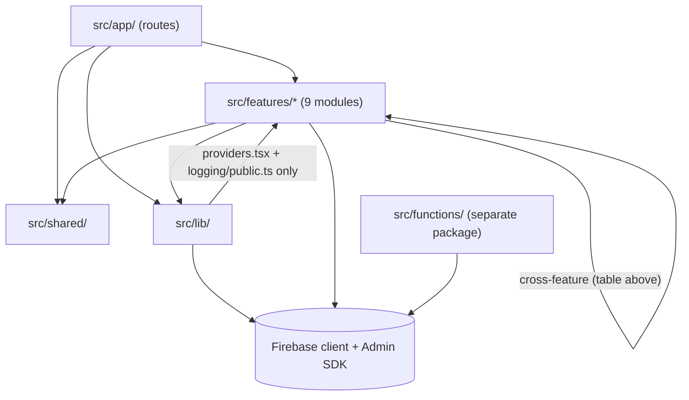
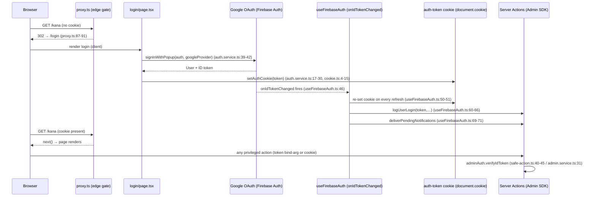
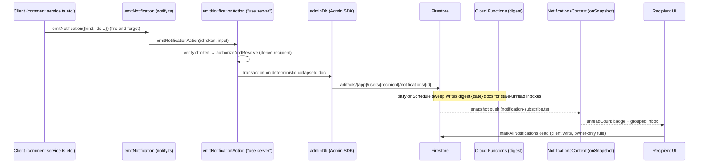

# 02 — Architecture Discovery

> **Phase 3 — Discovery only.** This document describes the architecture as it exists in the code. Every claim cites a file (line numbers where precision matters). "Observed" = read directly from code/config. "Inferred" = a conclusion drawn from observations, marked as such.
>
> Repo root: `/Users/yuh.nguyenpham/GitHub/japanese`. The Next.js project root is the `src/` subdirectory (`src/package.json`). All paths below are relative to the repo root unless absolute.

---

## 1. Architecture style as observed

Observed: the app is a **Next.js 16 App Router application** (`next: "16.2.3"`, `src/package.json:44`) organized as **thin route files + feature modules + a shared layer + an infrastructure layer**, backed almost entirely by **Firebase** (Auth, Firestore, Storage, AI Logic, Remote Config — `src/lib/firebase.ts`, `src/lib/firebase-admin.ts`), with a separately deployed **Cloud Functions package** (`src/functions/`, own `package.json`, own tsconfig — `src/functions/package.json:1-14`).

The four top-level code layers inside `src/`:

| Layer | Role as observed |
|---|---|
| `src/app/` | Route files only. Pages are explicitly written as "pure orchestrators" that render a feature root (e.g. `src/app/[locale]/(immersive)/flashcard/[id]/study/page.tsx:1-32`, `src/app/[locale]/(main)/kana/learn/page.tsx:1-8`). |
| `src/features/` | 9 feature modules (`admin`, `ai`, `command-palette`, `flashcard`, `game`, `home`, `kana`, `notifications`, `user`), each with some subset of `components/ hooks/ services/ actions/ domain/ types/ utils/` subfolders (directory listing, Section 2). |
| `src/shared/` | Cross-feature UI primitives, layout components, hooks, providers, schemas, utils, and the audio subsystem (`src/shared/`). |
| `src/lib/` | App-wide infrastructure: Firebase client + Admin SDK singletons, the Zustand app store, the provider tree, safe-action clients, feature flags, logging, analytics/observability wiring (`src/lib/`). |

Observed: data access is predominantly **client-side Firestore** (direct SDK reads/writes/subscriptions from browser code, guarded by `src/firestore.rules`), with **Server Actions** used for privileged writes that need the Admin SDK (cross-user notifications, system logs, admin operations) — see Sections 8 and 12. There are **no API route handlers** (`find src/app -name "route.ts"` returns nothing).

Inferred: the runtime shape is closer to a client-heavy SPA that happens to be hosted in the App Router — 16 of 29 `page.tsx` files are `"use client"` (Section 6), and the server-rendered data path exists only for the public shared-deck route, sitemap/robots, and metadata.

A stated convention matching this structure exists in `.rules/ai-rules/architecture.rule.md` (feature-based structure, "UI → Hook → Service → API" mandatory data flow, "No direct Firebase/API calls outside services", 200-line file cap). This is cited here **as a statement of convention, not proof of behavior**; Section 4 lists what is mechanically enforced vs. stated.

---

## 2. Folder organization

Observed top-level repo layout: `docs/` (ADRs + notes), `src/` (the Next.js app), `.rules/` (convention prompts). Inside `src/`:

```
src/
├── app/                    # App Router routes (see Section 6 for full inventory)
│   ├── [locale]/           #   locale segment (en unprefixed, ja prefixed — src/i18n/routing.ts)
│   │   ├── (main)/         #   route group: standard chrome + BottomNav
│   │   ├── (immersive)/    #   route group: full-screen study/game surfaces, no chrome
│   │   └── login/          #   public login (outside both groups)
│   ├── _components/        #   ErrorFallback, MaintenanceScreen, ReactScan
│   ├── global-error.tsx / not-found.tsx / robots.ts / sitemap.ts
├── features/
│   ├── admin/              # actions/ components/ context/ domain/ hooks/ services/ types/ utils/
│   ├── ai/                 # hooks/ prompts/ schemas/ services/ (Gemini via Firebase AI Logic)
│   ├── command-palette/    # components/ data/
│   ├── flashcard/          # actions/ components/ dashboard/ detail/ domain/ games/ hooks/ loaders/ services/ types/ utils/
│   ├── game/               # components/ domain/ hooks/ services/ (sessions, stats, leaderboard)
│   ├── home/               # components/ hooks/
│   ├── kana/               # actions/ chart/ components/ data/ hooks/ hub/ learn/ practice/ quiz/ types/ store.ts
│   ├── notifications/      # actions/ components/ context/ domain/ services/ types/ __tests__/
│   └── user/               # hooks/ services/ types/  (auth, progress, activity tracking)
├── shared/
│   ├── audio/              # single audio subsystem (manager, policy, sequencer, voice/) — see eslint rule, Section 4
│   ├── components/ui/      # design-system primitives; components/layout/ (ScreenHeader)
│   ├── hooks/ providers/ schemas/ constants/ utils/
├── lib/                    # firebase.ts, firebase-admin.ts, app-store.ts, providers.tsx, safe-action.ts,
│   │                       # flags.ts, posthog.ts, PostHogProvider.tsx, AudioProvider.tsx, FontSyncer.tsx,
│   │                       # fonts.ts, site.ts, app-id.ts, motionFeatures.ts, logging/
├── i18n/                   # next-intl routing.ts, navigation.ts, request.ts
├── messages/               # en.json, ja.json
├── functions/              # SEPARATE npm package — Cloud Functions 2nd gen (digest.ts, fanout.ts, index.ts)
├── e2e/                    # Playwright specs (auth.spec.ts, realtime.spec.ts, helpers/)
├── scripts/                # backfill-notifications.mjs
├── proxy.ts                # Next.js 16 `proxy` (middleware successor) — auth gate + i18n + PostHog reverse proxy
├── firestore.rules / firestore.indexes.json / storage.rules / firebase.json
├── instrumentation.ts / instrumentation-client.ts   # Sentry init (server / client)
└── next.config.ts / tsconfig.json / eslint.config.mjs / playwright.config.ts / vitest.*.config.ts
```

Observed: `src/functions/` is excluded from the app's TypeScript program (`src/tsconfig.json` `exclude: ["functions/**"]`) and from the app's eslint run (`src/eslint.config.mjs:17-21`), and is wired for deployment via `firebase.json` `functions.source: "functions"`.

---

## 3. Layer boundaries — what enforces or states them

### 3.1 Mechanically enforced (build/lint/runtime)

| Mechanism | What it does | Evidence |
|---|---|---|
| `server-only` package imports | 10 modules hard-fail if pulled into a client bundle: `lib/firebase-admin.ts`, `lib/safe-action.ts`, `lib/flags.ts`, `lib/logging/server.ts`, all 5 `features/admin/services/*.service.ts`, `features/flashcard/services/shared-preview.service.ts` | grep `import "server-only"` over `src/` (10 production files); e.g. `src/lib/firebase-admin.ts:1`, `src/features/flashcard/services/shared-preview.service.ts:18` |
| `"use server"` directive | 10 production modules are Server Action modules (full inventory in Section 12) | grep `^"use server"` (10 files, e.g. `src/features/notifications/actions/notification.actions.ts:1`) |
| `"use client"` directive | 244 production files (excluding `*.test.*`/`*.stories.*`): `app/` 29, `features/` 184, `shared/` 26, `lib/` 5 | grep `^"use client"` per directory |
| ESLint audio restriction | `no-restricted-globals` bans `Audio`, `AudioContext`, `webkitAudioContext`, `SpeechSynthesisUtterance` and `no-restricted-properties` bans `window.speechSynthesis` in `features/**`, `app/**`, `lib/**` — forcing all sound through `@/shared/audio` | `src/eslint.config.mjs:23-57` (the rule's comment cites `docs/adr/001-audio-architecture.md`) |
| ESLint `max-lines` | 200-line ceiling on all `.ts/.tsx`, as a **warning** ("~46 pre-existing files over the limit" per the config comment) | `src/eslint.config.mjs:59-67` |
| tsconfig path alias | Single alias `@/*` → `src/*`; no per-layer aliases | `src/tsconfig.json` `"paths": { "@/*": ["./*"] }` |
| `LazyMotion strict` | Runtime throw if a bare `motion.*` component renders instead of `m.*` (bundle-size guardrail) | `src/lib/providers.tsx:78-81` |

Observed: there are **no ESLint import-boundary rules** (no `no-restricted-imports` between `features/*`, no import plugin) in `src/eslint.config.mjs`. Cross-layer discipline beyond the table above is by convention.

### 3.2 Stated conventions (not mechanically enforced)

- `.rules/ai-rules/architecture.rule.md` — feature-based structure; layer responsibilities ("Components → UI only … Services → API/Firebase only"); mandatory `UI → Hook → Service → API` data flow; "No direct Firebase/API calls outside services"; "No file > 200 lines".
- `.rules/ai-rules/service.rule.md` — "All API/Firebase calls go here"; "FORBIDDEN: Calling Firebase in components/hooks".
- `docs/adr/002-data-layer-pattern.md` — the accepted data-layer convention: realtime data stays on bespoke `onSnapshot` hooks; one-shot reads may use the `@tanstack-query-firebase/react` bridge; composite loads use plain `@tanstack/react-query` `useQuery`.
- `docs/adr/001-audio-architecture.md` (referenced from the eslint config) and `docs/adr/003-feature-flags.md` (referenced from `src/lib/flags.ts:4-5`).

Observed deviation from the stated "no Firebase in hooks" convention: several hooks open Firestore listeners directly (e.g. `src/features/flashcard/hooks/useCardsWithProgress.ts:125-140` calls `onSnapshot` on a collection built by a service path helper). The convention/code relationship is documented here without evaluation.

---

## 4. Dependency flow between layers (verified by grep)

Grep-verified import directions (production files, `@/`-alias imports):

- `app/` → `features/` (39 files), `shared/`, `lib/`, `i18n/` — observed throughout Section 6's pages.
- `features/` → `shared/`, `lib/`, `i18n/` — pervasive; `features/` **never imports `@/app`** (grep: 0 hits).
- `shared/` → **neither `@/features` nor `@/lib`** (grep: 0 hits for both). `shared/` is a leaf layer.
- `lib/` → `features/` in exactly two places: `src/lib/providers.tsx:8-11` (mounts `AdminProvider`, `CommandPaletteLauncher`, `NotificationsProvider`, user hooks at the app shell) and `src/lib/logging/public.ts:1` (type-only import of admin log types).

Cross-feature imports (count of importing-file × imported-feature pairs, grep over `from "@/features/…"`):

| From → To | Count | From → To | Count |
|---|---|---|---|
| flashcard → game | 61 | home → user | 7 |
| flashcard → user | 20 | home → kana | 7 |
| flashcard → ai | 12 | home → game | 7 |
| home → flashcard | 11 | flashcard → notifications | 7 |
| kana → user | 10 | admin → flashcard | 6 |
| kana → game | 8 | user → notifications | 2 |
| user → game | 1 | notifications → flashcard | 1 |
| command-palette → admin | 1 | admin → notifications | 1 |



Observed: `shared/` importing nothing from `features/`/`lib/` while `lib/providers.tsx` reaches "up" into `features/` makes `lib/providers.tsx` the single composition point of the app shell.

---

## 5. Rendering flow

### 5.1 Route inventory and server/client split

29 `page.tsx` files, classified by presence of `"use client"` in the file head (verified per file):

- **Client pages (16):** all study/game pages under `(immersive)/flashcard/…` and `kana/survival`, plus `(main)/flashcard/*` (list/detail/create/edit), `(main)/kana`, `(main)/notifications`, `(main)/page.tsx` (home), `(main)/profile`, and `login/page.tsx`.
- **Server pages (13):** all 6 `admin/*` pages, `(main)/flashcard/shared/[shareId]`, `(main)/kana/chart`, `(main)/kana/learn`, `(main)/settings`, `(immersive)/kana/practice`, `(immersive)/kana/quiz`, `(main)/admin` root.

Observed: most server pages contain no data fetching — they render a client feature root (e.g. `src/app/[locale]/(main)/kana/learn/page.tsx:1-8` returns `<KanaLearn />`, which is `"use client"` at `src/features/kana/learn/components/KanaLearn.tsx:9`). Server pages that actually fetch on the server: `(main)/flashcard/shared/[shareId]/page.tsx` (Admin-SDK preview + `generateMetadata`, lines 32-100), `(main)/settings/page.tsx` (reads `getFlags()`, line 7), and the root `[locale]/layout.tsx` (flags + translations).

### 5.2 Route groups and layouts

- `app/[locale]/layout.tsx` — the root layout: validates locale (`44-49`), resolves Remote Config flags (`51`), renders `<MaintenanceScreen/>` or `<Providers>{children}</Providers>` (`58-62`), wraps everything in `NextIntlClientProvider`.
- `(main)/layout.tsx` — appends `<BottomNav/>` after children; deliberately does **not** remount `AdminProvider` (comment at `src/app/[locale]/(main)/layout.tsx:3-6`).
- `(immersive)/layout.tsx` — a pure passthrough (`return <>{children}</>`, `src/app/[locale]/(immersive)/layout.tsx:1-3`). Inferred purpose (from the routes placed in it — study, speed, match, quiz, practice, survival): full-screen surfaces without the bottom navigation.
- `(main)/admin/layout.tsx` — wraps children in `<AdminGuard>` + `<AdminSidebar>` (`src/app/[locale]/(main)/admin/layout.tsx:15-27`).

### 5.3 Static vs dynamic

- The **only** `generateStaticParams` in the repo is for locales: `src/app/[locale]/layout.tsx:35-37` (`routing.locales.map(...)`, locales `["en","ja"]` from `src/i18n/routing.ts:9-13`, `localePrefix: "as-needed"`).
- Dynamic segments: `[locale]`, `[id]` (own flashcard deck), `[shareId]` (shared deck). No `generateStaticParams` exists for `[id]`/`[shareId]` (grep), so these render on request.
- `generateMetadata` exists on the root layout, the 4 admin sub-pages (analytics/content/reports/settings), and the shared-deck page (grep results, Section on route files).
- Non-page route files: `app/sitemap.ts`, `app/robots.ts` (bypass i18n routing in `src/proxy.ts:74-76`), and `app/[locale]/(main)/flashcard/shared/[shareId]/opengraph-image.tsx`.

### 5.4 Client-side gates layered over rendering

Order observed in `src/lib/providers.tsx:69-98`: `LazyMotion` → `QueryClientProvider` → `AlertProvider` → (`FontSyncer`, `AudioProvider`, `PostHogProvider`) → `AuthGate` → `AdminProvider` → `NotificationsProvider` → children + `CommandPaletteLauncher`. `AuthGate` (`providers.tsx:26-47`) renders a splash until `isAuthReady`, except on public shared-deck routes (`PUBLIC_ROUTE_PATTERNS`, `providers.tsx:24`), which the comment says mirrors `proxy.ts`'s allowlist so crawlers get server-rendered content.

The shared-deck page streams: the server component starts an un-awaited Admin-SDK preview Promise and passes it to the client component, which unwraps it with `use()` under `<Suspense>` (`src/app/[locale]/(main)/flashcard/shared/[shareId]/page.tsx:87-100`).

---

## 6. Authentication flow (end-to-end)

Observed chain, with citations at each hop:

1. **Route gate** — `src/proxy.ts` exports `proxy()` (Next.js 16 convention replacing `middleware`, per its own doc comment at lines 43-59). It reads the `auth-token` cookie (`COOKIE_NAME`, `src/shared/utils/cookie.ts:1`) at `proxy.ts:81`; unauthenticated requests to non-public paths redirect to `/login` (`87-91`); authenticated requests to `/login` redirect home (`93-97`). Public paths: `/login`, `/sitemap.xml`, `/robots.txt` (`proxy.ts:9`) plus the shared-deck landing pattern (`proxy.ts:18`). The matcher excludes static assets (`102-113`). **The proxy checks cookie presence only — no token verification happens here** (no Admin SDK import in `proxy.ts`; the Edge-incompatibility is not stated in code — Inferred: verification is deferred to Server Actions).
2. **Login page** — `src/app/[locale]/login/page.tsx` (client). Button → `signInWithGoogle()` (`41-45`); popup-blocked errors fall back to `signInWithGoogleRedirect()` (`52-62`, codes at `105-109`); a mount effect completes redirect sign-ins via `completeGoogleRedirectSignIn()` (`21-39`).
3. **Google OAuth** — `src/features/user/services/auth.service.ts`: `signInWithPopup(auth, googleProvider)` (`39-42`), `signInWithRedirect` (`44-46`), `getRedirectResult` (`48-52`). `googleProvider` is a `GoogleAuthProvider` from `src/lib/firebase.ts:29`.
4. **Cookie persistence** — `persistSignedInUser()` (`auth.service.ts:17-30`): `user.getIdToken()` → `setAuthCookie(token)`. The cookie (`src/shared/utils/cookie.ts:4-15`): 7-day `max-age`, `SameSite=Lax`, `Secure` only on HTTPS, **intentionally not `httpOnly`** ("the Firebase client SDK refreshes this token (see proxy.ts)" — comment in `cookie.ts:5-6`; same statement in `proxy.ts:48`).
5. **Ongoing sync** — `useFirebaseAuth()` (mounted once in `Providers`, `src/lib/providers.tsx:51`) sets `browserLocalPersistence` (`useFirebaseAuth.ts:42-44`) and subscribes `onIdTokenChanged` (`46`): on every sign-in **and** hourly token refresh it re-sets the cookie (`50-51`), stores the user in Zustand (`55`), fires the deduplicated login-log Server Action `logUserLogin` (`60-66`, dedup described in the file's doc block `20-36`), and delivers pending email-keyed notifications (`69-71`). On sign-out it clears the cookie and user (`73-76`), then flips `isAuthReady` (`77`).
6. **Server-side verification** — two families, both via `firebase-admin` (`adminAuth.verifyIdToken`):
   - **Token-as-bind-arg**: `actionClient` + `verifyIdToken()` in `src/lib/safe-action.ts:33-45`; used by notification emission and activity logging (doc comment `13-27`).
   - **Cookie-session**: `adminActionClient` middleware reads the `auth-token` cookie via `next/headers` `cookies()` and enforces a per-action permission (`src/features/admin/services/admin.service.ts:51-85`).
7. **Sign-out** — `signOut()` (`auth.service.ts:59-72`): logs the logout server-side, `clearAuthCookie()`, `firebaseSignOut(auth)`.
8. **E2E bypass** — emulator-only `window.__e2eSignIn` custom-token bridge, double-gated on `NEXT_PUBLIC_USE_FIREBASE_EMULATOR==="true"` and non-production `NODE_ENV` (`src/lib/firebase.ts:41-65`).



---

## 7. Permission flow

### 7.1 Admin RBAC (system-level)

- **Role source** — `getCallerContext()` (`src/features/admin/services/admin.service.ts:30-38`): verifies the ID token, then resolves the role from **custom claims** (`decoded.superadmin` / `decoded.admin`) **falling back to a Firestore `admins/{uid}` doc** (`getFirestoreRole`, `25-28`, normalized by `normalizeAdminRole`, `src/features/admin/utils/rbac.ts:45-47`). No role → `FORBIDDEN` throw.
- **Permission matrix** — `ROLE_PERMISSIONS` (`src/features/admin/utils/rbac.ts:14-36`): two roles (`superadmin`, `admin`) × 8 permissions (`canViewDashboard`, `canViewAnalytics`, `canViewReports`, `canManageUsers`, `canDeleteUsers`, `canPromoteUsers`, `canManageContent`, `canChangeSettings`). `admin` lacks `canDeleteUsers`, `canPromoteUsers`, `canChangeSettings`.
- **Enforcement point** — every admin Server Action runs through `adminActionClient` whose middleware calls `assertAdminAction(metadata.permission)` before the body (`admin.service.ts:65-85`; the actions file states "no action here calls verifyIdToken or checks a permission by hand", `src/features/admin/actions/admin.actions.ts:40-49`).
- **Client-side UI gates** — `AdminProvider` (mounted once at the shell, `src/lib/providers.tsx:88`) resolves the role via `fetchAdminRoleAction` (`src/features/admin/hooks/useAdminRoleCheck.ts`); `AdminGuard` renders access-denied for non-admins around all `/admin` routes (`src/features/admin/components/shared/AdminGuard.tsx:24-48`); `BottomNav` includes the admin item only when a role exists (`src/app/[locale]/(main)/_components/BottomNav.tsx:111-116`).
- **Rules-level** — `isSystemAdmin()` in `src/firestore.rules:16-22` (custom claims OR existence of `admins/{uid}`) gates `system_logs` reads (`199-202`, client writes always denied); `admins/{uid}` is self-read-only, never client-writable (`194-197`).

### 7.2 Flashcard-level RBAC (deck sharing)

- **Single resolution engine** — `resolveRole()` (`src/features/flashcard/utils/rbac.ts:97-133`), documented in the module header as "the single source of truth for all permission decisions" with a full role/action matrix (`1-38`). Priority: owner → explicit `roles[uid]` → pending email invite → public link (hard-capped at `commenter`, `126-131`) → `none`. Predicates: `canView`/`canComment`/`canEdit` (`138-150`); write-time sanitizer `sanitizePublicRole` strips `editor` from public roles (`159-162`).
- **Rules-level mirror** — `src/firestore.rules`: lessons readable if public / owner / any role (`68-70`); update only owner or `editor` (`75-76`); delete owner-only (`78`); cards readable via parent-lesson access (`98-100`), writable only owner/editor (`103-104`); comments creatable by `owner|editor|commenter` (`86-87`); a collection-group read rule for shared-deck discovery (`208-215`).
- **Invite conversion** — pending email invites become `roles[uid]` entries on login via `syncInviteToCollaborator` (`src/features/flashcard/services/access.service.ts:34-82`).

### 7.3 Notification permissions

- Client may create **only in its own inbox** (`allow create: if isOwner(userId)`, `src/firestore.rules:117` with rationale comment `110-116`); updates are owner-only and immutable-field-guarded (`121`, helper `50-55`); no hard delete (`123`). Cross-user creation happens exclusively server-side via the Admin SDK (Section 9). Pending email-keyed invites: readable/deletable by the matching email, creatable by a signed-in sender who cannot forge `senderId` (`179-189`).

---

## 8. Error handling flow

- **Boundary files** — `app/[locale]/(main)/error.tsx`, `app/[locale]/(immersive)/error.tsx`, `app/[locale]/login/error.tsx` (per-segment), `app/global-error.tsx` (replaces the root layout, renders its own `<html>/<body>` — `global-error.tsx:13-17`), `app/[locale]/not-found.tsx`. Segment boundaries log to console and `Sentry.captureException` in an effect (`(main)/error.tsx:19-22`; same pattern in `global-error.tsx:25-28`).
- **Shared fallback** — all boundaries render `src/app/_components/ErrorFallback.tsx`, deliberately built with plain `<a>`/`<button>` and prop-passed copy so it renders with no providers/router/i18n context (its own rationale comments, `ErrorFallback.tsx:12-24`).
- **Sentry wiring** — server/edge init in `src/instrumentation.ts` (prod + `SENTRY_DSN` gated, `10-14`); client init in `src/instrumentation-client.ts` (prod + `NEXT_PUBLIC_SENTRY_DSN` gated, `8-10`); build wrapped in `withSentryConfig` with source-map upload disabled without `SENTRY_AUTH_TOKEN` (`src/next.config.ts:24-31`).
- **Service-layer conventions (observed patterns):**
  - *Fire-and-forget with swallowed errors* for anything secondary to the user's primary action: notification emit (`src/features/notifications/services/notify.ts:20-26`), activity logs (`Promise<void>`, "errors always swallowed" — `src/features/notifications/actions/activity-log.actions.ts:19-24`), daily-stat increments (`progress.service.ts:288-298`), login logging (`useFirebaseAuth.ts:60-66` `.catch(() => {})`).
  - *Fail-open defaults*: `getDailyProgress` returns safe zeros on error (`progress.service.ts:274-278`); `getFlags` falls back to `DEFAULT_FLAGS` (`src/lib/flags.ts:77-88`).
  - *Typed error mapping* for user-facing failures: comment operations throw `CommentError` via `mapFirestoreCommentError` (`src/features/flashcard/services/comment.service.ts:86-92`, `src/features/flashcard/services/comment-errors.ts`).
  - *Retry with backoff* on the notifications listener: fallback query + capped exponential backoff 1s→60s (`src/features/notifications/services/notification-subscribe.ts:24-71`).
  - *Server Action boundary*: both safe-action clients convert thrown errors to `serverError` strings (`src/lib/safe-action.ts:33-37`, `admin.service.ts:79-81`); `toActionResult` adapts to the repo-wide `{ok,data}|{ok,error}` shape (`safe-action.ts:52-60`).
- **User surfacing** — `AlertProvider` (`src/shared/providers/AlertProvider.tsx`) exposes `showAlert(type, message, options)` rendering the app's `Alert` through sonner's `toast.custom` with per-severity durations (success/info 4s, warning 6s, error 8s — `ALERT_DURATIONS`) and a `<Toaster>` capped at 3 visible toasts. 7 production files consume `useAlert` (grep). Example with an Undo action: clear-all notifications (`src/app/[locale]/(main)/notifications/page.tsx:71-89`).

---

## 9. Notification flow

### 9.1 Emit path (client → Server Action → Admin SDK)

1. A producer calls `emitNotification(input)` — the single client facade (`src/features/notifications/services/notify.ts:19-27`): fetch fresh ID token, call the Server Action, swallow all errors. Producers observed: comment/reply/resolve (`src/features/flashcard/services/comment.service.ts:78,141,179`), share-modal role changes (`ShareModal.tsx:252,268`), invite acceptance (`access.service.ts:80`).
2. `emitNotificationAction` (`src/features/notifications/actions/notification.actions.ts:99-114`) wraps a next-safe-action pipeline (`66-97`): token verified (`verifyIdToken`, hop into `src/lib/safe-action.ts:40-45`), input validated by `emitNotificationInputSchema`, sender **authorized** against the lesson's roles and recipient **derived server-side** per kind (`authorizeAndResolve`, `123-162` — the client never supplies a recipient).
3. `writeNotification` (`196-252`) writes via `adminDb` in a transaction to a **deterministic collapse-ID doc** (`collapseId`, `domain/id.ts`): first write sets `createdAt`; repeats fold actors and bump `count`, re-surfacing as unread. Admin SDK bypasses Firestore rules (stated in the file header, `5-7`).
4. Admin-initiated system events use `notifySystemEvent` (server-to-server, no client token, `170-189`).
5. **Pre-signup invites** are the one client-written cross-user path: email-keyed docs under `pendingNotifications/{email}/items` (`src/features/notifications/services/notification-pending.ts:26-37`), delivered into the user's own inbox on login by `deliverPendingNotifications` (`55-77`, chunked batches, deterministic destination IDs; triggered from `useFirebaseAuth.ts:69-71`) — permitted because rules allow owner-self inbox creates (`firestore.rules:117`).

### 9.2 Receive path (subscription → UI)

1. `NotificationsProvider` (mounted once at the shell, `src/lib/providers.tsx:89`) opens **one** app-lifetime listener per user via `subscribeNotifications` (`src/features/notifications/context/NotificationsContext.tsx:136-151`).
2. `subscribeNotifications` (`src/features/notifications/services/notification-subscribe.ts:46-126`): composite-index query (`isDeleted != true` + `createdAt desc`, `93-100`) with a plain-query fallback and backoff retries; pagination grows the live window (`limit(limitCount)`), never a separate page cache (rationale `39-44`).
3. Consumers read the shared context: `BottomNav` badge (`BottomNav.tsx:111-116`), `NotificationsPage` groups/filters (`src/app/[locale]/(main)/notifications/page.tsx:31-41`).
4. Read-state mutations are **client-side own-inbox writes**: `markNotificationRead`/`markAllNotificationsRead`/soft-delete/restore (`src/features/notifications/services/notification.service.ts:48-160`), permitted by the owner-only update rule (`firestore.rules:121`); each fires a fire-and-forget log action (`notifications/page.tsx:60-68`).

### 9.3 Cloud Functions involvement

`src/functions/src/index.ts` deploys three functions:

- `dailyNotificationDigest` — `onSchedule` sweep (`digest.ts:153`) that finds notifications unread ≥24h (`STALE_AFTER_MS`, `digest.ts:24`) and writes one `digest:{YYYY-MM-DD}` summary doc per recipient per UTC day into the same collection/schema, so the existing inbox UI renders it unchanged (file header `1-14`; idempotent deterministic ID, `62-75`).
- `fanOutNotifications` — an admin-only `onCall` (`fanout.ts:136-160`; requires auth + `admins/{uid}` role) that enqueues per-recipient Cloud Tasks, capped at 500 recipients.
- `deliverNotificationTask` — the `onTaskDispatched` consumer (`fanout.ts:92-99`, 5 retries) writing one deterministic-ID doc per recipient (`deliverOneNotification`, `55-90`). The file header states **no current product action triggers the fan-out path** (`fanout.ts:6-15`).



---

## 10. Form flow

- **Form library**: `react-hook-form` (^7.81.0) with `@hookform/resolvers` zod resolvers (`src/package.json:12,36`). Verified usage sites (production): `useLessonBuilder` (`useForm` + `zodResolver(lessonMetadataSchema)`, `src/features/flashcard/hooks/useLessonBuilder.ts:60-61`) consumed by `LessonBuilderMeta.tsx`, and `useShareInvites` (`zodResolver(shareInviteSchema)`, `src/features/flashcard/hooks/useShareInvites.ts:30-31`) consumed by `ShareCollaboratorsPanel.tsx`. Schemas live in `src/shared/schemas/lesson.schema.ts`.
- **Everything else observed** uses controlled `useState` inputs rather than a form library — e.g. the login page's loading/error state (`login/page.tsx:18-19`), the notifications filter (`notifications/page.tsx:43`), settings toggles bound directly to the Zustand store (`SettingsPageClient.tsx`).
- Validation outside forms is zod-at-the-boundary: every next-safe-action input schema (Sections 9, 12) and `systemLogInputSchema` for logs (`src/lib/logging/server.ts:30`).

---

## 11. API flow

### 11.1 Surface inventory

- **Route handlers**: none (`find src/app -name route.ts` → empty). `robots.ts`/`sitemap.ts`/`opengraph-image.tsx` are the only non-page route files.
- **Server Action modules** (all 10 production `"use server"` files):

| Module | Actions (exported) | Auth style |
|---|---|---|
| `features/admin/actions/admin.actions.ts` | 20 actions (`fetchUsersAction`, `fetchAdminStatsAction`, `setAdminRoleAction`, `deleteUserAction`, `fetchAnalyticsAction`, `fetchLogsAction`, `createTestLogAction`, `fetchDashboardOverviewAction`, `fetchDeckCardsAction`, `fetchGlobalContentAction`, `deleteGlobalFlashcardAction`, `fetchAdminRoleAction`, 4 drilldown fetches, 4 dataset exports) | cookie session via `adminActionClient` + per-action `.metadata({permission})` |
| `features/notifications/actions/notification.actions.ts` | `emitNotificationAction`, `notifySystemEvent` (server-to-server) | ID-token bind arg |
| `features/notifications/actions/activity-log.actions.ts` | 5 log actions (read/deleted/read-all/cleared/delivered) | ID-token bind arg |
| `features/flashcard/actions/activity-log.actions.ts` | 7 log actions (deck CRUD, study/game completions) | ID-token bind arg |
| `features/flashcard/actions/access.actions.ts` | `declineInviteAction` | ID-token bind arg |
| `features/kana/actions/activity-log.actions.ts` | `logKanaQuizCompleted`, `logKanaSurvivalCompleted` | ID-token bind arg |
| `features/user/services/auth-logging.service.ts` | `logUserLogin`, `logUserLogout` (server-side session dedup) | ID token param |
| `lib/logging/actions.ts` | `appendClientLogAction` | ID token param |
| `lib/logging/user-actions.ts` | `persistUserLog`, `logUserActionServer` (verifies token, rejects userId spoofing — `user-actions.ts:31-35`) | ID token param |
| `lib/logging/activity.ts` | `logActivity` (shared scaffolding for the per-feature log actions) | delegated |

- **Deployed callable**: `fanOutNotifications` (`functions/src/fanout.ts:136`) — reachable but not invoked by any app code path (its own header, `fanout.ts:6-15`).
- **Reverse proxy**: `/ingest/*` → PostHog hosts, rewritten in `proxy.ts:63-72` (first-party analytics ingestion; client configured with `api_host: "/ingest"` in `src/lib/posthog.ts`).

### 11.2 How clients invoke actions

Three observed invocation styles:

1. **Via React Query hooks** (admin feature): `useQuery`/`useMutation` wrap the action and unwrap `{ok,data}` (e.g. `src/features/admin/hooks/useUsers.ts:20-47`, with `refetchInterval: 30000`).
2. **Via a client service facade**: `notify.ts` for notifications (Section 9.1); `enqueueClientLog` for logs (`src/lib/logging/browser.ts:12-21`).
3. **Direct fire-and-forget from hooks/components**, passing a fresh token: `void logStudySessionCompleted(token, …)` (`useStudySession.ts:113-118`), the `withFreshToken` helper (`src/features/notifications/components/withFreshToken.ts`).

The dual safe-action-client design (token-bind-arg `actionClient` vs cookie-session `adminActionClient`) is documented in `src/lib/safe-action.ts:14-31`.

---

## 12. State flow

### 12.1 Zustand stores (3 `create()` calls in production code)

1. **`useAppStore`** (`src/lib/app-store.ts:35-70`) — the app-wide store. Exact contents: `user: User | null`, `isAuthReady: boolean`, `useHandwriting: boolean`, `globalAutoPlay: boolean`, `sfxMuted: boolean`, `voiceMuted: boolean`, `sfxVolume: number (0–1)`, `voiceVolume: number (0–1)`, plus their setters/togglers. Persisted to localStorage key `app-settings` with a `partialize` that **excludes auth state** (`55-68`).
2. **`useKanaStore`** (`src/features/kana/store.ts:11-22`) — `alphabet: "hiragana" | …`, persisted as `kana-ui-state`.
3. **`useMatchGameStore`** (`src/features/flashcard/hooks/useMatchGameStore.ts:30-…`) — ephemeral match-game grid state (grid, selections, matched pairs, shake animation), not persisted.

### 12.2 React Query

One `QueryClient`, created in `Providers` with defaults `staleTime: 30_000`, `refetchOnWindowFocus: false`, `retry: 1` (queries and mutations) — `src/lib/providers.tsx:53-67`. Production usage sites (grep): 6 admin hooks (`useAdminDashboard`, `useAnalytics`, `useLogs`, `useUsers`, `useAnalyticsDrilldown`, `useGlobalContent`), `useFlashcardLoader` (shared-deck one-shot load, `staleTime: Infinity`, `useFlashcardLoader.ts:81-93`), `KanaStrokeAnimation`, plus the `@tanstack-query-firebase/react` bridge in `useEditableLesson` for one-shot cross-user deck reads (`useEditableLesson.ts:18,43-47`). Query keys for admin are centralized in `src/features/admin/utils/queryKeys.ts`. The realtime-vs-one-shot division is the stated convention of `docs/adr/002-data-layer-pattern.md`.

### 12.3 React contexts (3 `createContext` in production code)

- `AdminContext` — `{role, isLoading}` resolved once app-wide (`src/features/admin/context/AdminContext.tsx`).
- `NotificationsContext` — the single notifications listener + derived `groups`/`unreadCount` (`src/features/notifications/context/NotificationsContext.tsx`).
- `AlertContext` — `showAlert` (`src/shared/providers/AlertProvider.tsx`).

### 12.4 Realtime subscriptions and local state

13 production files call `onSnapshot` (grep): flashcard (`useCardsWithProgress`, `useDeckProgressStatus`, `useEditableLesson`, `useLessons`, `card.service`, `comment.service`, `lesson-subscriptions`), game (`useLeaderboard`, `leaderboard.service`, `stats.service`), notifications (context + `notification-subscribe`), user (`user.service`). The dominant hook shape is `useState` + subscribe-in-`useEffect` + render-time reset on identity change (e.g. `useCardsWithProgress.ts:64-71`, `NotificationsContext.tsx:113-117`, `useLessons.ts:47-51` — each with a comment citing React's "reset state when a prop changes" pattern). Everything else is plain component `useState`/`useTransition` (e.g. `notifications/page.tsx:44-46`).

---

## 13. Configuration flow

### 13.1 Environment variables (every production `process.env.*` reference, grep-verified)

| Variable | Consumer(s) |
|---|---|
| `NEXT_PUBLIC_FIREBASE_API_KEY`, `_AUTH_DOMAIN`, `_PROJECT_ID`, `_STORAGE_BUCKET`, `_MESSAGING_SENDER_ID`, `_APP_ID` | `src/lib/firebase.ts:15-20` (client SDK config) |
| `NEXT_PUBLIC_APP_ID` | `src/lib/app-id.ts:1` (Firestore namespace, default `kana-nihongo-master`) |
| `NEXT_PUBLIC_USE_FIREBASE_EMULATOR` | `src/lib/firebase.ts:43` (emulator wiring, double-gated with `NODE_ENV`) |
| `NEXT_PUBLIC_AI_MODEL_CARD`, `_MODEL_DECK`, `_TEMPERATURE`, `_TOP_P`, `_MAX_OUTPUT_TOKENS`, `_MIN_DECK_CARDS`, `_MAX_DECK_CARDS` | `src/features/ai/config.ts:9-20` (Gemini model + generation params, defaults inline) |
| `NEXT_PUBLIC_SENTRY_DSN` | `src/instrumentation-client.ts:8` |
| `SENTRY_DSN`, `NEXT_RUNTIME` | `src/instrumentation.ts:10-14` (server/edge Sentry) |
| `SENTRY_AUTH_TOKEN` | `src/next.config.ts:30` (source-map upload gate) |
| `NEXT_PUBLIC_POSTHOG_KEY`, `NEXT_PUBLIC_POSTHOG_UI_HOST` | `src/lib/posthog.ts:17-22`, `src/lib/PostHogProvider.tsx:17` (prod-only init) |
| `NEXT_PUBLIC_SITE_URL` | `src/lib/site.ts:5` (metadata base, sitemap) |
| `FIREBASE_ADMIN_PROJECT_ID`, `_CLIENT_EMAIL`, `_PRIVATE_KEY` | `src/lib/firebase-admin.ts:43-45` (Admin SDK service account, lazy init) |
| `FIRESTORE_EMULATOR_HOST`, `GCLOUD_PROJECT` | `src/lib/firebase-admin.ts:30-39` (emulator-mode Admin init) |
| `NODE_ENV` | dev/prod gates in `login/page.tsx:30,49`, `ReactScan.tsx:7`, `firebase.ts:44`, `posthog.ts:15`, `PostHogProvider.tsx:17`, `instrumentation*.ts`, `admin.actions.ts:147` |

Observed: the Admin SDK initializes **lazily on first property access** via a Proxy so builds run credential-free (`src/lib/firebase-admin.ts:13-27,60-76`).

### 13.2 Remote Config feature flags

`src/lib/flags.ts` (server-only) resolves flags from **Firebase Remote Config server templates** with a 60s template cache and default-safe fallbacks (`DEFAULT_FLAGS`, `20-23`; TTL `32`; stale-template fallback on outage `60-63`). Two flags exist and both are wired:

- `maintenance_mode` → resolved in the root layout and swaps the entire tree for `<MaintenanceScreen/>` (`src/app/[locale]/layout.tsx:51-62`).
- `locale_switch_enabled` → resolved in the settings server page and passed as a prop that shows/hides the locale switch UI (`src/app/[locale]/(main)/settings/page.tsx:7`, `SettingsPageClient.tsx:21-25,71`).

The choice of Remote Config over PostHog flags is recorded in `docs/adr/003-feature-flags.md` (referenced from `flags.ts:4-5`).

---

## 14. Open uncertainties

- **Why the proxy never verifies tokens** is not stated in code; only cookie presence is checked (`proxy.ts:81-91`). Inferred (unverified): verification is intentionally deferred to Server Actions/Admin SDK.
- The `(immersive)` group's purpose is inferred from its member routes and empty layout; no comment names it.
- `fanOutNotifications`/`deliverNotificationTask` are deployed but unreferenced by app code — stated as intentional in `fanout.ts:6-15`; whether they are invoked operationally (e.g. manually) is not observable from the repo.
- `firestore-rules.test.ts` at `src/` root and `*.emu.test.ts` files exercise the rules against emulators; test behavior was not re-verified here beyond their existence.
