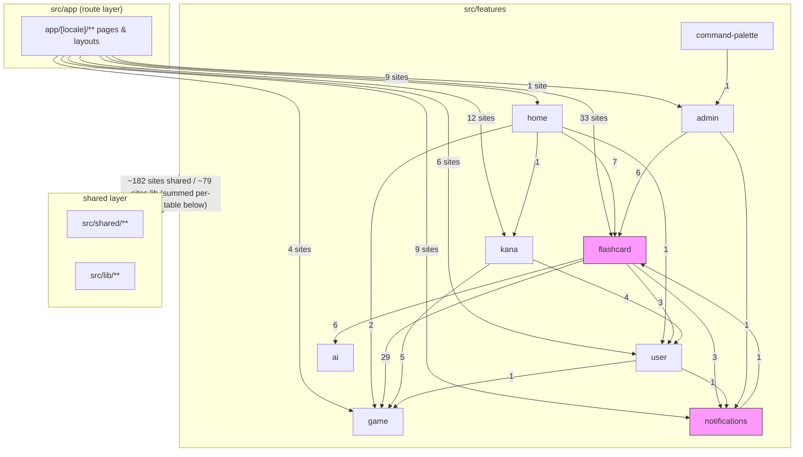
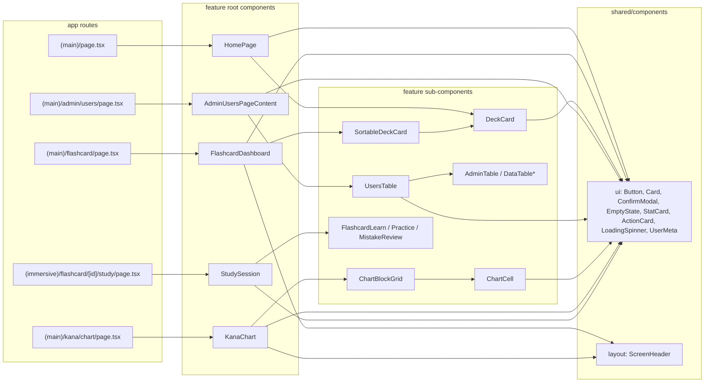
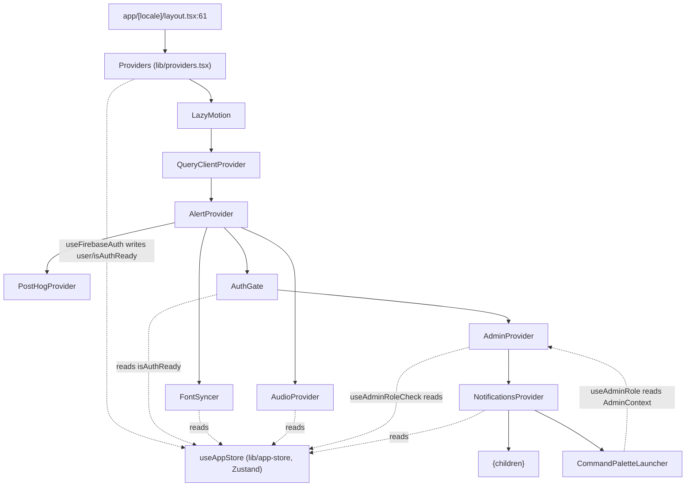
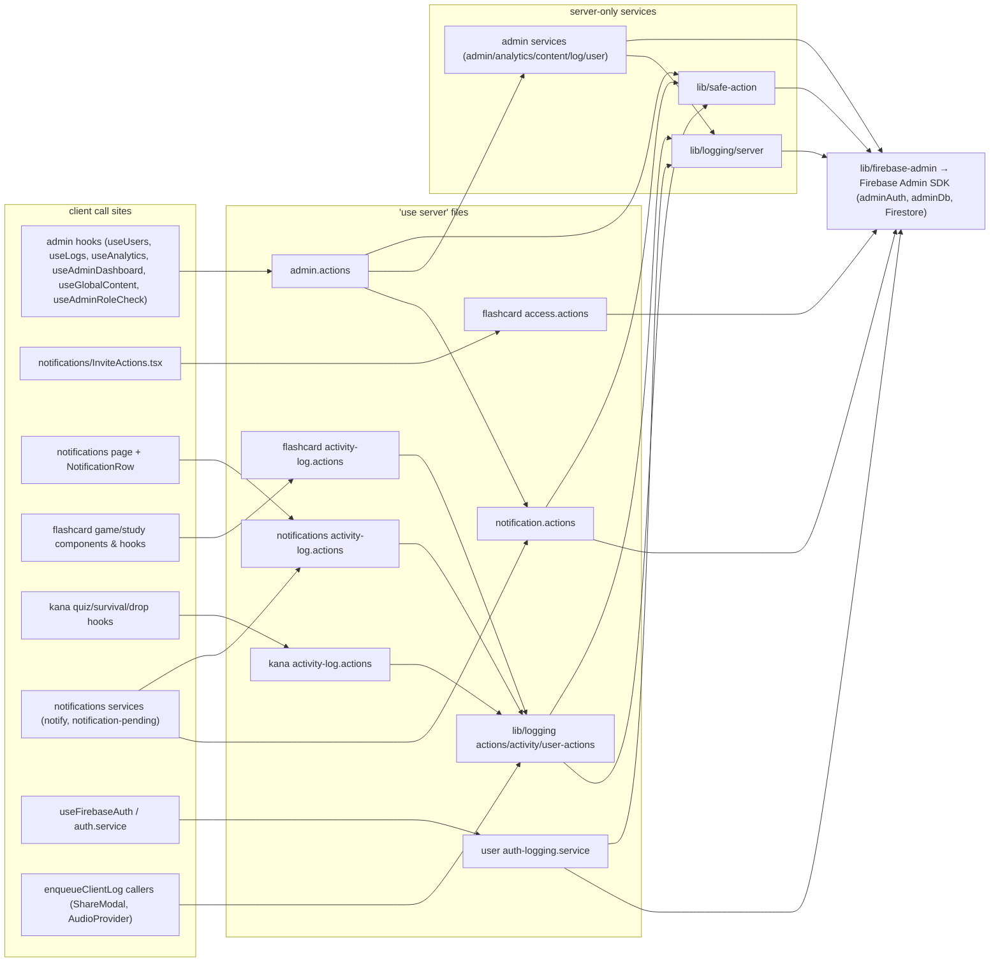

# 08 — Dependency Graph (Phase 6)

Discovery-phase documentation of module dependencies in this repository. The Next.js project root is `src/`; the `@/` path alias resolves to `src/` (per `src/tsconfig.json` convention used by every import below).

**Method.** Every edge in this document was derived from actual `import` statements found via `grep` over `src/features`, `src/app`, `src/lib`, and `src/shared` (`*.ts` / `*.tsx`, excluding `*.test.*`, `*.emu.test.*`, `__tests__/`, `.next/`, `node_modules/`). Counts labelled "sites" are matching import lines; counts labelled "files" are distinct importing files.

**Method limits (apply to all six graphs).**
- Static string grep only: dynamic `import()` expressions with computed paths, and edges hidden behind barrel re-exports (`index.ts` `export * from …`), are attributed to the barrel, not the underlying file, unless stated.
- Type-only imports (`import type`) are counted as edges; they are flagged where they are load-bearing for a cycle.
- One dynamic import was observed and is included where relevant: `lib/providers.tsx:79` lazily imports `@/lib/motionFeatures`.

Legend used throughout: **Observed** = read directly from an import statement or file body; **Inferred** = derived from observed facts (e.g. "X is inside Y's JSX tree, therefore X can read Y's context") and marked as such.

---

## 1. Feature dependency graph

Derived by running `grep -rn 'from "@/features/'` inside each directory under `src/features/` and keeping only edges whose importing feature differs from the imported feature. Relative intra-feature imports are invisible to this grep by construction, but they would be self-edges and are out of scope here.



(`flashcard` and `notifications` are highlighted because they form the one observed feature-level cycle; see §1.4.)

### 1.1 Evidence: cross-feature edges (features → features)

Counts are import sites (lines), test files excluded. "Example importing files" lists every file for small edges and a representative subset for the largest edge.

| Edge | Sites | Importing file(s) → imported module |
|---|---|---|
| flashcard → game | 29 | `features/flashcard/dashboard/hooks/useDashboardState.ts` → `@/features/game/services` (2); `features/flashcard/dashboard/types.ts` → `@/features/game/services` (type); `features/flashcard/dashboard/components/DeckCard.tsx` → `@/features/game/components`; `features/flashcard/components/StudySummaryScreen.tsx` → `@/features/game/components` (2); `features/flashcard/hooks/useFlashcardGameBestScore.ts` → `@/features/game/services`; `features/flashcard/games/hooks/useGameCompletionLogger.ts` → `@/features/game/domain`; match game: `MatchGame.tsx`, `MatchPlaying.tsx`, `MatchIntro.tsx` (2), `MatchResults.tsx` (2), `config.ts`, `useMatchModeSession.ts` (2) → `@/features/game/{domain,components,hooks,services}`; speed game: `SpeedGame.tsx`, `SpeedPlaying.tsx`, `SpeedIntro.tsx` (2), `SpeedResults.tsx` (2), `useGameEngine.ts` (2), `useSpeedModeSession.ts`, `engine/core/ScoringEngine.ts`, `engine/speedRules.ts` → `@/features/game/{domain,components,hooks,services}`; study: `StudyModeSelector.tsx` → `@/features/game/components` |
| home → flashcard | 7 | `features/home/components/HomePage.tsx` → `@/features/flashcard/components/ShareModal`, `@/features/flashcard/dashboard/components/DeckCard`, `@/features/flashcard/games/match/config`, `@/features/flashcard/games/speed/config` (4); `features/home/hooks/useHomeState.ts` (3) |
| flashcard → ai | 6 | `features/flashcard/components/AIBulkPanel.tsx` → `@/features/ai/hooks/useAIDeck`, `@/features/ai/types` (2); `LessonBuilderImportPane.tsx` → `@/features/ai/hooks/useAIImageDeck`; `FlashcardMistakeReview.tsx` → `@/features/ai/hooks/useAIExplanation`; `hooks/useLessonBuilder.ts` → `@/features/ai/hooks/useAICard`; `games/match/hooks/useMatchModeSession.ts` → `@/features/ai/services/gemini.service` |
| admin → flashcard | 6 | `features/admin/services/content.service.ts` → `@/features/flashcard/types` (2, one type-only); `components/content/DeckMobileRow.tsx`, `components/content/DeckDetailsPanel.tsx` (type), `components/content/DeckCardItem.tsx` (type), `hooks/useDecksTableColumns.tsx` → `@/features/flashcard/types` |
| kana → game | 5 | `features/kana/hooks/useKanaQuizSession.ts` (2), `quiz/components/QuizPlaying.tsx`, `hooks/useSurvivalGame.ts`, `hooks/useDropMode.ts` → `@/features/game/*` |
| kana → user | 4 | `features/kana/learn/components/KanaLearn.tsx`, `hub/hooks/useKanaHubState.ts`, `hooks/useKanaQuizSession.ts`, `chart/components/KanaChart.tsx` → `@/features/user/hooks` |
| flashcard → user | 3 | `features/flashcard/games/study/hooks/useStudySession.ts`, `games/speed/components/SpeedGame.tsx`, `games/match/components/MatchGame.tsx` → `@/features/user/hooks` (`useUserProgress`) |
| flashcard → notifications | 3 | `features/flashcard/components/ShareModal.tsx:12`, `services/comment.service.ts:29`, `services/access.service.ts:11` → `@/features/notifications/services` |
| home → game | 2 | `features/home/hooks/useHomeState.ts:15` → `subscribeGameStats`; `:20` → type `GameStatEntry`, both from `@/features/game/services` |
| user → notifications | 1 | `features/user/hooks/useFirebaseAuth.ts:7` → `deliverPendingNotifications` from `@/features/notifications/services` |
| user → game | 1 | `features/user/hooks/useBestScores.ts:5` → `submitScore, subscribePersonalBests` from `@/features/game/services` |
| notifications → flashcard | 1 | `features/notifications/components/InviteActions.tsx:8` → `declineInviteAction` from `@/features/flashcard/actions/access.actions` |
| home → user | 1 | `features/home/hooks/useHomeState.ts:17` → `useUserProgress` from `@/features/user/hooks` |
| home → kana | 1 | `features/home/hooks/useHomeState.ts:16` → `HIRAGANA_DATA, KATAKANA_DATA` from `@/features/kana/data` |
| command-palette → admin | 1 | `features/command-palette/components/CommandPalette.tsx:10` → `useAdminRole` from `@/features/admin/context/AdminContext` |
| admin → notifications | 1 | `features/admin/actions/admin.actions.ts:7` → `notifySystemEvent` from `@/features/notifications/actions/notification.actions` |

Observed non-importers: `features/ai` and `features/game` import **no** other feature (the grep found zero `from "@/features/` lines in `features/ai` or `features/game` targeting another feature). `features/command-palette` imports only `admin` (1 site).

### 1.2 Evidence: app → features

`grep -rn 'from "@/features/' app` (tests excluded) — 74 sites in 37 files (per-file list observed; full list omitted for size, representative files shown).

| Edge | Sites | Representative importing files |
|---|---|---|
| app → flashcard | 33 | `app/[locale]/(main)/flashcard/page.tsx`, `flashcard/[id]/page.tsx`, `flashcard/[id]/edit/page.tsx`, `flashcard/create/page.tsx`, `flashcard/shared/[shareId]/{page,SharedLessonPageClient,opengraph-image}.tsx`, `app/[locale]/(immersive)/flashcard/[id]/{study,match,speed}/page.tsx`, `(immersive)/flashcard/shared/[shareId]/{study,match,speed}/page.tsx`, `(main)/page.tsx` (via home) |
| app → kana | 12 | `(main)/kana/{page,chart/page,learn/page}.tsx`, `(immersive)/kana/{practice,quiz,survival}/page.tsx`, `(immersive)/kana/survival/_components/*.tsx` |
| app → notifications | 9 | `(main)/notifications/page.tsx`, `(main)/notifications/_components/NotificationsVirtualList.tsx`, `(main)/_components/BottomNav.tsx` |
| app → admin | 9 | `(main)/admin/{page,layout,users,content,analytics,reports,settings}/…` |
| app → user | 6 | `(main)/profile/page.tsx`, `(main)/settings/SettingsPageClient.tsx`, `login/page.tsx` |
| app → game | 4 | `(immersive)/kana/survival/_components/*.tsx`, `(main)/profile/page.tsx` |
| app → home | 1 | `app/[locale]/(main)/page.tsx:13` → `HomePage` from `@/features/home` |

### 1.3 Evidence: features → shared / lib (summarized layer edge)

Import sites of `from "@/shared…"` and `from "@/lib…"` per feature (tests excluded):

| Feature | → `@/shared` sites | → `@/lib` sites |
|---|---|---|
| flashcard | 96 | 34 |
| admin | 43 | 9 |
| kana | 31 | 7 |
| notifications | 3 | 12 |
| user | 2 | 11 |
| game | 3 | 4 |
| ai | 2 | 1 |
| home | 2 | 1 |
| command-palette | 0 | 0 |

Reverse direction (Observed): `grep 'from "@/lib\|from "@/features'` over `src/shared` returned **zero** matches — `shared` imports neither `lib` nor `features`. `src/lib` imports features in exactly two files: `lib/providers.tsx` (lines 8–11: `AdminProvider`, `CommandPaletteLauncher`, `NotificationsProvider`, `useActivityTracker`/`useFirebaseAuth` — the composition root, §4) and `lib/logging/public.ts:1` (type-only, §1.4).

### 1.4 Cycles at the feature level

**Cycle A (Observed): `flashcard` ↔ `notifications`.**

```
features/flashcard/components/ShareModal.tsx:12:   import { emitNotification } from "@/features/notifications/services";
features/flashcard/services/comment.service.ts:29: import { emitNotification } from "@/features/notifications/services";
features/flashcard/services/access.service.ts:11:  import { emitNotification, notifyInvite } from "@/features/notifications/services";
features/notifications/components/InviteActions.tsx:8: import { declineInviteAction } from "@/features/flashcard/actions/access.actions";
```

Both directions are value imports. The cycle exists at the feature-directory level; at the individual-module level the four files above do not import each other directly (no module-level cycle among them was found by grep).

**Cycle B (Observed, one leg type-only): `features/admin` ↔ `lib/logging`.**

```
features/admin/services/log.service.ts:8-9: … from "@/lib/logging/public";  import { persistSystemLog } from "@/lib/logging/server";
features/admin/actions/admin.actions.ts:8:  import { ActivityAction } from "@/lib/logging/actions.enum";
lib/logging/public.ts:1:                    import type { AdminLog, LogLevel, LogSource, LogType } from "@/features/admin/types";
```

The `lib → features` leg is `import type` only. This is a directory-package-level cycle; no module-level import cycle among these specific files was found.

No other feature-level cycles were found: the remaining edge set (§1.1) is acyclic by inspection (e.g. `user → notifications` has no `notifications → user` counterpart in the grep output; `flashcard → ai` has no `ai → flashcard` counterpart).

---

## 2. Component dependency graph (high-level, representative chains)

**Selection.** Five chains were chosen to cover each major route group: the home page, the flashcard dashboard (largest feature), an admin table page (most component layers), the kana chart, and one immersive game route. Every arrow below was verified against an actual import line; this is not an exhaustive component inventory.



### 2.1 Evidence

| Chain | Import statement (file:line) |
|---|---|
| Route → HomePage | `app/[locale]/(main)/page.tsx:13` → `import HomePage from "@/features/home"` |
| HomePage → DeckCard / ShareModal | `features/home/components/HomePage.tsx:7-8` → `@/features/flashcard/components/ShareModal`, `@/features/flashcard/dashboard/components/DeckCard` |
| HomePage → shared ui | `HomePage.tsx:12` → `ActionCard, Button, ConfirmModal, EmptyState, StatCard` from `@/shared/components/ui` |
| Route → FlashcardDashboard | `app/[locale]/(main)/flashcard/page.tsx:13` → `@/features/flashcard/dashboard` |
| FlashcardDashboard → sub-components | `features/flashcard/dashboard/components/FlashcardDashboard.tsx:38-43` → `./DashboardEmpty`, `./DashboardError`, `./DashboardLoading`, `./DashboardTabs`, `./SortableDeckCard`; `:35-36` → `ScreenHeader` (`@/shared/components/layout`), `Button, ConfirmModal` (`@/shared/components/ui`) |
| SortableDeckCard → DeckCard | `features/flashcard/dashboard/components/SortableDeckCard.tsx:16` → `import DeckCard from "./DeckCard"` |
| DeckCard → shared ui / game | `features/flashcard/dashboard/components/DeckCard.tsx:19` → `Button, Card, UserMeta` from `@/shared/components/ui`; `:16` → `TierBadge` from `@/features/game/components` |
| Route → AdminUsersPageContent | `app/[locale]/(main)/admin/users/page.tsx:1` → `@/features/admin/components` (barrel `features/admin/components/index.ts:7` → `./users/AdminUsersPageContent`) |
| AdminUsersPageContent → UsersTable, shared ui, context | `features/admin/components/users/AdminUsersPageContent.tsx:8-13` → `LoadingSpinner` (`@/shared/components/ui`), `./UsersTable`, `AdminErrorState, AdminPageHeader, AdminPageLayout` (`../shared`), `useAdminRole` (`../../context/AdminContext`), `useCursorPagination, useUsers` (`../../hooks`) |
| UsersTable → AdminTable / shared ui | `features/admin/components/users/UsersTable.tsx:7,12` → `Button, EmptyState` from `@/shared/components/ui`; `AdminTable, DataTableBody, DataTableHeader, DataTableMobileList` from `../shared` |
| AdminTable → AdminTableShell | `features/admin/components/shared/AdminTable.tsx:3` → `./AdminTableShell` |
| Route → KanaChart | `app/[locale]/(main)/kana/chart/page.tsx:5` → `@/features/kana/chart` |
| KanaChart → sub-components / hooks / store | `features/kana/chart/components/KanaChart.tsx:16-23` → `useKanaDataset` (`@/features/kana/hooks`), `useKanaStore` (`@/features/kana/store`), `useUserProgress` (`@/features/user/hooks`), `ScreenHeader`, `Button`, `./ChartBlockGrid`, `./ChartSection`, `../hooks` |
| ChartBlockGrid → ChartCell | `features/kana/chart/components/ChartBlockGrid.tsx:13` → `./ChartCell` |
| ChartCell → shared ui / audio | `features/kana/chart/components/ChartCell.tsx:13-14` → `speak` from `@/shared/audio`; `Button` from `@/shared/components/ui` |
| Route → StudySession + loader | `app/[locale]/(immersive)/flashcard/[id]/study/page.tsx:17-19` → `StudySession` (`@/features/flashcard/games/study`), `useFlashcardLoader` (`@/features/flashcard/loaders`), `LoadingSpinner` (`@/shared/components/ui`) |
| StudySession → mode components | `features/flashcard/games/study/components/StudySession.tsx:5-11` → `FlashcardLearn`, `FlashcardMistakeReview`, `FlashcardPractice` (`@/features/flashcard/components/*`), `ConfirmModal` (`@/shared/components/ui`), `./StudyModeSelector`, `../hooks` (`useStudySession`) |

`src/shared/components/ui` contains 29 entries (Button, Card, Modal, ConfirmModal, Input, Select, EmptyState, LoadingSpinner, StatCard, ActionCard, UserMeta, UserAvatar, etc. — Observed via `ls`). No component-level import cycle was observed in the chains above (each chain is strictly route → root → sub-component → shared ui). Method limit: cycles among components *outside* these representative chains were not exhaustively checked.

---

## 3. Service dependency graph

Scope: files under `features/*/services/` and `features/*/actions/`, plus `lib/logging/*`, `lib/safe-action.ts`, `lib/firebase.ts`, `lib/firebase-admin.ts`. Derived from `grep 'from "@/features/[a-z-]*/services\|from "@/lib/logging\|from "@/lib/firebase'` over those directories plus per-file import reads.

```mermaid
graph TD
    subgraph flashcard_svc ["flashcard services/actions"]
        FCOMMENT[comment.service]
        FACCESS[access.service]
        FSHPREV[shared-preview.service]
        FACCACT["access.actions (use server)"]
        FLOGACT["activity-log.actions (use server)"]
        FCLIENT["lesson/card/image/progress/shared services"]
    end

    subgraph notif_svc ["notifications services/actions"]
        NNOTIFY[notify]
        NPENDING[notification-pending]
        NSVC[notification.service]
        NACT["notification.actions (use server)"]
        NLOGACT["activity-log.actions (use server)"]
    end

    subgraph admin_svc ["admin services/actions"]
        AACT["admin.actions (use server)"]
        ASVC[admin.service]
        AANALYTICS[analytics.service]
        ACONTENT[content.service]
        ALOG[log.service]
        AUSER[user.service]
    end

    subgraph user_svc ["user services"]
        UAUTH[auth.service]
        UAUTHLOG["auth-logging.service (use server)"]
        UUSER[user.service]
    end

    subgraph game_svc ["game services"]
        GSVC["session/leaderboard/stats/persist-best-score"]
    end

    subgraph lib_logging ["lib/logging"]
        LBROWSER[browser]
        LACTIONS["actions (use server)"]
        LACTIVITY["activity (use server)"]
        LUSERACT["user-actions (use server)"]
        LSERVER["server (server-only)"]
    end

    SAFE["lib/safe-action (server-only)"]
    FB["lib/firebase (client SDK)"]
    FBA["lib/firebase-admin (Admin SDK, server-only)"]

    FCOMMENT --> NNOTIFY
    FACCESS --> NNOTIFY
    FACCESS --> NPENDING
    NNOTIFY --> NACT
    NPENDING --> NLOGACT
    NACT --> FBA
    NACT --> SAFE
    FACCACT --> FBA
    FSHPREV --> FBA
    FLOGACT --> LACTIVITY

    AACT --> NACT
    AACT --> ASVC
    AACT --> AANALYTICS
    AACT --> ACONTENT
    AACT --> ALOG
    AACT --> AUSER
    AACT --> SAFE
    ASVC --> FBA
    ACONTENT --> ASVC
    AANALYTICS --> ASVC
    AANALYTICS --> ALOG
    AANALYTICS --> AUSER
    AUSER --> ASVC
    ALOG --> LSERVER

    UAUTH --> UAUTHLOG
    UAUTHLOG --> FBA
    UAUTHLOG --> LSERVER

    LBROWSER --> LACTIONS
    LACTIONS --> LUSERACT
    LACTIVITY --> LUSERACT
    LUSERACT --> SAFE
    LUSERACT --> LSERVER
    LSERVER --> FBA
    SAFE --> FBA

    FCLIENT --> FB
    NSVC --> FB
    NPENDING --> FB
    NNOTIFY --> FB
    GSVC --> FB
    UAUTH --> FB
    UUSER --> FB
```



### 3.1 Evidence: service → service edges

| Edge | Sites | Import statement (file:line) |
|---|---|---|
| flashcard/comment.service → notifications/services | 1 | `features/flashcard/services/comment.service.ts:29` → `emitNotification` |
| flashcard/access.service → notifications/services | 1 | `features/flashcard/services/access.service.ts:11` → `emitNotification, notifyInvite` |
| notifications/notify → notifications/actions | 1 | `features/notifications/services/notify.ts:15` → `emitNotificationAction` from `../actions/notification.actions` |
| notifications/notification-pending → notifications/actions | 1 | `features/notifications/services/notification-pending.ts:15` → `logNotificationsDelivered` from `../actions` |
| admin/admin.actions → notifications/actions | 1 | `features/admin/actions/admin.actions.ts:7` → `notifySystemEvent` |
| admin/admin.actions → admin services | 5 modules | `admin.actions.ts:17,25,30,31,37` → `../services/admin.service`, `analytics.service`, `content.service`, `log.service`, `user.service` |
| admin/content.service → admin.service | 1 | `content.service.ts:4` → `adminAuth, adminDb` from `./admin.service` |
| admin/analytics.service → admin.service, log.service, user.service, analytics-* | 8 | `analytics.service.ts:3-10,19` → `./admin.service`, `./analytics-constants`, `./analytics-content`, `./analytics-engagement`, `./analytics-logs`, `./analytics-retention`, `./log.service`, `./user.service`, `./analytics-drilldowns` |
| admin/user.service → admin.service | 1 | `user.service.ts:3` → `adminAuth, adminDb, APP_ID, clampLimit` |
| admin/log.service → lib/logging | 2 | `log.service.ts:8-9` → `@/lib/logging/public`, `persistSystemLog` from `@/lib/logging/server` |
| user/auth.service → user/auth-logging.service | 1 | `features/user/services/auth.service.ts:10` → `logUserLogin, logUserLogout` from `./auth-logging.service` |
| user/auth-logging.service → lib/firebase-admin + lib/logging | 3 | `auth-logging.service.ts:3-5` → `adminDb`, `ActivityAction` (`@/lib/logging/actions.enum`), `persistSystemLog` (`@/lib/logging/server`) |
| flashcard/*.actions → lib/logging | 2 | `features/flashcard/actions/activity-log.actions.ts:3-4` → `actions.enum`, `activity`; kana and notifications activity-log actions are identical in shape (`features/kana/actions/activity-log.actions.ts:3-4`, `features/notifications/actions/activity-log.actions.ts:5-6`) |

### 3.2 Evidence: lib/logging internal edges

| Edge | Import statement |
|---|---|
| `lib/logging/browser` → `lib/logging/actions` | `browser.ts:3` → `appendClientLogAction` |
| `lib/logging/actions` → `lib/logging/user-actions` | `actions.ts:3,5` → `persistUserLog` (+ type) |
| `lib/logging/activity` → `lib/logging/user-actions` | `activity.ts:3` → `logUserActionServer` |
| `lib/logging/user-actions` → `lib/safe-action` + `lib/logging/server` | `user-actions.ts:3,5` → `verifyIdToken`; `persistSystemLog` |
| `lib/logging/server` → `lib/firebase-admin` | `server.ts:3` → `adminDb` |
| `lib/logging/public` → `features/admin/types` | `public.ts:1` (type-only; see cycle B, §1.4) |
| `lib/safe-action` → `lib/firebase-admin` | `safe-action.ts:5` → `adminAuth` from `./firebase-admin` (relative path) |

### 3.3 Fan-in: `lib/firebase`, `lib/firebase-admin`, `lib/logging`

`from "@/lib/firebase"` — 27 importing files (tests excluded), by module: flashcard 9, notifications 5, game 4, kana 3, user 3, ai 1, app 1, lib 1 (`lib/AudioProvider.tsx`).

`@/lib/firebase-admin` importers (tests excluded, plus one relative import): `features/admin/services/admin.service.ts`, `features/flashcard/actions/access.actions.ts`, `features/flashcard/services/shared-preview.service.ts`, `features/notifications/actions/notification.actions.ts`, `features/user/services/auth-logging.service.ts`, `lib/logging/server.ts`, and `lib/safe-action.ts` (via `./firebase-admin`). All seven carry the `server-only` package import or are imported exclusively from server contexts (Observed: `server-only` appears in `admin.service.ts`, `user.service.ts`, `analytics.service.ts`, `content.service.ts`, `log.service.ts`, `shared-preview.service.ts`, `lib/safe-action.ts`, `lib/flags.ts`, `lib/logging/server.ts`, `lib/firebase-admin.ts`).

`@/lib/logging` importers (tests excluded): `features/admin/actions/admin.actions.ts`, `features/admin/services/log.service.ts`, `features/flashcard/actions/activity-log.actions.ts`, `features/flashcard/components/ShareModal.tsx`, `features/kana/actions/activity-log.actions.ts`, `features/notifications/actions/activity-log.actions.ts`, `features/user/services/auth-logging.service.ts`, `lib/AudioProvider.tsx`.

**Cycles at the service level:** the greps found no import cycle among individual service/action modules (e.g. `notifications/services` does not import `flashcard/services`; `lib/logging` files form a DAG `browser → actions → user-actions → server`). The two directory-level cycles remain those documented in §1.4. Method limit: only the import patterns listed above were grepped; a cycle expressed purely through a barrel `index.ts` chain would surface as an edge to the barrel and was not observed.

---

## 4. Provider dependency graph

**Composition root (Observed):** `src/lib/providers.tsx`, mounted at `src/app/[locale]/layout.tsx:61` (`<Providers>{children}</Providers>`; imported at line 14). Nesting order read directly from the JSX (`providers.tsx:78-97`), outermost first:

1. `LazyMotion` (motion/react; `features` loaded via dynamic `import("@/lib/motionFeatures")`, line 79)
2. `QueryClientProvider` (@tanstack/react-query; `QueryClient` created in `useState`, lines 53-67)
3. `AlertProvider` (`@/shared/providers`)
4. Siblings rendered inside `AlertProvider`: `FontSyncer`, `AudioProvider`, `PostHogProvider` (self-closing, no children)
5. `AuthGate` (local to `providers.tsx`)
6. `AdminProvider` (`@/features/admin/context/AdminContext`)
7. `NotificationsProvider` (`@/features/notifications/context/NotificationsContext`)
8. `{children}` + `CommandPaletteLauncher` (`@/features/command-palette`)

Additionally the `Providers` function body itself calls `useFirebaseAuth()` and `useActivityTracker()` (lines 51-52) before rendering the tree.



### 4.1 Evidence: what each provider imports (its dependencies)

| Provider / element | Depends on (import evidence) |
|---|---|
| `Providers` body | `useFirebaseAuth`, `useActivityTracker` (`providers.tsx:11` → `@/features/user/hooks`); `useAppStore` (`:13`); `usePathname` (`:12` → `@/i18n/navigation`) |
| `AuthGate` | `useAppStore((s) => s.isAuthReady)` (`providers.tsx:27`) — Zustand, not React context |
| `AdminProvider` | `useAdminRoleCheck` (`AdminContext.tsx:5` → `../hooks`), which imports `useAppStore` (`useAdminRoleCheck.ts:5`), `useAdminToken` (`:6`), `fetchAdminRoleAction` (`:7` → `../actions`) |
| `NotificationsProvider` | `useAppStore` (`NotificationsContext.tsx:33` → `@/lib/app-store`); `subscribeNotifications` (`../services`); `groupNotificationsByTime, isUnread` (`../types`) |
| `AlertProvider` | `Alert, AlertType` (`AlertProvider.tsx:8` → `@/shared/components/ui`); `sonner`; `next-intl`. No dependence on any other provider's context (Observed: no other context import). |
| `FontSyncer` | `useAppStore` (`FontSyncer.tsx:14`) |
| `AudioProvider` | `useAppStore` (`AudioProvider.tsx:6`); `auth` (`@/lib/firebase`, `:7`); `ActivityAction`/`enqueueClientLog` (`@/lib/logging/*`, `:8-9`); `@/shared/audio` (`:10-15`) |
| `PostHogProvider` | `initPostHog, posthog` (`PostHogProvider.tsx:6` → `@/lib/posthog`) |
| `CommandPaletteLauncher` → `CommandPalette` | `useAdminRole` (`CommandPalette.tsx:10` → `@/features/admin/context/AdminContext`) — context dependency on `AdminProvider` |
| `useFirebaseAuth` (run inside `Providers`) | `deliverPendingNotifications` (`useFirebaseAuth.ts:7` → notifications services); `logUserLogin` (`:8` → user auth-logging "use server" service); `useAppStore` (`:9`); `auth` (`:10` → `@/lib/firebase`); `clearAuthCookie, setAuthCookie` (`:11` → `@/shared/utils`) |
| `useActivityTracker` | `useAppStore` (`useActivityTracker.ts:4`); `updateLastSeen` (`:5` → `../services/user.service`) |

**Inter-provider context dependencies (Observed):** the only provider-to-provider *context* edge found is `CommandPalette → AdminContext`. `AdminProvider`, `NotificationsProvider`, `AuthGate`, `FontSyncer`, and `AudioProvider` all coordinate through the Zustand `useAppStore` rather than through each other's contexts. **Inferred:** `NotificationsProvider` being nested inside `AdminProvider` is positional only — no import from `NotificationsContext.tsx` to `AdminContext.tsx` exists; the ordering constraint that *is* import-visible is `CommandPaletteLauncher` inside `AdminProvider`.

No cycle: the provider graph is a tree plus one context edge (`CommandPalette → AdminContext`) pointing strictly outward/upward; greps found no provider importing a provider nested inside it (other than rendering it).

---

## 5. API dependency graph (client → server actions → server services → Admin SDK)

There are **no** `app/api/**/route.ts` files (Observed: `find app -name 'route.ts'` returned nothing). The client/server boundary is Server Actions. `grep -rl '"use server"'` found exactly 10 production files (plus one browser test):

`features/admin/actions/admin.actions.ts`, `features/flashcard/actions/access.actions.ts`, `features/flashcard/actions/activity-log.actions.ts`, `features/kana/actions/activity-log.actions.ts`, `features/notifications/actions/activity-log.actions.ts`, `features/notifications/actions/notification.actions.ts`, `features/user/services/auth-logging.service.ts`, `lib/logging/actions.ts`, `lib/logging/activity.ts`, `lib/logging/user-actions.ts`.



### 5.1 Evidence per action file

| Action file (`"use server"`) | Exported actions (grep `export async function`) | Verified client call sites (importing files) | Server-side dependencies (imports) |
|---|---|---|---|
| `features/admin/actions/admin.actions.ts` | `fetchUsersAction`, `fetchAdminStatsAction`, `setAdminRoleAction`, `deleteUserAction`, `fetchAnalyticsAction`, `fetchLogsAction`, `createTestLogAction`, `fetchDashboardOverviewAction`, `fetchDeckCardsAction`, `fetchGlobalContentAction`, `deleteGlobalFlashcardAction`, `fetchAdminRoleAction` | `features/admin/hooks/useUsers.ts`, `useLogs.ts`, `useAnalytics.ts`, `useAdminDashboard.ts`, `useGlobalContent.ts`, `useAdminRoleCheck.ts` (all via `../actions`) | `../services/{admin,analytics,content,log,user}.service` (all `server-only`); `toActionResult` (`@/lib/safe-action`); `ActivityAction` (`@/lib/logging/actions.enum`); `notifySystemEvent` (`@/features/notifications/actions/notification.actions`); `next/headers` cookies |
| `features/flashcard/actions/access.actions.ts` | `declineInviteAction` | `features/notifications/components/InviteActions.tsx:8` (only caller found) | `adminAuth, adminDb` (`@/lib/firebase-admin`); `APP_ID` (`@/lib/app-id`); `firebase-admin/firestore` `FieldPath, FieldValue` |
| `features/flashcard/actions/activity-log.actions.ts` | `logDeckCreated/Updated/Deleted`, `logStudySessionCompleted`, `logStudyProgressReset`, `logMatchGameCompleted`, `logSpeedGameCompleted` | `features/flashcard/hooks/useLessons.ts` (`logDeckCreated`); `games/study/hooks/useStudySession.ts` (`logStudySessionCompleted`); `games/match/components/MatchGame.tsx` (`logMatchGameCompleted`); `games/speed/components/SpeedGame.tsx` | `logActivity` (`@/lib/logging/activity`); `ActivityAction` enum |
| `features/kana/actions/activity-log.actions.ts` | `logKanaQuizCompleted`, `logKanaSurvivalCompleted` | `features/kana/quiz/hooks/useQuizState.ts`, `hooks/useDropMode.ts`, `hooks/useSurvivalGame.ts` | `logActivity` (`@/lib/logging/activity`); enum |
| `features/notifications/actions/activity-log.actions.ts` | `logNotificationRead/Deleted/ReadAll/Cleared/Delivered` | `app/[locale]/(main)/notifications/page.tsx`; `features/notifications/components/InviteActions.tsx`, `NotificationRow.tsx`; `services/notification-pending.ts` (`logNotificationsDelivered`) | `logActivity`; enum; `toActionResult`/`actionClient` (`@/lib/safe-action`, per grep of `toActionResult\|actionClient`) |
| `features/notifications/actions/notification.actions.ts` | `emitNotificationAction`, `notifySystemEvent` | Client side via wrapper: `services/notify.ts:15` (which is called from flashcard `comment.service`, `access.service`, `ShareModal` — §1.4); server side: `admin.actions.ts:7` | `adminDb` (`@/lib/firebase-admin`); `actionClient, verifyIdToken` (`@/lib/safe-action`); `APP_ID` (`@/lib/app-id`); `firebase-admin/firestore` `FieldValue`; notifications `domain/*` + `schema` |
| `features/user/services/auth-logging.service.ts` | `logUserLogin`, `logUserLogout` | `features/user/hooks/useFirebaseAuth.ts:8` (`logUserLogin`); `features/user/services/auth.service.ts:10` (`logUserLogin, logUserLogout`) | `adminDb`; `ActivityAction`; `persistSystemLog` (`@/lib/logging/server`); `verifyIdToken` |
| `lib/logging/actions.ts` | `appendClientLogAction` | `lib/logging/browser.ts:3` (whose `enqueueClientLog` is called from `features/flashcard/components/ShareModal.tsx` and `lib/AudioProvider.tsx`) | `persistUserLog` (`./user-actions`) |
| `lib/logging/activity.ts` | `logActivity` | The three feature `activity-log.actions.ts` files above (server-to-server) | `logUserActionServer` (`./user-actions`) |
| `lib/logging/user-actions.ts` | `persistUserLog`, `logUserActionServer` | `./actions.ts`, `./activity.ts` (internal only) | `verifyIdToken` (`@/lib/safe-action`); `persistSystemLog` (`./server`); `./schema` |

Terminal layer (Observed): `lib/logging/server.ts:3` and `lib/safe-action.ts:5` import `lib/firebase-admin`, which exports `adminAuth`, `adminDb`, `adminRemoteConfig` (`firebase-admin.ts:72-74`). `lib/safe-action.ts` exports `actionClient` (line 33), `verifyIdToken` (line 40), `toActionResult` (line 52).

No cycle was found among action files (the only action→action edges are `admin.actions → notification.actions` and feature `activity-log.actions → lib/logging/activity`, all one-directional).

---

## 6. State dependency graph

State containers found by grep (`from "zustand"`, `createContext`, `useQuery|useMutation|useQueryClient|useInfiniteQuery`, tests excluded):

- **Zustand stores (3):** `lib/app-store.ts` (`useAppStore`; persisted; holds `user`, `isAuthReady`, audio/handwriting settings), `features/kana/store.ts` (`useKanaStore`), `features/flashcard/hooks/useMatchGameStore.ts`.
- **React contexts (3):** `AdminContext` (`features/admin/context/AdminContext.tsx:14`), `NotificationsContext` (`features/notifications/context/NotificationsContext.tsx:63`), `AlertContext` (`shared/providers/AlertProvider.tsx:29`).
- **React Query:** one `QueryClient` (`lib/providers.tsx:53`); query hooks in `features/admin/hooks/` (6 files) and `features/flashcard/loaders/useFlashcardLoader.ts`.

```mermaid
graph TD
    subgraph zustand ["Zustand"]
        APPSTORE["useAppStore (lib/app-store)"]
        KANASTORE["useKanaStore (features/kana/store)"]
        MATCHSTORE["useMatchGameStore (features/flashcard/hooks)"]
    end

    subgraph contexts ["React contexts"]
        ADMINCTX["AdminContext (role, isLoading)"]
        NOTIFCTX["NotificationsContext (notifications, unreadCount, ...)"]
        ALERTCTX["AlertContext (toasts)"]
    end

    subgraph rq ["React Query (QueryClient in lib/providers.tsx)"]
        ADMINKEYS["adminQueryKeys: admin/{dashboard,analytics,users,stats,content,logs}"]
        DRILLKEY["['analytics','drilldown',...]"]
        SHAREDKEY["['shared-flashcard', shareId, uid]"]
    end

    APPSTORE --> C_APP["app pages/layouts (7 files)"]
    APPSTORE --> C_FLASH["features/flashcard (17 files)"]
    APPSTORE --> C_USER["features/user (4 files)"]
    APPSTORE --> C_LIB["lib: providers, FontSyncer, AudioProvider"]
    APPSTORE --> C_ADMIN2["features/admin (2 files)"]
    APPSTORE --> C_KANA2["features/kana (2 files)"]
    APPSTORE --> C_NOTIF2["features/notifications (1 file)"]
    APPSTORE --> C_HOME["features/home (1 file)"]

    KANASTORE --> KC2["KanaChart.tsx"]
    KANASTORE --> KD["useKanaDataset.ts"]

    MATCHSTORE --> MG["MatchGrid.tsx, MatchPlaying.tsx"]
    MATCHSTORE --> MH["useMatchScoring.ts, useMatchModeSession.ts"]

    ADMINCTX --> AC1["AdminGuard, AdminUsersPageContent"]
    ADMINCTX --> AC2["CommandPalette.tsx"]
    ADMINCTX --> AC3["app: BottomNav, (main)/layout, profile page"]

    NOTIFCTX --> NC1["app: BottomNav.tsx"]
    NOTIFCTX --> NC2["app: notifications/page.tsx"]

    ALERTCTX --> AL1["app (4 files)"]
    ALERTCTX --> AL2["features/flashcard (6 files)"]
    ALERTCTX --> AL3["features/notifications (1 file)"]

    ADMINKEYS --> Q1["useUsers, useLogs, useAnalytics, useAdminDashboard, useGlobalContent"]
    DRILLKEY --> Q2["useAnalyticsDrilldown"]
    SHAREDKEY --> Q3["useFlashcardLoader"]
```



### 6.1 Evidence: Zustand consumers

`grep -rl 'from "@/lib/app-store"'` (tests excluded) — **37 files**: app 7, features/flashcard 17, features/user 4, lib 3 (`providers.tsx`, `FontSyncer.tsx`, `AudioProvider.tsx`), features/admin 2, features/kana 2 (`quiz/components/KanaQuiz.tsx:12`, `hub/hooks/useKanaHubState.ts:12`), features/notifications 1 (`context/NotificationsContext.tsx:33`), features/home 1.

`useKanaStore` consumers: `features/kana/chart/components/KanaChart.tsx:17` and `features/kana/hooks/useKanaDataset.ts:6` (both via `@/features/kana/store`).

`useMatchGameStore` consumers (grep on the symbol, excluding its own definition and the barrel `hooks/index.ts`): `features/flashcard/games/match/components/MatchGrid.tsx`, `MatchPlaying.tsx`, `hooks/useMatchScoring.ts`, `hooks/useMatchModeSession.ts`.

### 6.2 Evidence: context consumers

| Context hook | Consumers (grep on hook symbol, excluding the defining file, tests excluded) |
|---|---|
| `useAdminRole` (AdminContext) | `app/[locale]/(main)/_components/BottomNav.tsx`, `app/[locale]/(main)/layout.tsx`, `app/[locale]/(main)/profile/page.tsx`, `features/admin/components/shared/AdminGuard.tsx`, `features/admin/components/users/AdminUsersPageContent.tsx`, `features/command-palette/components/CommandPalette.tsx` (6 files) |
| `useNotifications` (NotificationsContext) | `app/[locale]/(main)/_components/BottomNav.tsx`, `app/[locale]/(main)/notifications/page.tsx` (2 files) |
| `useAlert` (AlertContext) | 11 files: app 4, features/flashcard 6, features/notifications 1 |

### 6.3 Evidence: React Query caches

Key factory (Observed): `features/admin/utils/queryKeys.ts` — `adminQueryKeys.all = ["admin"]` with derived keys `dashboard()`, `analytics()`, `users(pageToken, pageSize)` (`USERS_PAGE_SIZE = 25`), `stats()`, `content()`, `logs(filters, cursorId)`.

| Cache key | Consumer hook (file:line of `queryKey`) | Notes (Observed) |
|---|---|---|
| `adminQueryKeys.dashboard()` | `useAdminDashboard.ts:12` | invalidated by `useUsers.ts:44`, `useGlobalContent.ts:47` |
| `adminQueryKeys.analytics()` | `useAnalytics.ts:12` | invalidated by `useUsers.ts:45` |
| `adminQueryKeys.users(...)` / `stats()` | `useUsers.ts:21,32` | mutations invalidate users, stats, dashboard, analytics (`useUsers.ts:42-45`) |
| `adminQueryKeys.content()` | `useGlobalContent.ts:21` | invalidated at `useGlobalContent.ts:46` |
| `adminQueryKeys.logs(filters, cursorId)` | `useLogs.ts:27` | invalidated at `useLogs.ts:44` |
| `["analytics", "drilldown", type, value]` | `useAnalyticsDrilldown.ts:43` | ad-hoc key, not from the factory |
| `["shared-flashcard", shareId, uid]` | `features/flashcard/loaders/useFlashcardLoader.ts:82` | the only React Query usage outside `features/admin` |

**Inferred:** all React Query consumers share the single `QueryClient` constructed in `lib/providers.tsx` (staleTime 30 000 ms, `refetchOnWindowFocus: false`, retry 1), since it is the only `new QueryClient(...)` found outside tests.

No cycles apply at this level: state containers are leaves (stores/contexts import no consumers back; `NotificationsContext` imports only `@/lib/app-store`, its own feature's `services`/`types`, and React — Observed from its import block).

---

## Cycle summary (all levels)

| # | Level | Cycle | Evidence |
|---|---|---|---|
| A | Feature directories | `features/flashcard` ↔ `features/notifications` | 3 sites forward, 1 back — exact import lines in §1.4 |
| B | Directory packages | `features/admin` ↔ `lib/logging` | forward: `log.service.ts:8-9`, `admin.actions.ts:8`; back: `lib/logging/public.ts:1` (**type-only**) — §1.4 |

At the individual-module level, the component chains (§2), service/action modules (§3, §5), providers (§4), and state containers (§6) each showed no import cycle in the greps performed. Method limit restated: greps covered `@/`-alias and the specific relative patterns listed; a cycle routed entirely through un-grepped relative paths or barrel files could evade detection.
