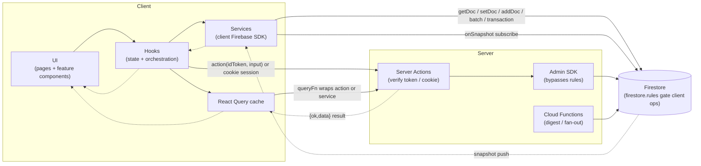
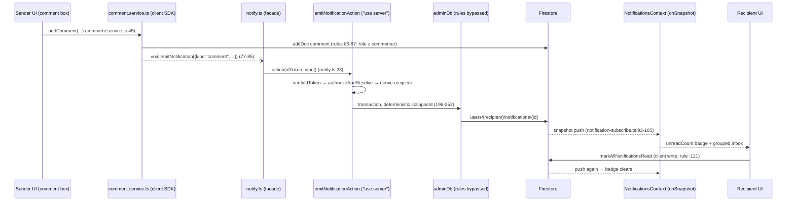

# 09 — Data Flow

> **Phase 5 — Discovery only.** This document maps how data moves through the application's layers, as observed in code. Every hop cites a file (with line numbers where precision matters). "Observed" = read directly from code; "Inferred" = marked as such. No evaluation.
>
> Repo root: `/Users/yuh.nguyenpham/GitHub/japanese`; the Next.js project root is `src/`. Paths below are relative to the repo root.

---

## 1. The layered map

Observed layers and their roles (structural evidence in `02-Architecture-Discovery.md`; convention statement in `.rules/ai-rules/architecture.rule.md` "UI → Hook → Service → API" and `docs/adr/002-data-layer-pattern.md`):

| Layer | Where | What it does with data |
|---|---|---|
| **UI** | `src/app/**/page.tsx` + `src/features/*/components/` | Pages are thin orchestrators that render a feature root (e.g. `src/app/[locale]/(main)/kana/page.tsx:15-16`); components receive data and callbacks as props. |
| **Hooks** | `src/features/*/hooks/`, feature `context/`, `src/shared/hooks/` | Own React state, open/close subscriptions, decide *when* to read/write, and expose `{data, loading, error}` + handler functions. |
| **Services** | `src/features/*/services/`, `src/lib/logging/` | Own Firestore paths and query shapes (e.g. path helpers in `src/features/flashcard/services/progress.service.ts:42-75`), perform the actual SDK calls, map snapshots to domain types. |
| **Server Actions** | `src/features/*/actions/`, `src/lib/logging/*.ts` (10 `"use server"` modules) | The privileged path: verify an ID token or session cookie, validate input with zod, write via the Admin SDK (`src/lib/firebase-admin.ts`), which bypasses Firestore security rules. |
| **Firebase** | Firestore + Auth + Storage + AI Logic (client SDK, `src/lib/firebase.ts`); Admin SDK (server); Cloud Functions (`src/functions/`) | Storage and push source. `src/firestore.rules` is the enforcement boundary for every client-SDK operation. |
| **Back to UI** | `onSnapshot` push, React Query cache, or resolved Promise | Three distinct return channels — see Section 2. |

Observed division of write authority:

- **Client SDK writes** (through services) are used wherever the writer is the document owner and `src/firestore.rules` can express the check — SRS progress, kana progress, own lessons/cards, comments, own-inbox notification read-state, leaderboard entries.
- **Admin SDK writes** (through Server Actions) are used where the check is not expressed in the rules — cross-user notification creation (`src/features/notifications/actions/notification.actions.ts:5-7`), system logs (client `create` is `false` at `src/firestore.rules:200-201`; writes go through `persistSystemLog`, `src/lib/logging/server.ts:26-50`), and all admin operations (`src/features/admin/actions/admin.actions.ts`).

---

## 2. The three return channels (pattern differences)

Observed (and recorded as an accepted convention in `docs/adr/002-data-layer-pattern.md`):

1. **Realtime `onSnapshot` push** — the authoritative channel for live data. 13 production files subscribe (list in `02-Architecture-Discovery.md` §12.4). The hook shape is: `useEffect` opens the listener, the callback `setState`s, the cleanup unsubscribes; identity changes reset state during render (e.g. `src/features/flashcard/hooks/useCardsWithProgress.ts:64-71`). Data written by *any* client (or by the Admin SDK, or by Cloud Functions) arrives through the same push — the UI never refetches after a write.
2. **One-shot fetch through React Query** — for reads that are not live-subscribed: composite loads via plain `useQuery` (shared-deck load, `src/features/flashcard/loaders/useFlashcardLoader.ts:81-93`, `staleTime: Infinity`; admin dashboards, `src/features/admin/hooks/*`), and single-call reads via the `@tanstack-query-firebase/react` bridge (`useDocumentQuery`/`useCollectionQuery` in `src/features/flashcard/hooks/useEditableLesson.ts:18,43-47`). Admin hooks also poll (`refetchInterval: 30000`, `src/features/admin/hooks/useUsers.ts:28`) and invalidate query keys after mutations (`useUsers.ts:41-46`).
3. **Fire-and-forget Server Actions** — no return channel consumed at all. Every activity-log action returns `Promise<void>` with errors swallowed (`src/features/notifications/actions/activity-log.actions.ts:19-24`); notification emission is "never surface a failure" (`src/features/notifications/services/notify.ts:10-12,24-26`). Callers use `void fn(...)` or `.catch(() => {})`.

Two smaller variants observed:

- **Server-streamed Promise**: the shared-deck page starts an Admin-SDK read in a server component and passes the un-awaited Promise to a client component that unwraps it with `use()` under `<Suspense>` (`src/app/[locale]/(main)/flashcard/shared/[shareId]/page.tsx:87-100`).
- **Request/response Server Action with result** — admin actions and `emitNotificationAction` return `{ok,data}|{ok,error}` (adapter `toActionResult`, `src/lib/safe-action.ts:52-60`), consumed synchronously by React Query hooks or awaited directly.

---

## 3. Trace 1 — Flashcard study: grading a card (write → realtime read-back)

Feature: `flashcard`. Channel: client-SDK write + `onSnapshot` read-back. The learner grades a card; SRS state persists under the **learner's** namespace (not the deck owner's) and the UI's due/new/mistake counts update from the push, not from a refetch.

**Down (UI → Firestore):**

1. **Route** — `src/app/[locale]/(immersive)/flashcard/[id]/study/page.tsx:21-31` (`"use client"`): loads deck data via `useFlashcardLoader({type:"personal", lessonId:id})` (line 23) and renders `<StudySession data={...}/>` (line 31).
2. **UI component** — `src/features/flashcard/games/study/components/StudySession.tsx:42` destructures `handleAnswer` from the session hook and passes it as `onAnswer` into the active mode component (`FlashcardLearn` line 79, `FlashcardPractice` line 90, `FlashcardMistakeReview` line 100).
3. **Hook** — `useStudySession.handleAnswer` (`src/features/flashcard/games/study/hooks/useStudySession.ts:90-103`): guards on `user`/`mode`, then calls the service with `(user.uid, card.lessonId, card.id, card.sourceOwnerId, card, grade)`.
4. **Service** — `gradeCardForUser` (`src/features/flashcard/services/progress.service.ts:123-158`): computes the next SRS state via the pure domain function `computeNextSRS` (`progress.service.ts:131` → `src/features/flashcard/domain/srs.ts:56`), then `setDoc` (first study, lines 147-150) or `updateDoc` (line 153) on the doc built by `userProgressCardDoc` (`55-71`): `artifacts/{APP_ID}/userProgress/{userId}/lessons/{lessonId}/cards/{cardId}`. A fire-and-forget `incrementDailyReviewCount` follows (line 157 → `288-298`, Firestore `increment(1)`, errors swallowed).
5. **Firestore rules** — the write is allowed only because the learner owns the path: `match /userProgress/{userId} … allow read, write: if isOwner(userId)` including the nested `lessons/{lessonId}/cards/{cardId}` block (`src/firestore.rules:146-156`; the comment at `140-145` notes this is deliberately private even for shared decks).

**Up (Firestore → UI):**

6. **Push** — the same hook stack is subscribed: `useCardsWithProgress` holds a live `onSnapshot` on `userProgressLessonCol(user.uid, lessonId)` (`src/features/flashcard/hooks/useCardsWithProgress.ts:125-140`) *and* a live card-content subscription via `subscribeCards` (`110-122` → `src/features/flashcard/services/card.service.ts:58`). Either snapshot triggers `merge()` (`86-107`), which joins content with progress (fresh SRS state synthesized for never-studied cards, `95-103`) and `setState`s the merged `CardWithProgress[]`.
7. **UI update** — `useStudySession` consumes the same live hook (`useStudySession.ts:56`) and derives `status` (new/due/mistake counts) in a memo over the live cards (`line 70`); the session queue is intentionally *not* rebuilt mid-session (`63-67` comment). The deck loader used by the page shares the identical subscription (`src/features/flashcard/loaders/useFlashcardLoader.ts:47`), so dashboard status chips update on the same push.

**Side channel:** on session completion the hook fires XP/streak updates through Trace 3's `useUserProgress.addXP` (`useStudySession.ts:106-108`) and a fire-and-forget log Server Action `logStudySessionCompleted` with a fresh ID token (`113-118` → `src/features/flashcard/actions/activity-log.actions.ts:45`).

---

## 4. Trace 2 — Notification: comment emit → recipient inbox (Server Action round trip)

Feature: `notifications` (producer in `flashcard`). Channel: client-SDK write for the comment itself, **Server Action + Admin SDK** for the cross-user notification, `onSnapshot` push on the recipient side, client-SDK write-back for read state.

**Emit (sender's client → recipient's Firestore inbox):**

1. **UI/service** — posting a comment calls `addComment` (`src/features/flashcard/services/comment.service.ts:45`): validates/sanitizes content, `addDoc` into the deck owner's comments collection (`63-72`) — a client write permitted by the comment-create rule for `owner|editor|commenter` roles (`src/firestore.rules:86-87`). If the commenter is not the deck owner, it fires `void emitNotification({kind:"comment", ownerId, lessonId, cardId, commentId})` (`comment.service.ts:77-85`).
2. **Client facade** — `emitNotification` (`src/features/notifications/services/notify.ts:19-27`): gets a fresh ID token from `auth.currentUser`, calls the Server Action, swallows every error ("a notification must never block or fail the user's primary action", lines 10-12).
3. **Server Action** — `emitNotificationAction` (`src/features/notifications/actions/notification.actions.ts:99-114`) invokes the next-safe-action pipeline (`66-97`): token bind-arg verified by `verifyIdToken` (`line 70` → `src/lib/safe-action.ts:40-45`), input validated against `emitNotificationInputSchema` (`line 68`).
4. **Authorization + recipient derivation** — the action loads the referenced lesson (`74-76`) and runs `authorizeAndResolve` (`123-162`): for `kind:"comment"` the sender must own or hold a role on the lesson, and the recipient is **derived server-side** as the deck owner (`133-136`) — the client never supplies a recipient (file guarantee list, `9-16`). Self-notifications no-op (`line 82`).
5. **Admin write** — `writeNotification` (`196-252`): a transaction on the deterministic collapse-ID doc (`collapseId`, `src/features/notifications/domain/id.ts`) at `artifacts/{APP_ID}/users/{recipientId}/notifications/{notiId}` (`notificationPath`, `47-49`). First write sets `createdAt: serverTimestamp` (`229-236`); a repeat folds the actor in and bumps `count`, re-surfacing as unread (`239-250`). This is an **Admin SDK** write — it bypasses `firestore.rules`, which is why the client-side create rule can stay owner-inbox-only (`src/firestore.rules:110-117`).

**Receive (Firestore → recipient's UI):**

6. **Subscription** — `NotificationsProvider` (mounted once at the app shell, `src/lib/providers.tsx:89`) opens one listener per signed-in user (`src/features/notifications/context/NotificationsContext.tsx:136-151`) via `subscribeNotifications` (`src/features/notifications/services/notification-subscribe.ts:46-126`): composite query `isDeleted != true` + `createdAt desc` + `limit(pageSize)` (`93-100`), with a plain-query fallback and exponential-backoff resubscribe (`64-91`). Pagination grows the live window itself (`39-44` rationale).
7. **Derived state** — the context computes `unreadCount` and time-bucketed `groups` in memos (`NotificationsContext.tsx:161-162`).
8. **Consumers** — the `BottomNav` badge (`src/app/[locale]/(main)/_components/BottomNav.tsx:111-116`) and the notifications page (`src/app/[locale]/(main)/notifications/page.tsx:31-41`) read the same context; the digest docs written by the Cloud Function `dailyNotificationDigest` (`src/functions/src/digest.ts:153`, same collection/schema by design, `digest.ts:1-14`) arrive through this identical listener with zero client changes.
9. **Write-back** — marking all read is a **client** write to the user's own inbox: `handleMarkAllRead` (`notifications/page.tsx:60-68`) → `markAllNotificationsRead` (`src/features/notifications/services/notification.service.ts:58`), permitted by the owner-only, immutable-fields-guarded update rule (`src/firestore.rules:121`, helper `50-55`), plus a fire-and-forget `logNotificationsReadAll` Server Action (`page.tsx:65-67` → `src/features/notifications/actions/activity-log.actions.ts:91`). The write re-enters the same snapshot stream, clearing the badge everywhere.

---

## 5. Trace 3 — Kana progress: marking a character learned (transactional write → realtime read)

Features: `kana` + `user`. Channel: client-SDK **transaction** write and `onSnapshot` read on a single user document — no Server Action, no React Query.

**Down (UI → Firestore):**

1. **Route** — `src/app/[locale]/(main)/kana/learn/page.tsx:5-8` (server page, no data fetching) renders the client feature root `<KanaLearn/>` (`src/features/kana/learn/components/KanaLearn.tsx:9` `"use client"`).
2. **UI component** — `KanaLearn` wires an `onVisit` callback into the play-deck hook: the first visit to a character calls `void markLearned(visitedChar.char)`, deduped per session with a ref (`KanaLearn.tsx:27-41`).
3. **Hook** — `useUserProgress.markLearned` (`src/features/user/hooks/useUserProgress.ts:75-85`): calls `updateUserProgress(user.uid, prev => …)` with a pure updater that appends the char to `learnedChars` if absent; errors are caught and logged (`82-84`).
4. **Service** — `updateUserProgress` (`src/features/user/services/user.service.ts:43-59`): a Firestore `runTransaction` (`line 49`) that reads `artifacts/{APP_ID}/users/{userId}` (path helper `userDoc`, `9-10`), applies the updater to the nested `progress` object, and `transaction.set(..., {merge:true})` with a `lastSeenAt` stamp (`line 56`). The doc comment (`33-41`) states the transaction exists because concurrent `addXP` + `completedLesson` calls on a plain merge-write would race.
5. **Firestore rules** — `match /users/{userId} { allow read, write: if isOwner(userId); }` (`src/firestore.rules:61-63`) — owner-only, no server involvement.

**Up (Firestore → UI):**

6. **Subscription** — the same hook subscribes on mount: `useUserProgress`'s effect (`useUserProgress.ts:17-35`) calls `subscribeUserProgress` (`user.service.ts:12-31`), an `onSnapshot` on the same user doc that maps `snap.data().progress` onto `INITIAL_USER_DATA` defaults and pushes it to `setUserData`.
7. **UI update** — every mounted consumer of `useUserProgress` receives the push independently (each call opens its own listener — observed, contrast with the notifications context which deliberately centralizes one listener, `NotificationsContext.tsx:9-22`). Consumers verified by grep: the kana hub computes `learnedCount`/`progressPct` from `userData.learnedChars` (`src/features/kana/hub/hooks/useKanaHubState.ts:16,23-27`, rendered by `KanaHub` → `src/app/[locale]/(main)/kana/page.tsx:15-16`), plus `KanaChart`, the profile page, settings, home state, and the study/game XP paths (grep list in the hook's consumers).

**Same-document variants:** `addXP` (streak arithmetic in the updater, `useUserProgress.ts:37-61`) and `recordCharStat` (per-character accuracy tally, `87-102`) follow the identical hook → transaction → push loop; kana quiz completion additionally fires the fire-and-forget log action `logKanaQuizCompleted` (`src/features/kana/actions/activity-log.actions.ts:16`).

---

## 6. Where the pattern differs — summary of observed variations

| Variation | Where observed | How it differs from the dominant loop |
|---|---|---|
| Realtime push (dominant) | 13 `onSnapshot` files; Traces 1 and 3 | Write anywhere → snapshot push → state; no refetch. |
| Centralized single listener | Notifications only (`NotificationsContext.tsx:9-22`) | One app-lifetime listener shared via context; every other realtime hook opens per-mount listeners (e.g. `useUserProgress`). |
| Dual-stream merge | `useCardsWithProgress.ts:73-140` | Two independent listeners (content + progress) merged in refs; first emit deferred until both are ready (`86-88`). |
| One-shot + React Query cache | Shared-deck load (`useFlashcardLoader.ts:81-93`, `staleTime: Infinity`), admin hooks | `queryFn` wraps a composite service load or a Server Action; refresh by cache invalidation, not push. |
| One-shot Firestore bridge | `useEditableLesson.ts:43-47` (`@tanstack-query-firebase/react`) | Single `getDoc`/`getDocs` wrapped by the bridge hooks; per `docs/adr/002-data-layer-pattern.md`, allowed only where no live listener owns the data. |
| Polling | Admin users list (`useUsers.ts:28`, `refetchInterval: 30000`) | Server Actions cannot push; the admin surface re-queries on an interval. |
| Server-streamed Promise | Shared-deck public preview (`shared/[shareId]/page.tsx:87-100`) | Admin-SDK read starts in a server component; client unwraps with `use()`; used for SEO/first paint only, with the full viewer-aware load still happening client-side (`shared-preview.service.ts:1-16`). |
| Fire-and-forget action | All activity logging, notification emit, login/logout logs | No result consumed; errors swallowed by design (`notify.ts:24-26`, `activity-log.actions.ts:19-24`). |
| Out-of-band writer | Cloud Functions digest (`functions/src/digest.ts:153`) | A scheduled server process writes into the same per-user collection; reaches the UI through the existing notification listener with no dedicated client code. |

---

## 7. Uncertainties

- The per-mount-listener multiplicity of `useUserProgress` (one `onSnapshot` per consuming component) is observed from the hook's structure (`useUserProgress.ts:17-35`); actual concurrent listener counts at runtime were not measured.
- `data.cards` vs live cards in `useStudySession` (`useStudySession.ts:59`, fallback while the live subscription warms up) means a brief window where grades operate on snapshot data; whether this window is observable in practice was not verified.
- The `fanOutNotifications`/`deliverNotificationTask` pipeline (`functions/src/fanout.ts`) participates in no current app data flow (stated in `fanout.ts:6-15`); it is documented in `02-Architecture-Discovery.md` §9.3 and omitted from the traces above for that reason.
